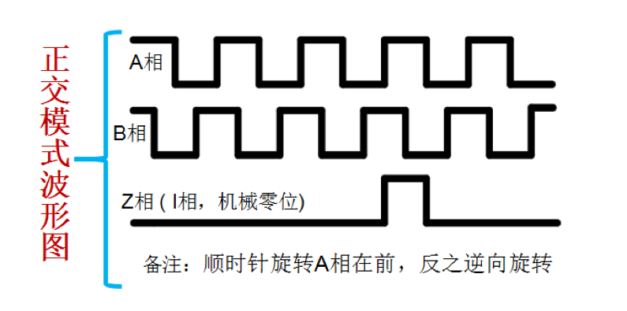
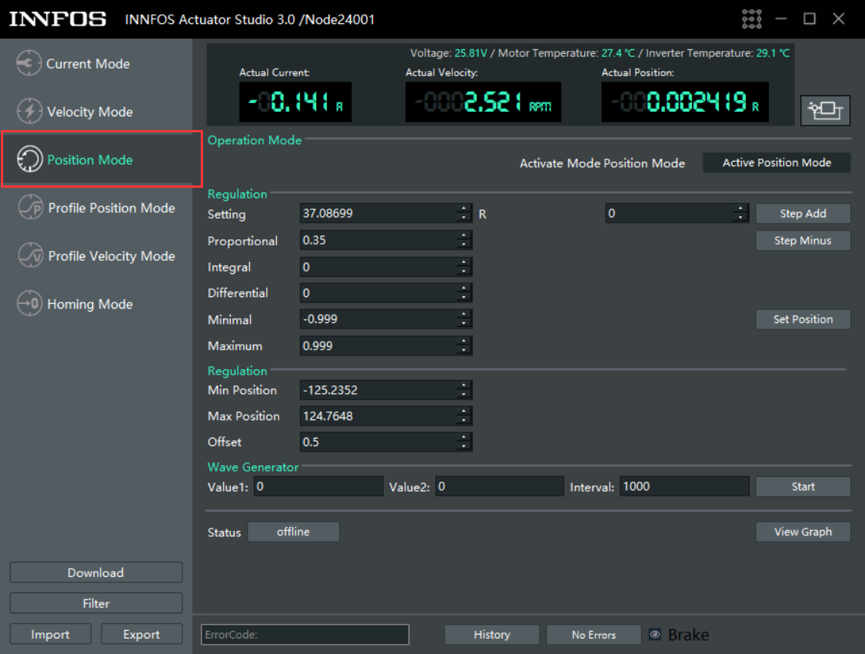
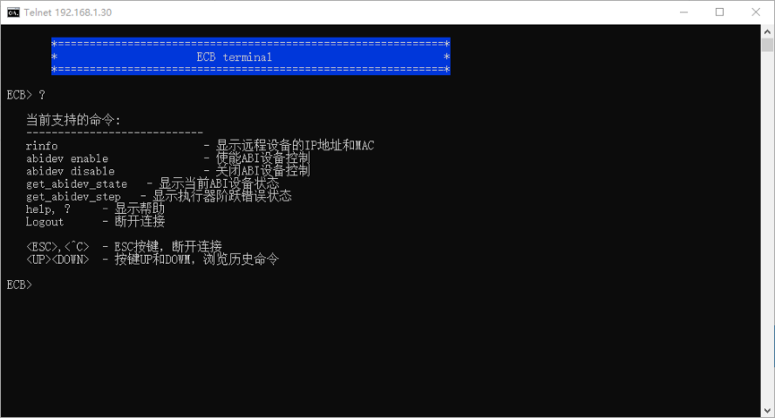

ABI2CAN_Converter使用说明
=====

## 简介
ABI2CAN_Converter（ABI转CAN 转接器）的主要功能是实现电机控制信号从ABI格式数据到INNFOS CAN协议数据地转换。INNFOS SCA采用CAN总线进行通信，并拥有一套专用的INNFOS CAN协议。为了使得SCA能够接受标准的ABI控制方式，ABI2CAN_Converter可以接收ABI数据，并将其转换为INNFOS CAN协议数据通过CAN总线发送至SCA，用户无需考虑INNFOS CAN协议的内容，只需要向ABI2CAN_Converter提供标准的ABI信号数据即可实现精准的控制操作。
与此同时，ABI2CAN_Converter保留了所有以太网转CAN的功能，用户可通过此转接板顺利完成上位机的连接或以太网SDK的应用开发。

## 关于ABI信号
在电机控制领域中的ABI信号是增量式编码器输出的一种数据格式，现在也多用于电机的输入控制信号当中。当电机旋转轴转动时编码器会输出位置的增量信息，其信号格式一般有两种：

### A-步进脉冲，B-旋转方向，I(Z)-零点信号。
 方向步模式：A-步进脉冲，B-旋转方向，I(Z)-零点信号。
 此种信号格式需要三根数据线，其中，AB两相表示脉冲和方向，脉冲记录了旋转轴转过了多少个编码器单位的距离，方向用高低电平表示旋转轴是正转还是反转。I(Z)表示零点信号，当旋转轴转至0点时，此相信号会产生一个脉冲通知控制器当前位置已达零点。在ABI信号作为输入控制信号时，由于只需要传入方向信号和位置信号，所以一般没有I(Z)相。

 

### 正交模式
 正交模式：AB两相相差90°，I(Z)-零点信号。
 在此种信号格式中，控制依然通过脉冲计数的方式获取位置数据，但方向数据的获取从AB两相的相位差中获取，顺时针转动时A相超前B相90°，反之为逆时针转动。I(Z)相功能与上述相同。

 

 ABI2CAN_Converter将ABI信号作为输入信号，采用的是第一种信号格式，支持方向信号和脉冲信号的输入，其脉冲信号满足以下比例：
 脉冲数 ：实际转动圈数 = 5000 ：1
 对于方向信号，高电平为顺时针转动，低电平为逆时针转动。

## 资源概览
*  CPU:STM32F429VET6
*  RAM:256K
*  Flash:512K
*  以太网通讯：1路，10/100M 自适应速率
*  CAN通讯：2路，速率1Mbps
*  LED 12个：电源指示LED 5个，用户LED 5个，以太网连接状态指示LED 1个，以太网速率指示LED 1个
*  功率信号复合接口 ：4个，单个复合接口同时包含CAN信号和功率信号
*  ABI信号输入接口：4路
*  限位开关输出接口：4路（正在开发）
*  其他请参考附件的数据手册

Note: 产品供电严禁超过最大输入电压；产品应该放置在干燥的环境中保存，严谨日晒雨淋、摔、掷和跌落；产品对静电敏感，静电可能会对芯片造成永久性损坏，用户在触摸产品之前，最好先将身体携带的静电放掉，可以通过人体静电消除器或者把手放在墙壁上一段时间；

## 硬件连接
**连接电源**
* 连接电源与ABI2CAN_Converter+HUB
  

**连接执行器及其配件**
*   连接`执行器综合线缆`

**连接电脑**
*  用网线连接ABI2CAN_Converter与电脑

**连接ABI信号线**

*  将控制器的ABI信号（方向与脉冲）使用连接线接入对应的轴输入信号接口处
Note: 信号输入接口采用光耦隔离，输入电压范围为3-10V

**开启电源**

*   开启电源. 执行器的供电电压范围为直流24V-45V.
*   上电以后，执行器LED状态灯会变成黄色闪烁，启动执行器后，LED会变成绿色闪烁，这时就可以与执行器进行通信了。如果执行器内部出现错误，LED灯会变为红色闪烁，请检查执行器错误代码。

Note: 信号输入接口采用光耦隔离，输入电压范围为3-10V

## 软件安装与使用
**下载IAS**

* 如果电脑系统为Linux,访问IAS(Linux)获取最新版本的[INNFOS Actuator Studio(Linux)说明](#!pages/INNFOS_Actuator_Studio_Linux_instruction.md).如果电脑系统是Windows请访问IAS(Windows).

**配置IP地址**
* 配置步骤请参考以太网通信配置

**安装IAS**
* 安装IAS请参考IAS安装

**配置执行器ID**
将执行器开机，在ID输入框中根据所使用的轴更改对应的ID，并执行回车，等待提示成功

<table class="tableizer-table" style="width:400px"><thead></th></tr></thead><tbody><tr><td>Axis</td><td>SCA ID</td><tr><td>X</td><td>2</td></tr><tr><td>Y</td><td>3</td></tr><tr><td>Z</td><td>1</td></tr><tr><td>A</td><td>4</td></tr></tbody></table>

**配置执行器参数**
根据产品的机械限位调整执行器的内部限位数据与零点位置

利用梯形位置模式，将执行器调整至零点位置

Note: 控制器使用的运动程序零点应与执行器的零点相对应

 将所有执行器切换至位置模式

**使能ABI控制**
 保持执行器现有的状态，将IAS关闭（建议）
 在终端中使用telnet命令，连接至192.168.1.30（默认IP）

Note: 若终端提示telnet不是内部或外部命令，则该命令未启用，请先启用该功能。

敲击回车后进入终端模式

输入字符 ‘?’，回车获取相关命令

输入abidev enable，并回车

提示 ABI Control Enable ，至此设备使能完毕，其他命令请参考帮助信息。

Note: 由于ABI信号控制下，执行器采用位置模式，其转动距离受限位的数据的限制，超过限位后将不再转动。若执行器出现阶跃错误，可能是因为转速过快，用户可不必理会，也无需淸错（淸错后会转至电流模式，无法继续使用ABI控制）。

## 版本变更记录
**下表简单描述了版本变更记录**

<table style="width:400px"><thead><tr style="background:PaleTurquoise"><th style="width:100px">版本号</th><th style="width:150px">更新时间</th><th style="width:150px">更新内容</th></tr></thead><tbody><tr><td>V1.0.0</td><td>2019.09</td><td>第一个版本</td></tbody></table>

