基于CAN总线的通信方式
=====

##  CAN的物理层说明

### CAN协议概述

*     CAN 是Controller Area Network 的缩写（以下称为CAN），是ISO国际标准化的串行通信协议。

*     本公司产品设计服从于CAN2.0A协议标准，本文详细介绍了本公司产品的产品CAN通信协议格式，及产品CAN通信结构。

### 综合性能参数

<table style="width:400px"><thead><COL WIDTH=50%><COL WIDTH=50%><tr><th colspan="2"style=background:PaleTurquoise>表1综合性能参数说明</th></tr></thead><tbody><tr><td>项目</td><td>说明</td></tr><tr><td>链路层协议</td><td>CAN总线</td></tr><tr><td>CAN-ID类型</td><td>11bit-CAN2.0A</td></tr><tr><td>波特率</td><td>1Mbit/s</td></tr><tr><td>最大站点数</td><td>63个</td></tr><tr><td>CAN帧长度</td><td>0~8字节</td></tr><tr><td>应用层CAN帧类型</td><td>数据帧、远程帧</td></tr><tr><td>终端匹配电阻</td><td>120Ω</td></tr></tbody></table>

本通信协议波特率为1Mbit/s，对于CAN通信，不同线的线缆对传输距离影响不大，但是要求线径尽量粗，最大节点数为64，本公司产品采用0.205mm²线径，最大传输距离为25m。

## CAN的硬件连接说明

### 接口规格型号

功率信号复合接口：Molex 430450827

* INNFOS执行器的插线接口为CAN通信接口，接口如下图所示。名称相同的端口内部引脚连接在一起，其接口定义表2-1所示。CAN接口连接器至少配有CANH、CANL、CGND引脚。

<table><thead><tr><th colspan="4" style=background:PaleTurquoise>表2通信信号连接器引脚定义</th></tr></thead><tbody><tr><td style="width:80px">针脚号</td><td>定义</td><td>描述</td><td>端子引脚分布</td></tr><tr><td>1</td><td>PVDD</td><td>功率电源</td><td rowspan="9"></td></tr><tr><td>3</td><td>PVDD</td><td>功率电源</td></tr><tr><td>5</td><td>PVDD</td><td>功率电源</td></tr><tr><td>2</td><td>GND</td><td>功率地</td></tr><tr><td>4</td><td>GND</td><td>功率地</td></tr><tr><td>6</td><td>CGND</td><td>CAN通信地</td></tr><tr><td>7</td><td>CANL</td><td>CAN通信接口</td></tr><tr><td>8</td><td>CANH</td><td>CAN通信接口</td></tr></tbody></table>

### CAN通信的总线和多节点的连接方式

<strong>图1 CAN通信网络的连接框图</strong>

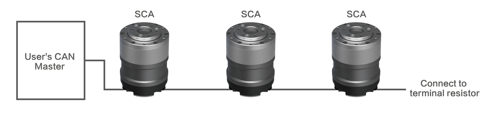

<strong>图2 CAN通信网络的连接示意图</strong>

Note: CAN通信是通过CAN_H与CAN_L之间的电压差来传递电平信号的。
如果没有隔离，在某些情况下，CAN总线上的电压可能会远远超出规范值，很可能会损坏整条总线上的大部分设备。
而SCA（除特殊型号外）内部设计了CAN隔离电路，从而保证了通信过程中的电气安全。

* CAN通信网络推荐使用双绞线缆，双绞线对高频磁场噪声干扰有很好的抵抗能力，也能减小线缆对外的辐射。
* 总线两端分别连接两个120Ω终端匹配电阻防止信号反射。
* CAN设备通信时，须将不同CAN电路的公共地CGND相互连接，以保证不同通信设备之间参考电位相等。
* 每路CAN连接的连接设备数量最多为64个。
* 用万用表测量CANH和CANL之间的阻值可以确认现场两端接电阻是否正确，正常阻值应为60Ω左右（两个电阻的并联值）。

## 硬件需求与连接

*    INNFOS执行器可与嵌入式控制板的CAN接口直接相连进行通信。
*    您可以根据需要连接自己的嵌入式控制板实现对INNFOS执行器的控制。
*    此处提供两种常见嵌入式开发板的连接实例供参考。

### 基于ST开发板的连接

**硬件需求**

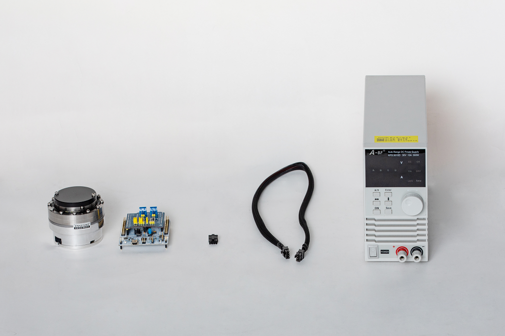

*   从左到右依次为：INNFOS 执行器、ST开发板（需自备）、终端电阻、执行器综合线缆，直流稳压电源
*   您可以使用自己的ST开发板实现与执行器间的CAN通信及控制
*   根据使用情况自行选配急停开关

Note: 必须先断电然后再插拔部件.  否则可能损坏部件. 请确认您的直流电源电压与执行器电压范围是否一致，否则会导致执行器出现过压或欠压错误。

**连接ST开发板与执行器综合线缆连接**

*   取出执行器综合线缆

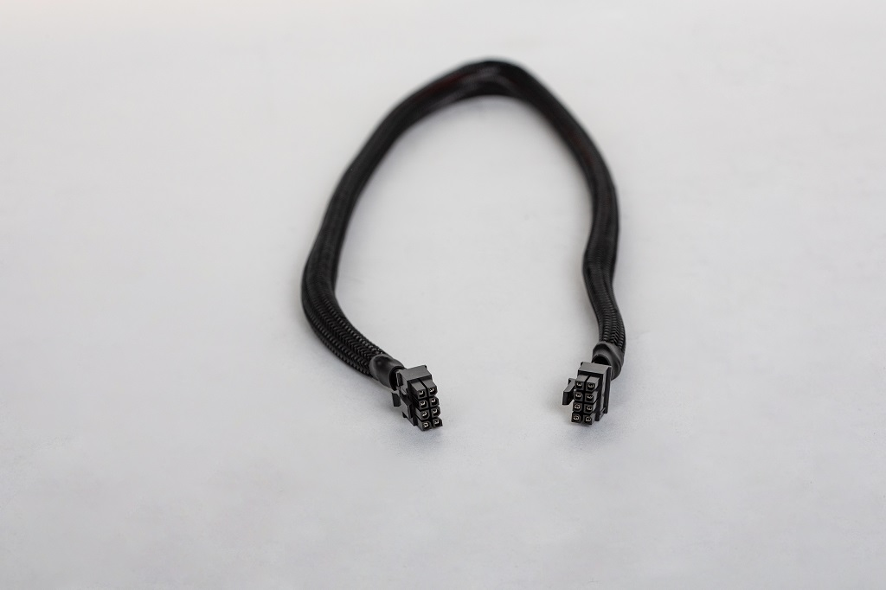 

*   将执行器综合线缆的一端剪开
红色粗线为电源正极线；黑色粗线为电源负极线，
将双绞屏蔽线剪开，其中红色细线为 CAN_H;黑色细线为 CAN_L; 银色细线为CAN_GND。

 

*    将红色细线 CAN_H，黑色细线 CAN_L分别接入 ST开发板的对应位置。

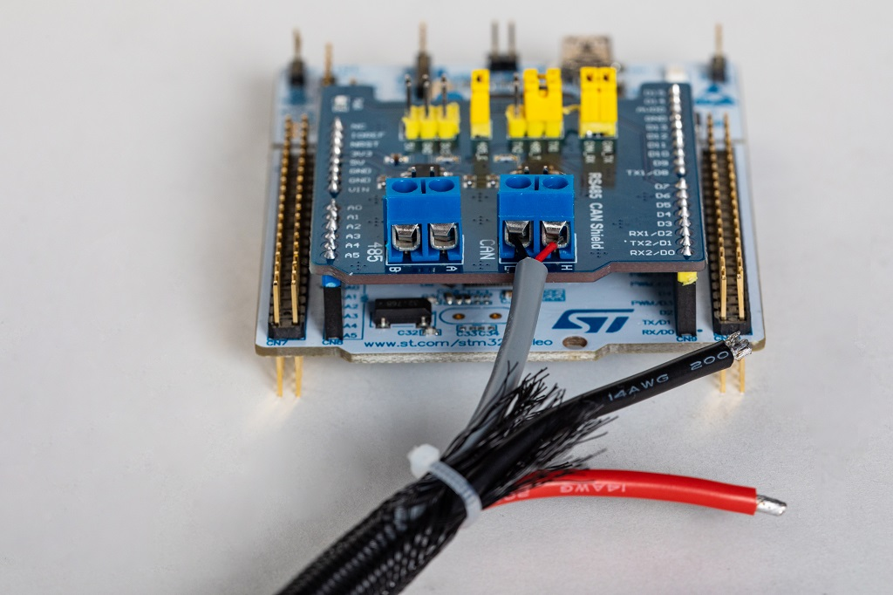 

*    将红色电源正极线与黑色电源负极线按图所示接入电源正负极。

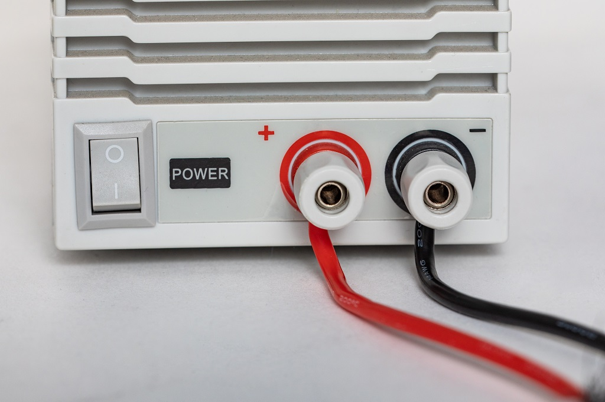 

**连接执行器**

*    将执行器综合线缆另一端连接执行器。

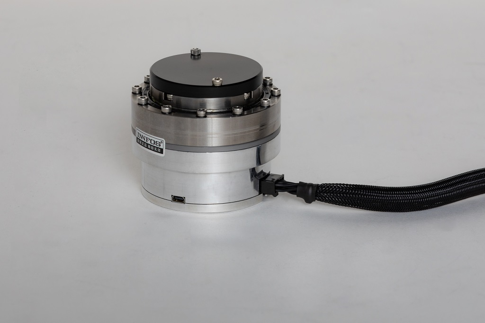 

*    末端执行器安插终端电阻

*    完成连接，即可接通电源，进行后续调试

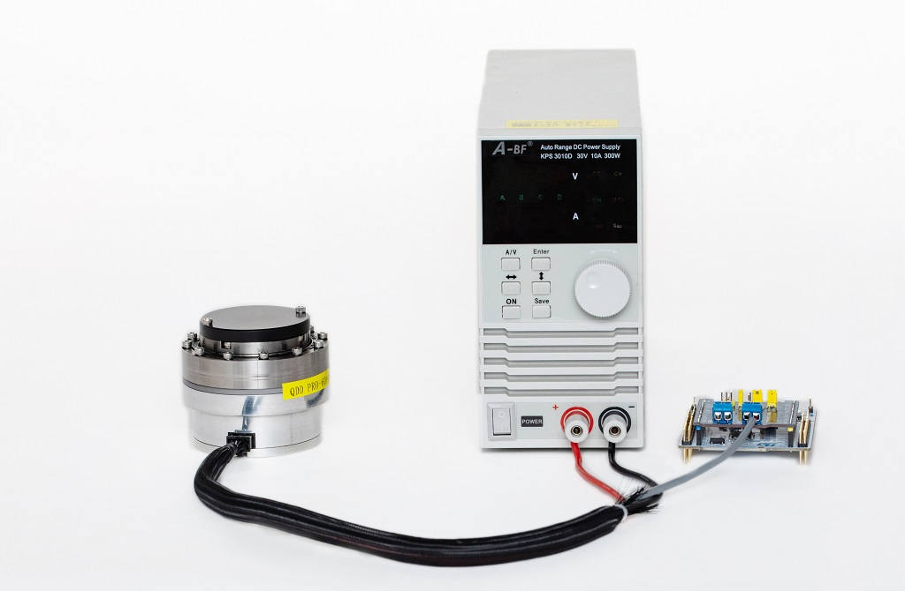 

### 基于Arduino开发板的连接

**硬件需求**

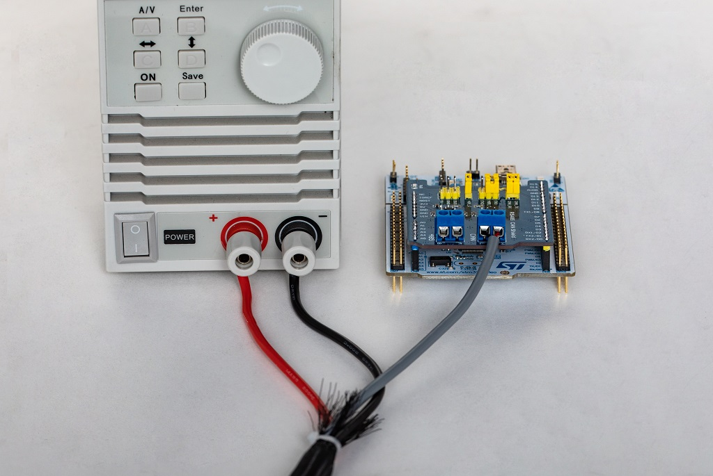

*   从左到右依次为：INNFOS 执行器、Arduino开发板（需自备）、终端电阻、ECB连接线、执行器综合线缆，直流稳压电源
*   您可以使用自己的Arduino开发板实现与执行器间的CAN通信及控制
*   根据使用情况自行选配急停开关

Note: 必须先断电然后再插拔部件.  否则可能损坏部件. 请确认您的直流电源电压与执行器电压范围是否一致，否则会导致执行器出现过压或欠压错误。

**连接Arduino开发板与执行器综合线缆**

*   取出执行器综合线缆和ECB连接线。

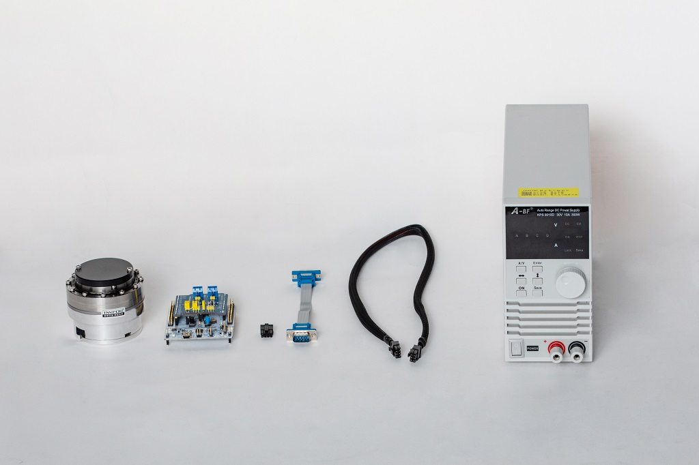 

*   将执行器综合线缆的一端剪开。
红色粗线为电源正极线；黑色粗线为电源负极线，将双绞屏蔽线剪开，其中红色细线为 CAN_H;黑色细线为 CAN_L; 银色细线为CAN_GND。

 

*    将ECB连接线小心剪开，并与剪开综合线缆的红色细线 CAN_H，黑色细线 CAN_L; 银色细线为CAN_GND
如图所示找好对应引脚进行连接，焊接牢固 ，并用热缩管或绝缘胶带包好以防止短路。

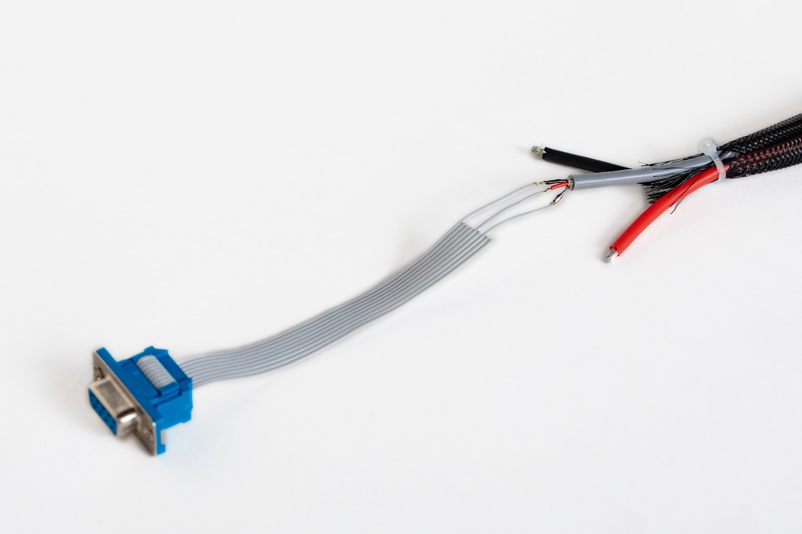 

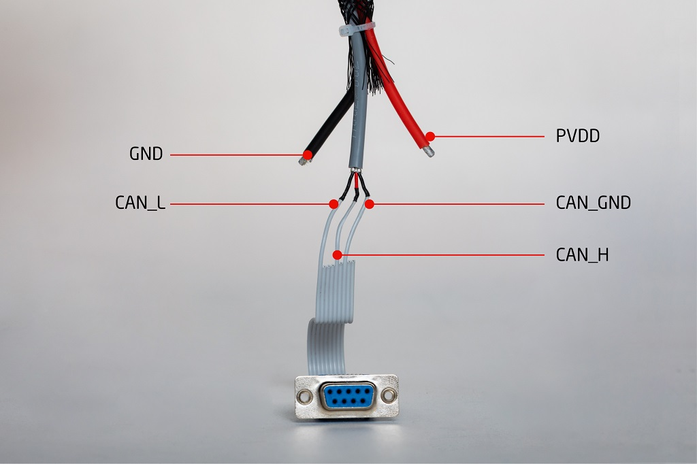

*    将红色电源正极线与黑色电源负极线按图所示接入电源正负极。

 

*    将ECB连接线的另一端插入Arduino开发板，完成连接。

**连接执行器**

*    将执行器综合线缆另一端连接执行器。

 

*    末端执行器安插终端电阻

*    完成连接，即可接通电源，进行后续调试

 

## 软件安装与使用

**下载IAS**

*   如果电脑系统为linux,访问[IAS(linux)](https://github.com/innfos/INNFOS-Actuator-Studio-linux.git)获取最新版本的IAS(INNFOS Actuator Studio)(Linux),如果电脑系统是window请访问[IAS(windows)](https://github.com/innfos/INNFOS-Actuator-Studio-windows.git).

**配置IP地址**

*   配置步骤请参考[以太网通信配置](Ethernet_Configuration.md)

**安装IAS**

*   安装IAS请参考[IAS安装](INNFOS_Actuator_Studio_IAS_instruction.md)

**使用** 

 

安装成功后，启动`IAS`,单击“确认”按钮启用“下一步”按钮，然后单击“下一步”直到出现如下界面: 

 

单击“1”或“2”按钮启动执行器，按钮“1”变为绿色表示您已成功启动执行器。单击消息框或单击“详细信息”按钮（位于按钮“1”下方） 进入执行器调试界面。 

 

 **位置控制**

*   单击左侧栏上的`Profile Position Mode`按钮，然后单击右侧的`Activate Profile Position Mode`。之后，您可以在“设置”中输入位置值，单位是R(范围是-127R~127R)。

 

 

### 其他

想了解更多关于`IAS`的信息 , 请访问[INNFOS Actuator Studio(IAS)说明](#!pages/INNFOS_Actuator_Studio_IAS_instruction.md).

## 版本变更记录

<table><thead><tr style=background:PaleTurquoise><th>版本</th><th>更新时间</th><th>更新内容</th></tr></thead><tbody><tr><td>V1.0.0</td><td>2019.04</td><td>第一个版本</td></tr></tbody></table>

