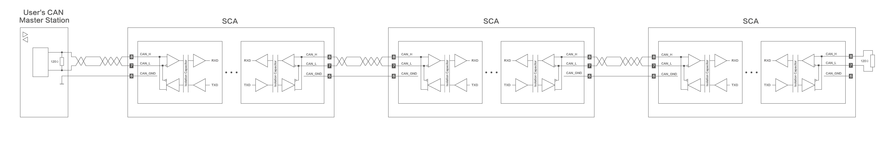
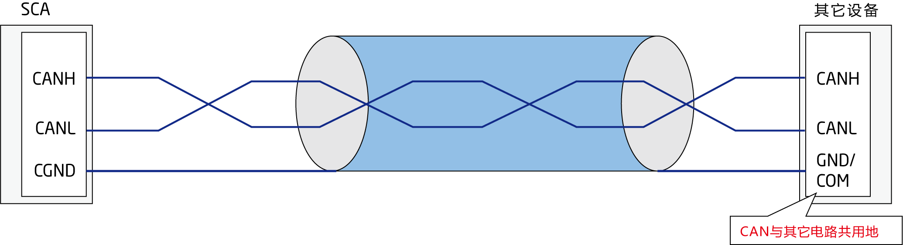
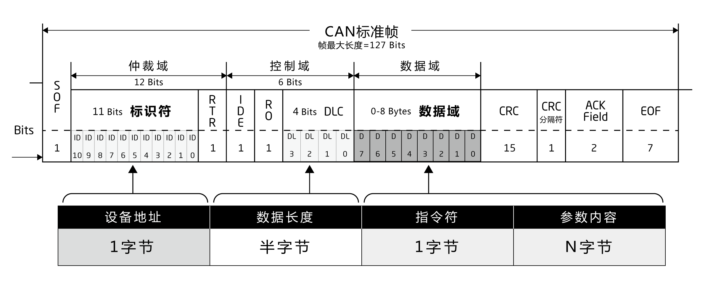

# CAN通信协议

## 1 产品信息

### 1.1 CAN协议概述

*     CAN 是Controller Area Network 的缩写（以下称为CAN），是ISO国际标准化的串行通信协议。

*     本公司产品设计服从于CAN2.0A协议标准，本文详细介绍了本公司产品的产品CAN通信协议格式，及产品CAN通信结构。

### 1.2 综合性能参数

<table style="width:400px"><thead><COL WIDTH=50%><COL WIDTH=50%><tr><th colspan="2"style=background:PaleTurquoise>表1-1综合性能参数说明</th></tr></thead><tbody><tr><td>项目</td><td>说明</td></tr><tr><td>链路层协议</td><td>CAN总线</td></tr><tr><td>CAN-ID类型</td><td>11bit-CAN2.0A</td></tr><tr><td>波特率</td><td>1Mbit/s</td></tr><tr><td>最大站点数</td><td>63个</td></tr><tr><td>CAN帧长度</td><td>0~8字节</td></tr><tr><td>应用层CAN帧类型</td><td>数据帧、远程帧</td></tr><tr><td>终端匹配电阻</td><td>120Ω</td></tr></tbody></table>

本通信协议波特率为1Mbit/s，对于CAN通信，不同线的线缆对传输距离影响不大，但是要求线径尽量粗，最大节点数为64，本公司产品采用0.205mm²线径，最大传输距离为25m。

<a href="#!pages/CAN_Communication_Protocol.md#3.3_CAN通信协议命令参考">3.3_CAN通信协议命令参考</a>

## 2 配线

* INNFOS执行器的插线接口为CAN通信接口，接口如下图所示。名称相同的端口内部引脚连接在一起，其接口定义表2-1所示。CAN接口连接器至少配有CANH、CANL、CGND引脚。

<table><thead><tr><th colspan="4" style=background:PaleTurquoise>表2-1通信信号连接器引脚定义</th></tr></thead><tbody><tr><td style="width:80px">针脚号</td><td>定义</td><td>描述</td><td>端子引脚分布</td></tr><tr><td>1</td><td>PVDD</td><td>功率电源</td><td rowspan="9"></td></tr><tr><td>3</td><td>PVDD</td><td>功率电源</td></tr><tr><td>5</td><td>PVDD</td><td>功率电源</td></tr><tr><td>2</td><td>GND</td><td>功率地</td></tr><tr><td>4</td><td>GND</td><td>功率地</td></tr><tr><td>6</td><td>CGND</td><td>CAN通信地</td></tr><tr><td>7</td><td>CANL</td><td>CAN通信接口</td></tr><tr><td>8</td><td>CANH</td><td>CAN通信接口</td></tr></tbody></table>

**表2-1通信信号连接器引脚定义**

公共地CGND 的连接，对提高CAN接口的抗干扰性能有很大提升。

### 2.1 CAN通信的总线和多节点的连接方式

**图2-1 CAN通信网络的连接方式为总线连接方式**

各个CAN收发设备挂接在总线上，每个分支长度要小于0.3m，否则会引起反射，造成通信问题。 

* 推荐使用带屏蔽双绞线连接，总线两端分别连接两个120Ω终端匹配电阻防止信号反射，屏蔽层一般使用单点可靠接地。
* 用万用表测量CANH和CANL之间的阻值可以确认现场两端接电阻是否正确，正常阻值应为60Ω左右（两个电阻的并联值）。
* 挂接设备数量最多为64个。
* CAN设备长距离通信时，须将不同CAN电路的公共地CGND相互连接，以保证不同通信设备之间参考电位相等。
* CGND是指CAN通信中的公共地，可用作信号电平参考，提升抗干扰能力；GND是执行器三相电源中的功率地，功率电流都会由地流回电源。

### 2.2 CAN通信的线缆推荐使用双绞线

CAN通信网络推荐使用双绞线缆，双绞线对高频磁场噪声干扰有很好的抵抗能力，也能减小线缆对外的辐射，图2-5所示。

**图2-2：双绞线示意图**

* 双绞线的扭矩D应小于2cm，扭矩越小抗干扰效果越好。
* 为了避免收到外界干扰的影响，传输数据的电缆通常使用带有屏蔽层的双绞线，并且屏蔽层要接参考地。

### 2.3 其他设备没有外接CAN_GND 端口配线说明

#### 设备为非隔离CAN,与其他信号共用GND或是COM端口

**图2-3：将其他设备GND或是COM与我公司设备CAN_GND连接**

## 3 通信协议

### 3.1 CAN通信协议格式

**图3-1**

如图3-1：设备地址对应标识符位，CAN总线标准数据帧标识符位为11位，本协议只用了其中8位，占一个字节，数据长度对应DLC,占半字节，指令符参数内容同在数据域，指令符在前参数内容在后，高字节在前，低字节在后。数据长度等于指令符加上参数内容。

**设备地址**

一个字节，标识要与之通讯的设备地址，0x01～0xff 可用。0x00为广播地址。

**数据长度**

半个字节，标识要通讯的具体数据的个数，范围 0x00～0x0F，超出范围的不作处理

**指令符**

一个字节，标识主机与从机进行的具体操作，取值范围 0x00~0xff。

**参数内容**

某条指令的具体参数内容，其长度等于数据长度减一。有些指令不含具体数据，其数据位数位也应为 1。

#### IQmath简介

**图3-2**

<table style="width:650px"><thead><tr><th rowspan="2" style=background:PaleTurquoise>Data Type</th><th colspan="2" style=background:PaleTurquoise>Range</th><th rowspan="2"style=background:PaleTurquoise>Resolution/Precision</th></tr><tr> <td>Min</td> <td>Max</td> </tr></thead><tbody><tr><td>_iq30</td><td>-2</td><td>1.999 999 999</td><td>0.000 000 001</td></tr><tr><td>_iq29</td><td>-4</td><td>3.999 999 998</td><td>0.000 000 002</td></tr><tr><td>_iq28</td><td>-8</td><td>7.999 999 996</td><td>0.000 000 004</td></tr><tr><td>_iq27</td><td>-16</td><td>15.999 999 993</td><td>0.000 000 007</td></tr><tr><td>_iq26</td><td>-32</td><td>31.999 999 985</td><td>0.000 000 015</td></tr><tr><td>_iq25</td><td>-64</td><td>63.999 999 970</td><td>0.000 000 030</td></tr><tr><td>`_iq24`</td><td>-128</td><td>127.999 999 940</td><td>0.000 000 060</td></tr><tr><td>_iq23</td><td>-256</td><td>255.999 999 981</td><td>0.000 000 119</td></tr><tr><td>_iq22</td><td>-512</td><td>511.999 999 762</td><td>0.000 000 238</td></tr><tr><td>_iq21</td><td>-1024</td><td>1023.999 999 523</td><td>0.000 000 477</td></tr><tr><td>_iq20</td><td>-2048</td><td>2047.999 999 046</td><td>0.000 000 954</td></tr><tr><td>_iq19</td><td>-4096</td><td>4095.999 998 093</td><td>0.000 001 907</td></tr><tr><td>_iq18</td><td>-8192</td><td>8191.999 996 185</td><td>0.000 003 815</td></tr><tr><td>_iq17</td><td>-16384</td><td>16383.999 992 371</td><td>0.000 007 629</td></tr><tr><td>_iq16</td><td>-32768</td><td>32767.999 984 741</td><td>0.000 015 259</td></tr><tr><td>_iq15</td><td>-65536</td><td>65535.999 969 482</td><td>0.000 030 518</td></tr><tr><td>_iq14</td><td>-131072</td><td>131071.999 938 965</td><td>0.000 061 035</td></tr><tr><td>_iq13</td><td>-262144</td><td>262143.999 877 930</td><td>0.000 122 070</td></tr><tr><td>_iq12</td><td>-524288</td><td>524287.999 755 859</td><td>0.000 244 141</td></tr><tr><td>_iq11</td><td>-1048576</td><td>1048575.999 511 719</td><td>0.000 488 281</td></tr><tr><td>_iq10</td><td>-2097152</td><td>2097151.999 023 437</td><td>0.000 976 563</td></tr><tr><td>_iq9</td><td>-4194304</td><td>4194303.998 046 875</td><td>0.001 953 125</td></tr><tr><td>_iq8</td><td>-8388608</td><td>8388607.996 093 750</td><td>0.003 906 250</td></tr><tr><td>_iq7</td><td>-16777216</td><td>16777215.992 187 500</td><td>0.007 812 500</td></tr><tr><td>_iq6</td><td>-33554432</td><td>33554431.984 375 000</td><td>0.015 625 000</td></tr><tr><td>_iq5</td><td>-67108864</td><td>67108863.968 750 000</td><td>0.031 250 000</td></tr><tr><td>_iq4</td><td>-134217728</td><td>134217727.937 500 000</td><td>0.062 500 000</td></tr><tr><td>_iq3</td><td>-268435456</td><td>268435455.875 000 000</td><td>0.125 000 000</td></tr><tr><td>_iq2</td><td>-536870912</td><td>536870911.750 000 000</td><td>0.250 000 000</td></tr><tr><td>_iq1</td><td>-1073741824</td><td>1 073741823.500 000 000</td><td>0.500 000 000</td></tr></tbody></table>

Note: _iq24为INNFOS主要应用.

* 我们使用的处理器一般情况下，要么直接支持硬件的浮点运算，比如某些带有FPU的器件，要么就只支持定点运算，此时对浮点数的处理需要通过编译器来完成。在支持硬件浮点处理的器件上，对浮点运算的编程最快捷的方法就是直接使用浮点类型，比如单精度的float来完成。但是在很多情况下，限于成本、物料等因素，可供我们使用的只有一个定点处理器时，直接使用float类型进行浮点类型的运算会使得编译器产生大量的代码来完成一段看起来十分简单的浮点数学运算，造成的后果是程序的执行时间显著加长，且其占用的资源量也会成倍地增加，这就涉及到了如何在定点处理器上对浮点运算进行高效处理的问题。

* 既然是定点处理器，那么其对定点数，或者说字面意义上的“整数”进行处理的效率就会比它处理浮点类型的运算要高的多。所以在定点处理器上，我们使用定点的整数来代表一个浮点数，并规定整数位数和小数位数，从而方便地对定点数和浮点数进行转换。以一个32位的定点数为例，假设转换因子为Q，即32位中小数的位数为Q，整数位数则为31-Q(有符号数的情况)，则定点数与浮点数的换算关系为：

定点数=浮点数×2^Q

例如，浮点数-2.0转换到Q为24的定点数时，结果为：定点数=-2×2^24=-33554432

32位有符号数的表示范围是：-2147483648到2147483647。如果我们把有符号定点数的最大值2147483647转换为Q为24对应的浮点数，则结果为：浮点数2147483647/2^24=127.999999940。

* IQ值换算的具体方法参见附录E。

### 3.2 CAN通信协议命令应用举例

**示例1.读命令**

<table style="width:400px"><thead><tr><th colspan="4"style=background:PaleTurquoise>读取执行器电机ID为0x01的当前速度值</th></tr></thead><tbody><tr><td>设备地址</td><td>数据长度</td><td>指令符</td><td>参数内容</td></tr><tr><td>0x01</td><td>0x01</td><td>0x05</td><td>无</td></tr></tbody></table>

设备地址： 0x01 = 读取的对象ID

数据长度：0x01 = 数据长度

指令符： 0x05 = 读取的当前速度指令

参数内容：无 = 发送的参数内容

发送内容： 0x05

<table style="width:400px"><thead><tr><th colspan="4"style=background:PaleTurquoise>应答命令</th></tr></thead><tbody><tr><td>设备地址</td><td>数据长度</td><td>指令符</td><td>参数内容</td></tr><tr><td>0x01</td><td>0x05</td><td>0x05</td><td>data[3~0]</td></tr></tbody></table>

返回设备地址：0x01 = 应答对象ID

数据长度：0x05 = 应答的数据长度5位

指令符：0x05 = 应答当前速度指令（与发送指令符相同）

参数内容：0xXX 0xXX 0xXX 0xXX = 应答的参数内容

应答内容：0x05 0xXX 0xXX 0xXX 0xXX

说明：参数内容data[3-0]高位在前，低位在后。为_IQ24格式。_IQ(-1.0)-(1.0)代表反转速度满量程和正转速度满量程。 满量程为6000RPM。若data=_IQ(0.5)。则为0.5*6000=3000RPM。

**示例2.写命令**

<table style="width:400px"><thead><tr><th colspan="4"style=background:PaleTurquoise>设置执行器电机ID为0x01的当前位置值 </th></tr></thead><tbody><tr><td>设备地址</td><td>数据长度</td><td>指令符</td><td>参数内容</td></tr><tr><td>0x01</td><td>0x5</td><td>0x0A</td><td>0x05 0x00 0x00 0x00</td></tr></tbody></table>

设备地址： 0x01 = 设置对象ID

数据长度：0x05 = 设置目标位置指令

指令符： 0x0A = 设置的位置

参数内容：0x05 0x00 0x00 0x00 = 发送的参数内容

发送内容：0x0A 0x05 0x00 0x00 0x00

说明：参数内容data[3-0]高位在前，低位在后。为_IQ24格式。_IQ(-128.0)-_IQ(127.999999940)代表反向位置值满量程和正向位置值满量程。若data=_IQ(5.0),则设置当前位置为5。

*    应答内容：无应答（特殊协议）

* * *

* 使用指令模式的一般步骤：

(1）SCA使能，指令：0x2A 01；

(2）选择使用模式，指令：电流模式0x07 01，速度模式0x07 02，位置模式0X07 03，S-位置模式0X07 06，S-速度模式0X07 07，HOMING模式 0X07 08；

(3）设定相关参数，指令参考说明书附录A。对于电流值，速度值，位置的参数来说，不为0则启动，为0则停止；

(4）使用结束，SCA失能，指令：0X2A 00。断电前必须先发送SCA失能指令，否则可能造成零位丢失。

* * *

**图3-3**

* 注释：
* 上位机所设置的上限幅值（Maximum）最高为_IQ(1.0)，下限幅值（Minimal）最低为_IQ(-1.0)，起到限幅作用（原理图如图3-2）。例：（如图:3-2用位置环的输出经过限幅模块为速度环的输入，假设限幅设为_IQ（0.5），_IQ（-0.5）则位置环输出最大速度应为±0.5x6000=±3000RPM）
* 比例积分设置值上限为_IQ(127.999999940)，设定值下限为_IQ(-128.0)，但设置值根据实际操作情况调节（原理图: 3-2）
* 电流环设置电流值范围为_IQ(-1.0)~_IQ(1.0)之间，电流实际值为IQ值乘以满量程，例：（QDD6010型号执行器满量程电流值为33A ，_IQ(0.5) 实际电流值则为0.5x33A=16.5A，见附录D:型号表）
* 速度环设置速度值范围为_IQ(-1.0)~_IQ(1.0)之间，速度实际值为IQ值乘以满量程（见各型号SCA参数表）。例：（_IQ(0.5)则实际速度为0.5*6000=3000RPM）
* 位置环因为是_IQ24格式，所以正向满量程为_IQ(127.0)，反向满量程为_IQ(-127.0)，IQ值即实际值，例：（_IQ（60.0）则实际位置为60R，即零位置正向转60转的位置。）
* 速度环曲线模式和位置环曲线模式，可以通过设置加速度，减速度的大小，相对平滑的达到自己预设的速度值和位置，可以避免操作时瞬间电流过大，触发执行器过流保护或者供电电源过流保护。

### 3.3 CAN通信协议命令参考

#### 读取命令

<table style="width:600px"><thead><tr><th colspan="3"style=background:PaleTurquoise>3.3.1.1 发送数据1字节， 返回数据2字节</th></tr><tr><td style="width:150px">命令名称</td><td colspan="2">读取命令</td></tr></thead><tbody><tr><td>说明</td><td colspan="2">此命令类发送数据长度为1，返回数据长度为2</td></tr><tr><td>指令符</td><td colspan="2">见读取指令1</td></tr><tr><td>数据长度</td><td colspan="2">1</td></tr><tr><td>数据内容</td><td colspan="2">无</td></tr><tr><td>指令符（返回值）</td><td colspan="2">见读取指令1</td></tr><tr><td>数据长度 (返回值)</td><td colspan="2">2</td></tr><tr><td rowspan="2">下位机返回数据</td><td>0x01 成功/使能/正常</td><td rowspan="2">模式查询返回数据见模式表</td><tr><td>0x00 失败/失能/异常</td></tr></tbody></table>

<table style="width:600px"><thead><tr><th colspan="3"style=background:PaleTurquoise>3.3.1.2 发送数据1字节，返回数据3字节</th></tr></thead><tbody><tr><td style="width:150px">命令名称</td><td colspan="2">读取命令</td></tr><tr><td>说明</td><td colspan="2">此命令类发送数据长度为1，返回数据长度为3，读取执行器参数值，高位在前。数值为真实值的2^8倍。`（一条特殊指令指令表内已特殊标注）`</td></tr><tr><td>指令符</td><td colspan="2">见读取指令2</td></tr><tr><td>数据长度</td><td colspan="2">1</td></tr>
  
  <tr><td>数据内容</td><td colspan="2">无</td></tr><tr><td>指令符（返回值）</td><td colspan="2">见读取指令2</td></tr>
  
  <tr><td>数据长度 (返回值)</td><td colspan="2">3</td></tr><tr><td>下位机返回数据</td><td>数据为IQ8格式</td><td>或见报警指令表</td></tr></tbody></table>

<table style="width:600px"><thead><tr><th colspan="3"style=background:PaleTurquoise>3.3.1.3 发送数据1字节，返回数据5字节</th></tr></thead><tbody><tr><td style="width:150px">命令名称</td><td>读取命令</td></tr><tr><td>说明</td><td>此命令类发送数据长度为1，返回数据长度为5，读取执行器参数值，高位在前。 数值为真实值的2^24倍。`（一条特殊指令指令表内已特殊标注）`</td></tr><tr><td>指令符</td><td>见读取指令3</td></tr><tr><td>数据长度</td><td>1</td></tr><tr><td>数据内容</td><td>无</td></tr><tr><td>指令符（返回值）</td><td>见读取指令3</td></tr><tr><td>数据长度 (返回值)</td><td>5</td></tr><tr><td>下位机返回数据</td><td>数据为IQ24格式。`(一条特殊指令指令表内已特殊标注)`</td></tr></tbody></table>

#### 写入命令

<table style="width:600px"><thead><tr><th colspan="3"style=background:PaleTurquoise>3.3.2.1发送数据2字节，返回数据2字节</th></tr></thead><tbody><tr><td style="width:150px">命令名称</td><td colspan="2">写入命令</td></tr><tr><td>说明</td><td colspan="2">此命令类发送数据长度为2，返回数据长度为2，发送数据后一个字节表示要写入参数内容。</td></tr><tr><td>指令符</td><td colspan="2">见写入指令1</td></tr><tr><td>数据长度</td><td colspan="2">2</td></tr><tr><td rowspan="2">数据内容</td><td>0x01 使能</td><td rowspan="2">模式设置见模式表</td></tr> <tr><td>0x00 失能</td></tr><tr><td>指令 (返回值)</td><td colspan="2">见写入指令1</td></tr><tr><td>数据长度(返回值)</td><td colspan="2">2</td></tr><tr><td rowspan="2">下位机返回数据</td><td colspan="2">0x01 成功</td></tr><tr><td colspan="2">0x00 失败</td></tr></tbody></table>

Note:(上电后先发送SCA使能指令才能使用，断电前必须先发送SCA失能指令，否则零位可能丢失)

<table style="width:600px"><thead><tr><th colspan="2"style=background:PaleTurquoise>3.3.2.2发送数据3字节，返回数据2字节</th></tr></thead><tbody><tr ><td style="width:150px">命令名称</td><td colspan="2">写入命令</td></tr><tr><td>说明</td><td>此命令类发送数据长度为3字节，返回数据长度为2字节，发送数据后2个字节表示要写入参数内容，高位在前。数值为真实值的2^8倍。</td></tr><tr><td>指令符</td><td>见写入指令2</td></tr><tr><td>数据长度</td><td colspan="2">3</td></tr><tr><td rowspan="2">数据内容</td><td>数值为IQ8格式</td></tr><tr><td>0x00：失能</td></tr><tr><td>指令 (返回值)</td><td>见写入指令2</td></tr><tr><td>数据长度(返回值)</td><td>2</td></tr><tr><td rowspan="2">下位机返回数据</td><td>0x01：成功</td></tr><tr><td>0x00：失败</td></tr></tbody></table>

<table style="width:600px"><thead><tr><th colspan="3"style=background:PaleTurquoise >3.3.2.3发送数据5字节，返回数据2字节或更少</th></tr></thead><tbody><tr><td style="width:150px">命令名称</td><td colspan="2">写入命令</td></tr><tr><td>说明</td><td colspan="2">此命令类发送数据长度为5，返回数据长度为2，发送数据后4个字节表示要写入的参数内容，数值为真实值的2^24倍。`(一条特殊指令指令表内已特殊标注)`</td></tr><tr><td>指令符</td><td colspan="2">见写入指令3</td></tr><tr><td>数据长度</td><td colspan="2">5</td></tr><tr><td>数据内容</td><td colspan="2">数据为IQ24格式。`(一条特殊指令指令表内已特殊标注)`</td></tr><tr><td>指令 (返回值)</td><td colspan="2">见写入指令3</td></tr><tr><td>数据长度(返回值)</td><td colspan="2">2或0</td></tr><tr><td rowspan="2">下位机返回数据</td><td>0x01：成功</td><td rowspan="2">`(三条特殊指令无返回数据，指令表内已标注。)`</td></tr><tr><td>0x00：失败</td></tr></tbody></table>

<table style="width:600px"><thead><tr><th colspan="2" style=background:PaleTurquoise>3.3.2.4发送数据1字节，返回数据2字节</th></tr></thead><tbody><tr><td style="width:150px">命令名称</td><td>写入命令</td></tr><tr><td>说明</td><td>此命令类发送数据长度为1，返回数据长度为2</td></tr><tr><td>指令符</td><td>见写入指令4</td></tr><tr><td>数据长度</td><td>1</td></tr><tr><td>数据内容</td><td>无</td></tr><tr><td>指令 (返回值)</td><td>见写入指令4</td></tr><tr><td>数据长度(返回值)</td><td>2</td></tr><tr><td rowspan="2">下位机返回数据</td><td>0x01：成功</td></tr><tr><td>0x00：失败</td></tr></tbody></table>

## 4 附录A

### A.1读取指令编码定义表

<table style="width:700px"><thead><tr><th colspan="3" style=background:PaleTurquoise>A.1.1 读取指令1</th></tr></thead><tbody><tr><td style="width:100px">指令符</td><td style="width:200px">定义</td><td>说明</td></tr><tr><td>0x00</td><td>握手</td><td>上位机发送本指令，下位机响应返回，说明下位机已经准备好与上位机通信，也可作为心跳协议，实时查询从机的状态。</td></tr> <tr><td>0x55</td><td>查询执行器当前模式</td><td>读取下位机所管理的执行器的当前的模式。</td></tr><tr><td>0xB0</td><td>查询执行器上次关机状态</td><td>读取执行器的上次关机状态，正常/异常</td></tr><tr><td>0x71</td><td>电流环滤波器状态</td><td>读取指定ID执行器的电流环滤波器使能/失能</td></tr><tr><td>0x75</td><td>速度环滤波器状态</td><td>读取指定ID执行器的速度环滤波器使能/失能</td></tr><tr><td>0x79</td><td>位置环滤波器状态</td><td>读取指定ID执行器的位置环滤波器使能/失能</td></tr><tr><td>0x2B</td><td>执行器使能/失能状态</td><td>读取指定ID执行器开机/停机状态。</td></tr></tbody></table>

<table style="width:700px"><thead><tr><th colspan="3" style=background:PaleTurquoise>A.1.2 读取指令2</th></tr></thead><tbody><tr><td style="width:100px">指令符</td><td style="width:200px">定义</td><td>说明</td></tr><tr><td>0x73</td><td>电流环滤波器的带宽</td><td>读取指定ID执行器电流环滤波器的带宽(Hz)</td></tr><tr><td>0x77</td><td>速度环滤波器的带宽</td><td>读取指定ID执行器速度环滤波器的带宽(Hz)</td></tr><tr><td>0x7B</td><td>位置环滤波器的带宽</td><td>读取指定ID执行器速度环滤波器的带宽(Hz)</td></tr><tr><td>0x5F</td><td>读取执行器电机的温度</td><td>读取指定ID执行器电机温度℃</td></tr><tr><td>0x60</td><td>读取逆变器温度</td><td>读取指定ID执行器的逆变器温度℃</td></tr><tr><td>0x62</td><td>读取执行器保护温度</td><td>读取指定ID执行器的保护温度℃</td></tr><tr><td>0x64</td><td>读取执行器恢复温度</td><td>读取指定ID执行器的恢复温度℃</td></tr><tr><td>0xFF</td><td>报警指令(特殊指令)</td><td>下位机的报警信息</td></tr></tbody></table>

<table style="width:700px"><thead><tr><th colspan="3" style=background:PaleTurquoise>A.1.3 读取指令3</th></tr></thead><tbody><tr><td style="width:100px">指令符</td><td style="width:200px">定义</td><td style="width:400px">说明</td></tr><tr><td>0x04</td><td>当前电流值</td><td>读取指定ID执行器的当前电流值，电流真实值需要乘以电流满量程（见各型号SCA相电流满量程），单位为A</td></tr><tr><td>0x05</td><td>当前速度值</td><td>读取指定ID执行器的当前速度值，速度真实值需要乘以速度满量程（见各型号SCA空载转速），单位为RPM</td></tr><tr><td>0x06</td><td>当前位置值</td><td>读取指定ID执行器的当前位置值，单位为R</td></tr><tr><td>0x15</td><td>电流环的P</td><td>读取指定ID执行器的当前电流环的P</td></tr><tr><td>0x16</td><td>电流环的I</td><td>读取指定ID执行器的当前电流环的I</td></tr><tr><td>0x17</td><td>速度环的P</td><td>读取指定ID执行器的当前速度环的P</td></tr><tr><td>0x18</td><td>速度环的I</td><td>读取指定ID执行器的当前速度环的I</td></tr><tr><td>0x19</td><td>位置环的P</td><td>读取指定ID执行器的当前位置环的P</td></tr><tr><td>0x1A</td><td>位置环的I</td><td>读取指定ID执行器的当前位置环的I</td></tr><tr><td>0x1C</td><td>位置梯形曲线的最大速度</td><td>读取指定ID执行器的当前位置梯形曲线的最大速度</td></tr><tr><td>0x1D</td><td>位置梯形曲线的加速度</td><td>读取指定ID执行器的当前位置梯形曲线的最大加速度</td></tr><tr><td>0x1E</td><td>位置梯形曲线的减速度</td><td>读取指定ID执行器的当前位置梯形曲线的最大减速度</td></tr><tr><td>0x22</td><td>速度梯形曲线的最大速度</td><td>读取指定ID执行器的当前速度梯形曲线的最大速度</td></tr><tr><td>0x23</td><td>速度梯形曲线的加速度</td><td>读取指定ID执行器的当前速度梯形曲线的最大加速度</td></tr><tr><td>0x24</td><td>速度梯形曲线的减速度</td><td>读取指定ID执行器的当前速度梯形曲线的最大减速度</td></tr><tr><td>0x34</td><td>电流环输出的下限</td><td>读取指定ID执行器的当前电流环输出的下限</td></tr><tr><td>0x35</td><td>电流环输出的上限</td><td>读取指定ID执行器的当前电流环输出的上限</td></tr><tr><td>0x36</td><td>速度环输出的下限</td><td>读取指定ID执行器的当前速度环输出的下限</td></tr><tr><td>0x37</td><td>速度环输出的上限</td><td>读取指定ID执行器的当前速度环输出的上限</td></tr><tr><td>0x38</td><td>位置环输出的下限</td><td>读取指定ID执行器的当前位置环输出的下限</td></tr><tr><td>0x39</td><td>位置环输出的上限</td><td>读取指定ID执行器的当前位置环输出的上限</td></tr><tr><td>0x85</td><td>执行器位置的上限</td><td>读取指定ID执行器的位置上限值</td></tr><tr><td>0x86</td><td>执行器位置的下限</td><td>读取执行ID执行器的位置下限值</td></tr><tr><td>0x8A</td><td>执行器位置偏置位置</td><td>读取指定ID执行器的位置偏置值</td></tr><tr><td>0x92</td><td>执行器自动归零时电流的下限</td><td>读取指定ID执行器自动归零时电流的下限</td></tr><tr><td>0x93</td><td>执行器自动归零时电流的上限</td><td>读取指定ID执行器自动归零是电流的上限</td></tr><tr><td>0x6C</td><td>执行器电机保护温度</td><td>读取指定ID执行器的电机保护温度</td></tr><tr><td>0x6E</td><td>执行器电机恢复温度</td><td>读取指定ID执行器的电机恢复温度</td></tr><tr><td>0x62</td><td>执行器逆变器保护温度</td><td>读取指定ID执行器的逆变器保护温度</td></tr><tr><td>0x93</td><td>执行器逆变器恢复温度</td><td>读取指定ID执行器的逆变器恢复温度</td></tr><tr><td>0x7F</td><td>堵转能量</td><td>读取指定ID执行器的堵转能量。（数值为真实值的75.225倍）堵转后发热能量，单位为J。</td></tr></tbody></table>

### A.2 写入命令编码值定义表

<table style="width:700px"><thead><tr><th colspan="3" style=background:PaleTurquoise>A.2.1写入指令1</th></tr></thead><tbody><tr><td style="width:100px">指令符</td><td style="width:200px">定义</td><td>说明</td></tr><tr><td>0x07</td><td>设置指定ID执行器的模式</td><td>设置指定ID执行器的当前的模式。</td></tr><tr><td>0x70</td><td>电流环滤波器状态</td><td>设置指定ID执行器的电流环滤波器使能/失能</td></tr><tr><td>0x74</td><td>速度环滤波器状态</td><td>设置指定ID执行器的速度环滤波器使能/失能</td></tr><tr><td>0x78</td><td>位置环滤波器状态</td><td>设置指定ID执行器的位置环滤波器使能/失能</td></tr><tr><td>0x2A</td><td>执行器的开关机状态</td><td>设置指定ID执行器开机/关机</td></tr></tbody></table>

<table style="width:700px"><thead><tr><th colspan="3" style=background:PaleTurquoise>A.2.2写入指令2</th></tr></thead><tbody><tr><td style="width:100px">指令符</td><td style="width:200px">定义</td><td>说明</td></tr><tr><td>0x72</td><td>电流环滤波器的带宽</td><td>设置指定ID执行器电流环滤波器的带宽(Hz)</td></tr><tr><td>0x76</td><td>速度环滤波器的带宽</td><td>设置指定ID执行器速度环滤波器的带宽(Hz)</td></tr><tr><td>0x7A</td><td>位置环滤波器的带宽</td><td>设置指定ID执行器位置环滤波器的带宽(Hz)</td></tr><tr><td>0x6B</td><td>执行器的电机保护温度</td><td>设置指定ID执行器的电机保护温度℃</td></tr><tr><td>0x6D</td><td>执行器的电机恢复温度</td><td>设置指定ID执行器的电机恢复温度℃</td></tr><tr><td>0x61</td><td>执行器的逆变器保护温度</td><td>设置指定ID执行器的逆变器保护温度℃</td></tr><tr><td>0x63</td><td>执行器的逆变器恢复温度</td><td>设置指定ID执行器的逆变器恢复温度℃</td></tr></tbody></table>

<table style="width:700px"><thead><tr><th colspan="3" style=background:PaleTurquoise>A.2.3写入指令3</th></tr></thead><tbody><tr><td style="width:100px">指令符</td><td style="width:200px">定义</td><td style="width:400px">说明</td></tr><tr><td>0x08</td><td>当前电流值</td><td>设置指定ID执行器的当前电流值。（注：无返回数据)</td></tr><tr><td>0x09</td><td>当前速度值</td><td>设置指定ID执行器的当前速度值。（注：无返回数据)</td></tr><tr><td>0x0A</td><td>当前位置值</td><td>设置指定ID执行器的当前位置值。（注：无返回数据)</td></tr><tr><td>0x0E</td><td>电流环的P</td><td>更改指定ID执行器电流环的P值</td></tr><tr><td>0x0F</td><td>电流环的I</td><td>设置指定ID执行器电流环的I值</td></tr><tr><td>0x10</td><td>速度环的P</td><td>设置指定ID执行器速度环的P值</td></tr><tr><td>0x11</td><td>速度环的I</td><td>设置指定ID执行器速度环的I值</td></tr><tr><td>0x12</td><td>位置环的P</td><td>设置指定ID执行器位置环的P值</td></tr><tr><td>0x13</td><td>位置环的I</td><td>设置指定ID执行器位置环的I值</td></tr><tr><td>0x1F</td><td>位置梯形曲线的最大速度</td><td>更改指定ID执行器位置梯形曲线的最大速度</td></tr><tr><td>0x20</td><td>位置梯形曲线的加速度</td><td>更改指定ID执行器位置梯形曲线的最大加速度</td></tr><tr><td>0x21</td><td>位置梯形曲线的减速速度</td><td>更改指定ID执行器位置梯形曲线的最大减速度</td></tr><tr><td>0x25</td><td>速度梯形曲线的最大速度</td><td>更改指定ID执行器速度梯形曲线的最大速度</td></tr><tr><td>0x26</td><td>速度梯形曲线的加速度</td><td>更改指定ID执行器速度梯形曲线的加速度</td></tr><tr><td>0x27</td><td>速度梯形曲线的减速度</td><td>更改指定ID执行器速度梯形曲线的减速度</td></tr><tr><td>0x2E</td><td>电流环输出的下限</td><td>更改指定ID执行器电流环输出的下限</td></tr><tr><td>0x2F</td><td>电流环输出的上限</td><td>更改指定ID执行器电流环输出的上限</td></tr><tr><td>0x30</td><td>速度环输出的下限</td><td>更改指定ID执行器速度环输出的下限</td></tr><tr><td>0x31</td><td>速度环输出的上限</td><td>更改指定ID执行器速度环输出的上限</td></tr><tr><td>0x32</td><td>位置环输出的下限</td><td>更改指定ID执行器位置环输出的下限</td></tr><tr><td>0x33</td><td>位置环输出的上限</td><td>更改指定ID执行器位置环输出的上限</td></tr><tr><td>0x83</td><td>执行器位置的上限</td><td>更改指定ID执行器的位置上限值</td></tr><tr><td>0x84</td><td>执行器位置的下限</td><td>更改指定ID执行器的位置下限值</td></tr><tr><td>0x87</td><td>执行器的Home值</td><td>设置指定ID执行器的Home值</td></tr><tr><td>0x89</td><td>执行器的位置偏置</td><td>设置指定ID执行器的位置偏置值</td></tr><tr><td>0x90</td><td>执行器自动归零时电流的下限</td><td>设置指定ID执行器自动归零时电流的下限</td></tr><tr><td>0x91</td><td>执行器自动归零时电流的上限</td><td>设置指定ID执行器自动归零时电流的上限</td></tr><tr><td>0x7E</td><td>堵转能量</td><td>设置指定ID执行器的堵转能量。 `(数值为真实值的75.225倍)`堵转后发热能量，单位为J</td></tr></tbody></table>

<table style="width:700px"><thead><tr><th colspan="3" style=background:PaleTurquoise>A.2.4写入指令4</th></tr></thead><tbody><tr><td style="width:100px">指令符</td><td style="width:200px">定义</td><td>说明</td></tr><tr><td>0xFE</td><td>消除下位机的报警</td><td>消除下位机的报警动作，接收到命令后，下位机停止报警，否则下位机不可操作</td></tr><tr><td>0x88</td><td>清除Homing数据</td><td>清除Homing数据</td></tr><tr><td>0x0D</td><td>存储参数</td><td>存储参数到EEPROM</td></tr></tbody></table>

## 5 附录B :模式表

<table style="width:400px"><thead><tr style=background:PaleTurquoise><th>指令符</th><th>指令符</th></tr></thead><tbody><tr><td>0x01</td><td>电流模式</td></tr><tr><td>0x02</td><td>速度模式</td></tr><tr><td>0x03</td><td>位置模式</td></tr><tr><td>0x06</td><td>位置梯形模式（S曲线）</td></tr><tr><td>0x07</td><td>速度梯形模式（S曲线）</td></tr><tr><td>0x08</td><td>homing模式</td></tr></tbody></table>

## 6 附录C：报警指令表

<table style="width:600px"><thead><tr style=background:PaleTurquoise><th>指令符</th><th>指令符</th></tr></thead><tbody><tr><td>0x0001</td><td>过压异常</td></tr><tr><td>0x0002</td><td>欠压异常</td></tr><tr><td>0x0004</td><td>堵转异常</td></tr><tr><td>0x0008</td><td>过热异常</td></tr><tr><td>0x0010</td><td>读写参数异常</td></tr><tr><td>0x0020</td><td>多圈计数异常</td></tr><tr><td>0x0040</td><td>逆变器温度传感器异常</td></tr><tr><td>0x0080</td><td>CAN通信异常</td></tr><tr><td>0x0100</td><td>电机温度传感器异常</td></tr><tr><td>0x0200</td><td>位置模式阶跃大于1</td></tr><tr><td>0x0400</td><td>DRV保护</td></tr><tr><td>其他</td><td>设备异常</td></tr><tr><td>注释</td><td>可同时报警多个错误，如返回数据为0005，则错误为0001过压异常与0004堵转异常</td></tr></tbody></table>

## 7 附录D：型号表

<table style="width:600px"><thead><tr style=background:PaleTurquoise><th>执行器型号</th><th>电流满量程</th><th>电机端速度满量程</th><th>输出端速度满量程</th></tr></thead><tbody><tr><td>QDD Pro-6010-50</td><td>33A</td><td>6000RPM</td><td>120RPM</td></tr><tr><td>QDD-6010-6</td><td>33A</td><td>6000RPM</td><td>1000RPM</td></tr><tr><td>QDD-6010-36</td><td>33A</td><td>6000RPM</td><td>166.7RPM</td></tr><tr><td>DD-6010</td><td>33A</td><td>6000RPM</td><td>6000RPM</td></tr><tr><td>QDD Pro-3510-50</td><td>16.5A</td><td>6000RPM</td><td>120RPM</td></tr><tr><td>QDD-3510-6</td><td>16.5A</td><td>6000RPM</td><td>1000RPM</td></tr><tr><td>QDD-3510-36</td><td>16.5A</td><td>6000RPM</td><td>166.7RPM</td></tr><tr><td>DD-3510</td><td>16.5A</td><td>6000RPM</td><td>6000RPM</td></tr></tbody></table>

* 输出端速度不同是因为个别型号执行器内置减速器，使输出的最大转速降低，提高扭矩。IQ换算时按照电机端速度满量程的值计算。

## 8 附录E:指令发送与IQ值换算方法
* 说明书的注释部分表明：在位置模式中，IQ值即为实际值，即实际值的范围为-128~127. 999999940。这时只需要将对应的位置值转换成IQ值即可输入到参数内容中。在速度和电流模式中，转换IQ值之前需要将对应的参数值进行换算，如设定当前速度值为100RPM，则需要将设定的当前值除以最大值，即100/6000=0.01666666，然后再将0.016666666进行IQ换算，得到的值即为参数值。
* 例如我们要设定当前的位置为60R（注意位置模式中阶跃响应的限制，若设定位置与当前位置差值超过1R则不响应），先寻找对应的指令。附录A中第三类写入命令（写入命令3）表明，设定当前位置值的指令为0x0A。找到指令后寻找指令的对应发送格式，在“CAN通信协议命令参考”中3.3.2.3小节对应第三类写入指令，发送数据长度为5，即一个字节的指令+4个字节的参数内容。数据内容应用IQ24格式，则直接对60进行IQ换算，即60*2^24= 1006632960，再统一转换为16进制（根据测试软件需要），3C 00 00 00。根据CAN总线的数据帧格式说明，指令参数要在最高位，参数内容在后，则我们发送的指令内容 为0x 0A 3C 00 00 00，这也对应了说明中的数据长度为5（字节）。到此指令发送完毕。
* 相应地，若要发送电流或者速度模式的设定值，需要先将参数值进行换算（各自除以对应的最大值），得到一个-1.0~1.0范围内的数，再进行IQ换算即可。发送命令的步骤与方法与位置模式相同，需要注意的是每个指令使用的数据格式，若为IQ8格式，则将公式中2^24改为2^8后再进行换算即可。

## 9 附录F:版本变更记录

**下表简单描述了版本变更记录**

<table style="width:800px"><thead><tr style="background:PaleTurquoise"><th style="width:80px">版本号</th><th style="width:100px">更新时间</th><th style="width:100px">更改类型</th><th style="width:80px">位置</th><th>更新内容</th></tr></thead><tbody><tr><td>V1.0.4</td><td>18.12.14</td><td>增加</td><td>附录E</td><td>指令发送与IQ值换算方法</td></tr><tr><td rowspan="4">V1.0.3</td><td rowspan="4">18.03.19</td><td>增加</td><td>第三章通信协议</td><td>较上一版本多加了更多的执行器参数信息指令，执行器的温度信息指令，查询上次关机状态指令，Homing指令。</td></tr><tr><td>增加</td><td>第三章通信协议</td><td>增加了储存参数指令</td></tr><tr><td>修改</td><td>第三章通信协议</td><td>修改了第三章全章的排版</td></tr><tr><td>增加</td><td>第三章通信协议</td><td>增加了储存参数指令</td></tr><tr><td rowspan="2">V1.0.2</td><td rowspan="2">18.01.30</td><td>修改</td><td>全文</td><td>微伺服更名为INNFOS执行器</td></tr><tr><td>增加</td><td>第三章通信协议</td><td>较上一版本多加了报警指令</td></tr><tr><td>V1.0.1</td><td>17.12.29</td><td>修改</td><td>第三章通讯协议</td><td>更新了通信协议的数据长度，数据长度较之前加1</td></tr><tr><td rowspan="2">V1.0.0</td><td rowspan="2">17.12.15</td><td>修改</td><td>第二章通配线</td><td>更新了CAN接口定义</td></tr><tr><td>增加</td><td>第三章通信协议</td><td>增加了开关机指令</td></tr></tbody></table>

