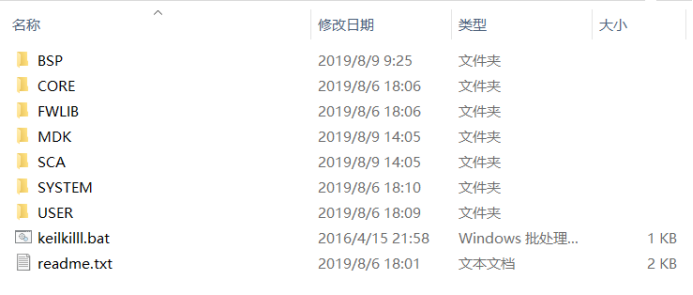
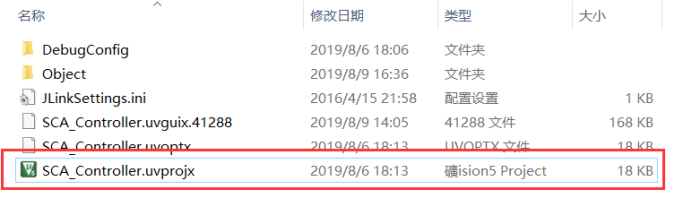
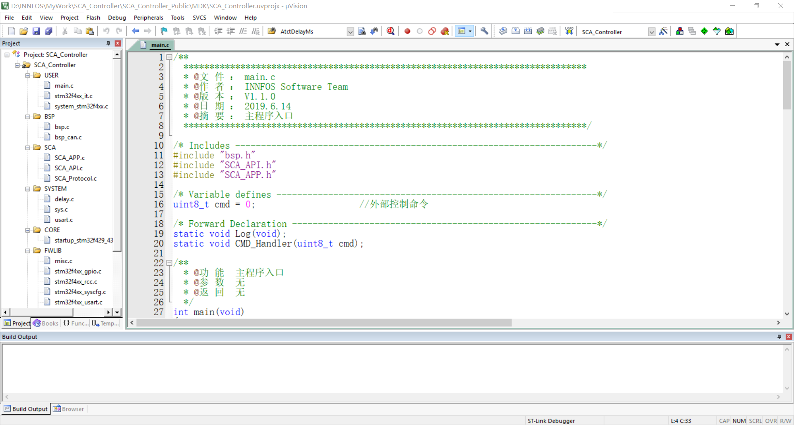
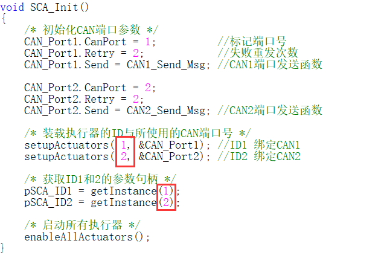
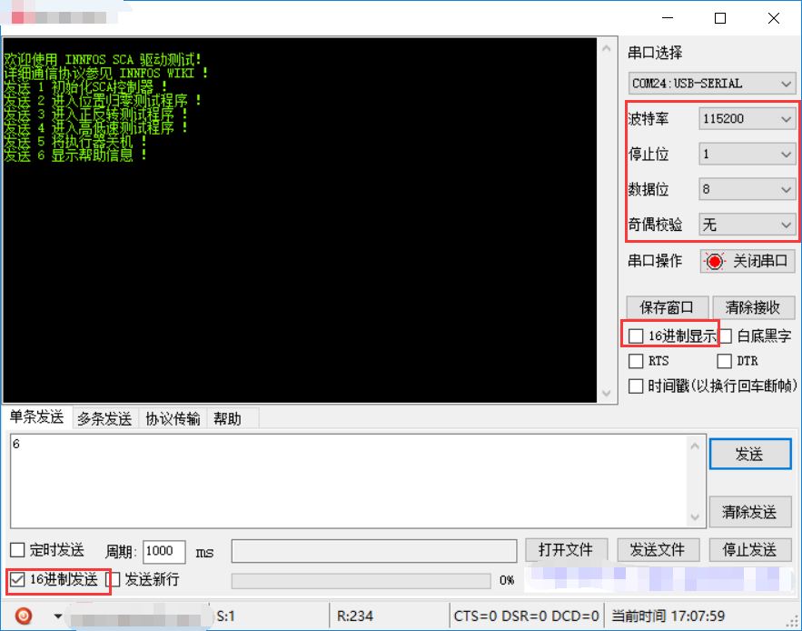
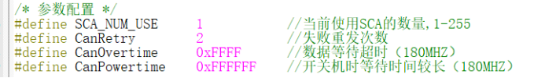
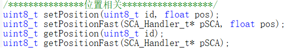

## 介绍

*    INNFOS CAN SDK STM32版 提供了友好的用户接口，包括了STM32F429单片机与多个INNFOS执行器进行通信的功能，可对多个执行器发送指令或者获取执行器状态和参数信息。本工程文件开放所有源代码，可根据项目需求定制或修改。

*    建议初次接触API的用户优先阅读工程文件中的 `readme.txt` 说明文件。

----

## 下载 SDK

访问[Download Link](https://github.com/innfos/INNFOS_CAN_SDK_STM32.git)获取MDK工程文件

----

## 文件结构

<strong>图1</strong>

*  `BSP`：STM32外设底层驱动文件
*  `CORE`：Cortex-M4 内核控制文件与STM32启动文件
*  `FWLIB`：STM32标准外设驱动库
*  `MDK`：MDK工程文件
*  `SCA`：INNFOS CAN 协议驱动文件以及应用实例代码
*  `SYSTEM`：STM32编程环境常用接口
*  `USER`：存放main.c等
*  `Keilkiller.bat`：清除编译产生的中间文件
*  `readme.txt`：相关说明

### SCA文件目录说明

<strong>图2</strong>

*  `SCA_Protocol.c/h`：INNFOS CAN 通信协议层，该协议层完成了数据帧封装，解包等步骤，使用CAN端口进行数据收发；
*  `SCA_API.c/h`：通信协议层的封装，包含了所有参数的读写API；
*  `SCA_APP.c/h`：演示程序；

----

## 示例代码编译运行

*  PC安装Keil MDK软件，工程所用版本为V5.21.1.0。所用单片机型号为`STM32F429IGT6`。

<strong>图3</strong>

*  打开MDK文件夹下的`SCA_Controller.uvprojx`文件，出现MDK的使用界面以及`main.c`代码：

<strong>图4</strong>

*  此DEMO中使用了两台执行器，ID `0x01`连接`CAN1`端口，ID `0x02`连接`CAN2`端口。在`SCA_APP.c`文件中有多处语句使用了该ID，请根据实际使用的执行器求修改所有对应的ID数值。若只使用一台执行器，请注释掉多余的代码，并将`SCA_API.c`文件下的宏定义`SCA_NUM_USE`修改为1。

<strong>图5</strong>

*  确保单片机通过`ST-LINK`或`J-LINK`等调试工具连接至PC，并能够正常工作。点击全部编译按钮，无错通过后点击下载按钮下载至单片机。

<strong>图6</strong>

*  下载完成后，将单片机的`串口1（PA9 PA10）`通过USB转串口工具连接至PC。打开虚拟串口终端软件，将波特率设为`115200`，接收数据以ASC码形式显示，以16进制形式发送数据。发送数字6打印帮助信息。

<strong>图7</strong>

*  根据提示信息，先初始化执行器，依次发送指令，结合`SCA_APP.c`下的代码观察执行器的动作变化。

-----

## 进阶使用

### 驱动架构

* INNFOS CAN SDK STM32版将驱动程序进行了分层处理。

*  `SCA_Protocol.c/h`为协议层，调用了STM32 CAN控制器收发数据的接口，提供了5类写入命令与读取命令的软件接口。这些接口会被API层的函数调用，针对不同命令对收发的数据进行打包或解包。头文件中包含了所有指令的宏定义，通信错误类型，以及用来保存每个执行器参数信息的信息句柄结构体定义。为了实现多CAN端口的支持，在协议层中加入了对CAN端口的描述句柄，可使用此句柄定义多个收发端口，需要在初始化程序中对每个端口的发送函数和重试次数进行定义，然后绑定到每个SCA的信息句柄中。另外，为方便移植，协议层提供了统一的数据接收接口`canDispatch(CanRxMsg* RxMsg)`，此接口需要在有新的CAN数据包接收时进行调用并将数据传入。用户可用轮询或者中断的方式来调用此函数，本例程采用中断调用。

*  `SCA_API.c/h`为接口层，提供了所有参数的读写功能，用户可直接调用该层的API。该层代码将指令与收发数据进行组合，并调用相应的读写API实现数据收发。大部分API都带有返回值，返回该次通信的结果，返回`SCA_NoError`为操作成功。详细定义在`SCA_Protocol.h`下。头文件中包含了执行器6种操作模式和2种状态的宏定义，以及参数配置的宏定义。

*  `SCA_APP.c/h`为应用层，提供了基本的示例程序与驱动的初始化方式。此处用户需要关注初始化程序`SCA_Init()`，其中包含了对CAN端口的配置，对SCA信息句柄的绑定以及获取参数的指针使用方式。

*  为了对执行器进行更高阶的控制，本例程采实现了阻塞和非阻塞可选的执行方式。带有参数`isBlock`的API可将此参数设为`Block（阻塞）`或`Unblock（非阻塞）`来控制其执行方式。阻塞执行时，命令发出后会等待执行器的返回数据，若超时则返回响应的错误代码，适用于比较重要的参数（如切换操作模式）。非阻塞执行时，命令发出后会自动延时`200us`，以防止CAN总线负载过高而导致数据出错，适用于参数刷新等操作。

### 参数配置

*  在开发项目时，需先配置系统参数，相关宏定义在`SCA_API.h`下。由于本例程支持阻塞式的通信方式，需要根据CPU速度调整阻塞超时时间，其中开关机时间较长，其他参数返回时间较短。在非阻塞执行程序时，为了防止总线过载，加入了保护延时，`SCA_Delay`为延时函数的接口，`SendInterval`为延时大小，默认每次非阻塞发送后延时`200us`。

<strong>图8</strong>

*  当`SCA_DEBUGER`宏定义为1时，会开启调试信息接口，默认调用`printf`打印错误数据，可用于调试软件。

### API调用

*  在调用`API`前需要对控制器进行初始化，具体方法参照应用层下的`SCA_Init()`函数。先根据所要使用的CAN端口数量定义CAN端口描述句柄，然后在初始化函数中为这些端口进行赋值操作，其中`Retry`（失败重发次数）和`Send`（发送函数）为必须定义的，`CanPort`（端口号）可用于标识端口号。完成所有CAN端口描述句柄的初始化后，需要使用`setupActuators()`函数将每个ID和其使用的CAN端口进行绑定，每个执行器只需要在初始化时执行一次该函数，注意此函数的调用次数不应超过`SCA_NUM_USE`定义的大小。

*  完成初始化并开机后，可正常使用接口的层所有函数。所有的`API`以`ID`来区分总线上的执行器，如读写位置的函数。写位置时，传入要操作的执行器ID，与实际位置值（±127.0R）；读位置时，只传入要读取的执行器ID即可将当前位置值读进对应的信息句柄中。大部分API带有返回值，返回本次数据通信的结果，当返回`SCA_NoError（0）`时，该指令执行成功，返回其他参见`SCA_Protocol.h`下的错误类型定义。

<strong>图9</strong>

*  所有的信息句柄会以结构体数组的形式进行初始化定义，定义的长度为`SCA_NUM_USE`，与实际使用的SCA数量保持一致。所有以ID区分执行器的API中，会有以ID查找信息句柄的过程，调用 `getInstance()`函数。该函数会返回指定ID的信息句柄地址，若ID不存在则返回NULL。用户想要获取每个执行器的参数信息，则定义个一个 `SCA_Handler_t`类型的指针，然后用 `getInstance()` 函数获取对应ID的地址，用指针查看对应的参数即可。同时，该类型的指针也可以传入`Fast`型函数中，快速的执行指令，进而省略查找信息句柄的过程，当使用的SCA数量较多时，推荐使用此种类型的函数。

*  当修改完执行器的参数时，需要使用`saveAllParams()`函数将参数永久保存，否则下次开机后执行器内依然为未修改的参数。

### 移植相关
*  当需要将驱动程序移植到其他平台时，需要将工程文件夹下的SCA文件夹拷贝至目标工程内，并实现相应的软件接口。

*  `1.`平台实现CAN底层驱动，提供发送函数，并将函数封装为Send_t定义的格式（在协议层头文件中描述）。

*  `2.`在数据接收的接口中调用协议层内`canDispatch(CanRxMsg* RxMsg)`函数来解析数据，其中`CanRxMsg` 为CAN数据包的接收类型结构体。移植时，请自行根据平台定义`CanRxMsg`结构类型，此处默认使用STM32标准库函数中的接收结构。

*  `3.`在接口层中，替换延时函数的宏定义，此处需要实现微秒级延时，若以毫秒为单位延时可能会造成指令执行效率低下的现象。若开启了调试接口功能，还需要实现相应的信息打印函数，默认使用`printf`。根据CPU速率修改阻塞超时时间，若该值太小可能会造成数据正常接收但函数返回错误的现象。

*  `4.`替换相关的头文件，参考例程使用。

----

## 版本变更记录

<table class="tableizer-table"><thead><tr class="tableizer-firstrow" style=background:PaleTurquoise><th>版本</th><th>更新时间</th><th>更新内容</th></tr></thead><tbody><tr><td>V1.1.0</td><td>2019.08.21</td><td>SDK更新至1.5.0版本，增加描述内容</td></tr><tr><td>V1.0.0</td><td>2019.08.12</td><td>第一个版本</td></tr></tbody></table>

