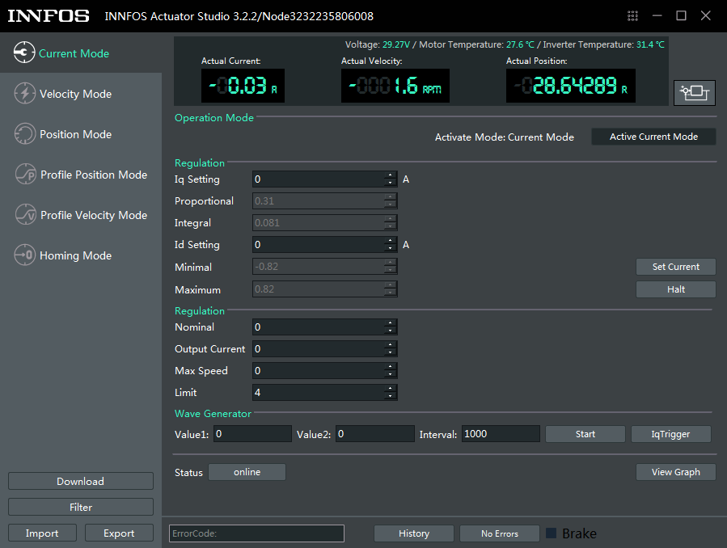

[English](CAN_Communication_Protocol "wikilink")

基于CAN总线的通信方式
=====

INNFOS执行器可与嵌入式控制板的CAN接口直接相连进行通信。 您可以根据需要连接自己的嵌入式控制板实现对INNFOS执行器的控制。 此处提供两种常见嵌入式开发板的连接实例供参考。

## 硬件需求与连接

## 基于ST开发板的连接

**硬件需求**

*   从左到右依次为：INNFOS 执行器、ST开发板（需自备）、终端电阻、ECB连接线、执行器综合线缆，直流稳压电源
*   您可以使用自己的ST开发板实现与执行器间的CAN通信及控制
*   如使用开关电源需配备急停开关。

Note: 必须先断电然后再插拔部件.  否则可能损坏部件. 请确认您的直流电源电压与执行器电压范围是否一致，否则会导致执行器出现过压或欠压错误。

**连接ST开发板与执行器综合线缆连接**

*   取出执行器综合线缆

 

*   将执行器综合线缆的一端剪开
红色粗线为电源正极线；黑色粗线为电源负极线，
将双绞屏蔽线剪开，其中红色细线为 CAN_H;黑色细线为 CAN_L; 银色细线为CAN_GND。

 

*    将红色细线 CAN_H，黑色细线 CAN_L分别接入 ST开发板的对应位置。

 

*    将红色电源正极线与黑色电源负极线按图所示接入电源正负极。

 

**连接执行器**

*    将执行器综合线缆另一端连接执行器。

 

*    末端执行器安插终端电阻

 

*    完成连接，即可接通电源，进行后续调试

 

## 基于Arduino开发板的开发板的连接

**硬件需求**

*   从左到右依次为：INNFOS 执行器、Arduino开发板（需自备）、终端电阻、ECB连接线、执行器综合线缆，直流稳压电源
*   您可以使用自己的Arduino开发板实现与执行器间的CAN通信及控制
*   如使用开关电源需配备急停开关。

Note: 必须先断电然后再插拔部件.  否则可能损坏部件. 请确认您的直流电源电压与执行器电压范围是否一致，否则会导致执行器出现过压或欠压错误。

**连接Arduino开发板与执行器综合线缆**

 

*   将执行器综合线缆的一端剪开。
红色粗线为电源正极线；黑色粗线为电源负极线，将双绞屏蔽线剪开，其中红色细线为 CAN_H;黑色细线为 CAN_L; 银色细线为CAN_GND。

 

*    将ECB连接线小心剪开，并与剪开综合线缆的红色细线 CAN_H，黑色细线 CAN_L; 银色细线为CAN_GND
如图所示找好对应引脚进行连接，焊接牢固 ，并用热缩管或绝缘胶带包好以防止短路。

 

*    将红色电源正极线与黑色电源负极线按图所示接入电源正负极。

 

*    将ECB连接线的另一端插入Arduino开发板，完成连接。

 

**连接执行器**

*    将执行器综合线缆另一端连接执行器。

 

*    末端执行器安插终端电阻

 

*    完成连接，即可接通电源，进行后续调试

 

## 软件安装与使用

**下载IAS**

*   如果电脑系统为linux,访问[IAS(linux)](https://github.com/innfos/INNFOS-Actuator-Studio-linux.git)获取最新版本的IAS(INNFOS Actuator Studio)(Linux),如果电脑系统是window请访问[IAS(windows)](https://github.com/innfos/INNFOS-Actuator-Studio-windows.git).

**配置IP地址**

*   配置步骤请参考[以太网通信配置](Ethernet_Configuration.md)

**安装IAS**

*   安装IAS请参考[IAS安装](INNFOS_Actuator_Studio_IAS_instruction.md)

**使用** 

 

安装成功后，启动`IAS`,单击“确认”按钮启用“下一步”按钮，然后单击“下一步”直到出现如下界面: 

 

单击“1”或“2”按钮启动执行器，按钮“1”变为绿色表示您已成功启动执行器。单击消息框或单击“详细信息”按钮（位于按钮“1”下方） 进入执行器调试界面。 

 

 **位置控制**

*   单击左侧栏上的`Profile Position Mode`按钮，然后单击右侧的`Activate Profile Position Mode`。之后，您可以在“设置”中输入位置值，单位是R(范围是-127R~127R)。

 

 

### 其他

想了解更多关于`IAS`的信息 , 请访问[INNFOS Actuator Studio(IAS)说明](#!pages/INNFOS_Actuator_Studio_IAS_instruction.md).

## 版本变更记录

<table><thead><tr style=background:PaleTurquoise><th>版本</th><th>更新时间</th><th>更新内容</th></tr></thead><tbody><tr><td>V1.0.0</td><td>2019.04</td><td>第一个版本</td></tr></tbody></table>

