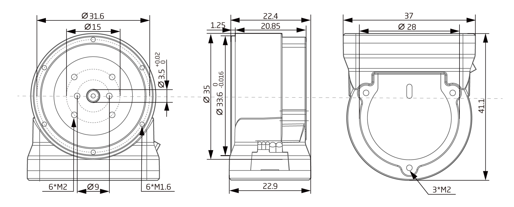

# 参数介绍 
## DD-2305工程参数图[单位：毫米]
 
### 3D 模型
[模型文件]( ../img/DD_23053D.STEP.zip )

note：谐波为柔轮固定方式，因此实际减速比为谐波标称减速比加1.

## DD-2305参数
<table class="tableizer-table"><table class="tableizer-table" style="width:400px"><thead><tr class="tableizer-firstrow"><th colspan="2" style="background: PaleTurquoise; color: black;">DD-2305参数</th></tr></thead><tbody><tr><td>功率</td><td>36 W</td></tr><tr><td>电机类型</td><td>无刷伺服电机</td></tr><tr><td>额定扭矩</td><td>0.023 Nm</td></tr><tr><td>峰值扭矩</td><td>0.069 Nm</td></tr><tr><td>相电流满量程</td><td>2A</td></tr><tr><td>转矩系数</td><td>0.0345</td></tr><tr><td>旋转角度</td><td>> 360.0 °</td></tr><tr><td>温度范围</td><td>-20~+80 °C</td></tr><tr><td>分辨率</td><td>16384(14bit) Step/turn</td></tr><tr><td>空载转速</td><td>6000 RPM</td></tr><tr><td>额定转速</td><td>4000 RPM</td></tr><tr><td>噪声</td><td><= 70 dB(A)</td></tr><tr><td>额定电压</td><td>42 VDC</td></tr><tr><td>电压范围</td><td>24~45 VDC</td></tr><tr><td>额定电流</td><td>0.86 A</td></tr><tr><td>静态工作电流</td><td>0.08 A</td></tr><tr><td>集成电力电子</td><td>yes</td></tr><tr><td>传感器</td><td>多圈绝对式编码器</td></tr><tr><td>通信接口</td><td>CAN</td></tr><tr><td>直径</td><td>35mm</td></tr><tr><td>长度</td><td>22.9mm</td></tr><tr><td>重量</td><td>54g</td></tr><tr><td>电机转子转动惯量</td><td>2.25254 Kg*mm²</td></tr></tbody></table>

### 接插件型号图
<table class="tableizer-table" style="width:700px">
<thead><tr class="tableizer-firstrow"><th colspan="4" style="background: PaleTurquoise; color: black;width:800px">接插件型号图</th></tr></thead><tbody><tr><td>标号</td><td>Signal</td><td>颜色</td><td >端子引脚分布</td></tr><tr><td>1</td><td>PVDD</td><td>红线</td><td rowspan="5"></td></tr><tr><td>2</td><td>GND</td><td>黑线</td></tr><tr><td>3</td><td>VDD</td><td>红线</td></tr><tr><td>4</td><td>CAN-P</td><td>红线</td></tr><tr><td>5</td><td>CAN—N</td><td>黑线</td></tr></tbody></table>

# 版本变更记录

<table class="tableizer-table">
<thead><tr class="tableizer-firstrow" style="background: PaleTurquoise; color: black;width:500px"><th >版本</th><th>更新时间</th><th>更新内容</th></tr></thead><tr><td>V1.0.0</td><td>2019-04</td><td>第一个版本</td></tr></tbody></table>

