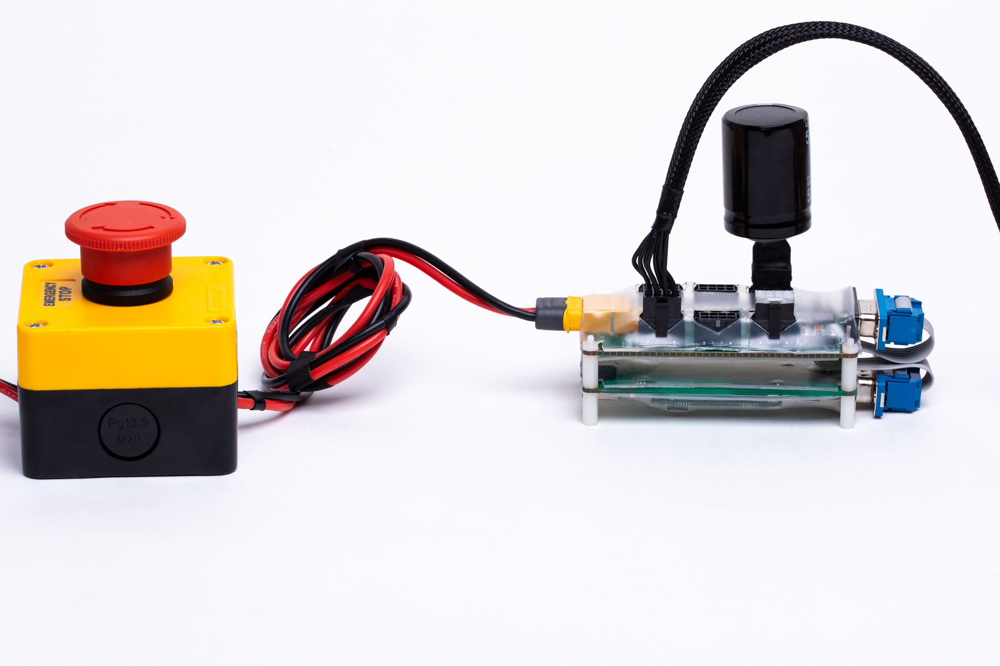
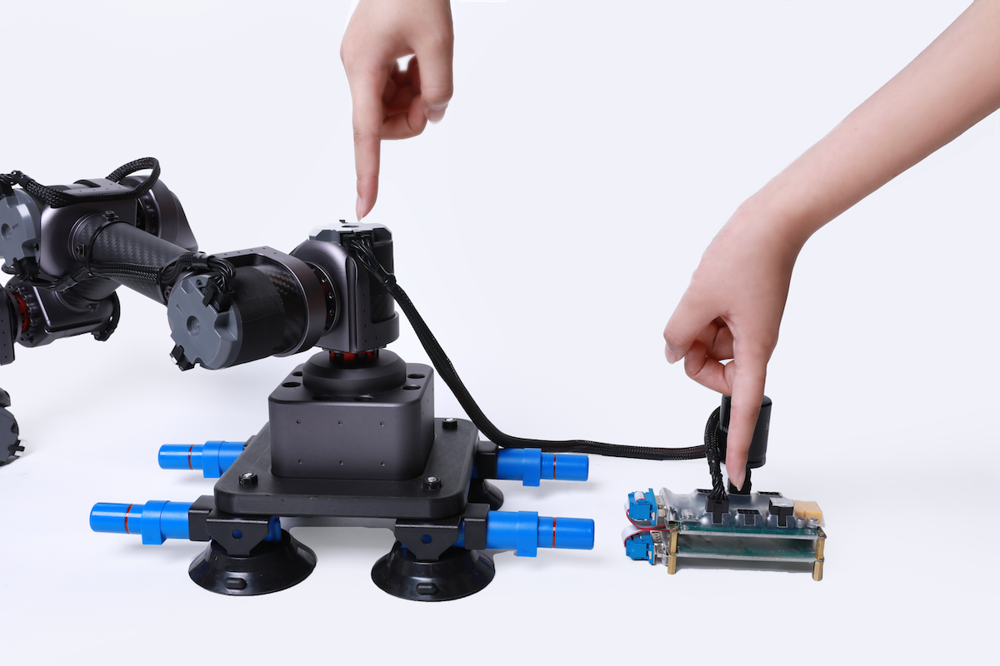
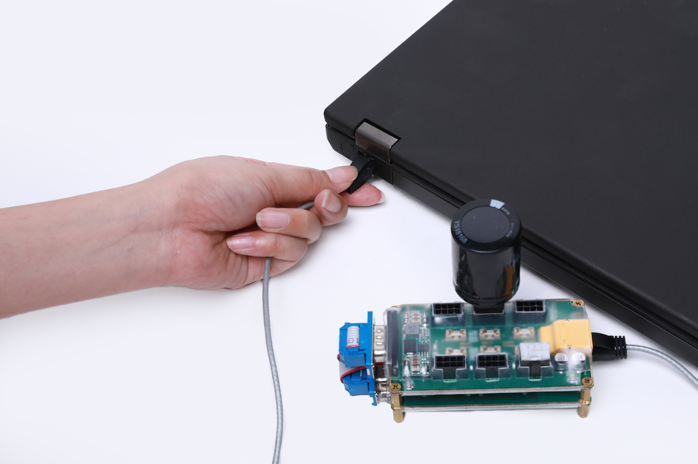
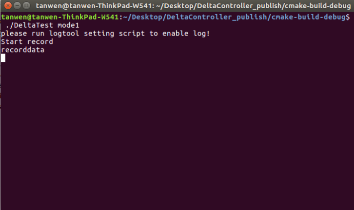
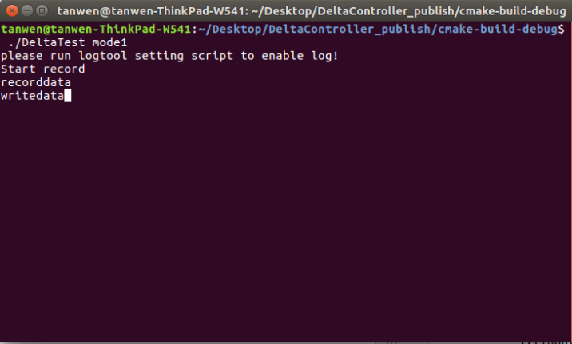
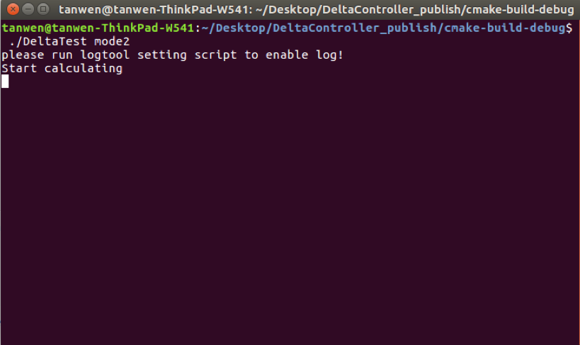
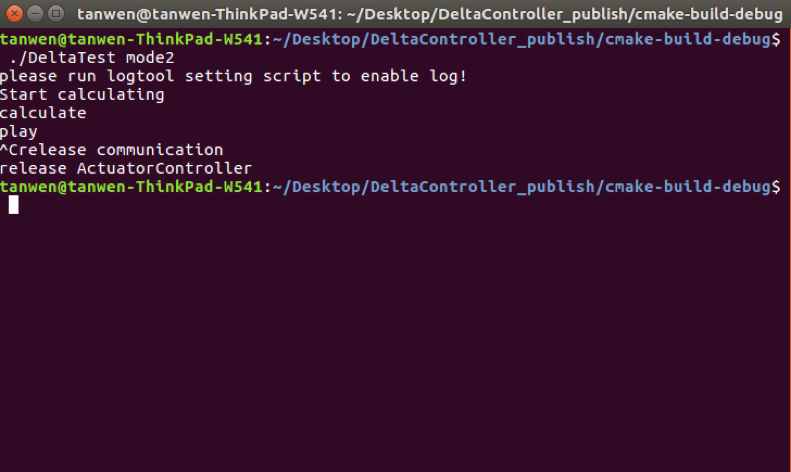

Delta机器人安装使用说明书
=====

## 介绍

*   本说明书是针对精度展示平台的使用说明。
*   在使用之前请仔细阅读本说明书内容。

Delta采用了并联结构,具有刚度大,承载能力强等优点,所有关节采用QDD Lite系列执行器搭建.同时,因QDD Lite系列执行器采用了复合材料，大大降低了高端机器人本机研发成本,主要应用于物流的包装分拣搬运,研究所实验室的研究等领域.
参考 SCA 型号:QDD Lite-PR60
参考 SCA 型号:[QDD Lite-PR60](QDDLite-PR60-36_v1_8.md) *3
                                                                          
                                                                          


## 工程参数图
<br>[单位：毫米]


### 3D模型
[模型文件]( ../../img/Delta机器人_v1_0.step.zip )


## 基本参数

<table style="width:500px"><thead><tr><th colspan="2" style="background: PaleTurquoise; color: black;">Delta机器人参数</th></tr></thead><tbody></tr><tr><td>末端负载</td><td> 0.5kg </td></tr><tr><td>自重</td><td> 暂无 </td></tr><tr><td>自由度</td><td>3 </td></tr><tr><td>工作范围</td><td>X轴:-195mm - 195mm<br>Y轴:-195mm - 195mm<br>Z轴:-501mm -  -251mm
</td></tr><tr><td>关节范围</td><td> -10°-80° </td></tr><tr><td>工具最大速度</td><td>2.0m/s</td></tr><tr><td>重复定位精度</td><td>0.1mm</td></tr><tr><td>供电电压</td><td> 42v</td></tr><tr><td>功耗</td><td>普通功耗约60w</td></tr><tr><td>结构件材料</td><td>铝合金,碳纤维管</td></tr><tr><td>工作环境温度</td><td>10-50°</td></tr><tr><td>工作环境湿度</td><td>5%~95%</td></tr><tr><td>防护等级</td><td>IP54</td></tr><tr><td>通信端口</td><td>CAN/以太网</td></tr><tr><td>示教器</td><td>电脑或者移动终端</td></tr></td></tbody></table>


## 产品实拍效果图


## 硬件需求与连接

**硬件需求**


从前到后、从左到右依次为：六轴机械臂一台、插好终端电阻和回馈制动电容的ECB+HUB、急停开关+电源、电脑。


**连接ECB**

**连接电源**

*   连接电源与`ECB+HUB`


**连接执行器及其配件**

*   连接`执行器综合线缆`



**连接机械臂**

*   用执行器连接线连接`HUB`与执行器



**连接电脑**

*   用网线连接`ECB`与电脑



**连接后整体视图**


**开启电源**

*   开启电源. 执行器的供电电压范围为直流24V-45V.


*   上电以后，执行器LED状态灯会变成黄色闪烁，启动执行器后，LED会变成绿色闪烁，这时就可以与执行器进行通信了。如果执行器内部出现错误，LED灯会变为红色闪烁，请检查执行器错误代码。


## 软件安装与使用


**IAS软件的使用**

* `IAS`(MINTASCA Actuator Studio)的为配置机械臂的上位机软件 , 请访问[MINTASCA Actuator Studio(IAS)说明](#!pages/INNFOS_Actuator_Studio_IAS_instruction.md).

**运动功能使用**

* 示教-再现功能
  

### 下载安装

运行环境：linux-x86-64
访问该链接下载机械臂软件或者直接执行以下命令

访问该链接[download link](https://github.com/mintasca/robot_controller-6-NE30-.git)下载SDK相关文件或者直接执行以下命令
```sh
$ git clone  https://github.com/mintasca/innfos-cpp-sdk.git
```
访问该链接[download link](https://github.com/mintasca/ActuatorController_SDK.git)下载Delta 机器人相关文件或者直接执行以下命令
```sh
$ git clone https://github.com/mintasca/innfos-delta-robot-controller
```


### 运行模式
Delta并联机器人提供以下运行模式:mode1,mode2

配置环境变量:
```sh
. environment
```
Note: 每次打开终端都需执行此命令,如不执行,终端会提示找不到动态库”libActuatorController.so”

执行以下命令更改权限：
```sh
chmod +x DeltaTest
```
 
 
* mode1:记录保存示教的点
执行命令
<br>(1)在终端中执行
```sh
$ ./DeltaTest mode1
```
此时终端会显示：


(2)在终端中执行recorddata(每记录一个点执行一次该命令)
<br>此时终端会显示：



(3)在终端中执行writedata(记录完所有的点后保存记录的点,只需执行一次)
<br>此时终端会显示：




(4)在终端中执行exit(退出mode1)
<br>此时终端会显示：


Note: 打开文件夹下记录数据的文本Data_linearCurve_Joint,文本中记录的为所有示教的点,这时候需要把第一行的数据复制到结尾,这样可以形成循环播放.


* mode2:执行示教动作
<br>(1)在终端中执行
```sh
$ ./DeltaTest mode2
```
此时终端会显示：



(2)在终端中执行calculate(末端计算插值点)
此时终端会显示:


(3)在终端中执行play(播放示教的轨迹)
此时终端会显示:


(4)在终端中执行ctrl+c(结束退出)
此时终端会显示:



Note:如果想执行之前示教好的点,不需要执行mode1,直接执行mode2即可.


## 版本变更记录
**下表简单描述了版本变更记录**

<table style="width:400px"><thead><tr style="background:PaleTurquoise"><th style="width:100px">版本号</th><th style="width:150px">更新时间</th><th style="width:150px">更新内容</th></tr></thead><tbody><tr><td>v1.0.1</td><td>2019.09.29</td><td>全文内容图片添加</td>
  <tr><td>v1.0.0</td><td>2019.09.16</td><td>全文添加</td></tr></tbody></table>


