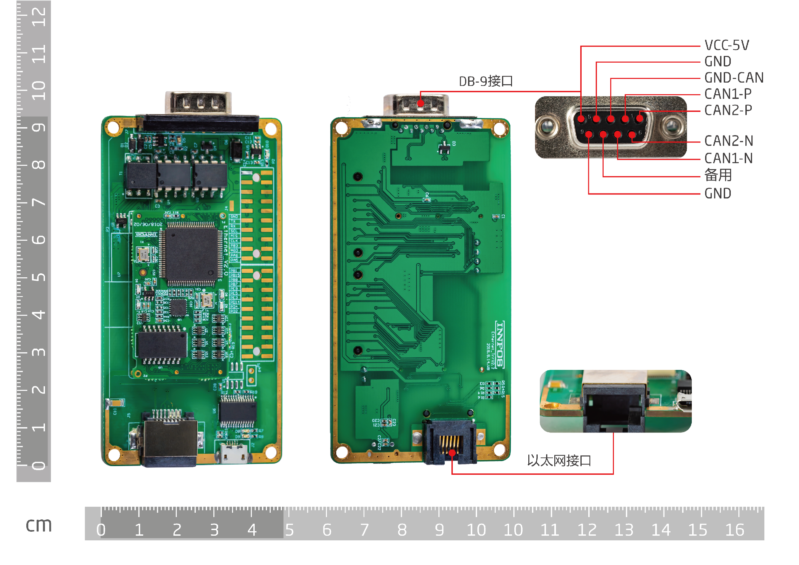
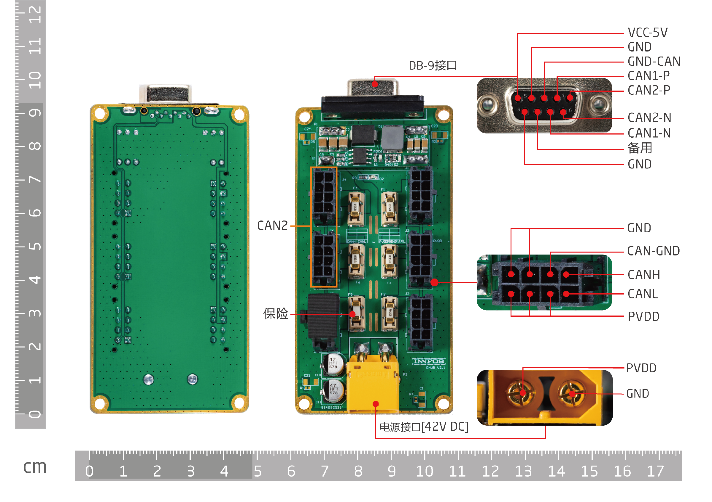
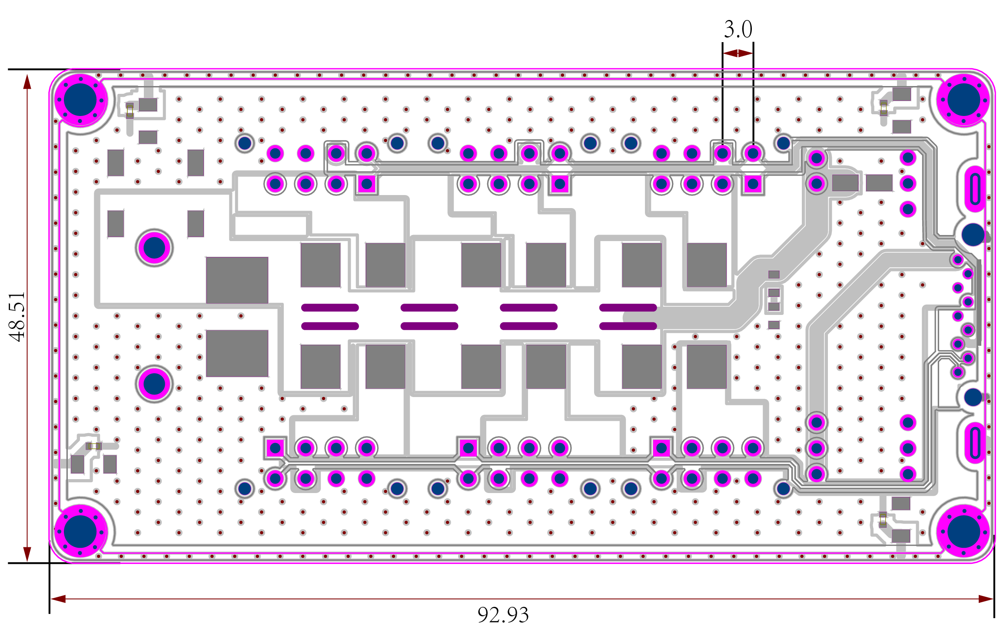

# ECB & HUB
## 简介

ECB是一款以太网转CAN控制器，该控制器起到了以太网和CAN通信相互转换的网桥的作用。它采用STM32F429VET6主控芯片。拥有丰富的扩展接口。以太网端口为标准RJ45以太网接口，网络速度为10/100Mbps，默认IP地址为192.168.1.30，以太网通讯协议采用UDP协议，默认端口号为2000。ECB拥有两路独立的CAN总线，并且采用CAN隔离方案，通讯速率为1Mbps。通过两路独立的CAN总线，可以增加系统CAN通讯的带宽，减小通讯延迟，增加了系统的实时性，可以实现多个执行器串联的复杂闭环系统的控制。

ECB的原理图和BOM，以及以太网通讯协议全部开源，用户可以根据自己的需求，在ECB上直接进行开发，大大提高了新产品的研发效率，从而加快新产品的上市时间。
  

 

## 功能

* CPU:STM32F429VET6
* RAM:256K
* Flash:512K
* 10/100M Ethernet：1
* CAN：2
* LEDs X12：电源指示LED X3，用户LED X5，USB收发数据LED X2，Link * activity LED X1，Link Speed LED X1
* Molex接口 X6：CAN通信接口
* 2排2.54mm双排针，包含以下资源：
* I2C
* SPI
* USART
* 预留主控芯片引脚 X29

 Note: 
产品供电严禁超过最大输入电压；
产品应该放置在干燥的环境中保存，严谨日晒雨淋、摔、掷和跌落；
产品对静电敏感，静电可能会对芯片造成永久性损坏，用户在触摸产品之前，最好先将身体携带的静电放掉，可以通过人体静电消除器或者把手放在墙壁上一段时间；

## 接口说明

### 核心板管脚定义
P1管脚定义
<table style="width:550px">
<thead><tr class="tableizer-firstrow" style="background: PaleTurquoise; color: black"><th>P1 PIN#</th><th>PCB PIN#</th><th>Name</th><th>P1 PIN#</th><th>PCB PIN#</th><th>Name</th></tr></thead><tbody><tr><td>1</td><td>1</td><td>PC0</td><td>2</td><td>2</td><td>PB1</td></tr><tr><td>3</td><td>3</td><td>PA15</td><td>4</td><td>4</td><td>PB15</td></tr><tr><td>5</td><td>5</td><td>PB14</td><td>6</td><td>6</td><td>PB8</td></tr><tr><td>7</td><td>7</td><td>PE10</td><td>8</td><td>8</td><td>PB7</td></tr><tr><td>9</td><td>9</td><td>PE8</td><td>10</td><td>10</td><td>PE9</td></tr><tr><td>11</td><td>11</td><td>PE4</td><td>12</td><td>12</td><td>PE5</td></tr><tr><td>13</td><td>13</td><td>PD15</td><td>14</td><td>14</td><td>PE3</td></tr><tr><td>15</td><td>15</td><td>PD13</td><td>16</td><td>16</td><td>PD14</td></tr><tr><td>17</td><td>17</td><td>PD3</td><td>18</td><td>18</td><td>PD4</td></tr><tr><td>19</td><td>19</td><td>PD1</td><td>20</td><td>20</td><td>PD2</td></tr></tbody></table>

P2管脚定义
<table style="width:550px">
<thead><tr class="tableizer-firstrow" style="background: PaleTurquoise; color: black"><th>P1 PIN#</th><th>PCB PIN#</th><th>Name</th><th>P1 PIN#</th><th>PCB PIN#</th><th>Name</th></tr></thead><tbody><tr><td>1</td><td>1</td><td>PA5</td><td>2</td><td>2</td><td>PA3</td></tr><tr><td>3</td><td>3</td><td>PA6</td><td>4</td><td>4</td><td>PA4</td></tr><tr><td>5</td><td>5</td><td>AGND</td><td>6</td><td>6</td><td>PA0</td></tr><tr><td>7</td><td>7</td><td>PB3</td><td>8</td><td>8</td><td>PB4</td></tr><tr><td>9</td><td>9</td><td>SPI2_SCK</td><td>10</td><td>10</td><td>SPI2_NSS</td></tr><tr><td>11</td><td>11</td><td>SPI2_MISO</td><td>12</td><td>12</td><td>SPI2_MOSI</td></tr><tr><td>13</td><td>13</td><td>I2C3_SCL</td><td>14</td><td>14</td><td>I2C3_SDA</td></tr><tr><td>15</td><td>15</td><td>USART2_RX</td><td>16</td><td>16</td><td>VCC_5V</td></tr><tr><td>17</td><td>17</td><td>USART2_TX</td><td>18</td><td>18</td><td>PB0</td></tr><tr><td>19</td><td>19</td><td>GND</td><td>20</td><td>20</td><td>PC7</td></tr></tbody></table>

### Amass XT60、molex、MicroUSB、网口
Amass XT60：电源输入

Molex：CAN通信接口，CAN1-J1、J2、J3；CAN2-J4、J5、J6

MicroUSB：预留USB功能接口

网口：连接上位机

## 外形尺寸

 

## ECB 和 ECB_HUB的连接方式
方式一：

方式二：

## 资源
* [原理图1]( ../img/Ethernet_TransferV2.2SCH.pdf.zip ) [原理图2]( ../img/HUBV3.0SCH.pdf.zip )
* [尺寸图1]( ../img/Ethernet_TransferV2.2.zip ) [尺寸图2]( ../img/HUBV3.0.zip )
* [STM32F429 数据表]( ../img/STM32F429.pdf.zip )

## 版本变更记录
<table class="tableizer-table">
<thead><tr class="tableizer-firstrow" style="background: PaleTurquoise; color: black;width:500px"><th >版本</th><th>更新时间</th><th>更新内容</th></tr></thead><tr><td>V1.0.0</td><td>2019-05</td><td>第一个版本</td></tr></tbody></table>
