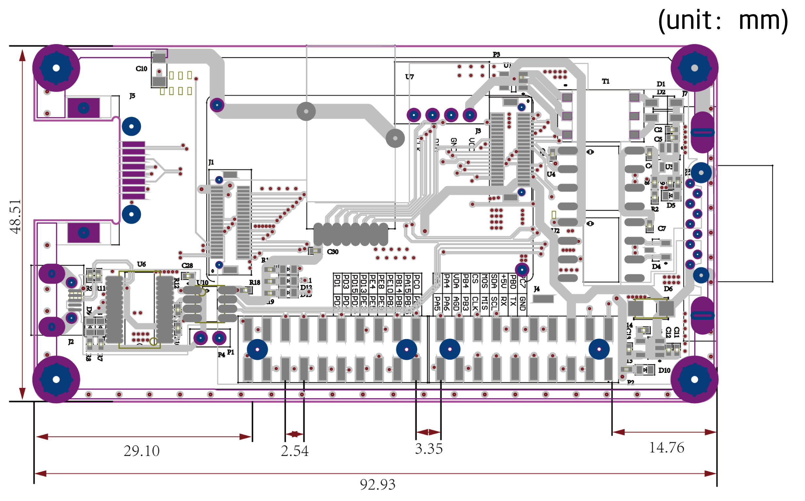
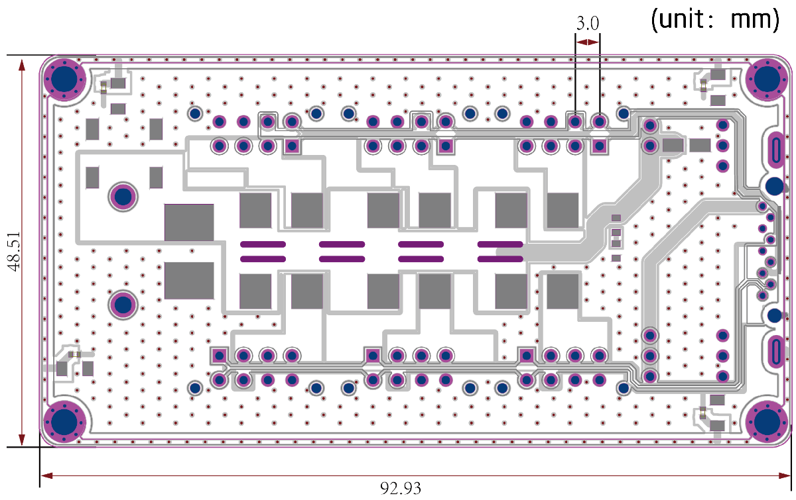

# ECB & HUB
## 简介

ECB(Ethernet to CAN Bridge)是一款以太网转CAN控制器，该控制器起到了以太网和CAN通信相互转换的网桥的作用。它采用STM32F429VET6主控芯片。拥有丰富的扩展接口。以太网端口为标准RJ45以太网接口，网络速度为10/100Mbps，默认IP地址为192.168.1.30，以太网通讯协议采用UDP协议，默认端口号为2000。ECB拥有两路独立的CAN总线，并且采用CAN隔离方案，通讯速率为1Mbps。通过两路独立的CAN总线，可以增加系统CAN通讯的带宽，减小通讯延迟，增加了系统的实时性，可以实现多个执行器串联的复杂闭环系统的控制。

ECB的原理图和BOM，以及以太网通讯协议全部开源，用户可以根据自己的需求，在ECB上直接进行开发，大大提高了新产品的研发效率，从而加快新产品的上市时间。
  


 


## 资源概览

* CPU:STM32F429VET6
* RAM:256K
* Flash:512K
* 以太网通讯：1路，10/100M 自适应速率
* CAN通讯：2路，速率1Mbps
* LED 12个：电源指示LED 3个，用户LED 5个，USB收发数据指示LED 2个，以太网连接状态指示LED 1个，以太网速率指示LED 1个
* 功率信号复合接口 ：6个，单个复合接口同时包含CAN信号和功率信号
* 扩展接口： 2排2.54mm双排针，包含以下资源：
* I2C
* SPI
* USART
* 预留主控芯片引脚：29 PIN，引脚包含复用功能，请参考附件的数据手册


Note: 
产品供电严禁超过最大输入电压；
产品应该放置在干燥的环境中保存，严谨日晒雨淋、摔、掷和跌落；
产品对静电敏感，静电可能会对芯片造成永久性损坏，用户在触摸产品之前，最好先将身体携带的静电放掉，可以通过人体静电消除器或者把手放在墙壁上一段时间；


## 接口说明

### 核心板管脚定义
P1管脚定义
<table style="width:500px"><thead><tr class="tableizer-firstrow" style="background: PaleTurquoise; color: black"><th style="width:70px">P1 PIN#</th><th>Name</th><th>P1 PIN#</th><th>Name</th></tr></thead><tbody><tr><td>1</td><td>PC0</td><td>2</td><td>PB1</td></tr><tr><td>3</td><td>PA15</td><td>4</td><td>PB15</td></tr><tr><td>5</td><td>PB14</td><td>6</td><td>PB8</td></tr> <tr><td>7</td><td>PE10</td><td>8</td><td>PB7</td></tr><tr><td>9</td><td>PE8</td><td>10</td><td>PE9</td></tr><tr><td>11</td><td>PE4</td><td>12</td><td>PE5</td></tr><tr><td>13</td><td>PD15</td><td>14</td><td>PE3</td></tr><tr><td>15</td><td>PD13</td><td>16</td><td>PD14</td></tr><tr><td>17</td><td>PD3</td><td>18</td><td>PD4</td></tr><tr><td>19</td><td>PD1</td><td>20</td><td>PD2</td></tr></tbody></table>


P2管脚定义
<table style="width:500px"><thead><tr class="tableizer-firstrow" style="background: PaleTurquoise; color: black"><th style="width:70px">P1 PIN#</th><th>Name</th><th>P1 PIN#</th><th>Name</th></tr></thead><tbody><tr><td>1</td><td>PA5</td><td>2</td><td>PA3</td></tr><tr><td>3</td><td>PA6</td><td>4</td><td>PA4</td></tr><tr><td>5</td><td>AGND</td><td>6</td><td>PA0</td></tr><tr><td>7</td><td>PB3</td><td>8</td><td>PB4</td></tr><tr><td>9</td><td>PD3</td><td>10</td><td>PB9</td></tr><tr><td>11</td><td>PI2</td><td>12</td><td>PI3</td></tr><tr><td>13</td><td>PA8</td><td>14</td><td>PC9</td></tr><tr><td>15</td><td>PD6</td><td>16</td><td>VCC_5V</td></tr><tr><td>17</td><td>PD5</td><td>18</td><td>PB0</td></tr><tr><td>19</td><td>GND</td><td>20</td><td>PC7</td></tr></tbody></table>


### 接口规格
电源输入接口：Amass XT60PT-M

功率信号复合接口：Molex 430450827

USB接口：MicroUSB 韩荣U-F-M5DD-Y-L，预留USB功能接口

以太网接口：RJ45连接器 L60055-14， 连接上位机


## 外形尺寸


 

 Note: 单位为mm
 
## ECB 和 ECB_HUB的连接方式
方式一：


方式二：


## 连接多个ECB


Note: 多个ECB连接同一电脑,ECB的IP和MAC地址不能有重复，修改ECB的IP和MAC地址请访问 修改IP和MAC地址

## 修改IP和MAC地址
#### 下载

* 访问该链接[download link](https://github.com/innfos/ipChangeTool .git)下载SDK相关文件或者直接执行以下命令

```sh
$ git clone https://github.com/innfos/ipChangeTool.git
```
    
* 进入ipChangeTool目录，修改ipChange的权限：

```sh
chmod 777 ipChange
```
* 确认有且只有一个ECB或者ECU已经连接到电脑并且上电后，执行命令：

```sh
./ipChange -ip=<1~255> -mac=<1~255>
```
* 请注意只能修改IP或者MAC地址的最后一个数。比如ECB的IP地址是192.168.1.30，只能用该工具将30修改成其他数字.

## 资源
* [ECB_SCH]( ../img/ECB_v2_2.pdf )   [ECB_HUB_SCH]( ../img/ECB_HUB_v2_2.pdf )
* [STM32F429 数据表]( ../img/STM32F429VIT6.PDF )


## 版本变更记录
**下表简单描述了版本变更记录**

<table style="width:600px"><thead><tr style="background:PaleTurquoise"><th style="width:80px">版本号</th><th style="width:100px">更新时间</th><th style="width:100px">更改类型</th><th style="width:80px">位置</th><th>更新内容</th></tr></thead><tbody><tr><td>V2.2.0</td><td>2019.05.02</td><td>添加</td><td>ECB & HUB</td><td>全文添加</td></tbody></table>

