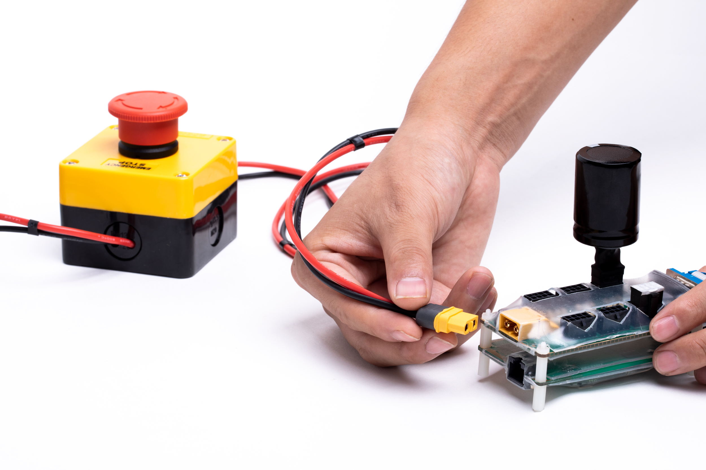
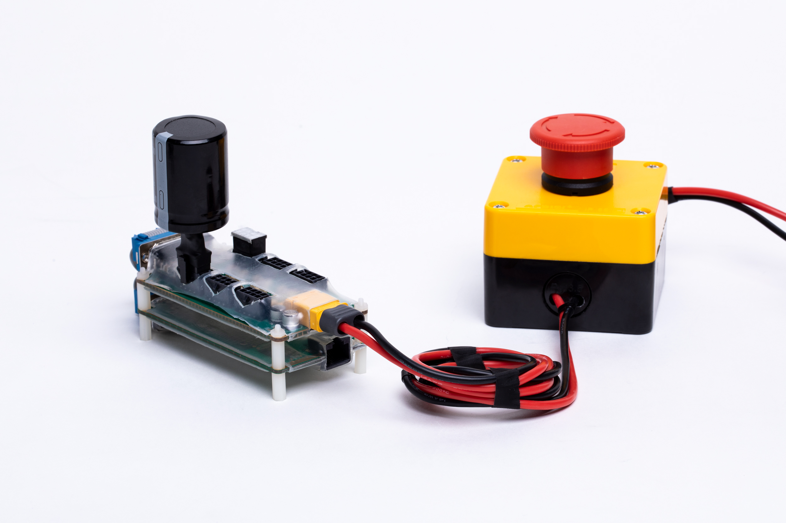
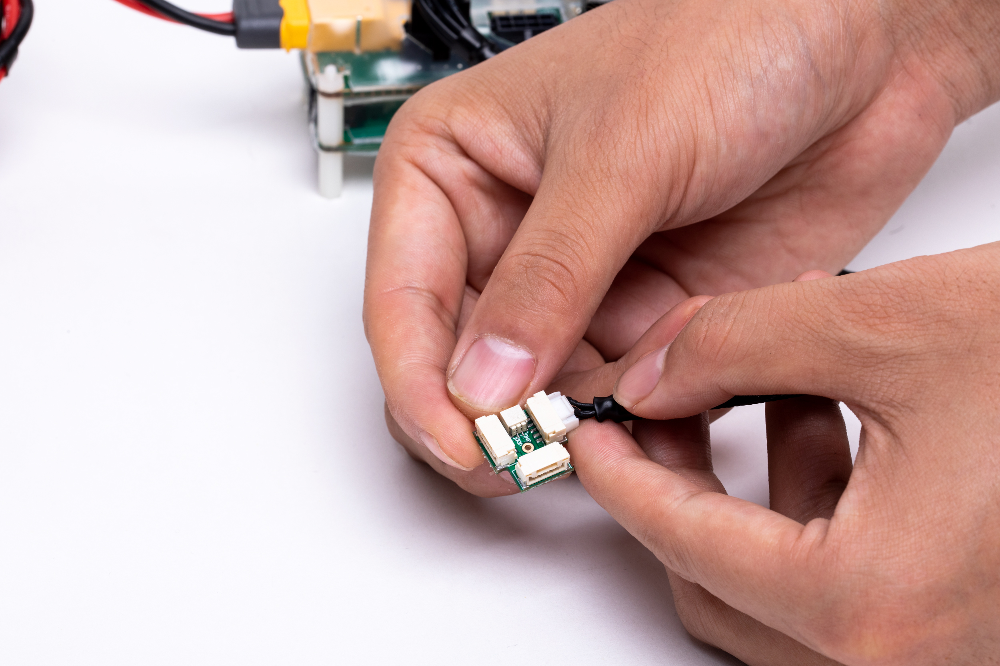
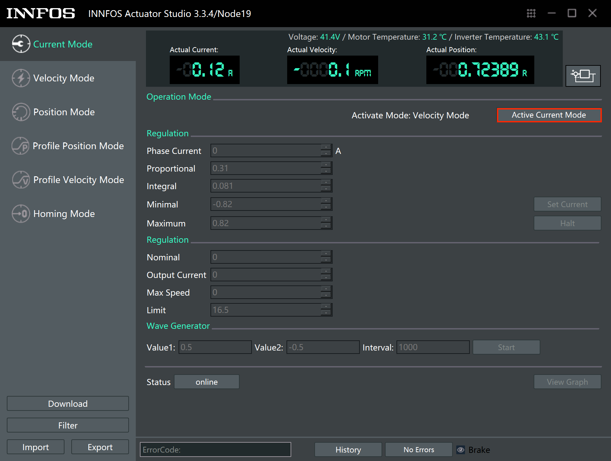
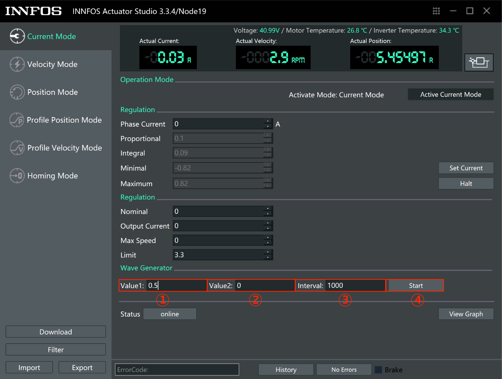

以太网通信
=====

## 硬件需求与连接

**硬件需求**

从前到后、从左到右依次为：ECB、HUB、终端电阻2个、回馈制动电容、ECB连接线、INNFOS执行器、执行器连接线，急停开关+电源。

**连接电源**

*   连接电源与`HUB`

Note: 必须先断电然后再插拔部件.  否则可能损坏部件.

**连接ECB**

*   连接`HUB`与`ECB`

 

*   HUB安插回馈制动电容与终端电阻

 

**连接执行器**

*   用执行器连接线连接`HUB`与执行器

*   末端执行器安插终端电阻

**连接电脑**

*   用网线连接`ECB`与电脑

**开启电源**

*   开启电源. 执行器的供电电压范围为直流24V-45V.

*   上电以后，执行器LED状态灯会变成黄色闪烁，启动执行器后，LED会变成绿色闪烁，这时就可以与执行器进行通信了。如果执行器内部出现错误，LED灯会变为红色闪烁，请检查执行器错误代码。

## EL20连接方式

**硬件需求**

从前到后、从左到右依次为：急停开关+电源、EL20综合线缆、梯形头连接线、插好终端电阻和回馈制动电容的ECB+HUB、EL20执行器、梯形头、电池、EL20终端电阻。

**连接电源**

*   连接电源与`ECB+HUB`

**连接执行器及其配件**

*   连接`EL20综合线缆`

*   连接`梯形头`

*   连接`电池`

*   连接`EL20终端电阻`

*   连接`EL20执行器`

*   单台`EL20执行器`连接

*   多台`EL20执行器`连接

 Note: EL20为非隔离CAN通信，暂时不推荐和其他系列SCA混连。即将推出CAN隔离转不隔离模组，届时即可混连。

## 软件安装与使用

**下载IAS**

*   如果电脑系统为Linux,访问[IAS(Linux)](https://github.com/innfos/INNFOS-Actuator-Studio-linux.git)获取最新版本的IAS(INNFOS Actuator Studio)(Linux),如果电脑系统是Windows请访问[IAS(Windows)](https://github.com/innfos/INNFOS-Actuator-Studio-windows.git).

**配置IP地址**

*   配置步骤请参考[以太网通信配置](Ethernet_Configuration.md)

**安装IAS**

*   安装IAS请参考[IAS安装](INNFOS_Actuator_Studio_IAS_instruction.md)

**使用** 

 

安装成功后，启动`IAS`,单击“确认”按钮启用“下一步”按钮，然后单击“下一步”直到出现如下界面: 

 

单击“1”或“2”按钮启动执行器，按钮“1”变为绿色表示您已成功启动执行器。单击消息框或单击“详细信息”按钮（位于按钮“1”下方） 进入执行器调试界面。 

 

 **位置控制**

*   单击左侧栏上的`Profile Position Mode`按钮，然后单击右侧的`Activate Profile Position Mode`。之后，您可以在“设置”中输入位置值，单位是R(范围是-127R~127R)。

 

 

### 其他

想了解更多关于`IAS`的信息 , 请访问[INNFOS Actuator Studio(IAS)说明](#!pages/INNFOS_Actuator_Studio_IAS_instruction.md).

## 版本变更记录

<table style="width:400px"><thead><tr style="background:PaleTurquoise"><th style="width:100px">版本号</th><th style="width:150px">更新时间</th><th style="width:150px">更新内容</th></tr></thead><tbody><tr><td>V1.0.1</td><td>2019.04</td><td>增加EL20连接方式</td></tr><tr><td>V1.0.0</td><td>2019.04</td><td>第一个版本</th></tr></thead><tbody><tr><td>

