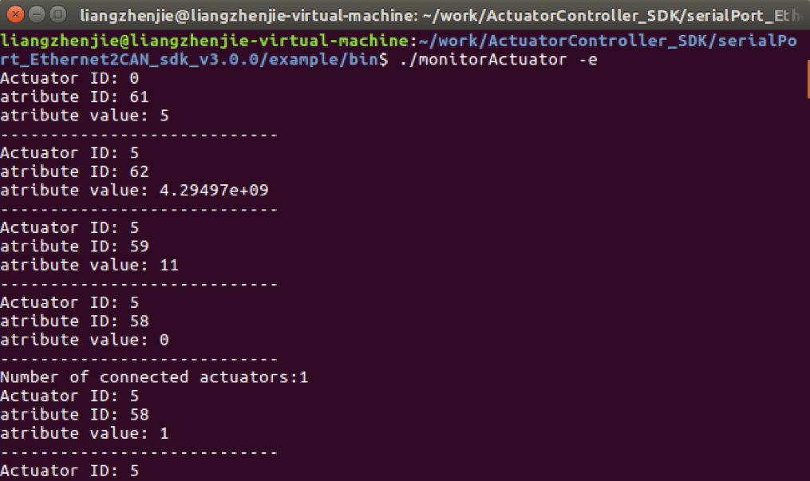
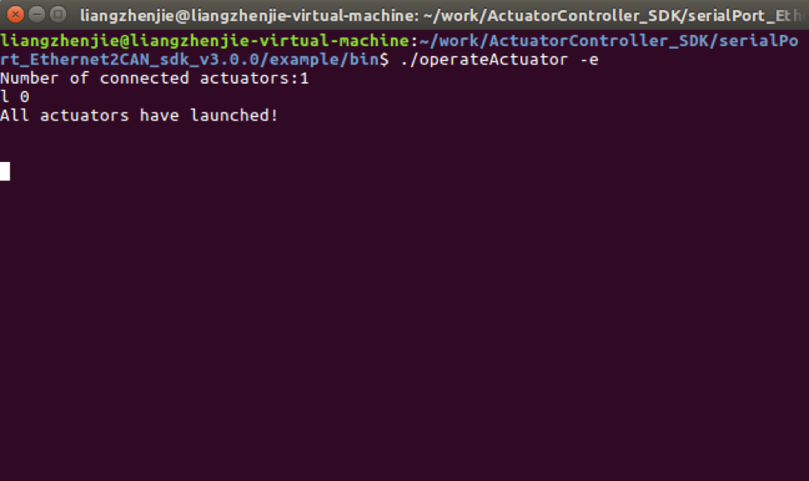
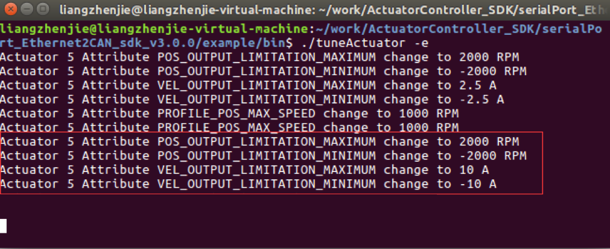
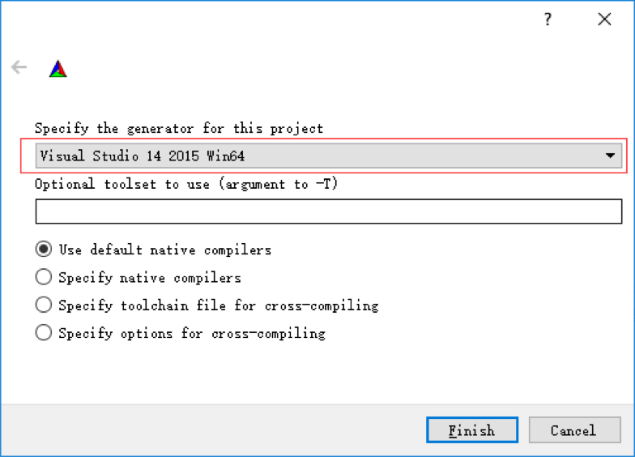
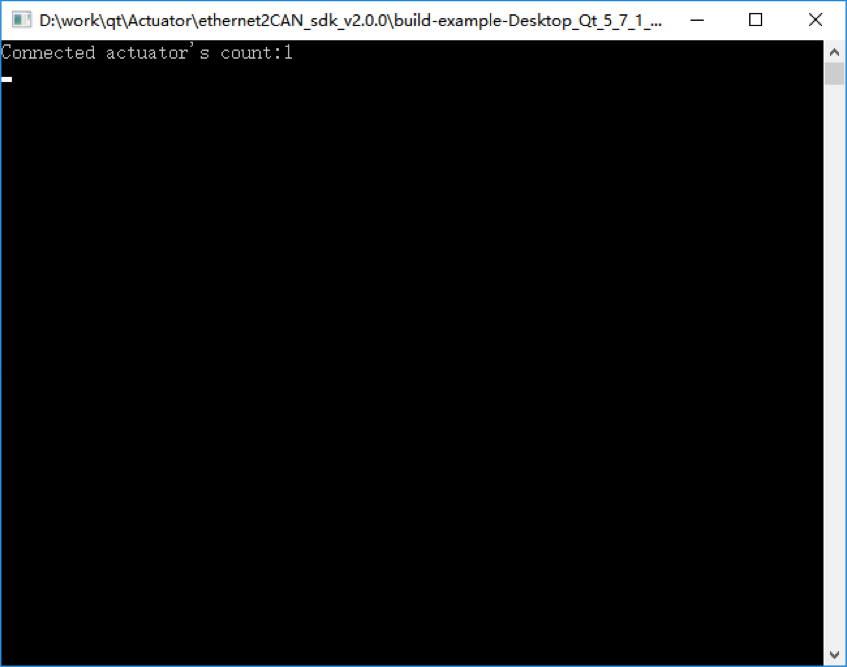
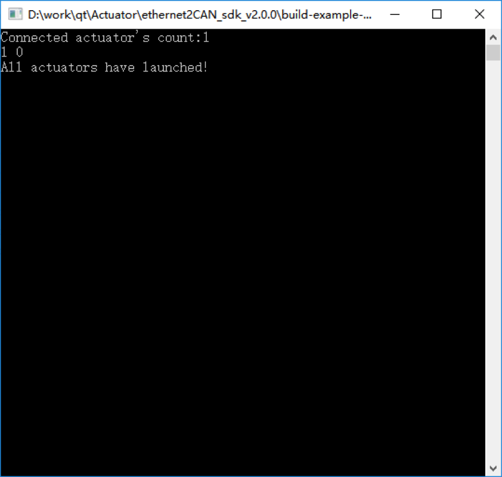
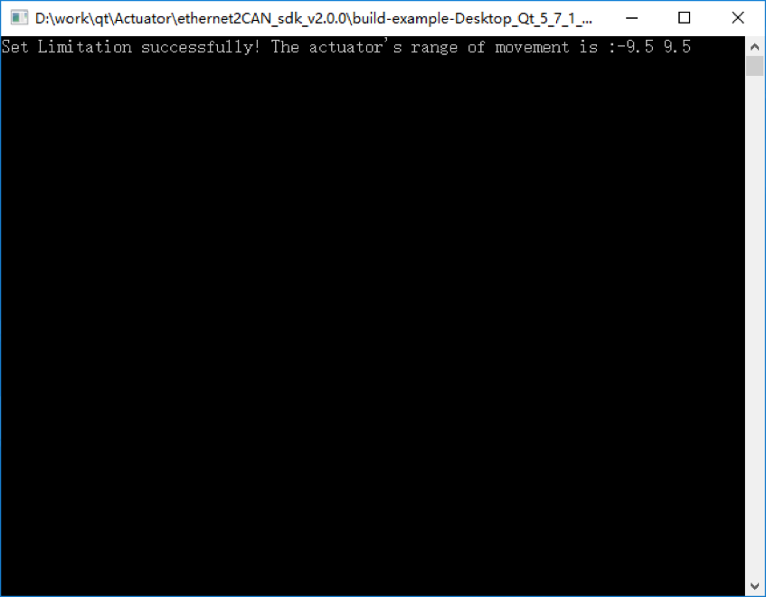

以太网通信SDK
=========

 [English](以太网通信协议SDK "wikilink")

## 介绍

*   API提供了友好的用户接口，包括了与多个INNFOS执行器进行串口或者以太网通信（推荐）功能，可同时对多个执行器发送指令或者获取执行器状态和参数信息
*   建议初次接触API的用户优先阅读SDK中的examples。

## SDK下载及目录说明

#### 下载

*   访问该链接[download link](https://github.com/innfos/ActuatorController_SDK.git)下载SDK相关文件或者直接执行以下命令

```sh
    $ git clone https://github.com/innfos/ActuatorController_SDK.git
```
    
## API相关文档

*   注意事项以及相关说明文档请访问[document link](http://innfos.com/doc/index.html)

## 执行器连接


如上动图为INNFOS执行器以太网通信的连接方式。

警告：所有线缆拔插严禁带电操作，否则容易损坏设备。

## 环境配置和示例代码编译运行

### linux平台

#### 环境配置

请参考<a href="#!pages/Ethernet_Configuration.md#linux平台环境配置">linux平台环境配置</a>


#### 示例代码编译

* 打开终端进入…\example目录，该目录下有CMakeLists.txt，

		$ cmake CMakeLists.txt
		$ make

*   输入命令执行完成后，在该目录下会生成一个bin文件夹，该目录存放了生成的示例程序。
*   确认执行器正确连接并供电以后，执行器会有黄色指示灯闪烁，此时可以测试示例代码。

#### 示例程序测试

*   确认执行器正确连接并供电以后，执行器会有黄色指示灯闪烁，此时可以测试示例代码

##### 查找已连接的执行器

*   打开终端并进入bin目录，输入命令

```sh
	$./lookupActuators -e
```
*   此窗口会显示当前已连接的执行器数量，可以ctrl+c结束程序

    * * *

    

**代码说明**

*   根据不同的参数选择不同的通信方式，默认为以太网通信。注意：必须先初始化控制器，才能进行其他操作

```cpp
    //初始化控制器
   if(strcmp(argv[1],"-s")==0)
        ActuatorController::initController(Actuator::Via_Serialport);
   elseif(strcmp(argv[1],"-e")==0)
        ActuatorController::initController();
```
*   关联操作完成信号，如此用户操作成功以后，会触发该信号，根据不同的operationType，进行相应操作，本例中会在自动识别完成后，打印出识别到的执行器数量。

```cpp
    //关联控制器的操作信号
   int nOperationConnection = pController->m_sOperationFinished->s_Connect([=](uint8_t nDeviceId,uint8_t operationType){
       switch (operationType) {
       case Actuator::Recognize_Finished://自动识别完成
           if(pController->hasAvailableActuator())
            {
                vector<uint8_t> idArray = pController->getActuatorIdArray();
                cout <<"Number of connected actuators:" << idArray.size() << endl;
            }
           break;
       default:
           break;
        }
    });
```
*   完整的应用必须要关联错误信号，以便在执行器内部发生错误时及时收到反馈并作出相应处理，nDeviceId为0时，错误不针对特定的执行器（例如未连接的错误）

```cpp
    //关联错误信号
   int nErrorConnection = pController->m_sError->s_Connect([=](uint8_t nDeviceId,uint16_t nErrorType,string errorInfo){
       if(nDeviceId==0)
        {
            cout <<"Error: " << (int)nErrorType <<" " << errorInfo << endl;
        }
       else
        {
            cout <<"Actuator " << (int)nDeviceId <<" " <<"error " << (int)nErrorType <<" " << errorInfo << endl;
        }
    });
```

*   关联好必要的信号以后，可以进行相应操作，第一步的操作就是识别已连接的执行器。

```cpp
    //自动识别已连接执行器
    pController->autoRecoginze();
```

*   事件循环是保证sdk内部通讯进行的必要步骤，务必要保证事件循环不被阻塞，sdk才能触发各种信号。

```cpp
    //执行控制器事件循环
   while (!bExit)
    {
        ActuatorController::processEvents();
    }
```

*   最后在程序结束前，断开和所有信号的关联

```cpp
    //断开信号连接
    pController->m_sOperationFinished->s_Disconnect(nOperationConnection);
    pController->m_sError->s_Disconnect(nErrorConnection);

```

##### 监测执行器状态

*   打开终端，进入example/bin目录，输入命令

```sh
    $./monitorActuator -e
```

*   其中Actuator ID为执行器id,attribute ID为监测的执行器属性Id，attribute value为对
    应的属性值，可以ctrl+c结束程序

    

**代码说明**

*   自动识别成功后自动开启所有执行器，每个执行器开启成功后都会触发Actuator::Launch_Finished信号，当所有执行器都开启以后，开始自动刷新，读取执行器数据。

```cpp
   int nLaunchedActuatorCnt =0;
   //关联控制器的操作信号
   int nOperationConnection = pController->m_sOperationFinished->s_Connect([&amp;](uint8_t nDeviceId,uint8_t operationType){
       switch (operationType) {
       case Actuator::Recognize_Finished://自动识别完成
           if(pController->hasAvailableActuator())
            {
                vector<uint8_t> idArray = pController->getActuatorIdArray();
            cout <<"Number of connected actuators:" << idArray.size() << endl;
               for (uint8_t id: idArray) {
                   if(pController->getActuatorAttribute(id,Actuator::ACTUATOR_SWITCH)==Actuator::ACTUATOR_SWITCH_OFF)
                    {//如果执行器处于关机状态，启动执行器
                        pController->launchActuator(id);
                    }
                   else
                    {
                        ++ nLaunchedActuatorCnt;
                       if(nLaunchedActuatorCnt == pController->getActuatorIdArray().size())//所有执行器都已启动完成
                        {
                            autoRefresh();
                        }
                    }
                }
            }
           break;
       case Actuator::Launch_Finished:
           if(++nLaunchedActuatorCnt == pController->getActuatorIdArray().size())//所有执行器都已启动完成
            {
                autoRefresh();
            }
           break;
       default:
           break;
        }
    });
```

*   为了监测执行器的属性变化，需关联信号m_sActuatorAttrChanged，当用户请求读取执行器的属性后，成功返回会触发该信号
    //关联控制器控制的执行器属性变化信号
	
```cpp
   int nAttrConnection =pController->m_sActuatorAttrChanged->s_Connect([=](uint8_t nDeviceId,uint8_t nAttrId,double value){
        cout <<"Actuator ID: " << (int)nDeviceId << endl;
        cout <<"atribute ID: " << (int)nAttrId << endl;
        cout <<"atribute value: " << value << endl;
        cout <<"----------------------------"<<endl;
    });
```

#### 控制执行器

*   打开终端，进入example/bin目录，输入命令

```sh
   	 $./operateActuator -e
```

    
	


*   表示执行器已经找到，输入命令l 0，该命令会启动所有已连接的执行器，如果启动成功，执行器会有绿色指示灯闪烁，表示已经启动成功，终端窗如下显示



*   此时可激活执行器对应模式，比如输入 a 6可以激活profile position模式，再输入p 5，

    执行器会转动到5圈的位置；输入a 7可以激活profile velocity模式，再输入v 500， 执行器将以500RPM的速度转动，停止转动输入v 0,；输入a 1可以激活电流模式，再输入 c 0.6，执行器将以恒定0.6A的电流转动（如果执行器不动，可用手轻轻转动一下执行器）， 可以ctrl+c以后再ctrl+d结束程序（因为有多线程等待键盘输入）
    
     
     

**代码说明**

*   成功启动执行器后，可对执行器进行操作。getActuatorIdArray可获取所有执行器的短id，用户可以指定其中任意id并进行操作，执行器有速度、电流、位置等多种模式（Actuator::ActuatorMode），必须先激活对应的模式才能进行相应操作。

```cpp
   vector<uint8_t> idArray = controllerInst->getActuatorIdArray();
   switch (directive)
    {
   case'a'://激活执行器指定模式，指令格式：a 模式id（Actuator::ActuatorMode）
        controllerInst->activeActuatorMode(idArray, Actuator::ActuatorMode((int)value));
       break;
   case'p'://指定执行器位置，指令格式：p 圈数（-127到127）
       for (int i =0; i < idArray.size(); ++i)
        {
            controllerInst->setPosition(idArray.at(i), value);
        }
       break;
   case'c'://指定执行器电流，指令格式：c 电流值（A）
       for (int i =0; i < idArray.size(); ++i)
        {
            controllerInst->setCurrent(idArray.at(i), value);
        }
       break;
   case'v'://指定执行器速度，指令格式：v 速度值（RPM）
       for (int i =0; i < idArray.size(); ++i)
        {
            controllerInst->setVelocity(idArray.at(i), value);
        }
       break;
   case'l'://启动指定执行器，指令格式：l 执行器id（id为0启动所有执行器）
       if(uint8_t(value)==0)
        {
            controllerInst->launchAllActuators();
        }
       else
        {
            controllerInst->launchActuator(uint8_t(value));
        }
       //cout << "launch"<<endl;
       break;
   case's'://关闭指定执行器，指令格式：l 执行器id（id为0启动所有执行器）
       if(uint8_t(value)==0)
        {
            controllerInst->closeAllActuators();
        }
       else
        {
            controllerInst->closeActuator(uint8_t(value));
        }
       //cout << "close"<<endl;
       break;
   default:
       break;
    }
```

#### 控制器参数调整

*   打开终端，进入example/bin目录，输入命令

```sh
    $./tuneActuator -e
```

*   此示例程序自动启动执行器并将位置环输出设置为3000RPM,速度环的电流最大输出为16.5A,

    如果使用profile position模式转动执行器，执行器的最大速度不会超过3000RPM;如果 使用profile velocity模式转动执行器，执行器最大电流不会超过16.5A，可以ctrl+c结束程序 
    
     
    
    **代码说明**
    

*   此示例程序自动启动执行器，启动成功后可调整执行器属性，速度环电流输出可调整速度环下的执行器扭矩，位置环速度输出可调整位置环下速度的大小。详见SCA快速使用说明。
    //执行器属性调整,调整成功，会触发执行器属性变化信号
	
```cpp
   void tuneActuator()
    {
        ActuatorController * pController = ActuatorController::getInstance();
        vector<uint8_t> idArray = pController->getActuatorIdArray();
       for (uint8_t id: idArray) {
           //调整执行器速度环最小电流输出
            pController->setMinOutputCurrent(id,-10);
           //调整执行器速度环最大电流输出
            pController->setMaxOutputCurrent(id,10);
           //调整执行器位置环最小速度输出
            pController->setMinOutputVelocity(id,-2000);
           //调整执行器位置环最大速度输出，最大值要大于最小值
            pController->setMaxOutputVelocity(id,2000);
           //调整执行器Mode_Profile_Pos的最大速度（RPM）
            pController->setActuatorAttribute(id,Actuator::PROFILE_POS_MAX_SPEED,1000);
        }
    }
```

#### 执行器归零

*   打开终端，进入example/bin目录，输入命令

```sh
$./homingActuator -e
```


*   表示已经将执行器当前位置设置为零位，范围是-9.5R到9.5R，并且开启了位置限制，如果profile position模式下，输入此范围之外的位置，执行器不会转动，可以ctrl+c结束程序 


**代码说明**

*   执行器自动启动完成后，setHomingPosition会将当前位置getActuatorAttribute(id,Actuator::ACTUAL_POSITION)设置成0位，</br>setMaxPosLimit和setMinPosLimit会设置最大和最小的位置限制，setActuatorAttribute(id,Actuator::POS_OFFSET,0.5)设置极限偏移。
    //执行器0位和限位调整
	
```cpp
   void setActuatorLimitation()
    {
        ActuatorController * pController = ActuatorController::getInstance();
        vector<uint8_t> idArray = pController->getActuatorIdArray();
       for (uint8_t id : idArray) {
           //将执行器当前位置变成0位，并且最小和最大位置分别设置为-10,10,偏移设置为0.5，执行器的运动范围变成（-9.5,9.5）
            pController->setHomingPosition(id,pController->getActuatorAttribute(id,Actuator::ACTUAL_POSITION));
            pController->setMinPosLimit(id,-10);
            pController->setMaxPosLimit(id,10);
            pController->setActuatorAttribute(id,Actuator::POS_OFFSET,0.5);
        }
        bSetLimitation =true;
    }
```

*   参数设置完成，保存参数，否则，关机以后参数设置将全部丢弃

```cpp
pController->saveAllParams(nDeviceId);
```

#### 执行器长短id

*   打开终端并进入bin目录，输入命令

```sh
$./longIdAndByteId -e
```

*   可以进行长短id的获取以及相互转换，并且可以通过长id获取通信ip地址。

**代码说明**

*   信号变量以L结尾的标识该信号关联的是执行器长id，可以通过长id进行通信。长短id的区别在于长id包含了通信地址和短id，并且可以相互转换（如果不同的ip地址下有相同短id的执行器，短id转换长id会随机转换其中一个ip地址下的一个长id）。
    //关联控制器的longId操作信号

```cpp
   int nOperationConnection = pController->m_sOperationFinishedL->s_Connect([&amp;](uint64_t nDeviceId,uint8_t operationType){
       switch (operationType) {
       case Actuator::Recognize_Finished://自动识别完成
           if(pController->hasAvailableActuator())
            {
               //获取longId数组
                vector<uint64_t> longIdArray = pController->getActuatorLongIdArray();
               //获取byteid数组
                vector<uint8_t> idArray = pController->getActuatorIdArray();
               for (uint64_t id: longIdArray) {
               //获取长id中的通信ip地址
                    cout <<"Communication IP is " << pController->toString(id) << endl;
                   //longId转换成byteId
                    cout <<"Long id " << id <<" convert to byte id " << (int)pController->toByteId(id) << endl;
                }
               for(uint8_t id : idArray)
                {
                   //byteId转换成longId
                    cout <<"Byte id " << (int)id <<" convert to long id " << pController->toLongId(id) << endl;
                }
            }
           break;
       default:
           break;
        }
    });
```

#### 同步响应

* 打开终端并进入bin目录，输入命令

```sh
$./feedback_sync -e
```

*   关联对应信号，在回调中进行操作属于异步响应，不会阻塞当前程序。同步响应，会阻塞当前程序，直到sdk返回结果，相比较而言，同步响应用法简单但是效率偏低，因为需要等待执行器响应（而且执行器部分操作没有同步响应，比如设置位置、速度、电流等）,如果对效率要求比较高，推荐使用异步响应。

**代码说明**

*   getActuatorAttributeWithACK和setActuatorAttributeWithACK是目前sdk提供的两个同步响应的接口，对应于getActuatorAttribute和setActuatorAttribute，可以同步获取或者设置执行器的属性，调用getActuatorAttributeWithACK和setActuatorAttributeWithACK会阻塞当前程序，直到有结果返回（不管成功或者失败）。

```cpp
ActuatorController * pController = ActuatorController::getInstance();
    vector<uint8_t> idArray = pController->getActuatorIdArray();
   for (uint8_t id: idArray) {
       bool bSuccess =false;
       //读取当前电流，并等待返回，如果读取失败 bSuccess的值为false
       double current = pController->getActuatorAttributeWithACK(id,Actuator::ACTUAL_CURRENT,&amp;bSuccess);
       if(bSuccess)
            cout <<"current is " << current << endl;
       //设置速度环最大电流输出，并等待返回，如果设置失败，bSuccess的值为false。（设置速度、位置、电流不能使用此接口）
        bSuccess = pController->setActuatorAttributeWithACK(id,Actuator::VEL_OUTPUT_LIMITATION_MAXIMUM,10);
       if(bSuccess)
            cout <<"Set VEL_OUTPUT_LIMITATION_MAXIMUM to 10A" << endl;
    }
```

### windows平台

#### 环境配置


请参考<a href="#!pages/Ethernet_Configuration.md#windows平台环境配置"> windows平台环境配置</a>


#### 示例代码编译

*   运行cmake-gui 出现如右界面：
*   其中源码路径就是目录结构中的…\example所在的路径，该目录下包含了CMakeLists.txt文件；构建路径可自行定义，用于生成工程文件两个路径配置完成后点击Generate按钮弹出如下界面


*   如果红色框内不是64位生成器，点击下拉三角，选择64位生成器，然后点击Finish按钮，生成成功后就生成了Visual Studio的工程文件，可用Visual Studio打开编译。编译完整个工程，在工程目录下会生成一个bin目录，里面有Debug或者Release文件夹（对应于编译的版本），将目录结构中的…\sdk\lib\windows_x64\debug或…\sdk\lib\windows_x64\release中的文件复制到对应版本的bin下面的Debug或者Release目录中，双击该目录中的exe就可正常运行示例程序了。




#### 示例程序测试

##### 查找已连接的执行器

*   确认执行器正确连接并供电以后，执行器会有黄色指示灯闪烁，此时可以测试示例代码。

打开命令行窗口并进入bin目录，输入命令

```sh
./lookupActuators.exe -e 
```


##### 监测执行器状态

*   打开命令行窗口并进入bin目录，输入命令

```sh
./monitorActuator.exe -e
```


##### 控制执行器

*   打开命令行窗口并进入bin目录，输入命令


```sh
./operateActuator.exe -e
```




表示执行器已经找到，输入命令l 0，该命令会启动所有已连接的执行器，如果启动成功，执行器会有绿色指示灯闪烁，表示已经启动成功，cmd窗口如下显示




*   此时可激活执行器对应模式，比如输入 a 6可以激活profile position模式，再输入p 10，执行器会转动到10圈的位置；输入a 7可以激活profile velocity模式，再输入v 500，执行器将以500RPM的速度转动，停止转动输入v 0,；输入a 1可以激活电流模式，再输入c 0.6，执行器将以恒定0.6A的电流转动（如果执行器不动，可用手轻轻转动一下执行器），可以ctrl+c结束程序


##### 执行器器参数调整

*   打开命令行窗口并进入bin目录，输入命令

```sh
./tuneActuator.exe -e
```

*   此示例程序自动启动执行器并将位置环输出设置为3000RPM,速度环的电流最大输出为16.5A,如果使用profile position模式转动执行器，执行器的最大速度不会超过3000RPM;如果使用profile velocity模式转动执行器，执行器最大电流不会超过16.5A，可以ctrl+c结束程序

[

##### 执行器归零

*   打开命令行窗口并进入bin目录，输入命令

```sh
./homingActuator.exe -e
```

*   如图结果表示已经将执行器当前位置设置为零位，范围是 -9.5R 到 9.5R，并且开启了位置限制，如果 profile

position 模式下，输入此范围之外的位置，执行器不会转动，可以 ctrl+c 结束程序


##### 执行器长短id

*   打开命令行窗口并进入bin目录，输入命令

```sh
./longIdAndByteId.exe -e
```

可以进行长短id的获取以及相互转换，并且可以通过长id获取通信ip地址。


##### 同步响应

*   打开命令行窗口并进入bin目录，输入命令

```sh
./feedback_sync.exe -e
```

*   运行feedback_sync.exe，关联对应信号，在回调中进行操作属于异步响应，不会阻塞当前程序。同步响应，会阻塞当前程序，直到sdk返回结果，相比较而言，同步响应用法简单但是效率偏低，因为需要等待执行器响应（而且执行器部分操作没有同步响应，比如设置位置、速度、电流等）,如果对效率要求比较高，推荐使用异步响应。

## SDK使用说明

### 概述

*   本SDK提供了与执行器通信的接口,可通过串口或者以太网对已经连接好的执行器进行查找、状态查询、属性调整和自定义控制。如果想快速了解sdk基本内容和使用方法,请查看example/src中的相关代码

### 项目中使用sdk

*   本 sdk 遵循 c++11 标准，所以在构建项目之前请确认编译选项支持 c++11（比如 gcc 中使用 -std=c++11） ;
*   将 sdk 集成到项目中的基本步骤（最好先参考 example 中的 CMakeLists.txt） :
*   将 sdk/include、 sdk/include/asio 加入到项目的包含目录，用于关联共享库中的方法 ;
*   将库文件目录 sdk/lib/linux_x86_64（windows 目录为 sdk/lib/debug 和 sdk/lib/release），以便可执行文件能链接到共享库，并保证运行时能够关联到共享库；
*   将必要的元素加入到构建过程中（比如 CMake 中的 target_link_libraries）

### 命名空间

* 在../sdk/include/actuatordefine.h定义了命名空间Actuator,并且枚举了sdk中所有用到的类型和类型值：

<table >
<thead><tr><th colspan="2" style=background:PaleTurquoise>连接状态，用于执行器和CAN的连接状态判断[ConnectStatus]</th></tr></thead><tbody>
 <tr><td>指令符</td><td>说明</td></tr>
 <tr><td>NO_CONNECT,</td><td>无连接</td></tr>
 <tr><td>CAN_CONNECTED=0x02,</td><td>CAN通信连接成功</td></tr>
 <tr><td>ACTUATOR_CONNECTED=0x04,</td><td>执行器连接成功</td></tr>
</tbody></table>

<table class="tableizer-table">
<thead><tr class="tableizer-firstrow"><th  colspan="2" style=background:PaleTurquoise>通道ID,用于标识执行器图表数据的通道索引[Channel_ID]</th></tr></thead><tbody>
 <tr><td>指令符</td><td>说明</td></tr>
 <tr><td>channel_1=0,</td><td>图表数据1通道,给定理想曲线</td></tr>
 <tr><td>channel_2,</td><td>图表数据2通道，实际电流曲线</td></tr>
 <tr><td>channel_3,</td><td>图表数据3通道，实际速度曲线</td></tr>
 <tr><td>channel_4,</td><td>图表数据4通道，实际位置</td></tr>
 <tr><td>channel_cnt</td><td></td></tr>
</tbody></table>

<table class="tableizer-table">
<thead><tr class="tableizer-firstrow"><th  colspan="2" style=background:PaleTurquoise>错误类型定义，定义了执行器内部和连接等错误代码[ErrorsDefine] </th></tr></thead><tbody>
 <tr><td>指令符</td><td>说明</td></tr>
 <tr><td>ERR_NONE = 0,</td><td>无错误</td></tr>
 <tr><td>ERR_ACTUATOR_OVERVOLTAGE=0x01,</td><td>执行器过压错误</td></tr>
 <tr><td>ERR_ACTUATOR_UNDERVOLTAGE=0x02,</td><td>执行器欠压错误</td></tr>
 <tr><td>RR_ACTUATOR_LOCKED_ROTOR=0x04,</td><td>执行器堵转错误</td></tr>
 <tr><td>ERR_ACTUATOR_OVERHEATING=0x08</td><td>执行器过温错误</td></tr>
 <tr><td>enum OnlineStatus{</td><td>执行器读写错误</td></tr>
 <tr><td>ERR_ACTUATOR_MULTI_TURN=0x20,</td><td>执行器多圈计数错误</td></tr>
 <tr><td>ERR_INVERTOR_TEMPERATURE_SENSOR=0x40,</td><td>执行器逆变器温度器错误</td></tr>
 <tr><td>ERR_CAN_COMMUNICATION=0x80,</td><td>执行器温度传感器错误</td></tr>
 <tr><td>ERR_ACTUATOR_TEMPERATURE_SENSOR=0x100,</td><td>执行器 CAN 通信错误</td></tr>
 <tr><td>ERR_DRV_PROTECTION=0x400,</td><td>执行器 DRV 保护</td></tr>
 <tr><td>ERR_ID_UNUNIQUE=0x800</td><td>执行器 ID 不唯一错误</td></tr>
 <tr><td>ERR_ACTUATOR_DISCONNECTION=0x801,</td><td>执行器未连接错误</td></tr>
 <tr><td>ERR_CAN_DISCONNECTION=0x802,</td><td>CAN 通信转换板未连接错误</td></tr>
 <tr><td>ERR_IP_ADDRESS_NOT_FOUND=0x803,</td><td>无可用 ip 地址错误</td></tr>
 <tr><td>ERR_ABNORMAL_SHUTDOWN=0x804,</td><td>执行器非正常关机错误</td></tr>
 <tr><td>ERR_SHUTDOWN_SAVING=0x805,</td><td>执行器关机时参数保存错误</td></tr>
 <tr><td>ERR_UNKOWN=0xffff</td><td>未知错误</td></tr>
</tbody></table>

<table class="tableizer-table">
<thead><tr class="tableizer-firstrow"><th colspan="2"style=background:PaleTurquoise>在线状态，用于标识执行器是否处于连接状态[OnlineStatus]</th></tr></thead><tbody>
 <tr><td>指令符</td><td>说明</td></tr>
 <tr><td>Status_Online=0x00,</td><td>执行器在线</td></tr>
 <tr><td>Status_Offline=0x01,</td><td>执行器离线</td></tr>
</tbody></table>

<table class="tableizer-table">
<thead><tr class="tableizer-firstrow"><th colspan="2"style=background:PaleTurquoise>开关状态，标识执行器的开关机状态[SwitchStatus]</th></tr></thead><tbody>
 <tr><td>指令符</td><td>说明</td></tr>
 <tr><td>ACTUATOR_SWITCH_OFF=0,</td><td>执行器已关机</td></tr>
 <tr><td>ACTUATOR_SWITCH_ON=1,</td><td>执行器已开机</td></tr>
</tbody></table>

<table class="tableizer-table">
<thead><tr class="tableizer-firstrow"><th colspan="2"style=background:PaleTurquoise>图表开关，用于标识执行器图表功能的开启或关闭[ChartSwitchStatus]</th></tr></thead><tbody>
 <tr><td>指令符</td><td>说明</td></tr>
 <tr><td>CHART_SWITCH_OFF=0,</td><td>图表功能关闭，不会产生图表数据</td></tr>
 <tr><td>CHART_SWITCH_ON=1,</td><td>图表功能开启，触发图表阈值会产生图表数据</td></tr>
</tbody></table>

<table class="tableizer-table">
<thead><tr class="tableizer-firstrow"><th colspan="2"style=background:PaleTurquoise>电流环图表索引，用于标识电流图表是IQ值还是ID值[CurrnetChart]</th></tr></thead><tbody>
 <tr><td>指令符</td><td>说明</td></tr>
 <tr><td>IQ_CHART=0,</td><td>图表数据2通道，实际电流IQ曲线</td></tr>
 <tr><td>ID_CHART=1,</td><td>图表数据2通道，实际电流ID曲线</td></tr>
</tbody></table>

<table class="tableizer-table">
<thead><tr class="tableizer-firstrow"><th colspan="2"style=background:PaleTurquoise>通信方式，可通过以太网或者串口两种方式与执行器通信，初始化执行器控制器时候要指定方式，默认为以太网通信[CommunicationType]</th></tr></thead><tbody>
 <tr><td>指令符</td><td>说明</td></tr>
 <tr><td>Via_Ethernet,</td><td>以太网通信</td></tr>
 <tr><td>Via_Serialport,</td><td>串口通信</td></tr>
</tbody></table>

<table class="tableizer-table">
<thead><tr class="tableizer-firstrow"><th colspan="2"style=background:PaleTurquoise>操作标识，标识操作完成，可用于判断执行器控制器的指令执行状态[OperationFlags]</th></tr></thead><tbody>
 <tr><td>指令符</td><td>说明</td></tr>
 <tr><td>Recognize_Finished</td><td>执行器启动完成（如果连接的是多个执行器，会触发多次启动完成信号）</td></tr>
 <tr><td>Launch_Finished</td><td>执行器关闭完成（如果连接的是多个执行器，会触发多次关闭完成信号）</td></tr>
 <tr><td>Close_Finished</td><td>执行器参数保存完成（如果连接的是多个执行器，会触发多次参数保存完成信号）</td></tr>
 <tr><td>Save_Params_Finished</td><td>执行器参数保存成功</td></tr>
 <tr><td>Save_Params_Failed</td><td>执行器参数保存失败</td></tr>
 <tr><td>Attribute_Change_Finished</td><td>暂未实现</td></tr>
</tbody></table>

<table class="tableizer-table">
<thead><tr class="tableizer-firstrow"><th colspan="2"style=background:PaleTurquoise>执行器模式，标识当前执行器的模式[ActuatorMode]</th></tr></thead><tbody>
 <tr><td>指令符</td><td>说明</td></tr>
 <tr><td>Mode_None</td><td>&nbsp;</td></tr>
 <tr><td>Mode_Cur</td><td>电流模式</td></tr>
 <tr><td>Mode_Vel</td><td>速度模式</td></tr>
 <tr><td>Mode_Pos</td><td>位置模式</td></tr>
 <tr><td>Mode_Teaching</td><td>暂未实现</td></tr>
 <tr><td>Mode_Profile_Pos=6</td><td>profile位置模式，比较于位置模式，该模式有加速减速过程</td></tr>
 <tr><td>Mode_Profile_Vel</td><td>profile速度模式，比较于速度模式，该模式有加速减速过程</td></tr>
 <tr><td>Mode_Homing</td><td>归零模式</td></tr>
</tbody></table>

<table class="tableizer-table">
<thead><tr class="tableizer-firstrow"><th colspan="2"style=background:PaleTurquoise>执行器属性，标识了执行器所有相关属性[ActuatorAttribute]</th></tr></thead><tbody>
 <tr><td>指令符</td><td>说明</td></tr>
 <tr><td>Cur_iq_setting</td><td>电流IQ值</td></tr>
 <tr><td>Cur_proportional</td><td>电流比例</td></tr>
 <tr><td>Cur_integral</td><td>电流积分</td></tr>
 <tr><td>Cur_id_setting</td><td>电流ID值</td></tr>
 <tr><td>Cur_minimum</td><td>预留</td></tr>
 <tr><td>Cur_maximum</td><td>预留</td></tr>
 <tr><td>Cur_nominal</td><td>预留</td></tr>
 <tr><td>Cur_output</td><td>预留</td></tr>
 <tr><td>Cur_maxspeed</td><td>电流环最大速度</td></tr>
 <tr><td>Actual_current</td><td>当前电流值</td></tr>
 <tr><td>Vel_setting</td><td>速度设置</td></tr>
 <tr><td>Vel_proportional</td><td>速度比例</td></tr>
 <tr><td>Vel_integral</td><td>速度积分</td></tr>
 <tr><td>Vel_output_limitation_minimum</td><td>速度环输出最小电流比例</td></tr>
 <tr><td>Vel_output_limitation_maximum</td><td>速度环输出最大电流比例</td></tr>
 <tr><td>Actual_velocity</td><td>速度值</td></tr>
 <tr><td>Pos_setting</td><td>位置设置</td></tr>
 <tr><td>Pos_proportional</td><td>位置比例</td></tr>
 <tr><td>Pos_integral</td><td>位置积分</td></tr>
 <tr><td>Pos_differential</td><td>位置微分</td></tr>
 <tr><td>Pos_output_limitation_minimum</td><td>位置环输出最小速度比例</td></tr>
 <tr><td>Pos_output_limitation_maximum</td><td>位置环输出最大速度比例</td></tr>
 <tr><td>Pos_limitation_minimum</td><td>最小位置限制</td></tr>
 <tr><td>Pos_limitation_maximum</td><td>最大位置限制</td></tr>
 <tr><td>Homing_position</td><td>归零位置</td></tr>
 <tr><td>Actual_position</td><td>当前位置</td></tr>
 <tr><td>Profile_pos_max_speed</td><td>profile position 模式最大速度</td></tr>
 <tr><td>Profile_pos_acc</td><td>profile position 模式加速度</td></tr>
 <tr><td>Profile_pos_dec</td><td>profile position 模式减速速度</td></tr>
 <tr><td>Profile_vel_max_speed</td><td>profile velocity 模式最大速度</td></tr>
 <tr><td>Profile_vel_acc</td><td>profile velocity 模式加速度</td></tr>
 <tr><td>Profile_vel_dec</td><td>profile velocity 模式减速速度</td></tr>
 <tr><td>Chart_frequency</td><td>图像频率</td></tr>
 <tr><td>Chart_threshold</td><td>图像阈值</td></tr>
 <tr><td>Chart_switch</td><td>图像开关</td></tr>
 <tr><td>Pos_offset</td><td>位置偏移</td></tr>
 <tr><td>Voltage</td><td>电压</td></tr>
 <tr><td>Pos_limitation_switch</td><td>开启或关闭位置限制</td></tr>
 <tr><td>Homing_cur_maximum</td><td>归零最大电流</td></tr>
 <tr><td>Homing_cur_minimum</td><td>归零最小小电流</td></tr>
 <tr><td>Current_scale</td><td>物理最大电流值</td></tr>
 <tr><td>Velocity_scale</td><td>速度最大电流值</td></tr>
 <tr><td>Filter_c_status</td><td>电流环滤波是否开启</td></tr>
 <tr><td>Filter_c_value</td><td>电流环滤波值</td></tr>
 <tr><td>Filter_v_status</td><td>速度环滤波是否开启</td></tr>
 <tr><td>Filter_v_value</td><td>速度环滤波值</td></tr>
 <tr><td>Filter_p_status</td><td>位置环滤波是否开启</td></tr>
 <tr><td>Filter_p_value</td><td>位置环滤波值</td></tr>
 <tr><td>Inertia</td><td>惯量</td></tr>
 <tr><td>Lock_energy</td><td>堵转保护能量</td></tr>
 <tr><td>Actuator_temperature</td><td>执行器温度</td></tr>
 <tr><td>Inverter_temperature</td><td>逆变器温度</td></tr>
 <tr><td>Actuator_protect_temperature</td><td>执行器保护温度</td></tr>
 <tr><td>Actuator_recovery_temperature</td><td>执行器恢复温度</td></tr>
 <tr><td>Inverter_protect_temperature</td><td>逆变器保护温度</td></tr>
 <tr><td>Inverter_recovery_temperature</td><td>逆变器恢复温度</td></tr>
 <tr><td>Calibration_switch</td><td>预留</td></tr>
 <tr><td>Calibration_angle</td><td>预留</td></tr>
 <tr><td>Actuator_switch</td><td>执行器开关机</td></tr>
 <tr><td>Firmware_version</td><td>执行器固件版本</td></tr>
 <tr><td>Online_status</td><td>执行器是否在线</td></tr>
 <tr><td>Device_id</td><td>执行器 Id</td></tr>
 <tr><td>Sn_id</td><td>执行器 SN 号</td></tr>
 <tr><td>Mode_id</td><td>执行器当前模式</td></tr>
 <tr><td>Error_id</td><td>错误代码</td></tr>
 <tr><td>Reserve_0</td><td>预留</td></tr>
 <tr><td>Reserve_1</td><td>预留</td></tr>
 <tr><td>Reserve_2</td><td>预留</td></tr>
 <tr><td>Reserve_3</td><td>预留</td></tr>
 <tr><td>Data_cnt</td><td>属性数量</td></tr>
 <tr><td>Data_chart</td><td>预留</td></tr>
 <tr><td>Data_invalid</td><td>非法属性值</td></tr>
</tbody></table>

## 版本信息

<table class="tableizer-table">
<thead><tr class="tableizer-firstrow"><th>版本</th><th>日期</th><th>修改内容</th></tr></thead><tbody>
 <tr><td>V2.0.0</td><td>2019-03-09</td><td>第二版本</td></tr>
 <tr><td>V1.0.0</td><td>2018-04-17</td><td>第一版本</td></tr>
</tbody></table>

