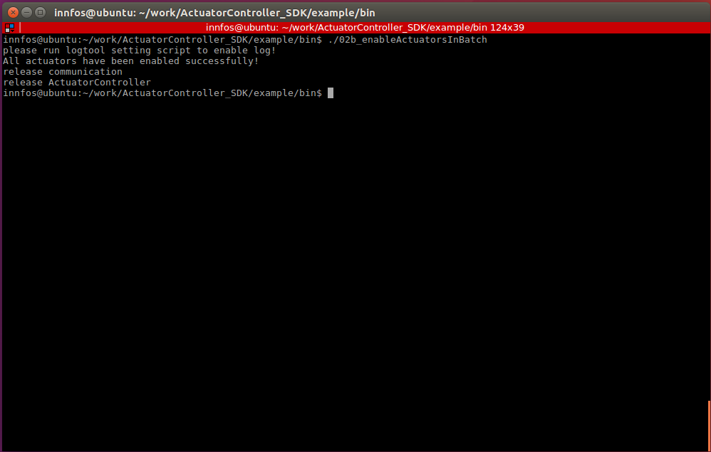
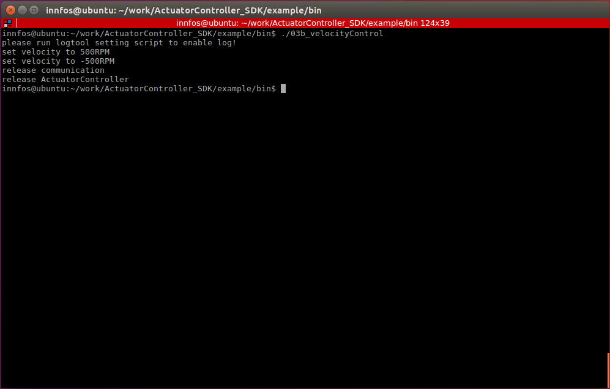
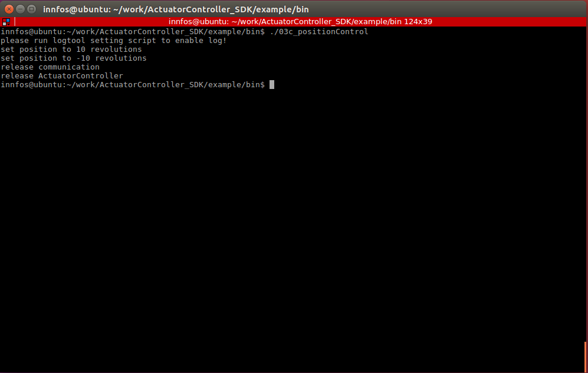
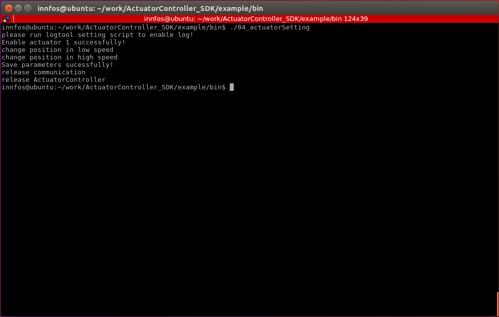

以太网通信SDK
=========

## 介绍

*   API提供了友好的用户接口，包括了与多个INNFOS执行器进行以太网通信功能，可同时对多个执行器发送指令或者获取执行器状态和参数信息
*   建议初次接触API的用户优先阅读SDK中的examples。

## SDK下载及目录说明

#### 下载

*   访问该链接[download link](https://github.com/innfos/ActuatorController_SDK.git)下载SDK相关文件或者直接执行以下命令

```sh
$ git clone https://github.com/innfos/ActuatorController_SDK.git
```
    
## API相关文档

*   注意事项以及相关说明文档请访问[document link](http://innfos.com/doc/index.html)

## 执行器连接


如上动图为INNFOS执行器以太网通信的连接方式。

警告：所有线缆拔插严禁带电操作，否则容易损坏设备。

## 环境配置和示例代码编译运行

### linux平台

#### 环境配置

请参考<a href="#!pages/Ethernet_Configuration.md#linux平台环境配置">linux平台环境配置</a>


#### 示例代码编译

* 打开终端进入`…\example`目录，该目录下有`CMakeLists.txt`

```bash
$ cmake CMakeLists.txt
$ make
```

*   输入命令执行完成后，在该目录下会生成一个bin文件夹，该目录存放了生成的示例程序。
*   确认执行器正确连接并供电以后，执行器会有黄色指示灯闪烁，此时可以测试示例代码。

#### 示例程序测试

*   确认执行器正确连接并供电以后，执行器会有黄色指示灯闪烁，此时可以测试示例代码

##### 查找已连接的执行器

*   打开终端并进入bin目录，输入命令

```bash
$./01_lookupActuators
```
*   此窗口会显示当前已连接的执行器数量，示例中连接了一个ID为1的执行器，其通信IP地址为192.168.1.30


**代码说明**

*   初始化执行器控制器。

Note:必须先初始化控制器，才能进行其他操作

``` cpp
ActuatorController * pController = ActuatorController::initController();
```
*   查找已连接执行器，需要先定义一个错误变量，用于查找不到执行器时返回相应错误代码。`lookupActuators`函数会返回所有已连接执行器的`UnifiedID`数组。

``` cpp
//ec Define an error type, ec==0x00 means no error, ec will be passed to pcontroller-> lookupActuators(ec) by reference,
//when the error occurs, ec value will be modified by SDK to the corresponding error code
Actuator::ErrorsDefine ec;
//Find the connected actuators and return the UnifiedID of all actuators found.
//UnifiedID is a structure composed of the actuator ID (actuatorID) and IP(ipAddress) of ECB(ECU)
std::vector<ActuatorController::UnifiedID> uIDArray = pController->lookupActuators(ec);
```

*   输出所有已连接的执行器的`UnifiedID`信息,如果没有找到执行器，输出错误代码

``` cpp
//If the size of the uIDArray is greater than zero, the connected actuators have been found
if(uIDArray.size() > 0)
{
    for(auto uID : uIDArray)
    {
        cout << "Actuator ID: "<<(int)uID.actuatorID << " IP address: " << uID.ipAddress.c_str() << endl;
    }
}
else
{
    //ec=0x803 Communication with ECB(ECU) failed
    //ec=0x802 Communication with actuator failed
    cout << "Connected error code:" << hex << ec << endl;
}

```


##### 使能单个执行器

*   打开终端，进入`example/bin`目录，输入命令

```bash
$./02a_enableSingleActuator
```

*   使能单个执行器，使能后执行器指示灯会变成绿色


**代码说明**

*   查找完已连接的所有执行器后,可使用`getActuatorIdArray`获取执行器ID数组,不同于`UnifiedID`,执行器ID不包含执行器通信IP地址信息，如果不存在不同IP地址下有相同ID的执行器，推荐直接使用执行器ID进行操作

```cpp
//Gets an array of all actuator IDs
vector<uint8_t> idArray = pController->getActuatorIdArray();
```

*   使能一个执行器，成功返回true，否则返回false
    
	
```cpp
//Enable an actuator
if(pController->enableActuator(idArray.at(0)))
{
    cout << "Enable actuator " << (int)idArray.at(0) << " successfully!" << endl;
}
```

#### 使能多个执行器

*   打开终端，进入`example/bin`目录，输入命令

```bash
$./02b_enableActuatorsInBatch 
```



     

**代码说明**

*   使能已连接的所有执行器，所有执行器使能后返回true，否则返回false

```cpp
//Enable all connected actuators
if(pController->enableActuatorInBatch(uIDArray))
{
    cout << "All actuators have been enabled successfully! " << endl;
}

```

#### 执行器电流控制

*   打开终端，进入`example/bin`目录，输入命令

```bash
$./03a_currentControl
```

*   此示例程序将在电流模式下控制执行器
    
 
    
**代码说明**
    

*   此示例程序自动使能执行器，使能执行器后，激活执行器电流模式，将给执行器指定0.6A的电流，1s后指定-0.6A的电流，最后失能执行器。`Actuator::Mode_Cur`请参考`actuatorDefine.h`中的`ActuatorMode`。
    
       
```cpp
//Enable an actuator,If there are no actuators with the same ID under multiple IP addresses, you can omit the ipAddress parameter
pController->enableActuator(actuator.actuatorID,actuator.ipAddress);
//Activate current mode
pController->activateActuatorMode(actuator.actuatorID,Actuator::Mode_Cur);
cout << "set current to 0.6A" << endl;
pController->setCurrent(actuator.actuatorID,0.6);
std::this_thread::sleep_for(std::chrono::seconds(1));
cout << "set current to -0.6A" << endl;
pController->setCurrent(actuator.actuatorID,-0.6);
std::this_thread::sleep_for(std::chrono::seconds(1));
```

#### 执行器速度控制

*   打开终端，进入`example/bin`目录，输入命令

```bash
$./03b_velocityControl 
```

*   此示例程序自动使能执行器，使能成功后激活执行器的profile velocity模式，然后发送速度指令，执行器将以500RPM的速度转动3s，再以-500RPM的速度转动3s，最后执行器失能



**代码说明**

*   关于`Actuator::Mode_Profile_Vel`请参考`actuatorDefine.h`中的`ActuatorMode`
	
```cpp
//Enable an actuator,If there are no actuators with the same ID under multiple IP addresses, you can omit the ipAddress parameter
pController->enableActuator(actuator.actuatorID,actuator.ipAddress);
//activate profile velocity mode
pController->activateActuatorMode(actuator.actuatorID,Actuator::Mode_Profile_Vel);

cout << "set velocity to 500RPM" << endl;
pController->setVelocity(actuator.actuatorID,500);
std::this_thread::sleep_for(std::chrono::seconds(3));
cout << "set velocity to -500RPM" << endl;
pController->setVelocity(actuator.actuatorID,-500);
std::this_thread::sleep_for(std::chrono::seconds(3));
```


#### 执行器位置控制

*   打开终端并进入`example/bin`目录，输入命令

```bash
$./03c_positionControl
```

*   此示例程序自动使能执行器，使能成功后激活执行器的profile position模式，然后发送位置指令，执行器将先转动到10R的位置，4s后再转动到-10R的位置，3s后失能执行器。



**代码说明**

*   关于`Actuator::Mode_Profile_Pos`请参考`actuatorDefine.h`中的`ActuatorMode`
    

```cpp
//Enable actuator
pController->enableActuator(actuator.actuatorID,actuator.ipAddress);
//activate profile position mode
pController->activateActuatorMode(actuator.actuatorID,Actuator::Mode_Profile_Pos);

cout << "set position to 10 revolutions " << endl;
pController->setPosition(actuator.actuatorID,10);
std::this_thread::sleep_for(std::chrono::seconds(4));
cout << "set position to -10 revolutions " << endl;
pController->setPosition(actuator.actuatorID,-10);
std::this_thread::sleep_for(std::chrono::seconds(3));
```

#### 执行器参数设置

* 打开终端并进入`example/bin`目录，输入命令

```bash
$./04_actuatorSetting 
```

*   此示例程序自动使能执行器，使能成功后激活执行器的profile position模式，然后修改执行器参数，执行器将以不同的速度转动到指定位置。



**代码说明**

*   使能执行器，使能成功后激活执行器的profile position模式

```cpp
if(pController->enableActuator(actuatorID))
{
    cout << "Enable actuator " << (int)actuatorID << " successfully!" << endl;
}
//activate profile position mode
pController->activateActuatorMode(actuatorID,Actuator::Mode_Profile_Pos);
```

*   将执行器profile position模式下的加速度、减速度、最大速度分别设置300RPM/s,-300RPM/s,500RPM,然后执行器转动到-15R的位置，此时执行器转速较慢。

```cpp
//change acceleration to 300 RPM/s
pController->setProfilePosAcceleration(actuatorID,300);
//change deceleration to -300 RPM/s
pController->setProfilePosDeceleration(actuatorID,-300);
//change max velocity to 500 RPM
pController->setProfilePosMaxVelocity(actuatorID,500);
cout << "change position in low speed " << endl;
pController->setPosition(actuatorID,-15);
this_thread::sleep_for(std::chrono::seconds(5));
```

*   将执行器profile position模式下的加速度、减速度、最大速度分别设置1200RPM/s,-1200RPM/s,3000RPM,然后执行器转动到15R的位置，此时执行器转速较快。

```cpp
//change acceleration to 1200 RPM/s
pController->setProfilePosAcceleration(actuatorID,1200);
//change deceleration to -1200 RPM/s
pController->setProfilePosDeceleration(actuatorID,-1200);
//change max velocity to 3000 RPM/s
pController->setProfilePosMaxVelocity(actuatorID,3000);
cout << "change position in high speed " << endl;
pController->setPosition(actuatorID,15);
this_thread::sleep_for(std::chrono::seconds(4));

```

*   执行器参数修改后，需要保存参数，否则执行器失能后将丢弃所有参数修改

```cpp
//Save parameters,or you will lose all changes after disable the actuator
if(pController->saveAllParams(actuatorID))
{
    cout << "Save parameters sucessfully!" << endl;
}

```

#### 同步获取执行器参数

* 打开终端并进入`example/bin`目录，输入命令

```bash
$./05a_feedback_sync
```

*   此示例程序自动使能执行器，使能成功后同步获取执行器的电流和位置。


**代码说明**

*   同步读取执行器的位置和电流，getPosition、getCurrent、getVelocity的第二个参数为true，sdk将发送读取对应执行器参数指令并等待返回，该函数会阻塞1-2ms，如果该参数为false，将会返回最近一次请求返回的结果（该结果跟执行器的实际参数可能不符）。

```cpp
/**
 * Read the position of the actuator, if the second parameter is true, sdk will send the read position request to the actuator and wait for the return,
 * otherwise, the result of the last request is returned immediately
 **/
double pos = pController->getPosition(actuatorID,true);
/**
 * Read the current of the actuator, if the second parameter is true, sdk will send the read current request to the actuator and wait for the return,
 * otherwise, the result of the last request is returned immediately
 **/
double cur = pController->getCurrent(actuatorID,true);
cout << "Actuator postion:" << pos << "R,current:" << cur << "A" <<endl;

```

#### 异步获取执行器参数

* 打开终端并进入`example/bin`目录，输入命令

```bash
$./05a_feedback_sync
```

*   此示例程序自动使能执行器，使能成功后异步获取执行器的电流和位置，可以使用ctrl-c结束程序。


**代码说明**

*   异步获取执行器参数需要有三部分工作，第一部分注册回调函数，该回调函数再请求参数返回值会被调用，`addParaRequestCallback`支持函数指针和std::function两种方式传入回调函数。

```cpp
//Add an actuator request parameter callback which will be invoked when the parameter request returns
pController->addParaRequestCallback(paramFeedback);
```

*   异步获取执行器参数的回调函数有三个变量，第一个变量`ActuatorController::UnifiedID`是执行器uID,代表是该ID的执行器请求结果返回，第二个变量`paramType`是参数类型，代表返回的参数是哪种参数，关于参数种类请参考`actuatordefine.h`中的`ActuatorAttribute`，第三个变量就是该执行此类参数的参数值

```cpp
void paramFeedback(ActuatorController::UnifiedID uID,uint8_t paramType,double paramValue)
{
    switch (paramType) {
    case Actuator::ACTUAL_CURRENT:
        cout << "Actuator " << (int)uID.actuatorID << " current is " << paramValue << "A"<<endl;
        break;
    case Actuator::ACTUAL_POSITION:
        cout << "Actuator " << (int)uID.actuatorID << " position is " << paramValue << "R"<<endl;
        break;
    case Actuator::ACTUAL_VELOCITY:
        cout << "Actuator " << (int)uID.actuatorID << " velocity is " << paramValue << "RPM"<<endl;
        break;
    default:
        break;
    }
}

```


*  第二部分工作是请求执行器参数，`requestCVPValue`会请求执行器的电流、速度和位置，该函数只发送请求，不等待请求返回。

```cpp
//Asynchronous request executor current, velocity, poistion, and when the request returns,
//the callback function is triggered by a polling callback event. This function does not block.
pController->requestCVPValue(idArray.at(0));

```

*  第三部分工作是轮询请求返回结果，即调用`ActuatorController::processEvents()`，该函数会轮询请求返回结果，当请求返回后调用已经注册的回调函数。

```cpp
//Event polling, polling callback events, event triggering calls to the corresponding callback function
ActuatorController::processEvents();.
pController->requestCVPValue(idArray.at(0));
```


### windows平台

#### 环境配置


请参考<a href="#!pages/Ethernet_Configuration.md#windows平台环境配置"> windows平台环境配置</a>


#### 示例代码编译

*   运行`cmake-gui` 出现如右界面：
*   其中源码路径就是目录结构中的`…\example`所在的路径，该目录下包含了CMakeLists.txt文件；构建路径可自行定义，用于生成工程文件两个路径配置完成后点击Generate按钮弹出如下界面


*   如果红色框内不是64位生成器，点击下拉三角，选择64位生成器，然后点击Finish按钮，生成成功后就生成了Visual Studio的工程文件，可用Visual Studio打开编译。编译完整个工程，在工程目录下会生成一个bin目录，里面有Debug或者Release文件夹（对应于编译的版本），将目录结构中的`…\sdk\lib\windows_x64\debug`或`…\sdk\lib\windows_x64\release`中的文件复制到对应版本的bin下面的Debug或者Release目录中，双击该目录中的exe就可正常运行示例程序了。


#### 示例程序测试

##### 查找已连接的执行器

*   确认执行器正确连接并供电以后，执行器会有黄色指示灯闪烁，此时可以测试示例代码。

打开命令行窗口并进入bin目录，输入命令

```bash
./lookupActuators.exe -e 
```


##### 监测执行器状态

*   打开命令行窗口并进入bin目录，输入命令

```bash
./monitorActuator.exe -e
```


##### 控制执行器

*   打开命令行窗口并进入bin目录，输入命令


```bash
./operateActuator.exe -e
```


表示执行器已经找到，输入命令`l 0`，该命令会使能所有已连接的执行器，如果使能成功，执行器会有绿色指示灯闪烁，表示已经使能成功，cmd窗口如下显示


*   此时可激活执行器对应模式，比如输入 a 6可以激活profile position模式，再输入p 10，执行器会转动到10圈的位置；输入a 7可以激活profile velocity模式，再输入v 500，执行器将以500RPM的速度转动，停止转动输入v 0,；输入a 1可以激活电流模式，再输入c 0.6，执行器将以恒定0.6A的电流转动（如果执行器不动，可用手轻轻转动一下执行器），可以ctrl+c结束程序


##### 执行器器参数调整

*   打开命令行窗口并进入bin目录，输入命令

```bash
./tuneActuator.exe -e
```

*   此示例程序自动使能执行器并将位置环输出设置为3000RPM,速度环的电流最大输出为16.5A,如果使用`profile position`模式转动执行器，执行器的最大速度不会超过3000RPM;如果使用`profile velocity`模式转动执行器，执行器最大电流不会超过16.5A，可以`ctrl+c`结束程序


##### 执行器归零

*   打开命令行窗口并进入bin目录，输入命令

```bash
./homingActuator.exe -e
```

*   如图结果表示已经将执行器当前位置设置为零位，范围是 -9.5R 到 9.5R，并且开启了位置限制，如果 `profile position` 模式下，输入此范围之外的位置，执行器不会转动，可以 `ctrl+c` 结束程序


##### 执行器长短id

*   打开命令行窗口并进入bin目录，输入命令

```bash
./longIdAndByteId.exe -e
```

可以进行长短id的获取以及相互转换，并且可以通过长id获取通信ip地址。


##### 同步响应

*   打开命令行窗口并进入bin目录，输入命令

```bash
./feedback_sync.exe -e
```

*   运行`feedback_sync.exe`，关联对应信号，在回调中进行操作属于异步响应，不会阻塞当前程序。同步响应，会阻塞当前程序，直到sdk返回结果，相比较而言，同步响应用法简单但是效率偏低，因为需要等待执行器响应（而且执行器部分操作没有同步响应，比如设置位置、速度、电流等）,如果对效率要求比较高，推荐使用异步响应。

## SDK使用说明

### 概述

*   本SDK提供了与执行器通信的接口,可通过串口或者以太网对已经连接好的执行器进行查找、状态查询、属性调整和自定义控制。如果想快速了解sdk基本内容和使用方法,请查看example/src中的相关代码

### 项目中使用sdk

*   本 sdk 遵循 `c++11` 标准，所以在构建项目之前请确认编译选项支持 `c++11`（比如 gcc 中使用 -std=c++11） ;
*   将 sdk 集成到项目中的基本步骤（最好先参考 example 中的 CMakeLists.txt） :
*   将 sdk/include、 加入到项目的包含目录，用于关联共享库中的方法 ;
*   将库文件目录 sdk/lib/linux_x86_64（windows 目录为 sdk/lib/debug 和 sdk/lib/release），以便可执行文件能链接到共享库，并保证运行时能够关联到共享库；
*   将必要的元素加入到构建过程中（比如 CMake 中的 target_link_libraries）

### 命名空间

* 在../sdk/include/actuatordefine.h定义了命名空间`Actuator`,并且枚举了sdk中所有用到的类型和类型值：

<table style="width:600px"><thead><tr><th colspan="2" style=background:PaleTurquoise>连接状态，用于执行器和CAN的连接状态判断[ConnectStatus]</th></tr></thead><tbody>
 <tr><td>指令符</td><td>说明</td></tr> <tr><td>NO_CONNECT,</td><td>无连接</td></tr> <tr><td>CAN_CONNECTED=0x02,</td><td>CAN通信连接成功</td></tr> <tr><td>ACTUATOR_CONNECTED=0x04,</td><td>执行器连接成功</td></tr></tbody></table>

<table style="width:600px">
<thead><tr class="tableizer-firstrow"><th  colspan="2" style=background:PaleTurquoise>通道ID,用于标识执行器图表数据的通道索引[Channel_ID]</th></tr></thead><tbody>
 <tr><td>指令符</td><td>说明</td></tr> <tr><td>channel_1=0,</td><td>图表数据1通道,给定理想曲线</td></tr> <tr><td>channel_2,</td><td>图表数据2通道，实际电流曲线</td></tr> <tr><td>channel_3,</td><td>图表数据3通道，实际速度曲线</td></tr> <tr><td>channel_4,</td><td>图表数据4通道，实际位置</td></tr> <tr><td>channel_cnt</td><td></td></tr></tbody></table>

<table style="width:600px">
<thead><tr class="tableizer-firstrow"><th  colspan="2" style=background:PaleTurquoise>错误类型定义，定义了执行器内部和连接等错误代码[ErrorsDefine] </th></tr></thead><tbody>
 <tr><td>指令符</td><td>说明</td></tr> <tr><td>ERR_NONE = 0,</td><td>无错误</td></tr> <tr><td>ERR_ACTUATOR_OVERVOLTAGE=0x01,</td><td>执行器过压错误</td></tr> <tr><td>ERR_ACTUATOR_UNDERVOLTAGE=0x02,</td><td>执行器欠压错误</td></tr> <tr><td>RR_ACTUATOR_LOCKED_ROTOR=0x04,</td><td>执行器堵转错误</td></tr> <tr><td>ERR_ACTUATOR_OVERHEATING=0x08</td><td>执行器过温错误</td></tr> <tr><td>enum OnlineStatus{</td><td>执行器读写错误</td></tr> <tr><td>ERR_ACTUATOR_MULTI_TURN=0x20,</td><td>执行器多圈计数错误</td></tr> <tr><td>ERR_INVERTOR_TEMPERATURE_SENSOR=0x40,</td><td>执行器逆变器温度器错误</td></tr> <tr><td>ERR_CAN_COMMUNICATION=0x80,</td><td>执行器温度传感器错误</td></tr> <tr><td>ERR_ACTUATOR_TEMPERATURE_SENSOR=0x100,</td><td>执行器 CAN 通信错误</td></tr> <tr><td>ERR_DRV_PROTECTION=0x400,</td><td>执行器 DRV 保护</td></tr> <tr><td>ERR_ID_UNUNIQUE=0x800</td><td>执行器 ID 不唯一错误</td></tr> <tr><td>ERR_ACTUATOR_DISCONNECTION=0x801,</td><td>执行器未连接错误</td></tr> <tr><td>ERR_CAN_DISCONNECTION=0x802,</td><td>CAN 通信转换板未连接错误</td></tr> <tr><td>ERR_IP_ADDRESS_NOT_FOUND=0x803,</td><td>无可用 ip 地址错误</td></tr> <tr><td>ERR_ABNORMAL_SHUTDOWN=0x804,</td><td>执行器非正常关机错误</td></tr> <tr><td>ERR_SHUTDOWN_SAVING=0x805,</td><td>执行器关机时参数保存错误</td></tr> <tr><td>ERR_UNKOWN=0xffff</td><td>未知错误</td></tr></tbody></table>

<table style="width:600px">
<thead><tr class="tableizer-firstrow"><th colspan="2"style=background:PaleTurquoise>在线状态，用于标识执行器是否处于连接状态[OnlineStatus]</th></tr></thead><tbody>
 <tr><td>指令符</td><td>说明</td></tr> <tr><td>Status_Online=0x00,</td><td>执行器在线</td></tr> <tr><td>Status_Offline=0x01,</td><td>执行器离线</td></tr></tbody></table>

<table style="width:600px">
<thead><tr class="tableizer-firstrow"><th colspan="2"style=background:PaleTurquoise>开关状态，标识执行器的开关机状态[SwitchStatus]</th></tr></thead><tbody>
 <tr><td>指令符</td><td>说明</td></tr> <tr><td>ACTUATOR_SWITCH_OFF=0,</td><td>执行器已关机</td></tr> <tr><td>ACTUATOR_SWITCH_ON=1,</td><td>执行器已开机</td></tr></tbody></table>

<table style="width:600px">
<thead><tr class="tableizer-firstrow"><th colspan="2"style=background:PaleTurquoise>图表开关，用于标识执行器图表功能的开启或关闭[ChartSwitchStatus]</th></tr></thead><tbody>
 <tr><td>指令符</td><td>说明</td></tr> <tr><td>CHART_SWITCH_OFF=0,</td><td>图表功能关闭，不会产生图表数据</td></tr> <tr><td>CHART_SWITCH_ON=1,</td><td>图表功能开启，触发图表阈值会产生图表数据</td></tr></tbody></table>

<table style="width:600px">
<thead><tr class="tableizer-firstrow"><th colspan="2"style=background:PaleTurquoise>电流环图表索引，用于标识电流图表是IQ值还是ID值[CurrnetChart]</th></tr></thead><tbody>
 <tr><td>指令符</td><td>说明</td></tr> <tr><td>IQ_CHART=0,</td><td>图表数据2通道，实际电流IQ曲线</td></tr> <tr><td>ID_CHART=1,</td><td>图表数据2通道，实际电流ID曲线</td></tr></tbody></table>

<table style="width:600px">
<thead><tr class="tableizer-firstrow"><th colspan="2"style=background:PaleTurquoise>通信方式，可通过以太网或者串口两种方式与执行器通信，初始化执行器控制器时候要指定方式，默认为以太网通信[CommunicationType]</th></tr></thead><tbody>
 <tr><td>指令符</td><td>说明</td></tr> <tr><td>Via_Ethernet,</td><td>以太网通信</td></tr> <tr><td>Via_Serialport,</td><td>串口通信</td></tr></tbody></table>

<table style="width:600px">
<thead><tr class="tableizer-firstrow"><th colspan="2"style=background:PaleTurquoise>操作标识，标识操作完成，可用于判断执行器控制器的指令执行状态[OperationFlags]</th></tr></thead><tbody>
 <tr><td>指令符</td><td>说明</td></tr> <tr><td>Recognize_Finished</td><td>识别完成</td></tr> <tr><td>Launch_Finished</td><td>执行器使能完成（如果连接的是多个执行器，会触发多次使能完成信号）</td></tr> <tr><td>Close_Finished</td><td>执行器关闭完成（如果连接的是多个执行器，会触发多次关闭完成信号）</td></tr> <tr><td>Save_Params_Finished</td><td>执行器参数保存完成（如果连接的是多个执行器，会触发多次参数保存完成信号）</td></tr> <tr><td>Save_Params_Failed</td><td>执行器参数保存失败</td></tr> <tr><td>Attribute_Change_Finished</td><td>暂未实现</td></tr></tbody></table>

<table style="width:600px">
<thead><tr class="tableizer-firstrow"><th colspan="2"style=background:PaleTurquoise>执行器模式，标识当前执行器的模式[ActuatorMode]</th></tr></thead><tbody>
 <tr><td>指令符</td><td>说明</td></tr> <tr><td>Mode_None</td><td>&nbsp;</td></tr> <tr><td>Mode_Cur</td><td>电流模式</td></tr> <tr><td>Mode_Vel</td><td>速度模式</td></tr> <tr><td>Mode_Pos</td><td>位置模式</td></tr> <tr><td>Mode_Teaching</td><td>暂未实现</td></tr> <tr><td>Mode_Profile_Pos=6</td><td>profile位置模式，比较于位置模式，该模式有加速减速过程</td></tr> <tr><td>Mode_Profile_Vel</td><td>profile速度模式，比较于速度模式，该模式有加速减速过程</td></tr> <tr><td>Mode_Homing</td><td>归零模式</td></tr></tbody></table>

<table style="width:600px">
<thead><tr class="tableizer-firstrow"><th colspan="2"style=background:PaleTurquoise>执行器属性，标识了执行器所有相关属性[ActuatorAttribute]</th></tr></thead><tbody>
 <tr><td>指令符</td><td>说明</td></tr> <tr><td>CUR_IQ_SETTING</td><td>电流IQ值</td></tr> <tr><td>CUR_PROPORTIONAL</td><td>电流比例</td></tr> <tr><td>CUR_INTEGRAL</td><td>电流积分</td></tr> <tr><td>CUR_ID_SETTING</td><td>电流ID值</td></tr> <tr><td>CUR_MINIMUM</td><td>预留</td></tr> <tr><td>CUR_MAXIMUM</td><td>预留</td></tr> <tr><td>CUR_NOMINAL</td><td>预留</td></tr> <tr><td>CUR_OUTPUT</td><td>预留</td></tr> <tr><td>CUR_MAXSPEED</td><td>电流环最大速度</td></tr> <tr><td>ACTUAL_CURRENT</td><td>当前电流值</td></tr> <tr><td>VEL_SETTING</td><td>速度设置</td></tr> <tr><td>VEL_PROPORTIONAL</td><td>速度比例</td></tr> <tr><td>VEL_INTEGRAL</td><td>速度积分</td></tr> <tr><td>VEL_OUTPUT_LIMITATION_MINIMUM</td><td>速度环输出最小电流比例</td></tr> <tr><td>VEL_OUTPUT_LIMITATION_MAXIMUM</td><td>速度环输出最大电流比例</td></tr> <tr><td>ACTUAL_VELOCITY</td><td>速度值</td></tr> <tr><td>POS_SETTING</td><td>位置设置</td></tr> <tr><td>POS_PROPORTIONAL</td><td>位置比例</td></tr> <tr><td>POS_INTEGRAL</td><td>位置积分</td></tr> <tr><td>POS_DIFFERENTIAL</td><td>位置微分</td></tr> <tr><td>POS_OUTPUT_LIMITATION_MINIMUM</td><td>位置环输出最小速度比例</td></tr> <tr><td>POS_OUTPUT_LIMITATION_MAXIMUM</td><td>位置环输出最大速度比例</td></tr> <tr><td>POS_LIMITATION_MINIMUM</td><td>最小位置限制</td></tr> <tr><td>POS_LIMITATION_MAXIMUM</td><td>最大位置限制</td></tr> <tr><td>HOMING_POSITION</td><td>归零位置</td></tr> <tr><td>ACTUAL_POSITION</td><td>当前位置</td></tr> <tr><td>PROFILE_POS_MAX_SPEED</td><td>profile position 模式最大速度</td></tr> <tr><td>PROFILE_POS_ACC</td><td>profile position 模式加速度</td></tr> <tr><td>PROFILE_POS_DEC</td><td>profile position 模式减速速度</td></tr> <tr><td>PROFILE_VEL_MAX_SPEED</td><td>profile velocity 模式最大速度</td></tr> <tr><td>PROFILE_VEL_ACC</td><td>profile velocity 模式加速度</td></tr> <tr><td>PROFILE_VEL_DEC</td><td>profile velocity 模式减速速度</td></tr> <tr><td>CHART_FREQUENCY</td><td>图像频率</td></tr> <tr><td>CHART_THRESHOLD</td><td>图像阈值</td></tr> <tr><td>CHART_SWITCH</td><td>图像开关</td></tr> <tr><td>POS_OFFSET</td><td>位置偏移</td></tr> <tr><td>VOLTAGE</td><td>电压</td></tr> <tr><td>POS_LIMITATION_SWITCH</td><td>开启或关闭位置限制</td></tr> <tr><td>HOMING_CUR_MAXIMUM</td><td>归零最大电流</td></tr> <tr><td>HOMING_CUR_MINIMUM</td><td>归零最小小电流</td></tr> <tr><td>CURRENT_SCALE</td><td>物理最大电流值</td></tr> <tr><td>VELOCITY_SCALE</td><td>速度最大电流值</td></tr> <tr><td>FILTER_C_STATUS</td><td>电流环滤波是否开启</td></tr> <tr><td>FILTER_C_VALUE</td><td>电流环滤波值</td></tr> <tr><td>FILTER_V_STATUS</td><td>速度环滤波是否开启</td></tr> <tr><td>FILTER_V_VALUE</td><td>速度环滤波值</td></tr> <tr><td>FILTER_P_STATUS</td><td>位置环滤波是否开启</td></tr> <tr><td>FILTER_P_VALUE</td><td>位置环滤波值</td></tr> <tr><td>INERTIA</td><td>惯量</td></tr> <tr><td>LOCK_ENERGY</td><td>堵转保护能量</td></tr> <tr><td>ACTUATOR_TEMPERATURE</td><td>执行器温度</td></tr> <tr><td>INVERTER_TEMPERATURE</td><td>逆变器温度</td></tr> <tr><td>ACTUATOR_PROTECT_TEMPERATURE</td><td>执行器保护温度</td></tr> <tr><td>ACTUATOR_RECOVERY_TEMPERATURE</td><td>执行器恢复温度</td></tr> <tr><td>INVERTER_PROTECT_TEMPERATURE</td><td>逆变器保护温度</td></tr> <tr><td>INVERTER_RECOVERY_TEMPERATURE</td><td>逆变器恢复温度</td></tr> <tr><td>CALIBRATION_SWITCH</td><td>预留</td></tr> <tr><td>CALIBRATION_ANGLE</td><td>预留</td></tr> <tr><td>ACTUATOR_SWITCH</td><td>执行器开关机</td></tr> <tr><td>FIRMWARE_VERSION</td><td>执行器固件版本</td></tr> <tr><td>ONLINE_STATUS</td><td>执行器是否在线</td></tr> <tr><td>DEVICE_ID</td><td>执行器 Id</td></tr> <tr><td>SN_ID</td><td>执行器 SN 号</td></tr> <tr><td>MODE_ID</td><td>执行器当前模式</td></tr> <tr><td>ERROR_ID</td><td>错误代码</td></tr> <tr><td>RESERVE_0</td><td>预留</td></tr> <tr><td>RESERVE_1</td><td>预留</td></tr> <tr><td>RESERVE_2</td><td>预留</td></tr> <tr><td>RESERVE_3</td><td>预留</td></tr> <tr><td>DATA_CNT</td><td>属性数量</td></tr> <tr><td>DATA_CHART</td><td>预留</td></tr> <tr><td>DATA_INVALID</td><td>非法属性值</td></tr></tbody></table>

## 版本信息

<table style="width:400px"><thead><tr style="background:PaleTurquoise"><th style="width:100px">版本号</th><th style="width:150px">更新时间</th><th style="width:150px">更新内容</th></tr></thead><tbody><tr><td>v4.0.0</td><td>2019.08.05</td><td>全文添加</th></tr></thead><tbody><tr><td><a href="http://innfos.com/wiki/cn/index.html#!pages/QDD-NU80-6_v3_2.md">v3.4.0 </a></td><td>2019.06.06</td><td>全文添加</th></tr></thead></tbody></table>


