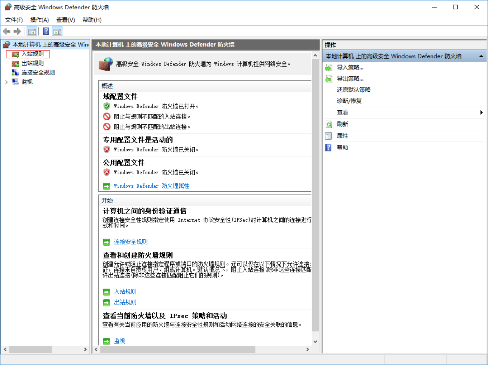
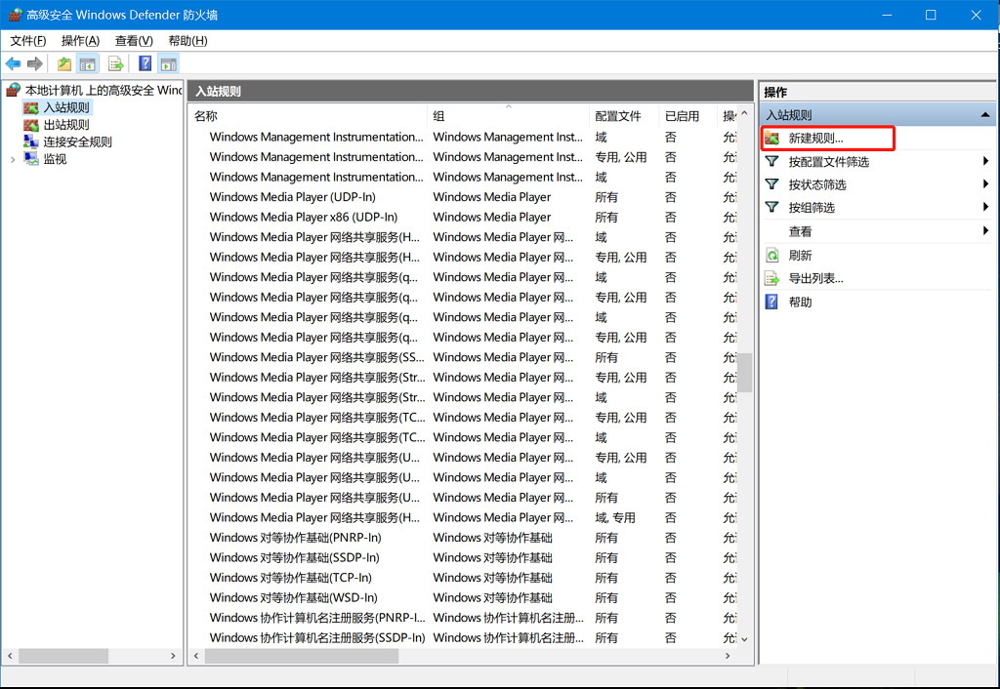
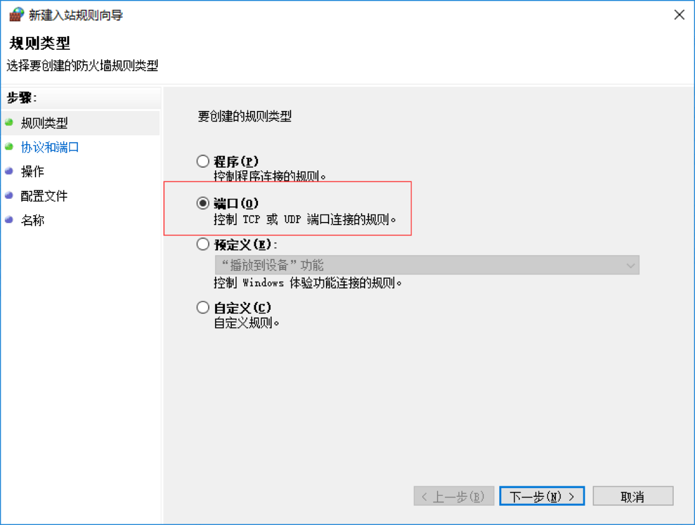
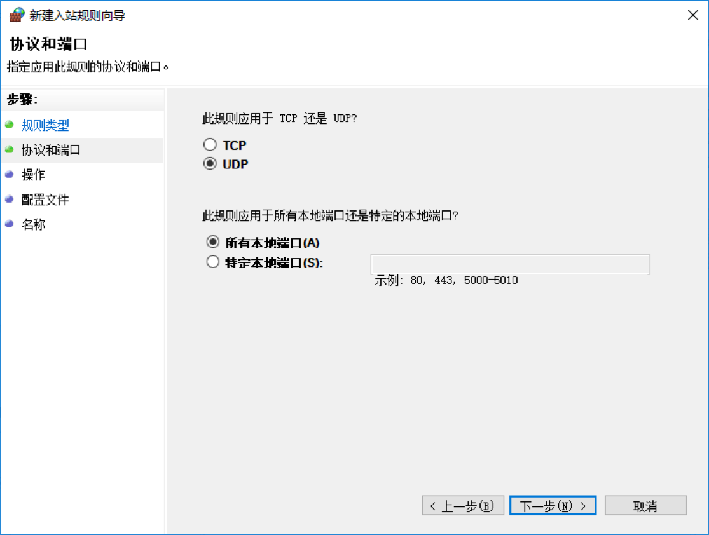
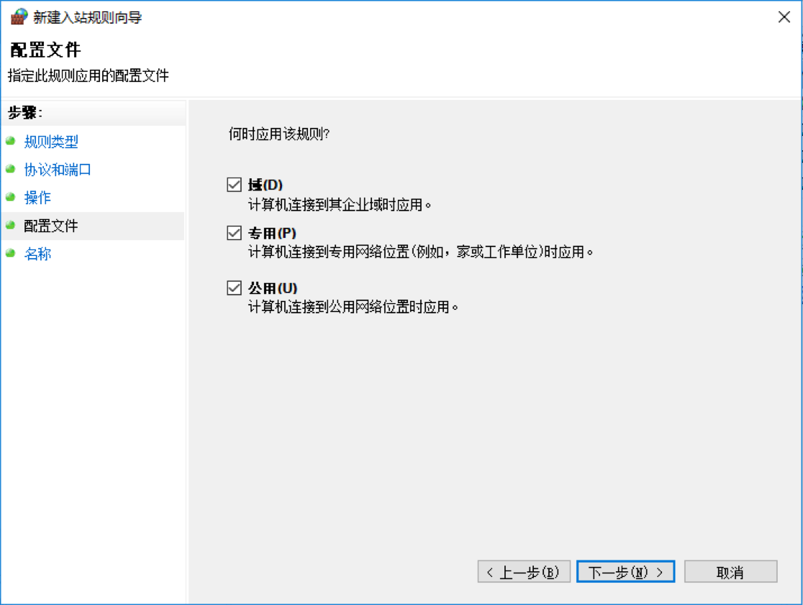
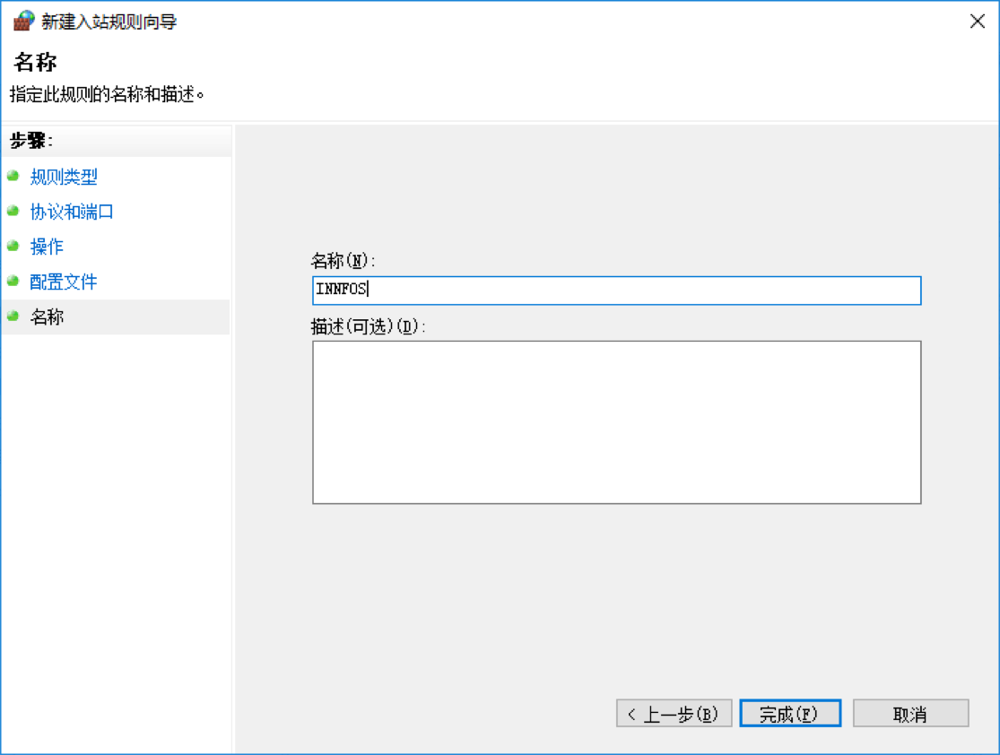
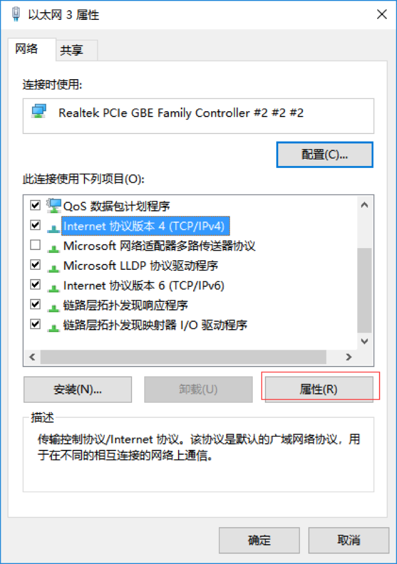
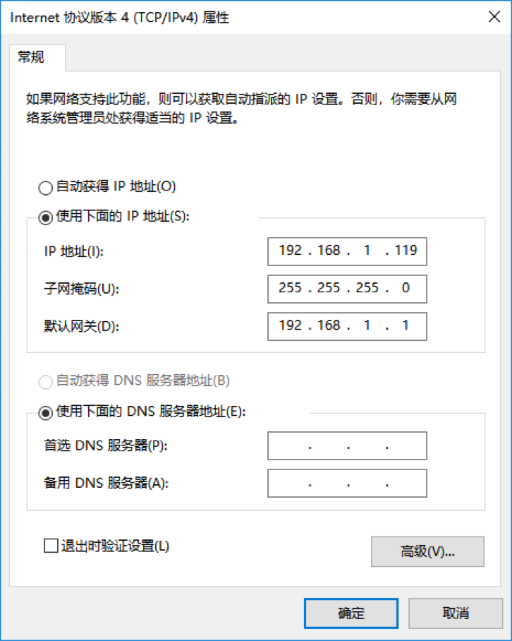

环境配置
=======


## Linux平台环境配置

*   需要安装Ubuntu16.04 LTS 及以上的系统
*   cmake 安装：打开终端输入命令

```sh
$ sudo apt-get install cmake
```

*   ip 地址配置：打开终端输入

```sh
$ ifconfig
```

* 查看网络配置 


* 示例中有线网卡的名字是`enp0s25`,输入命令

```sh
$ sudo ifconfig enp0s25 static 192.168.1.111
```


配置完成后输入`ifconfig`，可看到配置成功后的ip地址


## Windows平台环境配置

*   需要win7 sp1以上的64位Windows操作系统
*   如果电脑防火墙已开启，打开控制面板，选择系统和安全，打开Windows Defender 防火墙，点击左侧高级设置，点击入站规则



新建规则 



选择端口，然后点击下一步 



选择udp，并选择所有本地端口，点击下一步 



允许连接，点击下一步， 


默认勾选所有设置，点击下一步 



填写自定义名字，完成即可 



ip地址配置，

打开控制面板，选择网络和Internet,再选择网络和共享中心，再选择更改适配器设置，右键单击以太网，选择属性 



选择TCP/IPv4,然后选择属性， 配置如图：

其中ip地址中的192.168.1.119中的119可以替换成100~200之间的任意整数，配置完成点击确定 



## 版本变更记录

<table><tbody><tr class="odd"; style=background:PaleTurquoise><td align="left">版本号</td><td align="left">更新时间</td><td align="left">更新内容</td></tr><tr class="even"><td align="left">V1.0.0</td><td align="left">18.12.25</td><td align="left">全文</td></tr></tbody></table>
