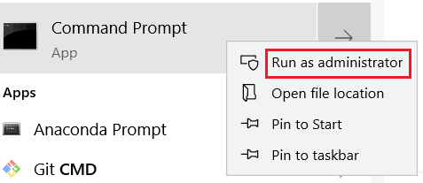

环境配置
=======


## Linux平台环境配置

*   需要安装Ubuntu16.04 LTS 及以上的系统
*   cmake 安装：打开终端输入命令

```sh
$ sudo apt-get install cmake
```

*   ip 地址配置：打开终端输入

```sh
$ ifconfig
```

* 查看网络配置 


* 示例中有线网卡的名字是`enp0s25`,输入命令

```sh
$ sudo ifconfig enp0s25 static 192.168.1.111
```


配置完成后输入`ifconfig`，可看到配置成功后的ip地址


## Windows平台环境配置

* 需要win7 sp1以上的64位Windows操作系统
* 如果电脑防火墙已开启，需要先新建入站规则：

在搜索栏中输入cmd,右键单击命令提示符，选择以管理员身份运行，打开命令提示符窗口



输入新建入站规则命令

```sh
netsh advfirewall firewall add rule name="Actuator" protocol=UDP dir=in action=allow
```

如果不再需要该规则,可运行删除规则命令

```sh
netsh advfirewall firewall delete rule name="Actuator" protocol=UDP dir=in
```

* IP地址配置:


在搜索栏中输入cmd,右键单击命令提示符，选择以管理员身份运行，打开命令提示符窗口


查看以太网网卡名称

```sh
ipconfig
```


上图中以太网网卡名字是Ethernet,修改该网卡的IP地址，输入命令

```sh
netsh interface ip set address name="Ethernet" source=static addr=192.168.1.111  mask=255.255.255.0  gateway=192.168.1.1 
```


其中`addr=192.168.1.111`中的`111`可以修改为其他数值，避免IP地址冲突（建议为100~200）

如果想恢复IP地址为自动分配，输入命令

```sh
netsh interface ip set address name="Ethernet" source=dhcp
```


## 版本变更记录

<table><tbody><tr class="odd"; style=background:PaleTurquoise><td align="left">版本号</td><td align="left">更新时间</td><td align="left">更新内容</td></tr><tr class="even"><td align="left">V2.0.0</td><td align="left">2019.05.25</td><td align="left">全文</td></tr><tr class="even"><td align="left">V1.0.0</td><td align="left">18.12.25</td><td align="left">全文</td></tr></tbody></table>
