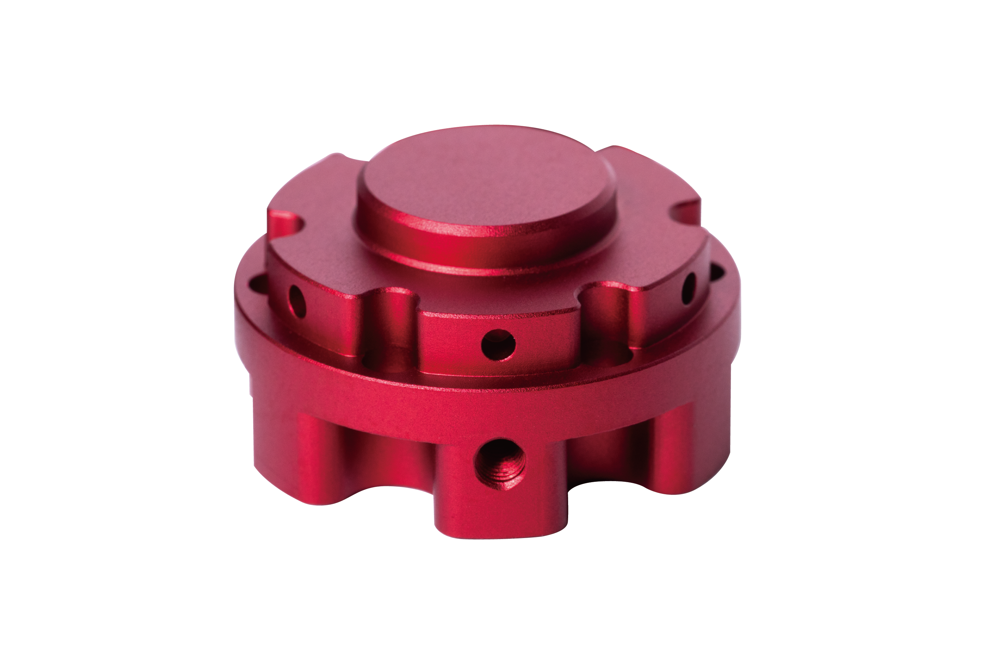
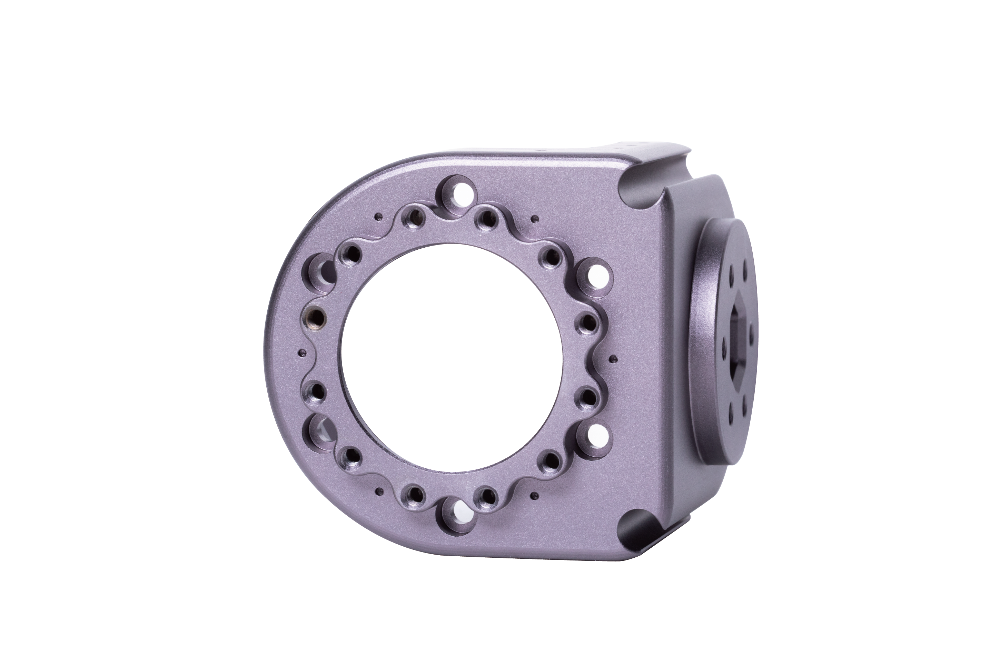
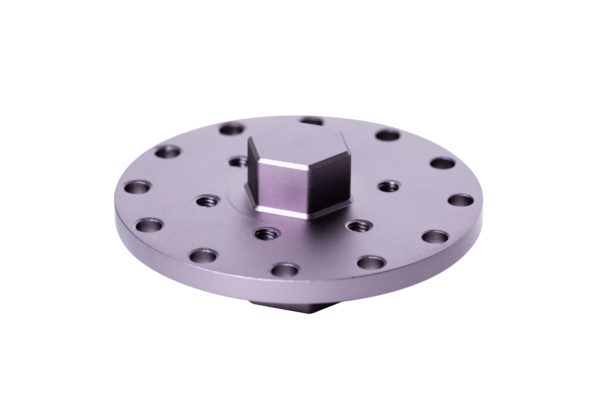
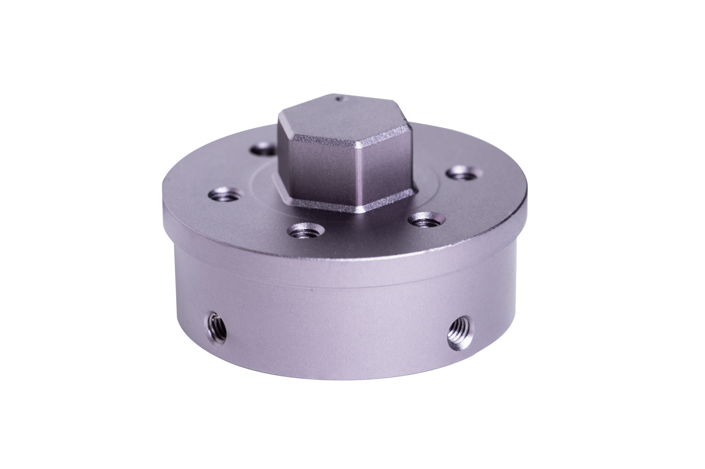
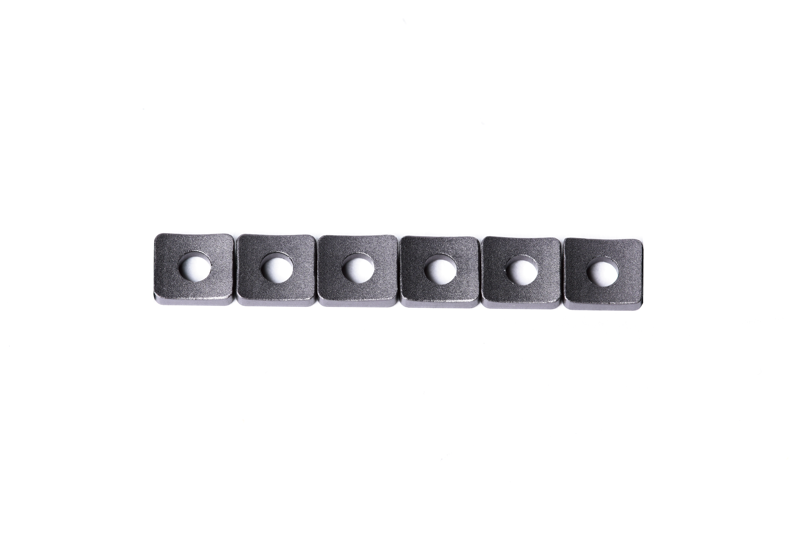
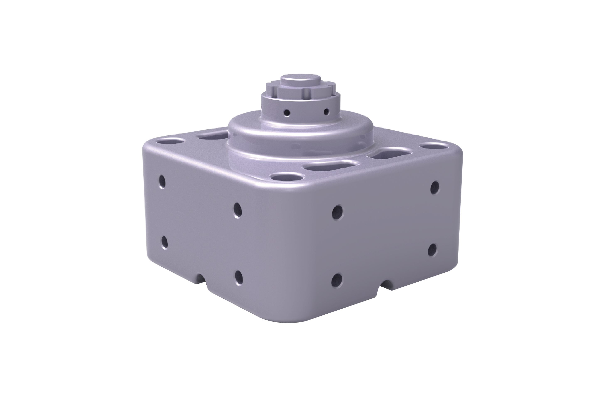

GLUON-6L3本体参数手册
=====

## 介绍

*   本手册适用于桌面级6轴机械臂GLUON-6L3。
*   在使用之前请仔细阅读本手册内容。

 所有关节采用QDD Lite系列执行器搭建。其臂长活动范围最大425mm，末端负载500g。因QDD Lite系列执行器采用了复合材料，大大降低了高端机器人本机研发成本，主要应用于教育领域，学校、实验室、研究所、竞赛等。
                                                                          
                                                                        

## 工程参数图
 [单位：毫米]

### 工作空间

### 3D模型

[模型文件]( ../../3DModel/Robotic_arm_6L3_v1_8_1.zip )

### 零件图

<a href="../../3DModel/NE30_Flange_coupling_v1.8.1.zip">SCA Output Adapter（NE30）</a >

<a href="../../3DModel/NE30_SCA_connector_v1.8.1.zip">SCA Bracket （NE30）</a >

<a href="../../3DModel/NE30_Flange_v1.8.1.zip">SCA Wheel Adapter（NE30）</a >

<a href="../../3DModel/NE30_Carbon_tube_connector_v1.8.1.zip">Carbon Tube Adapter（NE30）</a >

<a href="../../3DModel/NE30_Gasket_v1.8.1.zip">Gasket </a >

<a href="../../3DModel/NE30_Gluon_base_v1.8.1.zip">Gluon Base（NE30）</a >

## 基本参数

<table style="width:500px"><thead><tr><th colspan="3" style="background: PaleTurquoise; color: black;">GLUON-6L3参数</th></tr></thead><tbody></tr><td rowspan="8">规格</td></tr><tr><td>末端负载</td><td>500g</td></tr><tr><td>自重</td><td>3.7kg（带底座）；2.5kg（不带底座）</td></tr><tr><td>自由度</td><td>6</td></tr><tr><td>长宽高</td><td>162.15 ̽ 100  ̽ 555.5mm</td></tr><tr><td>安装方式</td><td>桌面/框架/倒置/倾斜</td></tr><tr><td>防护等级</td><td>IP54</td></tr><tr><td>结构件材料</td><td>铝合金/碳纤维</td></tr></tr><td rowspan="7">工作范围</td></tr><td>第1轴</td><td>-140°~140°</td></tr><td>第2轴</td><td>-90°~90°</td></tr><td>第3轴</td><td>-140°~140°</td></tr><td>第4轴</td><td>-140°~140°</td></tr><td>第5轴</td><td>-140°~140°</td></tr><td>第6轴</td><td>-360°~360°</td></tr></tr><td rowspan="7">最大速度</td></tr><td>第1轴</td><td>302°/s</td></tr><td>第2轴</td><td>302°/s</td></tr><td>第3轴</td><td>302°/s</td></tr><td>第4轴</td><td>302°/s</td></tr><td>第5轴</td><td>302°/s</td></tr><td>第6轴</td><td>902°/s</td></tr><td>重复定位精度</td><td colspan="3" >1.5cm</td></tr></tr><td rowspan="6">工作环境</td></tr><td>电压</td><td>42V</td></tr><td>功耗</td><td>普通工况约120W</td></tr><td>工作温度</td><td>10°~50°</td></tr><td>工作环境湿度</td><td>5%~95%</td></tr><td>通信端口</td><td>CAN/以太网</td></tr></tbody></table>

## 版本变更记录
**下表简单描述了版本变更记录**

<table style="width:450px"><thead><tr style="background:PaleTurquoise"><th style="width:100px">版本号</th><th style="width:150px">更新时间</th><th style="width:150px">更新内容</th></tr></thead><tbody>
  <tr><td>v1.0.2</td><td>2019.12.06</td><td>添加了机械臂零件图纸</td>
  <tr><td>v1.0.1</td><td>2019.10.23</td><td>参数表格修改</td>
  <tr><td>v1.0.0</td><td>2019.09.05</td><td>全文添加</td></tbody></table>

