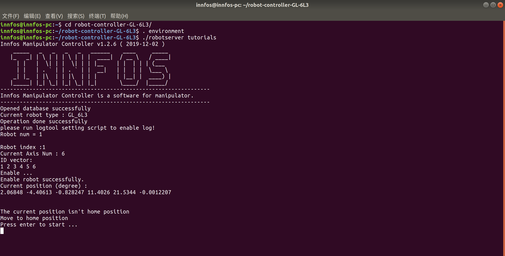
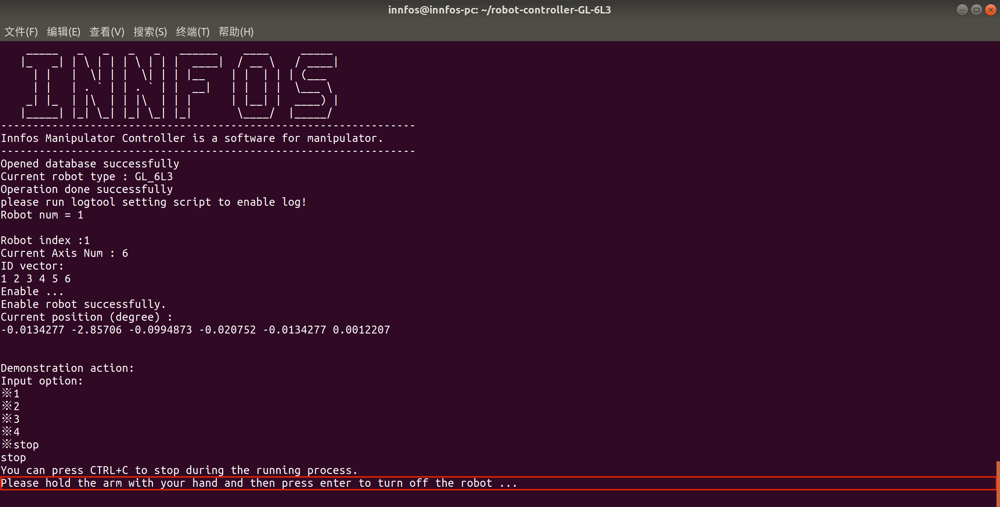
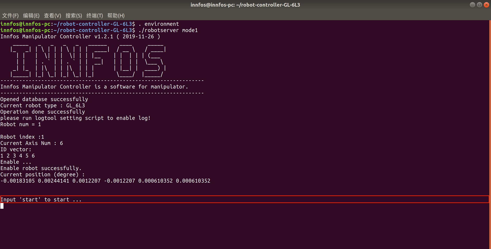
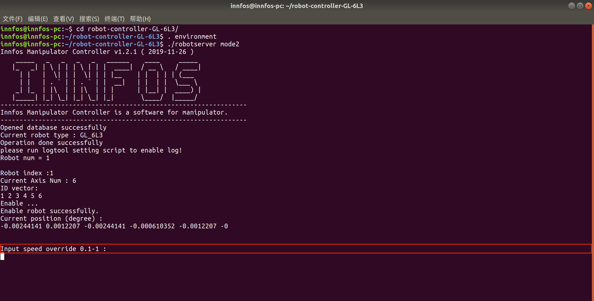
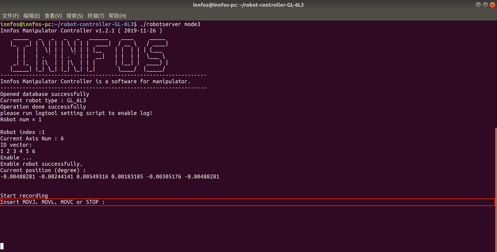
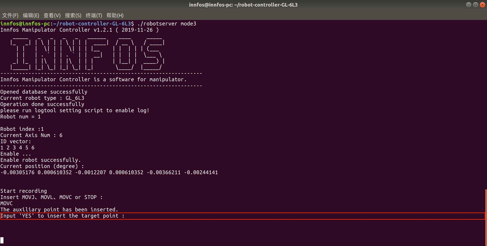
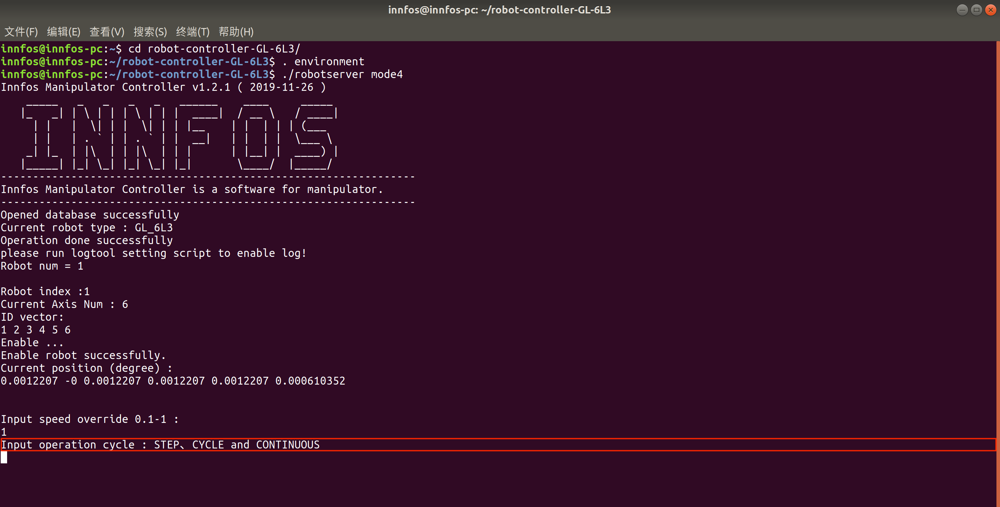
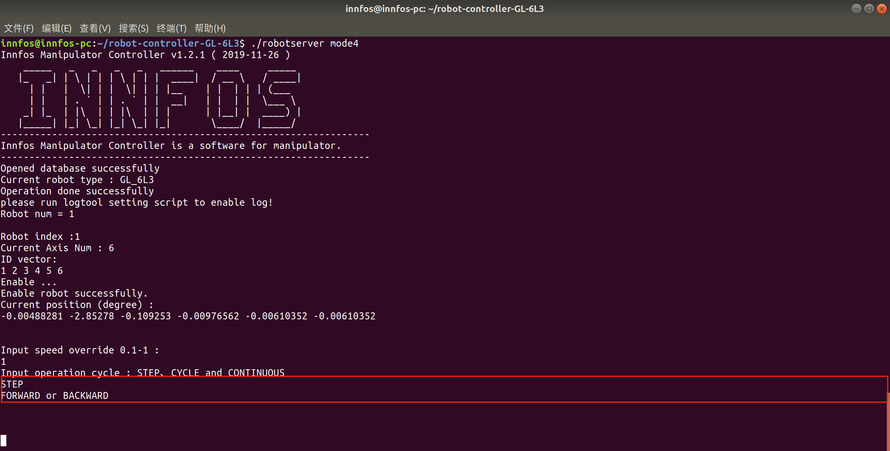
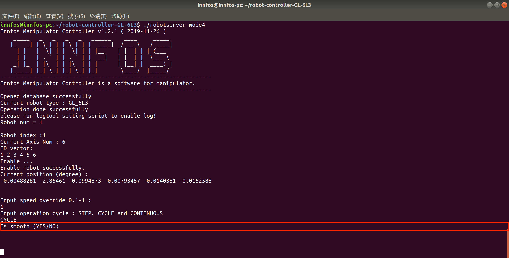
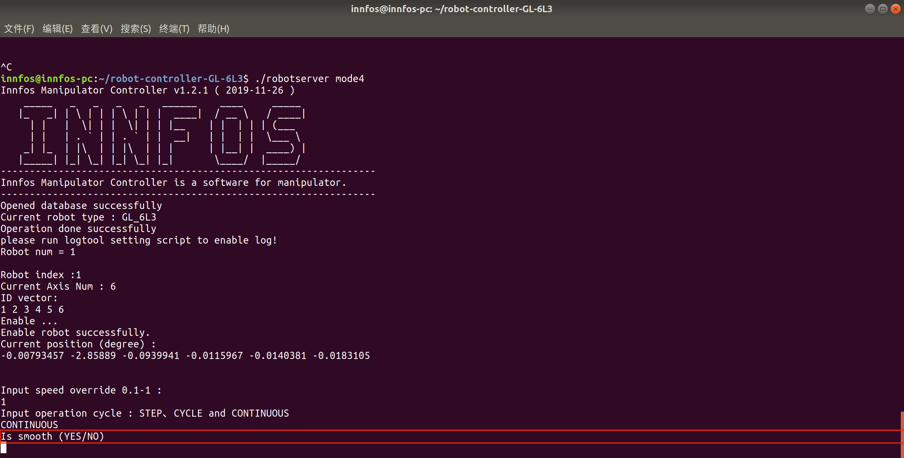

胶子系列使用说明书
=====

## 介绍

*   本说明书是针对胶子系列的使用说明。
*   在使用之前请仔细阅读本说明书内容。

## 产品实拍效果图

以GL_6L3为例:


## 硬件需求与连接

**硬件需求**


从前到后、从左到右依次为：六轴机械臂一台、插好终端电阻和回馈制动电容的ECU、急停开关+电源、电脑。


**连接ECB**

**连接电源**

*   连接电源与`ECB+HUB`


**连接执行器及其配件**

*   连接`执行器综合线缆`


**连接机械臂**

*   用执行器连接线连接`ECU`与执行器


**连接电脑**

*   用网线连接`ECU`与电脑


**连接后整体视图**


**开启电源**

*   开启电源. 执行器的供电电压范围为直流24V-45V.


*   上电以后，执行器LED状态灯会变成黄色闪烁，启动执行器后，LED会变成绿色闪烁，这时就可以与执行器进行通信了。如果执行器内部出现错误，LED灯会变为红色闪烁，请检查执行器错误代码。


## 机械臂操作使用说明


### 下载（Download）

目前支持linux-x86-64版本和linux-树莓派版本

x86-64版本：
推荐使用64位ubuntu16.04、ubuntu18.04等系统
访问[下载链接](https://github.com/innfos/innfos-gluon-controller.git)下载机械臂软件或者直接执行以下命令
```sh
$ git clone https://github.com/innfos/innfos-gluon-controller.git
```
树莓派版本：
适用于Raspberry Pi 3 Model B 和 Raspberry Pi 3 Model B+
访问[下载链接](https://github.com/innfos/innfos-gluon-controller-raspi.git)下载机械臂软件或者直接执行以下命令
```sh
$ git clone https://github.com/innfos/innfos-gluon-controller-raspi.git
```


### 简介（Introduction）

通过git下载后进入到主目录
```sh
$ cd innfos-gluon-controller/
```
ls命令可查看文件组成，其中"robotserver"和"setrobot"为可执行二进制文件，file文件夹用于存储动作文件，主要为trajectory.txt和data.txt
"robotserver"提供七种运行模式，分别为：calibrate,tutorials,mode0,mode1,mode2,mode3,mode4

使用方法为：
```sh
$ . environment
$ ./robotserver xx
```
其中"xx"可以是五种运行模式的任意一种,例如：
```sh
$ ./robotserver xx
```
"environment"用于设置动态库环境变量

Note: 每次打开终端都需执行此命令，如不执行,终端会提示找不到动态库,或将此写入开机启动脚本，则只需要配置一次即可

若执行时提示没有“robotserver”文件，表明该文件没有权限，执行以下命令更改权限：
```sh
$ chmod +x robotserver
```
"setrobot"主要用于设置机器人的各项参数，目前能设置的参数为机械臂类型,目前本软件支持两种胶子类型：GL_6L3和GL_2L6_4L3,默认类型为GL_6L3

如设置成GL_2L6_4L3,执行命令:

```sh
$ ./setrobot t GL_2L6_4L3
```

Attention: 请先确认自己的机械臂型号，若不是默认类型(GL_6L3),需执行上述命令设置相应的类型


### 运行模式使用说明

目前"robotserver"提供七种运行模式，分别为：calibrate,tutorials,mode0,mode1,mode2,mode3,mode4，具体使用方法介绍如下：

* calibrate

该模式为标定模式，用于标定机械臂的机械零点

将机械臂移动到零点位置，如下图所示：


<br>移动到零点位置后，执行该模式，此时终端周期性打印机械臂的当前角度值，按下CTRL+C结束打印：


若打印的角度和零点角度值相差较大，证明零点不准确，输入"y"将当前点设为机械零点
若打印的角度和零点角度值相差不大，证明零点准确，输入其他值退出标定程序

Attention: 零位若丢失，会导致机械臂运动异常

*  tutorials

该模式为向导模式，适用于初次上手，该模式会按用户选择运行预设的几套动作示例
<br>tutorials模式可以按照引导使机械臂按照预先设定动作运动
<br>执行该模式后，此时终端会显示：



<br>1、2、3、4为4套预设动作，输入其中任意数字即可让机械臂运动，播放完该动作自动后，可重新选择动作模式

输入stop会退出引导程序，此时终端会显示：




扶住机械臂，按enter键后执行器失能，引导程序结束

Note: 请注意一定要先扶住机械臂再按enter

*  mode0

该模式为关机模式，功能为关掉机械臂使能状态（机械臂伺服上电状态是绿色，黄色为未使能状态）， 用于机械臂断电之前，即每次断电之前需执行此模式

*  mode1

该模式为连续记录模式，功能是连续记录机械的运行轨迹，
执行该模式后，此时终端会显示：



<br>输入“start”开始记录。
<br>CTRL + C可停止记录，此时轨迹文件存储在file/trajectory.txt里。

*  mode2 

此模式为再现模式，功能为循环再现“mode1”生成的轨迹文件file/trajectory.txt。
执行该模式后，此时终端会显示：



<br>该值为再现速度比例，取值范围为0.1-1，即10%-100%，输入正确的值后按Enter键进行下一步。建议第一次运行采用低的再现速度比例，确认路径无误后，可采用较高的再现速度比例。

CTRL + C可停止运行。

*  mode3

此模式为单点示教模式，功能为接受用户指令记录下某个示教点
执行该模式后，此时终端会显示：



<br>该选项功能为选择插补类型或停止记录，可选择输入字符“MOVJ”、“MOVL”、“MOVC”、“STOP”，改选项大小写不敏感（即可全用小写输入）。

MOVJ:
关节插补，末端运动轨迹具有不确定性，仅在关节空间进行规划，终端输入“MOVJ”

MOVL:
直线插补，末端运动轨迹为直线，终端输入“MOVL”

MOVC:
圆弧插补，末端运动轨迹为圆弧，圆弧插补需要记录两个点，一个为辅助点，输入“MOVC”
<br>后记录下辅助点，终端如下提示，此时输入“YES”记录圆弧终点，输入其他则退出程序。



STOP:
停止记录，退出程序

*  mode4

此模式为再现模式，功能为再现“mode3”生成的路径文件file/data.txt。
执行该模式后，此时终端会显示：


<br>该值为再现速度比例，取值范围为0.1-1，即10%-100%，输入正确的值后按Enter键进行下一步。建议第一次运行采用低的再现速度比例，确认路径无误后，可采用较高的再现速度比例。
<br>确定再现速度比例后终端会显示：



<br>该选项为选择再现运行模式，可选择输入“STEP”、“CYCLE”、“CONTINUOUS”，输入其它值则退出程序。

STEP:
单步运行模式，该模式下可输入“FORWARD”运行到下一个点，或者输入“BACKWARD”运行到上一个点，输入其它值则退出程序。



CYCLE:
单循环运行模式，即只运行程序一遍，此模式下终端会出现以下界面，输入“YES”以平滑的方式再现路径（注意路径会变形），输入其他则按正常运动方式运行（即点到点运动速度降低为零）。



CONTINUOUS:
连续循环运行模式，连续再现“mode3”示教的路径，此模式下终端会出现以下界面，输入“YES”以平滑的方式再现路径（注意路径会变形），输入其他则按正常运动方式运行（即点到点运动速度降低为零）



<br> 运动过程中可按下组合键"CTRL+C"停止机械臂


### 具体功能使用步骤

通过上述几种模式，可实现不同的功能,具体使用步骤如下：

#### 使用前检查

*   检查机械臂类型，若不是默认类型(GL_6L3),需用./setrobot设置成相应的类型

*   检查执行器指示灯是否正常，若执行器指示灯绿色或黄色为正常，若不亮或者其他颜色则表示异常

*   检查各关节是否松动，转动关节查看关节是否有异响或松动现象

*   检查零位是否丢失，将机械臂摆到竖直状态，执行命令：            
    ```sh
    $ . environment
    $ ./robotserver calibrate
    ```
    按照"calibrate"的使用说明即可
    
#### 功能实现

* 录制-播放功能实现

执行命令：
```sh
$ . environment
$ ./robotserver mode1
```
按照"mode1"的使用说明录制动作

在有录制文件的前提下执行命令：
```sh
$ ./robotserver mode2
```
按照"mode2"的使用说明播放动作

* 单点示教-再现功能实现

执行命令：
```sh
$ . environment
$ ./robotserver mode3
```
按照"mode3"的使用说明示教动作

在有示教文件的前提下执行命令：
```sh
$ ./robotserver mode4
```
按照"mode4"的使用说明再现动作

* 向导功能实现

执行命令：
```sh
$ . environment
$ ./tutorials
```
按照"tutorials"的使用说明即可

#### 关机

```sh
$ . environment
$ ./robotserver mode0
```
机械臂断电之前，需执行此命令，然后才能关掉电源

Attention: 请用手托住机械臂，然后再执行"mode0"关闭电机使能,若不扶住机械臂，机械臂会有因为重力而砸下来的风险


## 版本变更记录
**下表简单描述了版本变更记录**

<table style="width:450px"><thead><tr style="background:PaleTurquoise"><th style="width:100px">版本号</th><th style="width:150px">更新时间</th><th style="width:150px">更新内容</th></tr></thead><tbody>
 <tr><td>v1.0.0</td><td>2019.12.06</td><td>全文添加</td></tbody></table>
