## 介绍

IAS是一款可视化的INNFOS执行器调试软件，主要功能包括控制、修改执行器ID、可视化图表调节执行器、动作编辑等等。IAS可以直观、方便的修改和控制INNFOS执行器。使用IAS无需编程经验，但是不适合复杂的功能开发。

----

## 下载IAS

如果电脑系统为Linux,访问[IAS(Linux)](https://github.com/innfos/INNFOS-Actuator-Studio-linux.git)获取最新版本的IAS(INNFOS Actuator Studio)(Linux),如果电脑系统是Windows请访问 [IAS(Windows)](https://github.com/innfos/INNFOS-Actuator-Studio-windows.git).

----

## 软件的安装

### Linux平台

1. 解压下载好的压缩包
2. 进入IAS目录
3. 双击INNFOS Actuator Studio图标或者使用下面命令启动IAS：

```sh
$ ./INNFOS\ Actuator\ Studio
```

### Windows平台

1.双击安装软件`Setup.exe`


<div class="md-text" style="text-align: center;"><strong>图1 CAN通信网络的连接框图</strong></div>

2.进入安装界面后，点击`Next`


<div class="md-text" style="text-align: center;"><strong>图1 CAN通信网络的连接框图</strong></div>

3.点击`I Agree`


<div class="md-text" style="text-align: center;"><strong>图1 CAN通信网络的连接框图</strong></div>

4.选择安装位置，然后点击`Install`


<div class="md-text" style="text-align: center;"><strong>图1 CAN通信网络的连接框图</strong></div>

5.等待安装完成


<div class="md-text" style="text-align: center;"><strong>图1 CAN通信网络的连接框图</strong></div>

6.如遇到有杀毒软件提示报警时，请选择“允许本次操作”，


<div class="md-text" style="text-align: center;"><strong>图1 CAN通信网络的连接框图</strong></div>

7.点击`Finish`，完成软件的安装


<div class="md-text" style="text-align: center;"><strong>图1 CAN通信网络的连接框图</strong></div>

----

## 软件的开机

1、双击运行软件 启动用户界面


<div class="md-text" style="text-align: center;"><strong>图1</strong></div>

2.点击`confirm that you’ve read the document！`，然后点击`next`，进入下一界面，（如果是初次对本产品使用者，请点击`show the document！` ,阅读软件使用说明）


<div class="md-text" style="text-align: center;"><strong>图2</strong></div>

3.选择执行器通信方式（默认为以太网通信），然后继续点击`next`（注：如果是初次使用以太网通信，应配置静态IP,具体配置）


<div class="md-text" style="text-align: center;"><strong>图3</strong></div>

*   当USB转CAN未连接或连接不正常时，会出现如图错误提示。


<div class="md-text" style="text-align: center;"><strong>图4</strong></div>

*   当外部执行器没有连接或连接不正常时，会出现如图错误提示

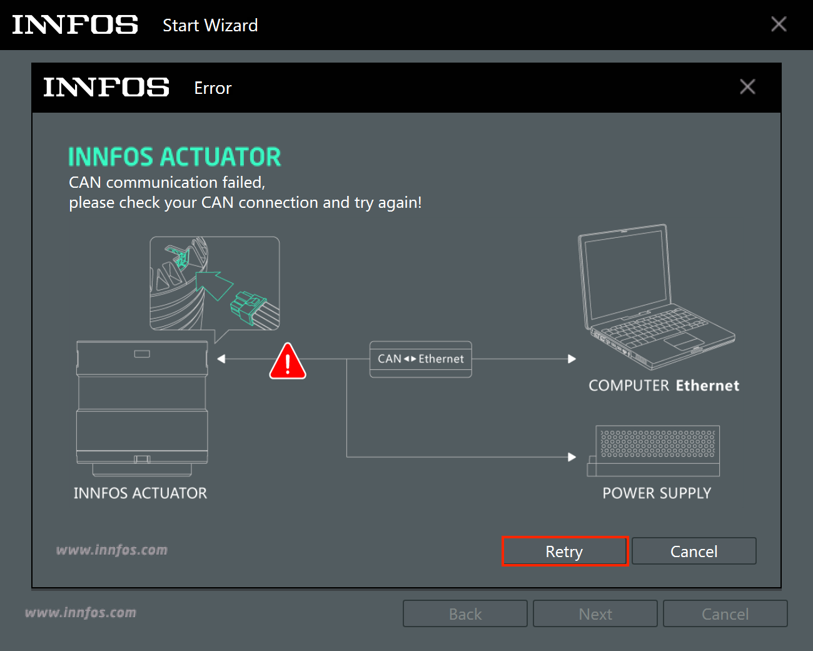

<div class="md-text" style="text-align: center;"><strong>图5</strong></div>

*   当外部系统连接正确，系统进入执行器运行界面，单机红色区域OFF，如图，标记1处OFF为单个执行器开关，2处ON为总开关，比如多个执行器同时连接时，点击总开关即可控制所有执行器开关机。


<div class="md-text" style="text-align: center;"><strong>图6</strong></div>

*   点击OFF开机后，弹出右图中红色区域提示信息


<div class="md-text" style="text-align: center;"><strong>图7</strong></div>

*   等待三秒左右，如图，标记一处为该执行器ID号和内部版本号，标记2处为错误清除键，标记3处为Detail键可进入执行器操作界面，标记4处为该执行器的信息显示区域。

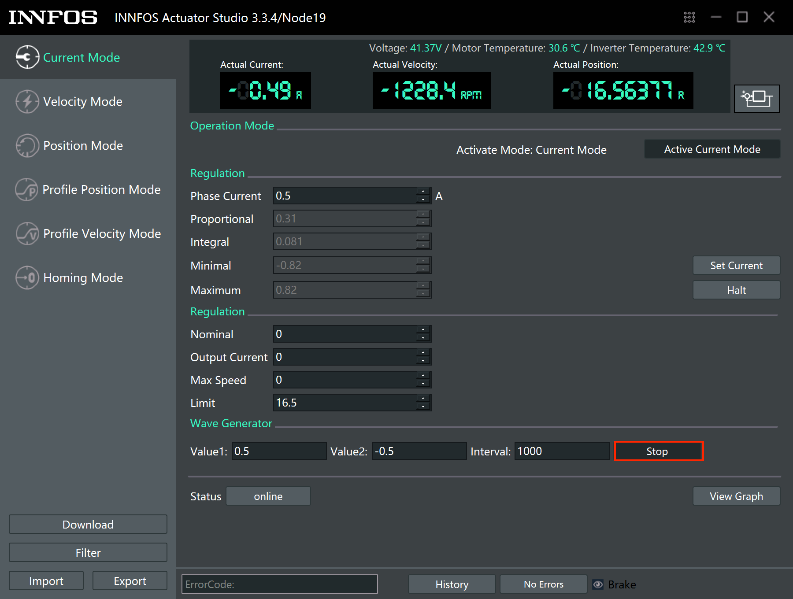

<div class="md-text" style="text-align: center;"><strong>图8</strong></div>

4.双击执行器信息框或者点击`Detail`键，进入电流环模式。


<div class="md-text" style="text-align: center;"><strong>图9</strong></div>

----

## 电流环模式

INNFOS执行器系统的逻辑框图：


<div class="md-text" style="text-align: center;"><strong>图10 INNFOS执行器系统的逻辑框图</strong></div>

框图介绍：电流设置值与电流反馈值做加减运算后经过PI模块后经可选的滤波器再经限幅模块以驱动电机，电机经反馈把电流参数反馈给系统，使之形成闭环。


### 电流环模式各项功能描述

*   文字序号与图中序号对应

（1）电流环模式

（2）电流环模式简易示意图

（3）当前模式下状态激活

（4）参数设置

（5）INNFOS执行器状态参数值

（6）错误警告

（7）方波发生器参数值设定

（8）INNFOS执行器当前连接状态

（9）示波器开关

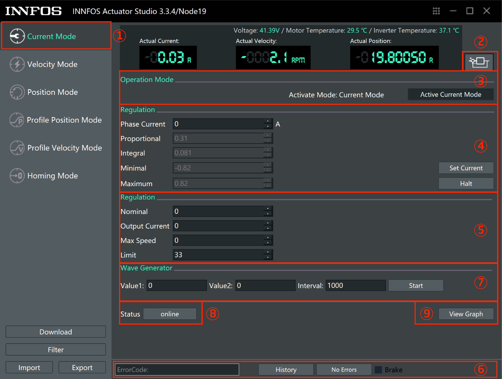

<div class="md-text" style="text-align: center;"><strong>图11</strong></div>

### 基本参数的描述

*   文字序号与图中序号对应

（1）相电流

（2）比例设置（预设）

（3）积分设置（预设）

（4）最大电流（预设）

（5）最小电流（预设）

<span style="color: red">[注:电流环模式中，比例设置、积分设置根据执行器型号已进行预设，无需更改；最小电流设置固定值-0.82，最大电流设置固定值0.82，并已进行预设，无需更改。]</span> 


<div class="md-text" style="text-align: center;"><strong>图12</strong></div>

### 电流环使用方式

1.点击“Active Current Mode”激活当前电流环模式。

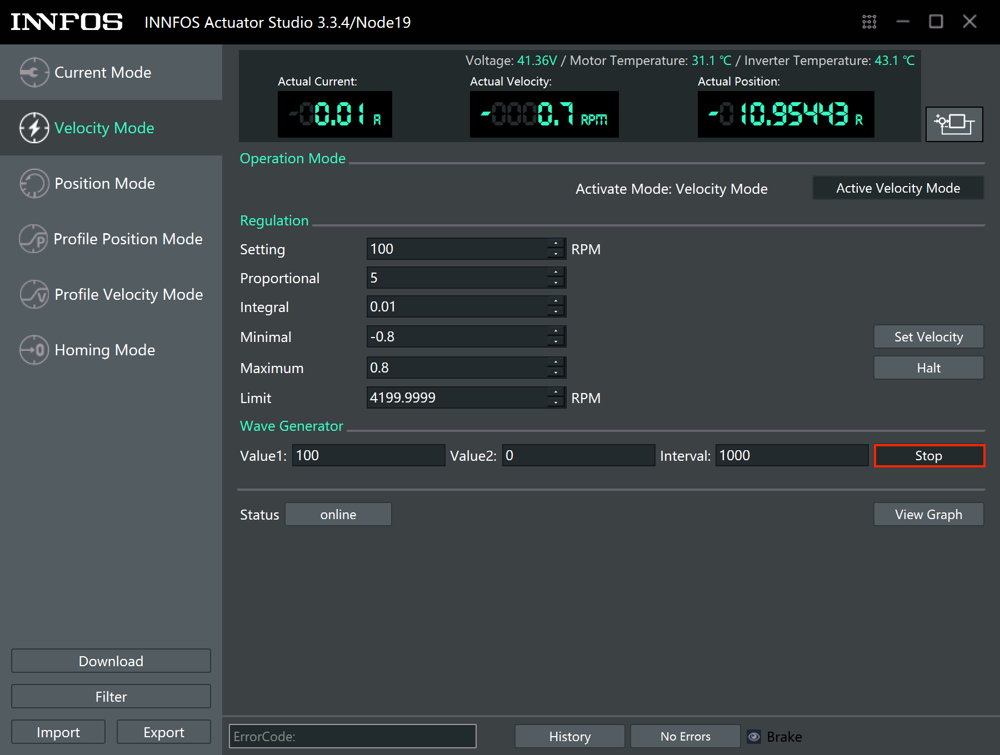

<div class="md-text" style="text-align: center;"><strong>图13</strong></div>

2.参数设置：应用方式

*   在`Phase Current`中输入电流值大小（图中1处），按回车键或`Set Current`键，INNFOS执行器开始输出相应扭矩。若负载不够大，INNFOS执行器会高速运转。
*   INNFOS执行器开始转动后，在状态值栏可以看到当前INNFOS执行器的各项参数值。(如图中3处)
*   按`Halt`键可停止INNFOS执行器的转动。（如图中2处）
*   `Limit`参数栏中可以设置最大电流值。


<div class="md-text" style="text-align: center;"><strong>图14</strong></div>

3.点击“View Graph”可打开示波器

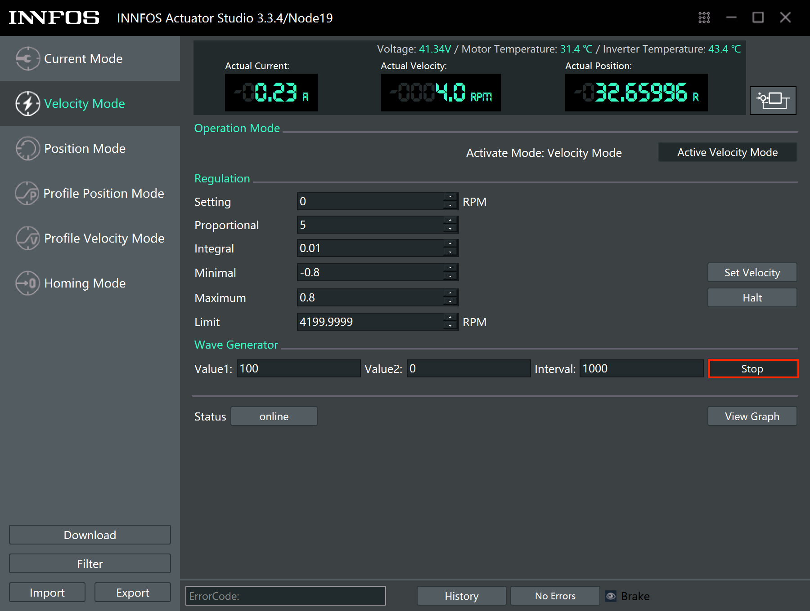

<div class="md-text" style="text-align: center;"><strong>图15</strong></div>

4.示波器各项功能描述

*   右图中`prescalar`可设置波形的预分频系数（图1处），`trig_value`可设置触发数值（图2处），图 3处设置参数的保存、暂停、自动缩放；
*   `Channel 1` 为INNFOS执行器给定波形的偏置和放大倍数（图4处）；
*   `Channel 2` 为INNFOS执行器电流波形的偏置和放大倍数（图5处）；
*   `Channel 3` 为INNFOS执行器速度波形的偏置和放大倍数（图6处）；
*   `Channel 4` 为INNFOS执行器位置波形的偏置和放大倍数（图7处）。


<div class="md-text" style="text-align: center;"><strong>图16</strong></div>

Note:不用的通道偏置设置为0，放大设置为1，或者直接点击OFF关闭其显示!

5.方波发生器参数值设定

*   在`Value 1`中输入电流值1（单位：A）（图1处）
*   在`Value 2`中输入电流值2（单位：A）（图2处）
*   在`Interval`内输入时间（单位：ms）（图3处）（例：`Value 1`为0.1，`Value 1`为0，`Value 1`为1000，启动后，先给定INNFOS执行器相电流为-0.001A，1000mS后给定相电流为0.5A,再过1000ms再次给定相电流-0.001A，如此反复运行直至用户点击“停止”)。
*   选择点击`Start`键（右图4处），方波发生器会按设定的时间（`Interval`值），连续生效`Value 1`和`Value 2`到指定的位置，直到关闭此按钮。


<div class="md-text" style="text-align: center;"><strong>图17</strong></div>

6.点击`View Graph`按钮打开示波器窗口，可以查看给定（ `Channel 1` 此时为方波发生器）、电流（ `Channel 2` ）、速度（ `Channel 3` ）、位置（ `Channel 4` ）四通道参数波形，如图 


<div class="md-text" style="text-align: center;"><strong>图18</strong></div>

7.点击`Stop`键，可停止方波发生器的运行。


<div class="md-text" style="text-align: center;"><strong>图19</strong></div>

----

## 速度环模式

INNFOS执行器系统的逻辑框图：


<div class="md-text" style="text-align: center;"><strong>图20 INNFOS执行器系统的逻辑框图</strong></div>

框图的介绍： 速度值设置与速度反馈值做加减后经PI模块后经可选的滤波器再经模块输出电流给电流环，在确保电流环模式运行正确的情况下，通过电流环驱动电机，经编码器把速度参数反馈给系统，使之形成闭环。

### 点击“Velocity Mode”进入速度环模式

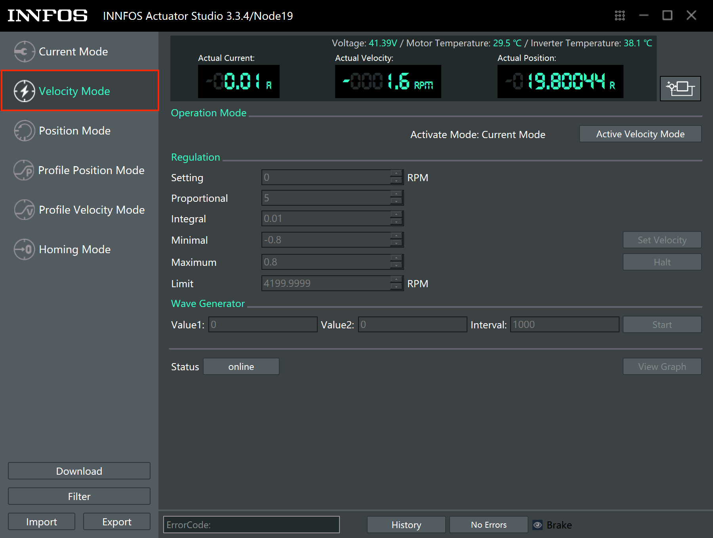

<div class="md-text" style="text-align: center;"><strong>图21</strong></div>

### 速度环模式各项功能描述

*   文字序号与图中序号对应

（1）速度环模式简易示意图

（2）当前模式下状态激活

（3）基本参数设置

（4）INNFOS执行器状态参数值

（5）错误警告

（6）方波发生器参数值设定

（7）INNFOS执行器连接状态

（8）示波器开关 


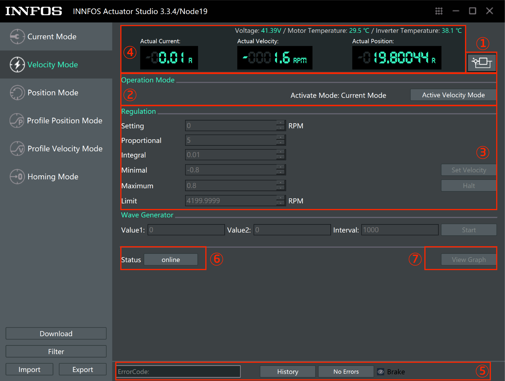

<div class="md-text" style="text-align: center;"><strong>图22</strong></div>

### 速度环使用方式

1.点击“Active Velocity Mode”，激活当前速度环模式。


<div class="md-text" style="text-align: center;"><strong>图23</strong></div>

2.速度环基本参数设置：

*   图1处`Setting`框中输入转速值大小（单位：RPM），按回车键或点击右图4处的`Set Velocity`键，INNFOS执行器开始转动。若转速值为负值则反向转动。
*   INNFOS执行器开始转动后，右图5处的状态值栏可以看到当前INNFOS执行器的各项参数值。
*   调节`Proportional`框和`Integral`框可调节PI值，右图2处。
*   右图3处的`Mininal`框和`Maximum`框为速度环输出限幅（后接电流环的输入），例如：电流最大值为33A（PR60型为33A，NE30型为16.5A，具体参见各型号SCA参数表相电流满量程值。输入值为0.5，那么INNFOS执行器电流增加到33×0.5的时候，电流值将受限，不再增加。
*   按`Halt`键可停止INNFOS执行器的转动。


<div class="md-text" style="text-align: center;"><strong>图24</strong></div>

3.点击`View Graph`可打开示波器,参数界面介绍同上。


<div class="md-text" style="text-align: center;"><strong>图25</strong></div>

4.方波发生器参数值设定

*   在`Value 1`中输入转速1。(单位:RPM)
*   在`Value 2`中输入转速2。(单位:RPM)
*   在`Interval`内输入单位时间（单位：ms），可设置INNFOS执行器方波发生器的参数。（例：`Value 1`为-0.001，`Value 1`为300，`Value 1`为1000，启动后，INNFOS执行器先到速度-0.001 RPM，1000mS后速度为 300 RPM，在过1000ms再次到速度-0.001 RMP，如此反复运行直至用户点击“停止”)。
*   选择点击`Start`键，INNFOS执行器将开始转动。


<div class="md-text" style="text-align: center;"><strong>图26</strong></div>

5.设置`View Graph`视图里的参数，可以更好的查看当前INNFOS执行器各项参数波形。


<div class="md-text" style="text-align: center;"><strong>图27</strong></div>

<span style="color: red">注：不用的通道偏置设置为0，放大设置为1（右图中channel2和channel4），或者直接点击OFF关闭其显示</span>

6.点击`Stop`键，可停止方波发生器的运行。


<div class="md-text" style="text-align: center;"><strong>图28</strong></div>


----

## 位置环模式

INNFOS执行器系统的逻辑框图：


<div class="md-text" style="text-align: center;"><strong>图29 INNFOS执行器系统的逻辑框图</strong></div>

框图的介绍： 在确保电流环和速度环准确的情况下，位置设置值与位置反馈值做加减运算后经过PI模块后经可选的滤波器再经限幅模块输出速度值，然后速度值经速度环再经电流环驱动电机，电机经编码器把位置参数反馈给系统，使之形成闭环。

### 点击“位置环”进入位置环模式


<div class="md-text" style="text-align: center;"><strong>图29</strong></div>

### 位置环模式各项功能描述

*   文字序号与图中序号对应

（1）位置环模式示意图

（2）当前模式下状态激活

（3）基本参数设置

（4）INNFOS执行器状态参数值

（5）错误警告

（6）方波发生器参数值设定

（7）INNFOS执行器连接状态

（8）示波器开关 


<div class="md-text" style="text-align: center;"><strong>图30</strong></div>

### 位置环使用方式

1.点击`Active Position Mode`，激活当前位置环模式。 


<div class="md-text" style="text-align: center;"><strong>图31</strong></div>

2.位置环基本参数设置：

*   右图1处`Setting`框中输入位置值大小（单位：R），在图4处按`Set Position`键，INNFOS执行器开始转动，INNFOS执行器转到输入位置后，停止。
*   INNFOS执行器开始转动后，右图5处状态值栏可以看到当前INNFOS执行器的各项参数值。
*   调节`Proportional`框可调节比例值，如右图2处。
*   右图的3处的`Mininal`框和`Maximum`框为位置环输出给速度环的速度限制。执行器速度最大为6000RPM，例如输入值为0.5，那么INNFOS执行器最大速度增加到6000×0.5=3000R/分钟的时候，速度值将受限，不再增加。


<div class="md-text" style="text-align: center;"><strong>图32</strong></div>

3.点击“波形图”可打开示波器，参数界面介绍同上 


<div class="md-text" style="text-align: center;"><strong>图33</strong></div>

4.方波发生器参数值设定

*   在`Value 1`中输入位置值1(单位:R)
*   在`Value 2`”中输入位置值2(单位:R)
*   在`Interval`内输入时间（单位：ms），输入参数为转动一次的时间。（例：`Value 1`为0.1，`Value 1`为0，`Value 1`为1000，启动后，INNFOS执行器先转到位置0.1，1000mS后转到位置0，在过1000ms再次转到位置2，如此反复运行直至用户点击“停止”)。
*   点击`Start`键，开启INNFOS执行器转动。


<div class="md-text" style="text-align: center;"><strong>图34</strong></div>

5.点击`Stop`键，可停止方波发生器的运行。


<div class="md-text" style="text-align: center;"><strong>图35</strong></div>

6.位置模式步加步减设置：

*   在框X中输入转动的位置（单位：R），也可点击键盘方向键进行设置。点击键盘默认为增加0.1。
*   在框X中输入数值，按`step add`和`step minus`按钮，执行器可转动相应位置，点击一次可使执行器正向或反向转动一次。
*   INNFOS执行器开始转动后，在状态值栏可以看到当前INNFOS执行器的各项参数值。


<div class="md-text" style="text-align: center;"><strong>图36</strong></div>


----

## 位置环S曲线模式

### 点击“梯形位置模式”进入位置环S曲线模式


<div class="md-text" style="text-align: center;"><strong>图37</strong></div>

### 位置环S曲线模式各项功能描述

*   文字序号与图中序号对应

（1）位置环S曲线模式简易示意图

（2）当前模式下状态激活

（3）基本参数设置

（4）INNFOS执行器状态参数值

（5）错误警告

（6）INNFOS执行器当前连接状态 


<div class="md-text" style="text-align: center;"><strong>图38</strong></div>

### 位置环S曲线模式使用方式

1.点击“Active Profile Position Mode” 激活当前位置环S曲线模式 

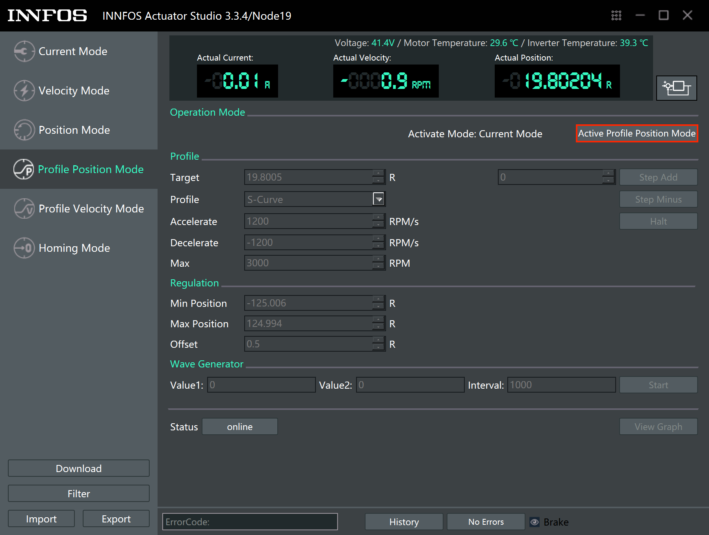

<div class="md-text" style="text-align: center;"><strong>图39</strong></div>

2.位置环S曲线模式基本参数设置：

*   右图2处的`Accelerate`框和`Decelerate`框为S曲线模式下的速度上升和下降的平缓度，例如：加速度值越大，INNFOS执行器达到最大速度的时间越短，加速度值越小，INNFOS执行器达到最大转速的时间越长。减速度值越大，INNFOS执行器从最大速度降低到零的时间越短，减速度值越小，INNFOS执行器从最大速度降低到零的时间越长。
*   `Max`限制了INNFOS执行器的最大转速，随数值增加而增加，如右图的3处，当前最大转速为1000RPM。


<div class="md-text" style="text-align: center;"><strong>图40</strong></div>


2.位置环S曲线模式基本参数设置：

*   在`Target`框中输入转动的位置（单位：R），INNFOS执行器开始转动到指定位置。
*   INNFOS执行器开始转动后，在状态值栏可以看到当前INNFOS执行器的各项参数值，右图4处。

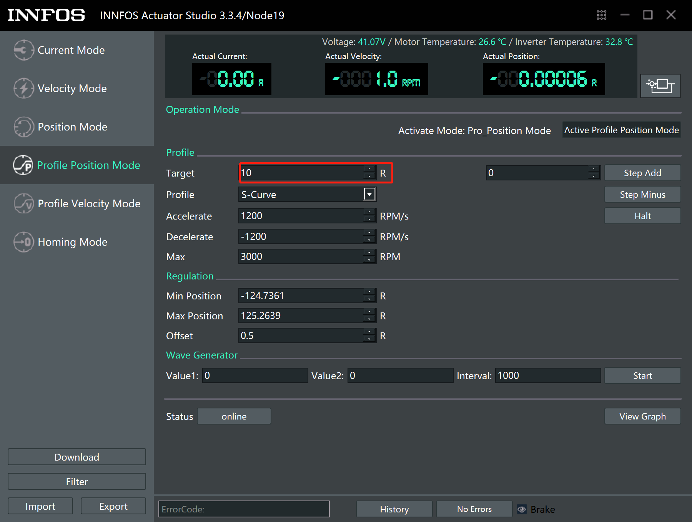

<div class="md-text" style="text-align: center;"><strong>图33</strong></div>


3.点击“波形图”可打开示波器，参数界面介绍同上:


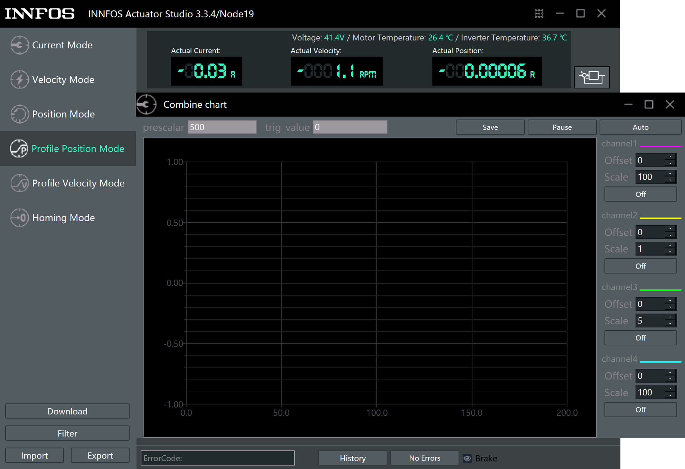

<div class="md-text" style="text-align: center;"><strong>图33</strong></div>


4.方波发生器参数值设定：

*   在`Value 1`中输入位置值1(单位:R)
*   在`Value 2`”中输入位置值2(单位:R)
*   在`Interval`内输入时间（单位：ms），输入参数为转动一次的时间。（例：`Value 1`为2，`Value 1`为-2，`Value 1`为1000，启动后，INNFOS执行器先转到位置2，1000mS后转到位置-2，在过1000ms再次转到位置2，如此反复运行直至用户点击“停止”)。
*   点击`Start`键，开启INNFOS执行器转动。

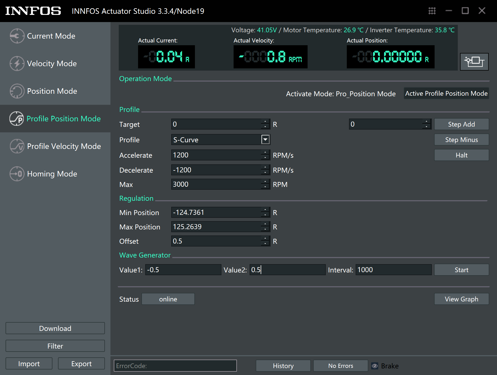

<div class="md-text" style="text-align: center;"><strong>图44</strong></div>

*   波形图如下：


<div class="md-text" style="text-align: center;"><strong>图43</strong></div>


5.点击`Stop`键，可停止方波发生器的运行。

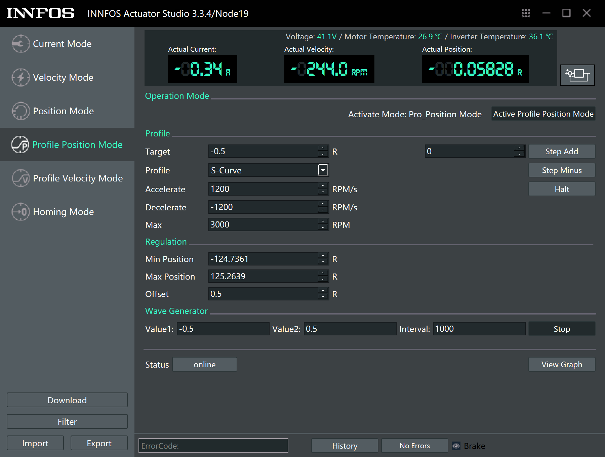

<div class="md-text" style="text-align: center;"><strong>图45</strong></div>

3.位置环S曲线模式步加步减设置：

*   在`Target`框中输入转动的位置（单位：R），也可点击键盘方向键进行设置。点击键盘默认为增加1。


<div class="md-text" style="text-align: center;"><strong>图41</strong></div>

*   在框X中输入数值，按`step add`和`step minus`按钮，执行器可转动相应位置，点击一次可使执行器转动一次。
*   INNFOS执行器开始转动后，在状态值栏可以看到当前INNFOS执行器的各项参数值，右图4处。


<div class="md-text" style="text-align: center;"><strong>图42</strong></div>


----

## 速度环S曲线模式

### 点击“Profile Velocity Mode”进入速度环S曲线模式


<div class="md-text" style="text-align: center;"><strong>图46</strong></div>

*   文字序号与图中序号对应

（1）速度环S曲线模式简易示意图

（2）当前模式下状态激活

（3）基本参数设置

（4）INNFOS执行器状态参数值

（5）错误警告

（6）INNFOS执行器当前连接状态 


<div class="md-text" style="text-align: center;"><strong>图47</strong></div>

### 速度环S曲线模式使用方式

1.点击“Active Profile Velocity Mode”，激活当前速度环S曲线模式。 


<div class="md-text" style="text-align: center;"><strong>图48</strong></div>

2.速度环S曲线模式基本参数设置：

*   在`Target`框中输入INNFOS执行器的速度值（单位：RPM），INNFOS执行器开始转动，直至达到输入值。
*   INNFOS执行器开始转动后，在状态值栏可以看到当前INNFOS执行器的各项参数值，右图3处。
*   右图中2处的加速度、减速度和最大速度项为S曲线的调整参数。


<div class="md-text" style="text-align: center;"><strong>图49</strong></div>

----

## 归零模式

### 点击“归零模式”进入归位模式

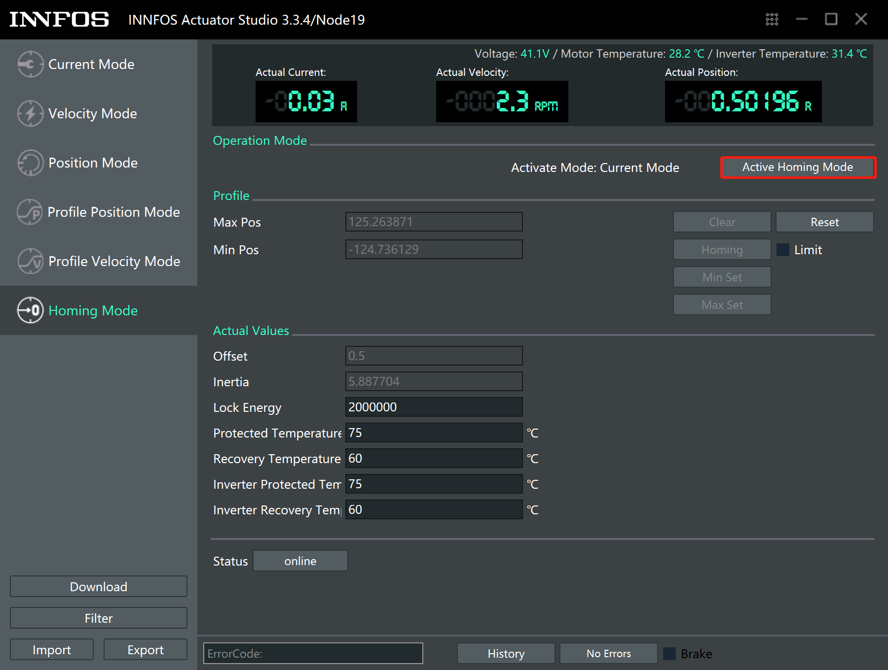

<div class="md-text" style="text-align: center;"><strong>图50</strong></div>

### 归位模式使用方式

点击“Homing Mode”，激活当前归位模式。


<div class="md-text" style="text-align: center;"><strong>图51</strong></div>

### 归位模式各项功能描述

1.自动校准左右极限

*   先后点击“清除”和“归零”按键，重复两次清除当前左右极限，直到右图8-1图1处数据变为如下大数值（这是软件限位的上下限）。然后将右图8-1图2处调为如下大数值（这是限流，比如加大负载时需要较大电流，需要放开电流限制）。然后点击Auto按钮，INNFOS执行器就会自动顺时针转动，直到触碰机械左极限（这里定义顺时针碰的机械限位为左极限，逆时针的为右极限），然后自动逆时针转动直到触碰机械右极限停止。


<div class="md-text" style="text-align: center;"><strong>图52</strong></div>

*   此时会返回左右极限的值到图8-1的1处。然后手动控制转动INNFOS执行器到想要的零点（例如图8-2中左侧图的2处），最后点击Homing按键，则当前位置变为零点（如图8-2中右侧图03的2处），图8-2中右侧图的1处的左右极限会根据点击Homing前的位置进行偏移（对比图8-2中两侧图）。这样就保证了软件限位和机械限位的一致性。

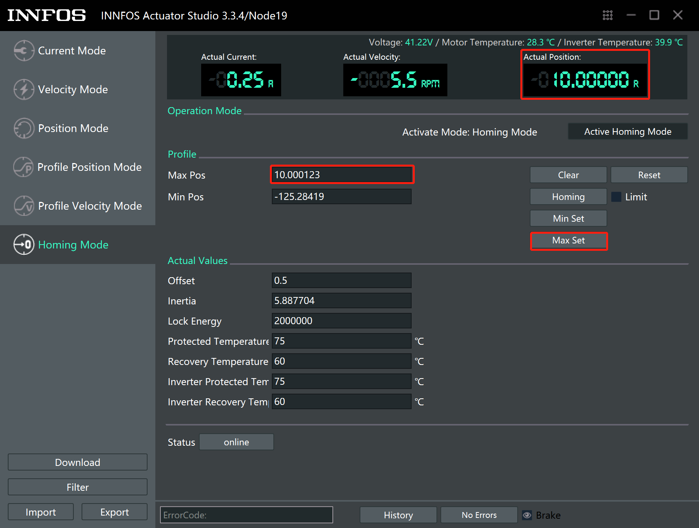

<div class="md-text" style="text-align: center;"><strong>图53</strong></div>

*   然后，设置到左右极限的余量偏置（图8-2中右侧图的3处），则实际运动范围为左右极限减去偏置，(图8-2中右侧图：左软件限位为33.774918-1.4=32.374918；右软件限位为-32.4932+1.4=-31.0932。)最后，确认软件限位开启如如图8-2中右侧图的4处后，点击“保存”按钮即可保存当前参数。

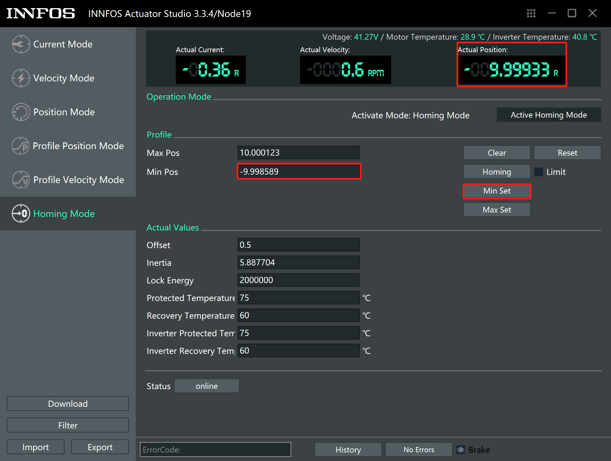

<div class="md-text" style="text-align: center;"><strong>图54</strong></div>


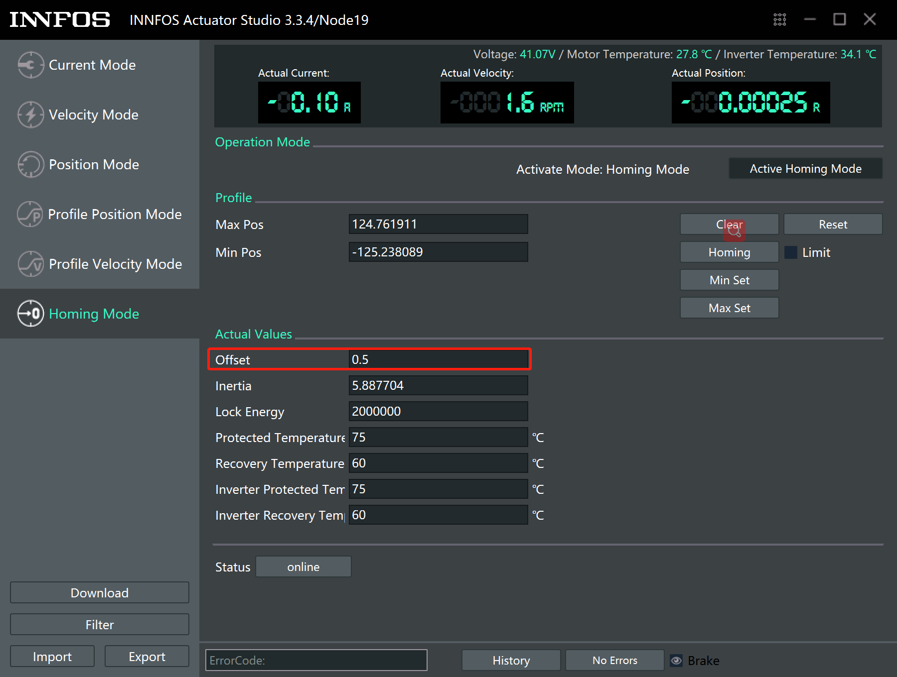

<div class="md-text" style="text-align: center;"><strong>图55</strong></div>


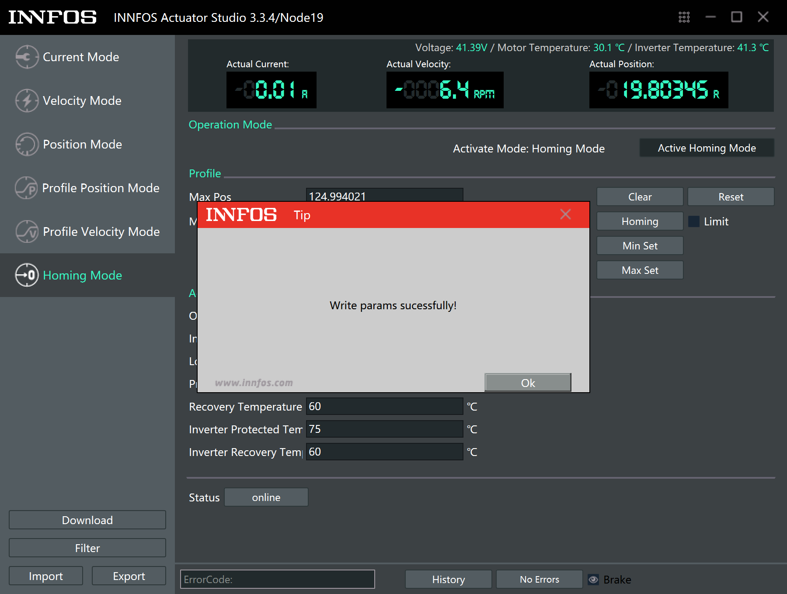

<div class="md-text" style="text-align: center;"><strong>图56</strong></div>


### 手动校准左右极限

1.点击右图红框位置“激活归零模式”;进入归位模式。


<div class="md-text" style="text-align: center;"><strong>图1 CAN通信网络的连接框图</strong></div>

2.先后点击“清除”;和“归零”按键，重复两次可清除当前左右极限，并使当前位置变为零位。直到右图红框1处数据变为如图大数值（这是软件限位的上下限）。然后将右图2处调为如下大数值（这是限流，比如加大负载时需要较大电流，需要放开电流限制）。


<div class="md-text" style="text-align: center;"><strong>图1 CAN通信网络的连接框图</strong></div>

3.手动将关节或执行器调节到左机械极限，点击“最大位置”，此时“最小位置”;栏处的数值会改变，左机械极限设定完毕。（此处也可以手动输入极限数值，单位：R）


<div class="md-text" style="text-align: center;"><strong>图1 CAN通信网络的连接框图</strong></div>

4.手动将关节或执行器调节到右机械极限，点击“最小位置”;，此时“最小位置”栏处的数值会改变，右机械极限设定完毕。（此处也可以手动输入极限数值，单位：R）


<div class="md-text" style="text-align: center;"><strong>图1 CAN通信网络的连接框图</strong></div>

注意：位置模式使用时，应注意当前限位范围，如果当前位置在限位范围外，发位置指令时，位置则会回到限位范围内。

5.若只设定零点，则手动将关节或执行器调节至想要的零点，点击2处的“归零”按键，1处的当前位置值会变为0。


<div class="md-text" style="text-align: center;"><strong>图1 CAN通信网络的连接框图</strong></div>

6.设置左右极限偏置


<div class="md-text" style="text-align: center;"><strong>图1 CAN通信网络的连接框图</strong></div>

7.点击“保存”按钮即可保存当前参数 


<div class="md-text" style="text-align: center;"><strong>图</strong></div>


### 温度保护设置

1.设置电机保护温度

输入电机保护温度并回车，点击“download”保存，执行器将在达到保护温度后停止转动，并将自动切入电流环模式。
电机保护温度默认为75℃。


2.设置电机恢复温度

输入电机保护温度并回车，点击“download”保存，执行器将在降温至恢复温度后恢复可控，用户可继续。
电机保护温度默认为70℃。


3.设置逆变器保护温度


4设置逆变器恢复温度

注：设置的保护温度需比恢复温度高5℃

### 堵转能量设置


----
## 新版本在线升级功能

1.如有新版本更新，会有提示


<div class="md-text" style="text-align: center;"><strong>图</strong></div>

2.显示本次升级内容及升级按钮


<div class="md-text" style="text-align: center;"><strong>图</strong></div>

3.点击update等待升级完成


<div class="md-text" style="text-align: center;"><strong>图</strong></div>


----
## 错误提示

### 当有错误出现时，错误框内会提示错误内容

如图，弹出错误提示信息。


### 错误处理方式

点击“OK”，再点击“Clear Errors”可清除错误，清除错误后，INNFOS执行器进入电流环模式。


----

## 版本信息
<table class="tableizer-table"><thead><tr class="tableizer-firstrow" style=background:PaleTurquoise><th>版本</th><th>更新时间</th><th>更新内容</th></tr></thead><tbody><tr><td>V1.0.0</td><td>2019-04</td><td>第一个版本</td></tr></tbody></table>
