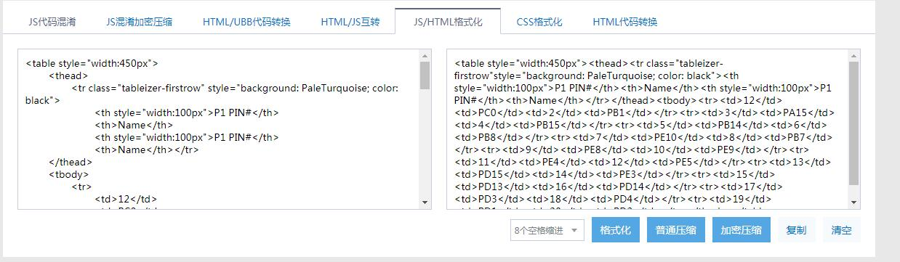
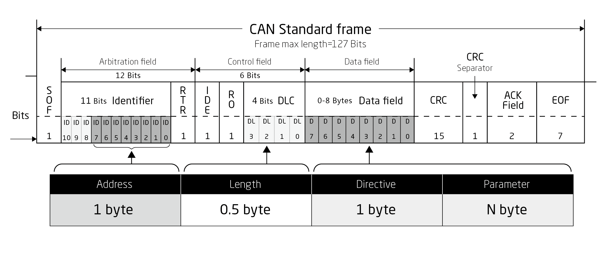
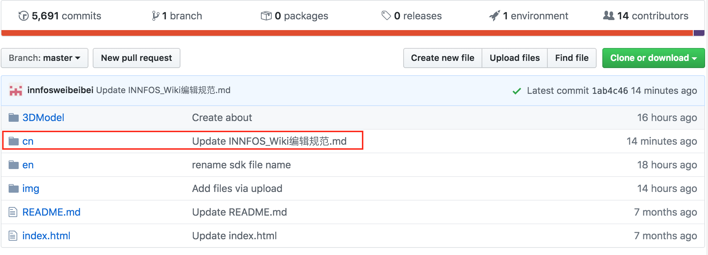
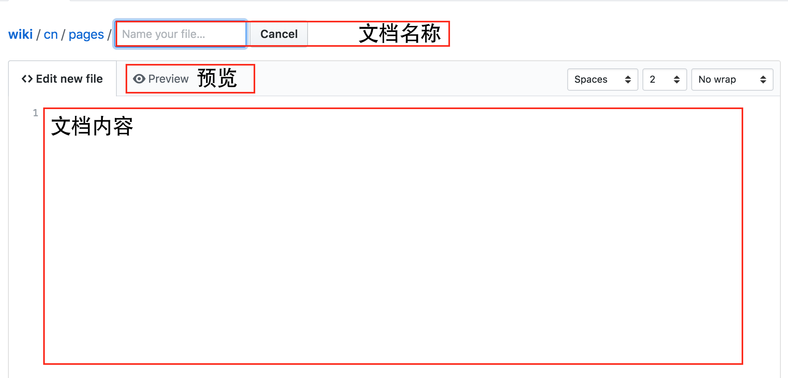
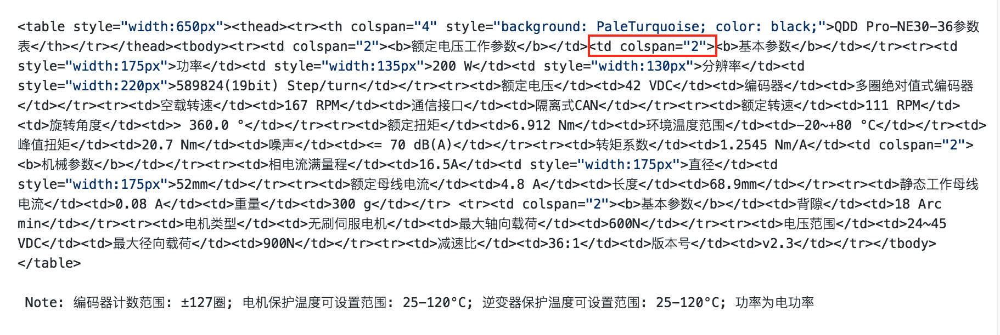

# INNFOS Wiki编写规范
MDwiki是用于链接INNFOS官网，面向客户的一个平台。为完善INNFOS官网的Wiki信息，请相关同事各自负责各自的部分，在严格审查及时更正产品资料信息的同时，做到格式的统一。

## 格式要求
### 标题
- 每个大标题间加一条线，例如：#wiki撰写规范（#号后方有一空格，因显示问题不能添加）

----

- 英文版本中所有标题开头字母要大写，例如：##Introduction；（#号后方有一空格，因显示问题不能添加）

- 文本的内外标题要统一；

- 文本的一级标题要加序号（注：只适用于篇幅较大的文本）；
  
  
### 表格
- 所有表格的第一行表格颜色为蓝色；

- 在同一标题内容下，整体表格宽度要统一。（表格中的小表格宽度视文字多少来定。注：一般以文字不换行后的宽度为合适宽度）；

- 表格编辑工具，可以访问[代码格式化工具](http://tool.chinaz.com/tools/jsformat.aspx) ，将表格代码复制进去，点击格式化会自动缩进代码，方便查看与修改;修改之后的代码复制到左边，点击普通压缩去掉缩进，替换到wiki的页面中。（class与style之间会多缩进一个空格，需要手动添加一个空格）


### 说明和注释
编辑wiki时要充分利用markdown的样式。例如：

Note: 在同一标题内容下，表格宽度统一。


### 图片要求
- 照片类图片上传时，请查看图片的大小，若图片过大请将图片压缩后上传；（电脑自带图片编辑即可更改图片大小）

- 制作类图片上传时，请下载图片原图上传，以免出现图片分辨率过低现象；

- 图片下方正文与图片要有一定间隔，间隔大小视内容来定；

- 中、英文档中所有图片统一使用英文图片；

- 图片为电脑截图时要求如下：请统一用一台电脑截图，截图界面为英文操作系统，电脑的分辨率尽量高；

- 在编写图片代码时要统一格式。代码格式如下效果：

Note: 所有页面中的图片格式以本代码为准，特殊情况下除外。如产品系列中的图片格式和页面图片有特殊要求；



<p><div class="md-text" style="text-align: center;"><strong>图3-1</strong></div></p >

Note: 带图号的要将图号居中对齐，代码格式效果如上：


### 文字要求
- 在文字中如果有关键词出现，请将关键词标红。例如：` 0x00`；

- 16进制数标为红色字样；在单独写16进制数时，务必以0x开头，且x为小写字母，x后所加的内容统一为两位字符；0x后如果为字母符号，请将字母统一大写。例如：` 0xFF`；

- 专有名词要大写；当专有名词为公司制定且第一次出现时，要将其添加备注及解释。例如：ECB（Ethernet CAN Bridge）


### 版本变更
#### 版本变更记录
- 在制作版本变更记录表格时，要有版本号、更新时间及更新内容，并以此为规范运用于每个文档中。其中版本号命名格式为vX.X.X, 例如：v1.0.0。 更新时间格式为20XX.XX.XX, 例如：2019.05.17。（型号数据因为涉及的修改很多，可以在稳定之后，小的修改采用以上格式）

- 版本号命名格式vX.X.X中前两位数值为机械提供版本型号，后一位数值是对机械提供版本型号修改次数的记录统计；

- 每次版本号不能重复，根据更新的大小，在不同的位置上递增；

- 英文版本中“版本变更记录”的英文翻译统一用"Version updating records"


#### 版本更新要求
- 所有文档涉及版本号更新时需新建文档，请勿直接在原版本修改。例如：QDD-NU80-6_v2_2.md更新版本时新建文档名为QDD-NU80-6_v3_0.md。

- 文档更新版本时内部图片链接、模型链接等名称要与新建文档名一致。请勿将原版本图片覆盖。

- 文档编辑完成后请将index.md中的对应文档链接进行修改，以保证及时更新。操作时若遇到问题请联系张贺凯或韦贝贝。


### 命令行格式
如下：
```sh
$ robotserver
```

### JS代码格式
如下：
```javascript
function test(){
	console.log("Hello world!");
}
var testBox = box();
testBox.add("jQuery").remove("jQuery");
```

### wiki常用转义字符
小于号为& lt;（&后方有一空格，使用时请将其去掉）<br>
大于号为& gt;（&后方有一空格，使用时请将其去掉）<br>
米号为& lowast;（&后方有一空格，使用时请将其去掉）<br>
小于或等于为& le;（&后方有一空格，使用时请将其去掉）<br>
大于或等于为& ge;（&后方有一空格，使用时请将其去掉）<br>


## 版本变更记录
**下表简单描述了版本变更记录**

<table style="width:400px"><thead><tr style="background:PaleTurquoise"><th style="width:100px">版本号</th><th style="width:150px">更新时间</th><th style="width:150px">更新内容</th></tr></thead><tbody><tr><td>v1.0.4</td><td>2019.09.09</td><td>添加内容</td><tr><td>v1.0.3</td><td>2019.07.01</td><td>添加内容</td><tr><td>v1.0.2</td><td>2019.05.27</td><td>添加内容</td><tr><td>v1.0.1</td><td>2019.05.22</td><td>添加内容</td><tr><td>v1.0.0</td><td>2019.05.17</td><td>全文添加</td></tbody></table>


## 新手指南
- 在编写wiki界面时请先申请账号（账号申请请找张贺凯），申请后登陆个人账号。中文界面编写时点击CN，英文界面编写时点击EN。如图<br>


- 进入CN后点击Pages可查看所有现有文档。若只需在原有文档修改内容，请查找所要修改的文档名称直接双击进入修改（注意文档版本不同，内容差距较大，请勿出现文档版本与修改内容不符的错误）；如需添加新文档请点击Create new file添加文档。如图<br>


- 文档中文本修改时直接编辑文案即可，有关标题问题请仔细阅读格式要求中的标题。

- 文档中表格修改时请注意表格合并的编写方式。colspan="X"意为列合并，其中X为合并列数；rowspan="X"意为行合并，其中X为合并行数。有关其他表格问题请仔细阅读格式要求中的格式要求。如图<br>



