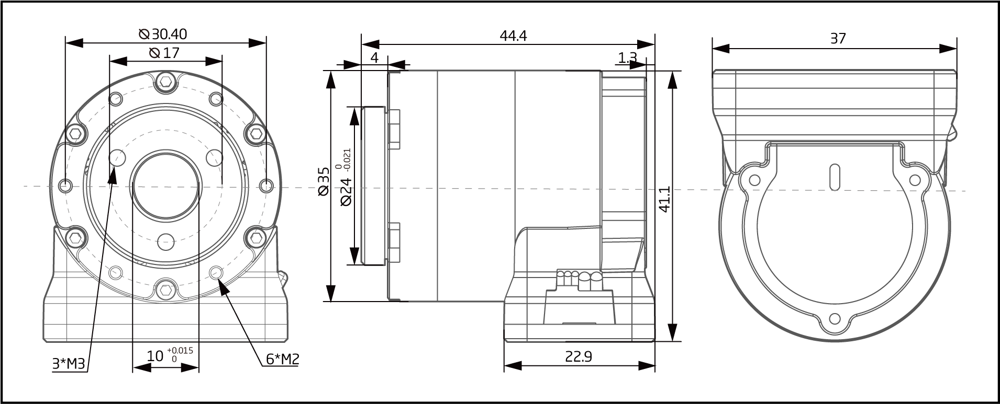

# 参数介绍 
## QDD-2305-36工程参数图[单位：毫米]
 
### 3D 模型
[模型文件]( ../img/Qdd_2305_363D.STEP.zip )

## QDD-2305-36参数

<table class="tableizer-table" style="width:400px">
<thead><tr class="tableizer-firstrow"><th colspan="2" style="background: PaleTurquoise; color: black;">QDD-3510-36参数</th></tr></thead><tbody><tr><td>功率</td><td>36 W</td></tr><tr><td>电机类型</td><td>无刷伺服电机</td></tr><tr><td>额定扭矩</td><td>0.828 Nm</td></tr><tr><td>峰值扭矩</td><td>2.484 Nm</td></tr><tr><td>旋转角度</td><td>> 360.0 °</td></tr><tr><td>温度范围</td><td>-20~+80 °C</td></tr><tr><td>分辨率</td><td>589824（19bit） Step/turn</td></tr><tr><td>精度</td><td>8 Arcmin</td></tr><tr><td>空载转速</td><td>167 RPM</td></tr><tr><td>额定转速</td><td>111 RPM</td></tr><tr><td>减速比</td><td>36:1</td></tr><tr><td>噪声</td><td><= 70 dB(A)</td></tr><tr><td>额定电压</td><td>42 VDC</td></tr><tr><td>电压范围</td><td>24~45 VDC</td></tr><tr><td>额定电流</td><td>0.86 A</td></tr><tr><td>静态工作电流</td><td>0.08 A</td></tr><tr><td>集成电力电子</td><td>yes</td></tr><tr><td>传感器</td><td>多圈绝对式编码器</td></tr><tr><td>通信接口</td><td>CAN</td></tr></tbody></table>

### 接插件型号图
<table class="tableizer-table" style="width:700px">
<thead><tr class="tableizer-firstrow"><th colspan="4" style="background: PaleTurquoise; color: black;">接插件型号图</th></tr></thead><tbody><tr><td>标号</td><td>Signal</td><td>颜色</td><td >端子引脚分布</td></tr><tr><td>1</td><td>PVDD</td><td>黑线</td><td rowspan="9"></td></tr><tr><td>3</td><td>PVDD</td><td>黑线</td></tr><tr><td>5</td><td>PVDD</td><td>黑线</td></tr><tr><td>2</td><td>GND</td><td>黑线</td></tr><tr><td>4</td><td>GND</td><td>黑线</td></tr><tr><td>6</td><td>CAN-GND</td><td>灰线</td></tr><tr><td>7</td><td>CAN-L</td><td>灰线</td></tr><tr><td>8</td><td>CAN-H</td><td>灰线</td></tr></tbody></table>

# 版本变更记录

<table><thead><tr style="background:PaleTurquoise"><th>版本</th><th>更新时间</th><th>更新内容</th></tr></thead><tbody><tr><td>V1.0.0</td><td>2019.04</td><td>第一个版本</td></tr></tbody></table>
