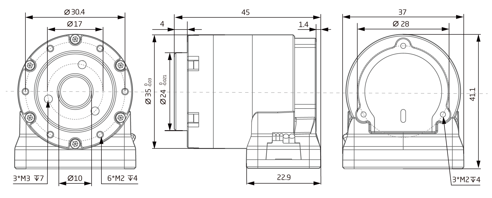

# 参数介绍 
## QDD-EL20-36工程参数图[单位：毫米]
 
### 3D 模型
[模型文件]( ../img/QDD-EL20-36_v2_3.step.zip )

## QDD-EL20-36参数

### 接插件型号图
<table class="tableizer-table" style="width:700px">
<thead><tr class="tableizer-firstrow"><th colspan="4" style="background: PaleTurquoise; color: black;">接插件型号图</th></tr></thead><tbody><tr><td>标号</td><td>Signal</td><td>颜色</td><td >端子引脚分布</td></tr><tr><td>1</td><td>PVDD</td><td>黑线</td><td rowspan="9"></td></tr><tr><td>3</td><td>PVDD</td><td>黑线</td></tr><tr><td>5</td><td>PVDD</td><td>黑线</td></tr><tr><td>2</td><td>GND</td><td>黑线</td></tr><tr><td>4</td><td>GND</td><td>黑线</td></tr><tr><td>6</td><td>CAN-GND</td><td>灰线</td></tr><tr><td>7</td><td>CAN-L</td><td>灰线</td></tr><tr><td>8</td><td>CAN-H</td><td>灰线</td></tr></tbody></table>

## 版本变更记录
**下表简单描述了版本变更记录**

<table style="width:400px"><thead><tr style="background:PaleTurquoise"><th style="width:100px">版本号</th><th style="width:150px">更新时间</th><th style="width:150px">更新内容</th></tr></thead><tbody><tr><td>v2.3.0</td><td>2019.07.18</td><td>内部结构更新</th></tr></thead><tbody><tr><td><a href="http://innfos.com/wiki/cn/index.html#!pages/QDD-EL20-36_v2_2.md">v2.2.0 </a></td><td>2019.05.09</td><td>全文添加</th></tr></thead><tbody><tr><td>v1.0.0</td><td>2019.04.11</td><td>全文添加</td></tbody></table>

