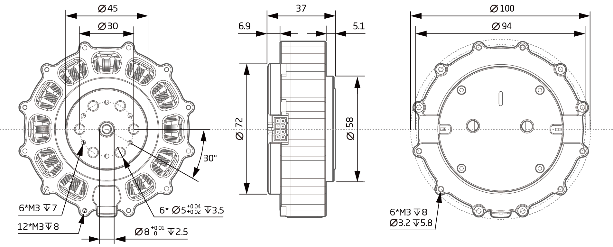

# 参数介绍 
## QDD-NU80-6工程参数图[单位：毫米]
 
### 3D 模型
[模型文件]( ../../3DModel/QDD_NU80-6_v3_3.step.zip )

## QDD-NU80-6参数

<table style="width:650px"><thead><tr><th colspan="4" style="background: PaleTurquoise; color: black;">QDD-NU80-6参数表</th></tr></thead><tbody><tr><td colspan="2"><b>额定电压工作参数</b></td><td colspan="2"><b>基本参数</b></td></tr><tr><td style="width:175px">连续工作功率</td><td style="width:135px">150 W</td><td style="width:130px"  rowspan="2">分辨率</td><td style="width:220px"  rowspan="2">98304(16bit) Step/turn</td></tr><tr><td style="width:175px">短时峰值功率</td><td style="width:135px">400 W</td></tr><tr><td>额定电压</td><td>42 VDC</td><td>编码器</td><td>多圈绝对值式编码器</td></tr><tr><td>空载转速</td><td>366.67 RPM</td><td>通信接口</td><td>隔离式CAN</td></tr><tr><td>额定转速</td><td>250 RPM</td><td>旋转角度</td><td>> 360.0 °</td></tr><tr><td>额定扭矩</td><td>6.6 Nm</td><td>环境温度范围</td><td>-20~+80 °C</td></tr><td>峰值扭矩</td><td>19.8 Nm</td><td>噪声</td><td><= 70 dB(A)</td></tr><tr><td>转矩系数</td><td>0.6 Nm/A</td><td colspan="2"><b>机械参数</b></td></tr><tr><td>相电流满量程</td><td>33 A</td><td style="width:175px">直径</td><td style="width:175px">100mm</td></tr><tr><td>额定母线电流</td><td>12 A</td><td>长度</td><td>37mm</td></tr><tr><td>静态工作母线电流</td><td>0.08 A</td><td>重量</td><td>453.1 g</td></tr> <tr><td colspan="2"><b>基本参数</b></td><td>背隙</td><td>9 Arc min</td></tr><tr><td>电机类型</td><td>无刷伺服电机</td><td rowspan="2">额定静态载荷</td rowspan="2"><td rowspan="2">1270N</td rowspan="2"></tr><tr><td>电压范围</td><td>24~45 VDC</td></tr><tr><td>减速比</td><td>6:1</td><td>版本号</td><td>v3.3</td></tr></tbody></table>

 Note: 编码器计数范围: ±127圈; 电机保护温度可设置范围: 25-120°C; 逆变器保护温度可设置范围: 25-120°C; 功率为电功率 

### 接插件型号图

### 端子引脚功能描述

<table class="tableizer-table" style="width:390px">
 <thead><tr class="tableizer-firstrow"><th colspan="4" style="background: PaleTurquoise; color: black;">端子引脚功能描述</th></tr></thead><tbody><tr><td>标号</td><td>Signal</td><td>颜色</td><td>功能</td></tr><tr><td>1</td><td>PVDD</td><td>黑线</td><td rowspan="3">功率电源正极</td></tr><tr><td>3</td><td>PVDD</td><td>黑线</td></tr><tr><td>5</td><td>PVDD</td><td>黑线</td></tr><tr><td>2</td><td>GND</td><td>黑线</td> <td rowspan="2">功率电源地</td></tr><tr><td>4</td><td>GND</td><td>黑线</td></tr><tr><td>6</td><td>CAN-GND</td><td>灰线</td><td>CAN通讯信号地线</td></tr><tr><td>7</td><td>CAN-L</td><td>灰线</td><td>CAN通讯低位信号线</td></tr><tr><td>8</td><td>CAN-H</td><td>灰线</td><td>CAN通讯高位信号线</td></tr></tbody></table>
 </tbody></table>
## 版本变更记录
**下表简单描述了版本变更记录**

<table style="width:400px"><thead><tr style="background:PaleTurquoise"><th style="width:100px">版本号</th><th style="width:150px">更新时间</th><th style="width:150px">更新内容</th></tr></thead><tbody><tr><td>v3.3.2</td><td>2019.09.27</td><td>改变整体版式</td></tr><tr><td>v3.3.1</td><td>2019.08.09</td><td>添加电机保护温度可设置范围  添加逆变器保护温度可设置范围 </td></tr><tr><td>v3.3.0</td><td>2019.06.30</td><td>全文添加</th></tr></thead><tbody><tr><td><a href="http://wiki.innfos.com/wiki/cn/index.html#!pages/QDD-NU80-6_v3_2.md">v3.2.0 </a></td><td>2019.06.06</td><td>全文添加</th></tr></thead><tbody><tr><td><a href="http://wiki.innfos.com/wiki/cn/index.html#!pages/QDD-NU80-6_v3_1.md">v3.1.0 </a></td><td>2019.05.28</td><td>全文添加</th></tr></thead><tbody><tr><td><a href="http://wiki.innfos.com/wiki/cn/index.html#!pages/QDD-NU80-6_v3_0.md">v3.0.0 </a></td><td>2019.05.22</td><td>全文添加</th></tr></thead><tbody><tr><td><a href="http://wiki.innfos.com/wiki/cn/index.html#!pages/QDD-NU80-6_v2_2.md">v2.2.0 </a></td><td>2019.05.09</td><td>全文添加</th></tr></thead><tbody><tr><td>v1.0.0</td><td>2019.04.11</td><td>全文添加</td></tbody></table>
