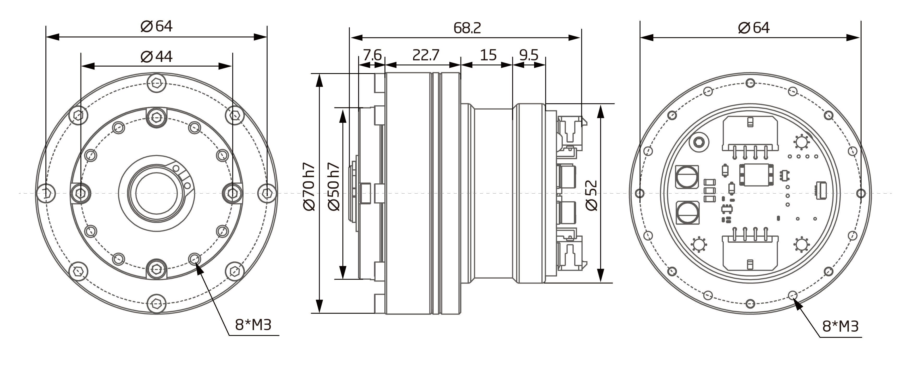
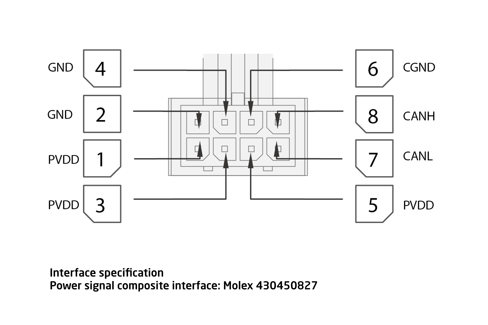

# 参数介绍 
## QDD Pro-3510-100工程参数图[单位：毫米]

### 3D 模型
[3D 模型]

## QDD Pro-3510-100参数

<table class="tableizer-table">
<thead><tr class="tableizer-firstrow"><th colspan="2" style="background: PaleTurquoise; color: black;width:800px">QDD Pro-3510-100参数</th></tr></thead><tbody><tr><td>功率</td><td>200 W</td></tr><tr><td>电机类型</td><td>无刷伺服电机</td></tr><tr><td>额定扭矩</td><td>10.5 Nm</td></tr><tr><td>峰值扭矩</td><td>51 Nm</td></tr><tr><td>旋转角度</td><td>> 360.0 °</td></tr><tr><td>温度范围</td><td>5~55 °C</td></tr><tr><td>分辨率</td><td>1638400（20bit） Step/turn</td></tr><tr><td>精度</td><td>±8 arcsec</td></tr><tr><td>空载转速</td><td>60 RPM</td></tr><tr><td>额定转速</td><td>35 RPM</td></tr><tr><td>减速比</td><td>100:1</td></tr><tr><td>噪声</td><td><= 70 dB(A)</td></tr><tr><td>额定电压</td><td>42 VDC</td></tr><tr><td>电压范围</td><td>24~45 VDC</td></tr><tr><td>额定电流</td><td>4.8 A</td></tr><tr><td>静态工作电流</td><td>0.08 A</td></tr><tr><td>集成电力电子</td><td>yes</td></tr><tr><td>传感器</td><td>多圈绝对式编码器</td></tr><tr><td>通信接口</td><td>CAN</td></tr></tbody></table>

### 接插件型号图
<table class="tableizer-table">
<thead><tr class="tableizer-firstrow"><th colspan="4" style="background: PaleTurquoise; color: black;width:800px">接插件型号图</th></tr></thead><tbody><tr><td>标号</td><td>Signal</td><td>颜色</td><td >端子引脚分布</td></tr><tr><td>1</td><td>PVDD</td><td>黑线</td><td rowspan="9"></td></tr><tr><td>3</td><td>PVDD</td><td>黑线</td></tr><tr><td>5</td><td>PVDD</td><td>黑线</td></tr><tr><td>2</td><td>GND</td><td>黑线</td></tr><tr><td>4</td><td>GND</td><td>黑线</td></tr><tr><td>6</td><td>CAN-GND</td><td>灰线</td></tr><tr><td>7</td><td>CAN-L</td><td>灰线</td></tr><tr><td>8</td><td>CAN-H</td><td>灰线</td></tr></tbody></table>

# 版本变更记录
版本号| 更新时间 | 更新内容
---|---|---
V1.0.0 | 2019.04| 第一版
