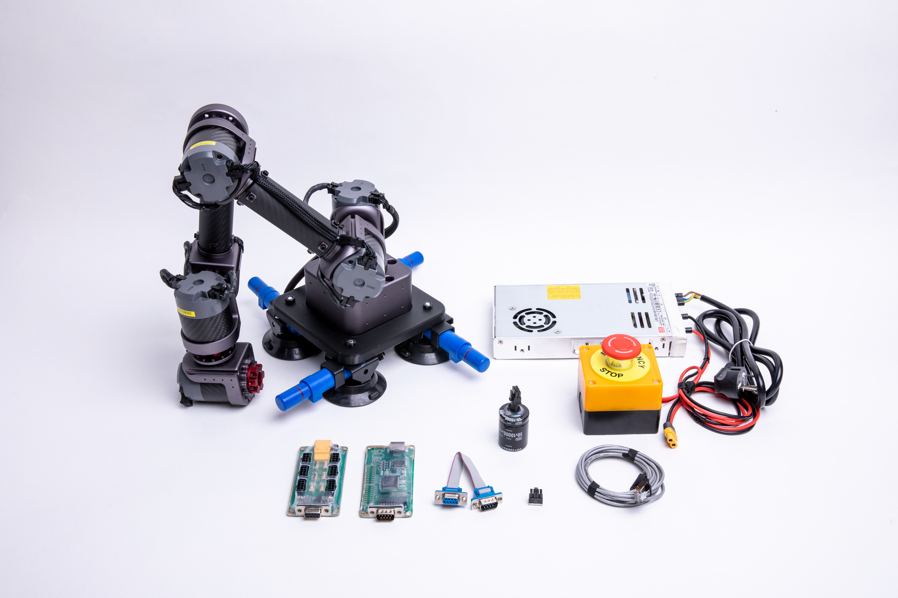
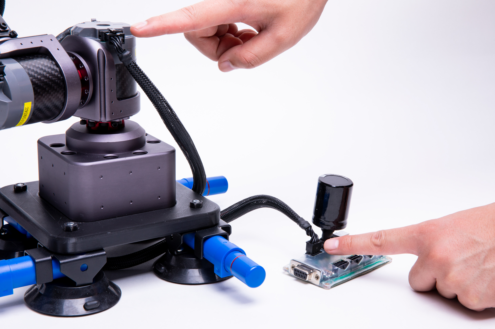
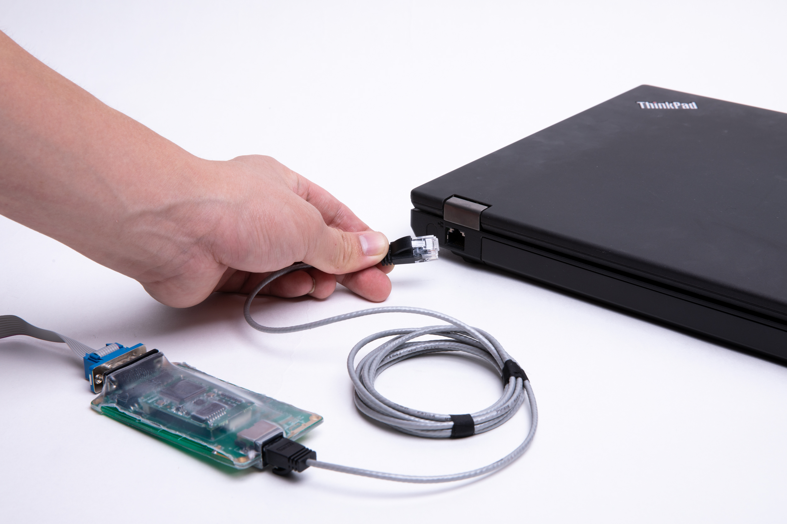
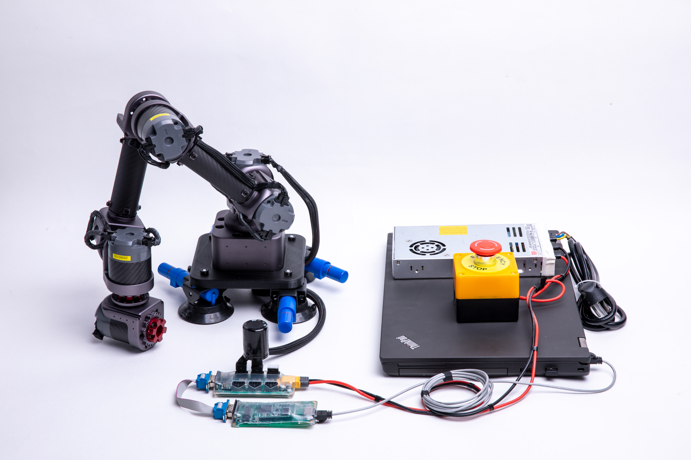

桌面级6轴机械臂安装使用说明书
=====

## 介绍

*   本说明书是针对桌面级6轴机械臂
*   在使用之前请仔细阅读本说明书内容。

## 开箱

## 硬件需求与连接
**硬件需求**

从前到后、从左到右依次为：HUB、ECB、ECB连接线、终端电阻1个、网线、 机械臂、回馈制动电容、急停开关+电源。

**连接电源**

*   连接电源与`HUB`.

Note: 必须先断电然后再插拔部件.  否则可能损坏部件.

**连接ECB**

*   连接`HUB`与`ECB`

 

*   HUB安插回馈制动电容与终端电阻

 

**连接机械臂**

*   用执行器连接线连接`HUB`与执行器

**连接电脑**

*   用网线连接`ECB`与电脑

**连接后整体视图**

**开启电源**

*   开启电源. 执行器的供电电压范围为直流24V-45V.

*   上电以后，执行器LED状态灯会变成黄色闪烁，启动执行器后，LED会变成绿色闪烁，这时就可以与执行器进行通信了。如果执行器内部出现错误，LED灯会变为红色闪烁，请检查执行器错误代码。

## 软件安装与使用

**IAS软件的使用**

* `IAS`(INNFOS Actuator Studio)的为配置机械臂的上位机软件 , 请访问[INNFOS Actuator Studio(IAS)说明](#!pages/INNFOS_Actuator_Studio_IAS_instruction.md).

**运动功能使用**

* 示教-再现功能
  

### 其他

## 版本变更记录

<table><thead><tr style=background:PaleTurquoise><th>版本</th><th>更新时间</th><th>更新内容</th></tr></thead><tbody><tr><td>V1.0.0</td><td>2019.04</td><td>第一个版本</td></tr></tbody></table>

