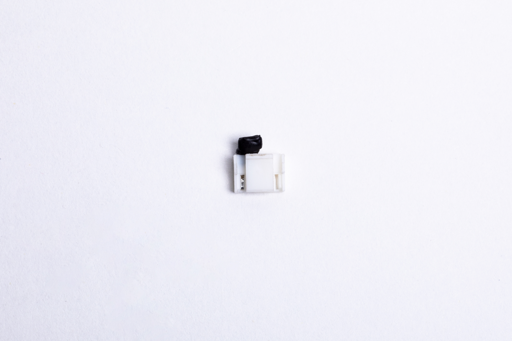
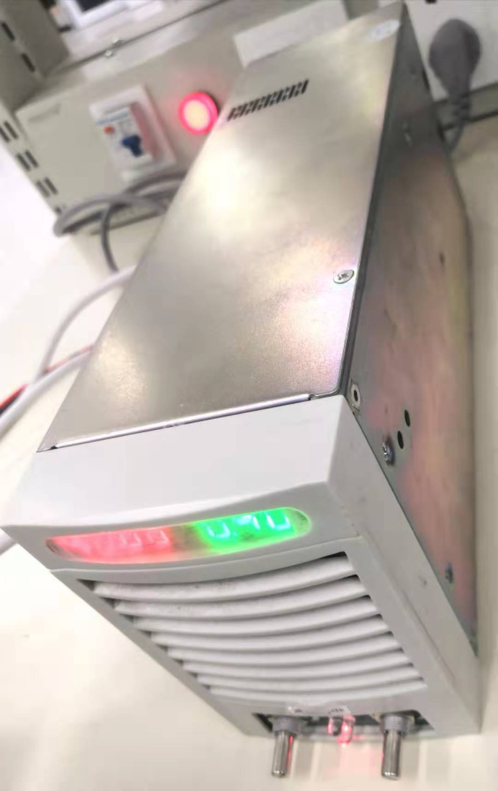
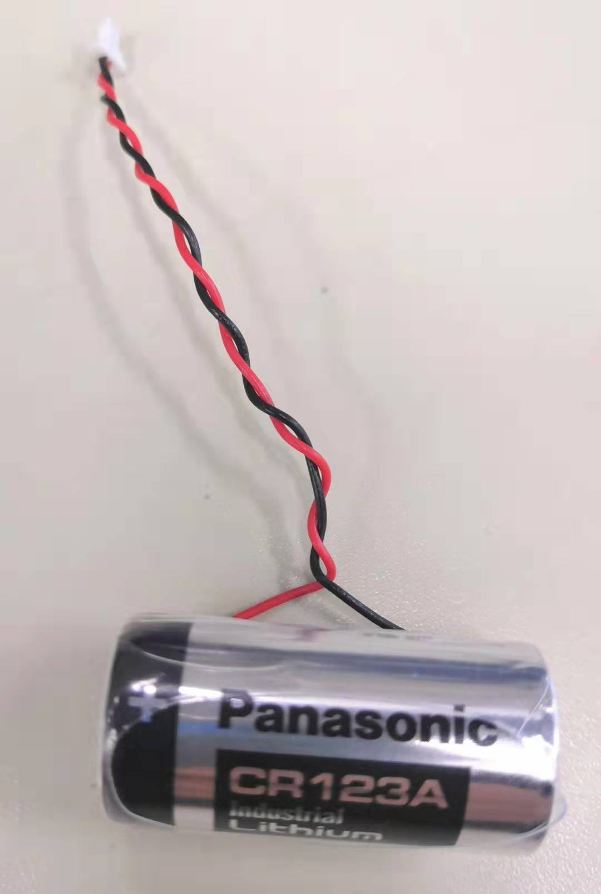
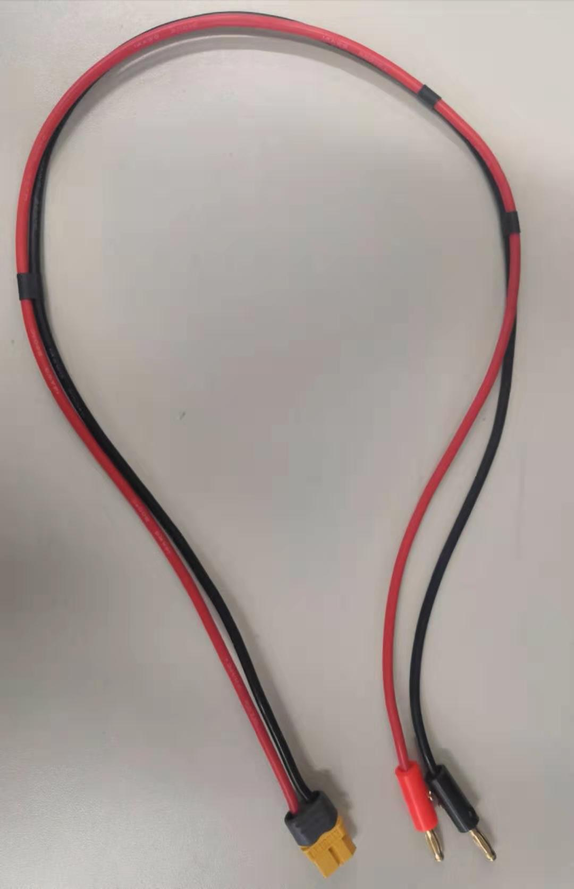

SCA其他配件
=====

## 产品简介
主要包括终端电阻、终端电阻（JST）、执行器综合线缆、EL20系列综合线缆、JST转MOLEX转接线、回馈制动电容、电源、急停开关、多圈计数编码器电池、T型三通转换器（JST）
## 产品信息详情
<table class="tableizer-table" style="width:750px"><thead><tr class="tableizer-firstrow"><th colspan="3" style="background: PaleTurquoise; color: black;">SCA其他配件</th></tr></thead><tbody><tr><td style="width:150px">料号</td><td>产品名称</td><td>图像</td><tr><td>0009-AC-INF</td><td>终端电阻（MOLEX）  适配型号为除EL20系列执行器以外全系列执行器，可以连接在执行器端口和ECB_HUB上使用</td><td rowspan="1"></td></tr><tr><td>0012-AC-INF</td><td>终端电阻（JST）  适配型号为EL20系列执行器，可以连接T型三通转换器（JST）上使用。</td></td><td rowspan="1"></td></tr><tr><td>0008-AC-INF</td><td>执行器综合线缆 INNFOS SCA Cable（MOLEX）  用于HUB与SCA、SCA与SCA之间的连接。</td><td rowspan="1"></td></tr><tr><td>0013-AC-INF</td><td>EL20系列综合线缆（JST） 用于连接T型三通转换器（JST），实现EL20系列执行器的串联使用。EL20系列执行器的选配件。</td><td rowspan="1"></td></tr> <tr><td>0014-AC-INF</td><td>JST转MOLEX转接线  用于连接HUB与T型三通转换器（JST）、T型三通转换器（JST）与非EL20系列SCA的连接，EL20系列执行器的选配件。</td><td rowspan="1"></td></tr> <tr><td>0010-AC-INF</td><td>回馈制动电容  执行器母线上并联大容量的制动电容，其目的是吸收电机制动过程中的波峰电压，同时，制动电容由于其容量较大还可以提供峰值电流给SCA。 回馈制动电容插接在HUB上使用。</td><td rowspan="1"></td></tr><tr><td>0002-AC-INF</td><td>350W 工业开关电源  LRS-350-48 电源是一款350W单组输出封闭型电源供应器，采用115VAC或230VAC输入，DC电压输出可调范围43.2 ~ 52.8V，额定输出电流7.3A，输出侧具备急停开关，可以保证紧急情况下的安全急停。内置长寿命风扇满负载工作于-25℃-70℃。具有极低的功耗。 接口说明：（图示），接头接插在HUB上。</td><td rowspan="1"></td></tr><tr><td>0015-AC-INF</td><td>150W 电源适配器 采用220VAC输入，DC36V输出，输出电流4A，具有过压、过流、短路、过温等先进安全防护，可防止不定天气因素或非人为意外对设备的伤害。输出侧具备急停开关，可以保证紧急情况下的安全急停。 接口说明：（图示），接头接插在HUB上。</td><td rowspan="1"></td></tr><tr><td>0016-AC-INF</td><td>2400W可调直流电源 此电源满足110 VAC/120 VAC/127 VAC电网制式供电时，系统额定直流输出为48V/30A。在220VAC电网制式供电时，系统额定直流输出为48 V/50A。(48V为电压绝对值，电压极性由接法决定。)</td><td rowspan="1"></td></tr><tr><td>0017-AC-INF</td><td>多圈计数编码器电池（CR2032） 多圈计数编码器电池（CR2032）为纽扣电池，电池容量为225 mAh，连接在T型三通转换器（JST）上为EL20系列执行器的编码器进行供电。</td><td rowspan="1"></td></tr><tr><td>0018-AC-INF</td><td>多圈计数编码器电池（CR123A） 多圈计数编码器电池（CR123A）为普通电池，电池容量为1300mAh，连接在T型三通转换器（JST）上为EL20系列执行器的编码器进行供电。</td><td rowspan="1"></td></tr><tr><td>0003-AC-INF</td><td>电源线（香蕉头转XT60） 用于连接电源给HUB供电，公头一端连接在HUB上。</td><td rowspan="1"></td></tr><tr><td>0019-AC-INF</td><td>T型三通转换器（JST） 用于连接EL20系列执行器、JST转MOLEX转接线 、EL20系列综合线缆（JST）、终端电阻（JST）和编码器电池。</td><td rowspan="1"></td></tr> </tbody></table>

## 终端电阻：
高频信号或长线传输时，信号波长相对传输线较短，信号在传输线终端会形成反射波，干扰原信号，所以需要在传输线末端加终端电阻，使信号到达传输线末端后不反射。对于低频信号或线缆较短时则不用。CAN总线两端必须连接终端电阻才可以正常工作，终端电阻应该与通讯电缆的阻抗相同，典型值为120欧姆。其作用是匹配总线阻抗，提高数据通信的抗干扰性及可靠性。
CAN是多主传输，为了消除短路现象，其CANH和CANL电平性质是不一样的，如CANH的两种逻辑状态为高电平和高阻态，CANL的两种逻辑状态为低电平和高阻，高阻状态其实电平是不确定的，因此在差分传输的CAN总线中，匹配电阻不仅作为匹配用还起到降低CANH和CANL回路中阻抗的作用，使CANH和CAL具有确定的电平，所以需要在CAN两端加匹配电阻。

## 综合线缆:
SCA执行器综合线缆为INNFOS专为SCA研发的一款线缆，连接HUB与SCA，其中包含了为SCA供电的功率电源线缆和CAN总线。硅胶线保证电流传输，耐折弯、耐高温。两芯超软双绞屏蔽线，保证信号传输，外加阻燃编织网保证线缆耐磨。

## 多圈计数编码器电池:
编码器电池是在执行器掉电的情况下，可以记录执行器的位置，以保证在外因的作用下产生位移后掉电位置可以记录。正常上电工作时，因为系统的电压稍高于电池电压，电池截止输出，也就是保存电池寿命。只有在系统断电时给编码器供电，保持当前编码器数据。INNFOS执行器只有EL20系列的执行器编码器外置，其余型号编码器皆为内置。
多圈计数编码器电池（CR2032）适用于单台EL20系列执行器使用，多台EL20系列执行器串联使用选用多圈计数编码器电池（CR123A）。

### 2400W 可调直流电源参数
<table class="tableizer-table" style="width:847px"><thead><tr class="tableizer-firstrow"><th colspan="4" style="background: PaleTurquoise; color: black;">2400W 可调直流电源参数</th></tr></thead><tbody><tr><td>2400W可调直流电源尺寸</td><td>长318*宽134*高87mm</td><td>净重</td><td>3.8KG</td></tr><tr><td>输入电压范围</td><td>AC100-240V</td><td>浪涌电流</td><td><30A</td></tr><tr><td>额定电压</td><td>230V,AC</td><td>低压功率</td><td>100VAC输入时输出功率1440W</td><tr><td>最大输入电流</td><td>18A</td><td>可调输出电压范围</td><td>0-60V</td></tr><tr><td>频率</td><td>45-65HZ</td><td>可调输出电流范围</td><td>0-40A</td></tr><tr><td>功率因数</td><td>>0.99（满载情况下）</td><td>输出纹波</td><td>最大与最小电压≤100mV</td></tr><tr><td>AC110V电压输入时输出电流</td><td>0-60V=24A</td><td>电压调整率</td><td>≤0.1%，±6mV</td></tr><tr><td>电流调整率</td><td>≤0.6%，±20mA</td><td>负载调整率</td><td>电流≥18A时，电压不超±1V， 电流≤10A时电压不超±0.5V</td></tr>  <tr><td>空耗</td><td>≤90W(满高端输出电压状态）</td><td>耐压</td><td>1.8KV,AC,50Hz</td></tr>    <tr><td>泄露电流</td><td>≤3mA,1.8K V/5S </td><td>绝缘电阻</td><td>≥5MΩ，DC500V/5S</td></tr>    <tr><td>湿度</td> <td><b>≤80%</td><td>存储温度</td><td>-30~70℃ </td></tr></tbody></table>

## 版本变更记录
**下表简单描述了版本变更记录**

<table style="width:400px"><thead><tr style="background:PaleTurquoise"><th style="width:100px">版本号</th><th style="width:150px">更新时间</th><th style="width:150px">更新内容</th></tr></thead><tbody><tr><td>V1.0.3</td><td>2019.11</td><td>修改了配图和内文</td></tr><tr><td>V1.0.2</td><td>2019.09</td><td>增加表格与内文</td></tr>
  <tr><td>V1.0.1</td><td>2019.09</td><td>增加EL20配件</td></tr><tr><td>V1.0.0</td><td>2019.04</td><td>第一个版本</td></tbody></table>
