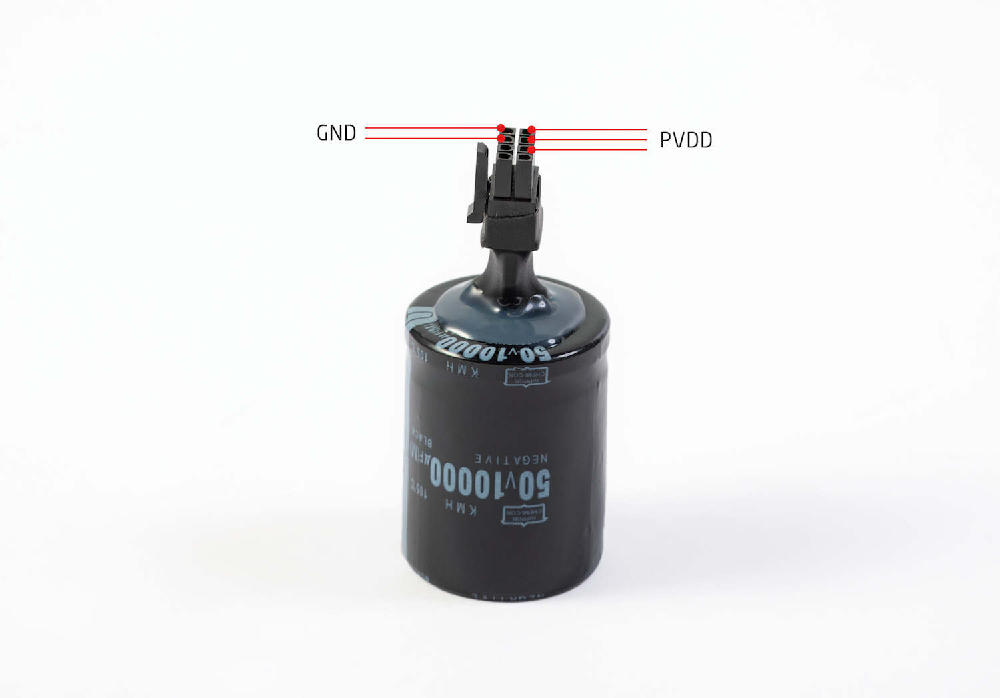
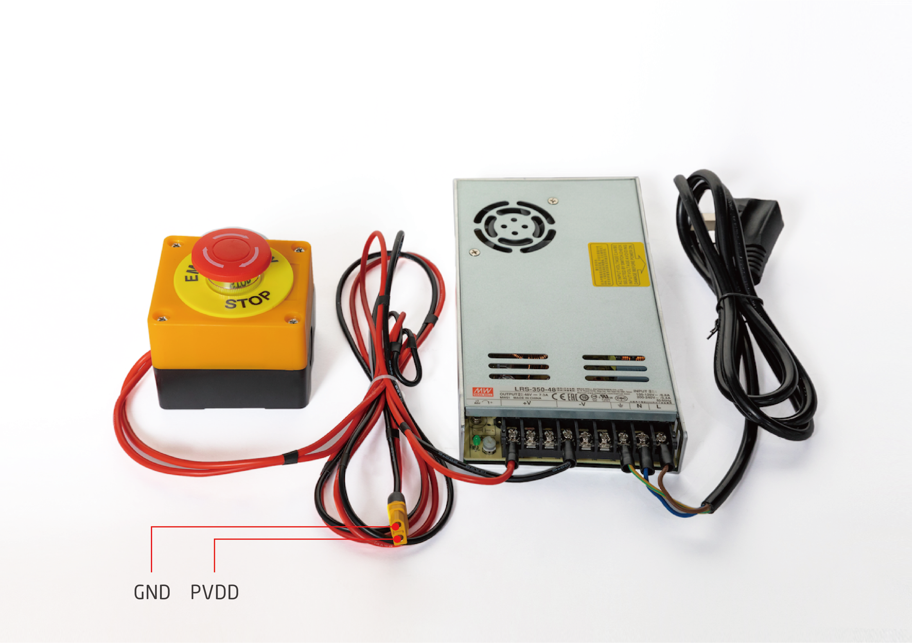
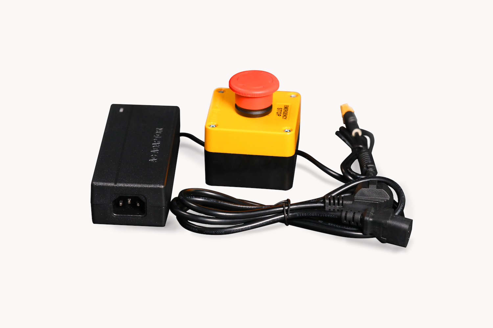
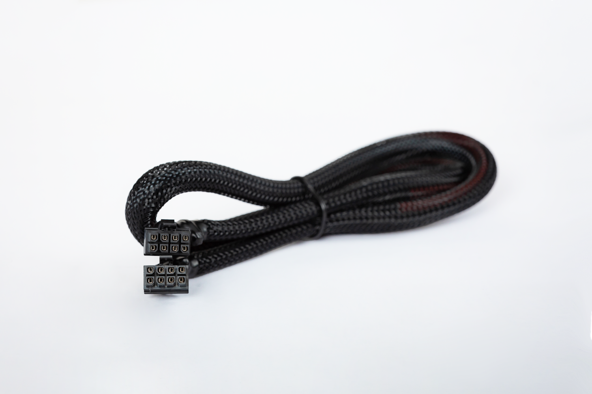

# SCA其他配件
主要包括终端电阻、回馈制动、电源、急停开关和执行器综合线缆。
  

## 终端电阻：
高频信号或长线传输时，信号波长相对传输线较短，信号在传输线终端会形成反射波，干扰原信号，所以需要在传输线末端加终端电阻，使信号到达传输线末端后不反射。对于低频信号或线缆较短时则不用。CAN总线两端必须连接终端电阻才可以正常工作，终端电阻应该与通讯电缆的阻抗相同，典型值为120欧姆。其作用是匹配总线阻抗，提高数据通信的抗干扰性及可靠性。

## 回馈制动电容：
执行器母线上并联大容量的制动电容，其目的是吸收电机制过程中的波峰电压，同时，制动电容由于其容量较大还可以提供峰值电流给SCA。

## 电源
### 350W 工业开关电源 
LRS-350-48 电源是一款350W单组输出封闭型电源供应器，采用115VAC或230VAC输入，DC电压输出可调范围43.2 ~ 52.8V，额定输出电流7.3A，输出侧具备急停开关，可以保证紧急情况下的安全急停。内置长寿命风扇满负载工作于-25℃-70℃。具有极低的功耗。
接口说明：(XT60接头，图示)

### 150W 电源适配器
150W电源适配器采用220VAC输入，DC36V输出，输出电流4A，具有过压、过流、短路、过温等先进安全防护，可防止不定天气因素或非人为意外对设备的伤害。输出侧具备急停开关，可以保证紧急情况下的安全急停。
接口说明：（图示）

## 执行器综合线缆
SCA执行器综合线缆为INNFOS专为SCA研发的一款线缆，连接HUB与SCA，其中包含了为SCA供电的功率电源线缆和CAN总线。硅胶线保证电流传输，耐折弯、耐高温。两芯超软双绞屏蔽线，保证信号传输，外加阻燃编织网保证线缆耐磨。
接口说明：（图示）

## 版本变更记录
**下表简单描述了版本变更记录**

<table style="width:600px"><thead><tr style="background:PaleTurquoise"><th style="width:80px">版本号</th><th style="width:100px">更新时间</th><th style="width:100px">更改类型</th><th style="width:80px">位置</th><th>更新内容</th></tr></thead><tbody><tr><td>V1.0.0</td><td>2019.07.30</td><td>添加</td><td>ECB & HUB</td><td>SCA其他配件</td></tbody></table>

