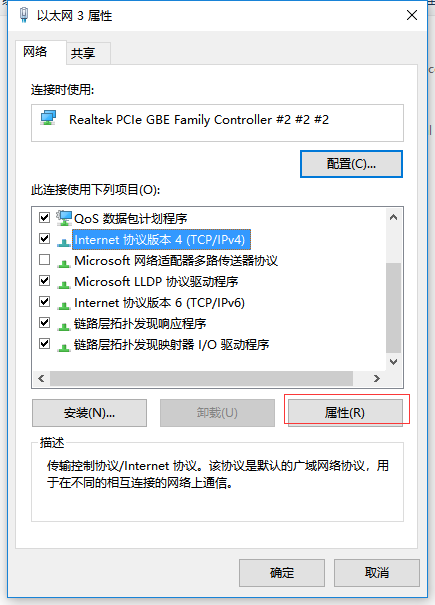

## 附录A:

开机后鼠标选中红色区域，可更改当前执行器ID编号,更改后，进入下图A-1界面后，点击Download保存更改参数。 

* 图A-1

* * *

## 附录B:INNFOS执行器使用注意事项

*   INNFOS执行器内部有低功耗电路设计，内部有一块纽扣电池为其供电，此低功耗电路可实现多圈计数功能，即当执行器关机后，改变执行器的当前位置，下次开机执行器的当前位置会相对变化，此电池使用寿命预计为8个月，若电池没电，可以寄回免费更换电池。（注：此功能为测试版本，使用时可能会出现多圈错误情况，所以每次上电后，应先观察执行器的当前位置，如果当前位置与之前设定相差较大，应激活Homing模式，重新设置零位，具体操作见上文中如何使用homing模式说明，避免误操作损伤机械结构）
*   新版执行器使用时，Homing模式中的Limit限制无论开启与否，左右极限都对位置模式起作用，对速度模式与电流模式来说，则是仅开启有效，不开启无效，例如，当前Max Pos设置值为10，Min Pos设置值为-10，则位置模式使用时，只能在此区间内运动，当发的指令超过此限制区间时，执行器会转到限位边界处，不在转动，例如当前位置为0，发送大于10的指令，电机会停在位置为10处，发送小于-10时，电机会停在位置为-10处，如果当前位置在限位范围外，例如20，设置限位内的位置，电机会停到设置的指定位置，发送电机限位外的位置指令时，无论多少，电机都会转到限位边界处，例如发送21，电机会转到位置10处。而对于速度与电流模式来说，则需要开启Limit限制，此限制才会生效，不开启不生效。
*   新版执行器对Position模式做出了限制，当所发指令阶跃变化超过1时，执行器不响应，并提示0x0200错误，以避免发生大阶跃损伤机械结构。
*   软件限位和机械限位的区别：机械限位是物理限位，是机械结构可以实际动作的上下限范围。软件限位是虚拟限位，是在上位机中设置的运动上下限范围。软件限位的范围应小于等于机械限位的范围。
*   在调节PI参数时要从电流模式开始依次调节，每一个环节的PI都需要调节。例如在调试速度环模式时，要先调试电流环的PI值，当速度环参数正常后才能继续调试位置环模式。
*   数值单位说明：

R: Revolutions，转数，1R=1转=360°，表示执行器的位置。

RPM：Revolutions Per Minute，每分钟的转数，表示执行器的转速。

RPM/s: 对转速的一阶时间导数，即加速度，表示执行器转速变化的快慢。

RPM/s^2: 对加速度的一阶时间导数，即加加速度（急动度），表示执行器加速度的变化快慢。

*   ip地址配置，打开控制面板，选择网络和Internet,再选择网络和共享中心，再选择更改适配器设置，右键单击以太网，选择属性,选择TCP/IPv4,然后选择属性，其中ip地址中的192.168.1.119中的119可以替换成100~200之间的任意整数，网关可设为192.168.1.1，DNS无需填写，配置完成点击确定。配置如下图：

*   图B-1

## 附录C：示波器详细使用说明

*   **Prescalar**：执行器内部采样频率为20K，采样周期为0.05ms（意义，每隔0.05ms采集一个数值）。Prescalar为前置分频数值，是将内部采样频率进行再分频，示波器显示的采样频率为20K/Prescalar。例如，若Prescalar为1，则采样频率不变，周期不变。若Prescalar为10，采样周期变为2K，每隔0.5ms（0.05ms*Prescalar）采集一个点，则在示波器中能看到的波形范围会变宽，波形刷新的频率也会变慢。相反的，若Prescalar减小，则示波器中能看到的波形范围越窄，波形局部会被放大，波形刷新频率会变快。
*   **Trig_value**:示波器的触发数值的使用：只有当波形的值由下往上穿越触发值的时候，波形才会被显示。如触发值为100，则只有当波形的数值穿越100时才会被显示出来，如从80到120穿过100，则可以触发显示。若从100到120则不会被触发。（若有需要可设为99.9999）
*   **Offset**:上下移动波形，只能在Y轴的方向上对波形进行上下平移，做对比用。
*   **Scalar**:放大倍数，放大或者缩小图形的幅值时使用。示波器的Y轴范围为-1~1，当鼠标停留在波形的某个点上时，会显示出当前点的坐标位置，Y轴的坐标乘以放大倍数即为当前点的幅值大小。即幅值 A=Y*Scalar。
*   **使用提示**：在使用示波器时，先设置好tirg_value和prescalar，等待出现波形时，可以先点击auto让软件自动找到一个offset和scalar的数值，然后再进行手动调节。每次更改完参数后，需要按下回车或切换输入框才能生效。

*   图C-1

## 附录D：位置环S曲线模式原理详解

*   在实际的应用中，执行器带动机械结构运动的时候往往需要起落平缓，快慢有序的进行。若执行器瞬间到达指定位置，则强大的转动惯量会对机械结构造成一定的冲击，所以S曲线-位置模式的作用就是让执行器每一个转动的过程都能平稳的进行。这也就是要求在执行器加减速的时候，速度有一个由低到高或由高到低逐渐变化的过程，以保证整个机械运动能够平稳的进行。
*   下面介绍两个调整S曲线-位置模式的参数，加速度Accelerate和减速度Decelerate。加速度Accelerate即反应的是速度由低到高增加时的变化快慢，Accelerate的值越大，速度增加的就越快；减速度Decelerate即反应的是速度由高到底减少时的变化快慢。Decelerate的值越大，速度减少的就越快。反而反之。Max对应的参数是最大转速，当速度增加到最大值后还没有到达指定位置，则速度不再增加，加速度为0。
*   以图形为例讲解这个两个参数的作用：为了方便分析图像，我们假设执行器当前位置为0 R，发送指令让其转动至20 R，最大速度设为1 RPM，加速度和减速度均设为0.1 RPM/S。此处的参数值设定仅仅为了理论分析，参数值要根据实际情况进行设定。

* 图D-1

*   上图所示三个波形分别为S曲线模式的位置，速度，加速度与时间的函数图，对位置求一阶导数即为速度，反应物体运动的快慢；在对速度求一阶导数即为加速度，反应物体速度变化的快慢与方向。不难看出，上述图像均被以时间单位分为三个区域。0-10为加速区域；10-20为匀速区域；20-30为减速区域。
*   当执行器按照S曲线模式运行时的图像如上图“位置-时间”所示，可以看到位置的变化是有一个平缓的过程的，根据参数设定的不同，曲线的形状也会相应改变。可以看到在加速区域中，位置量增加迅速，速度呈线性增长，加速度为常量；匀速区域中，位置量呈线性增长，速度值为常量，加速度为0；减速区域中，位置量增加缓慢，速度呈线性减少，加速度为常量。
*   此处若增加Accelerate的值，速度曲线中左边部分的斜率会变大，速度增加变快，相应的加速路程也会变小，位置曲线的加速区域会变陡；若增加Decelerate的值，速度曲线中减速区域的斜率会变大，速度减少变快，相应的减速路程也会变小，位置曲线的减速区域会变陡。这里根据实际需要自行调整即可。
*   需要说明的是，S-位置模式中的MAX参数即为转动速度的最大值，若MAX的值设定较大，则速度模式中可能不会出现匀速区域，加速度不会为0，位置曲线中也不会出现直线部分。这是由于速度上限值较高，执行器在到达指定位置的时候速度还没到达最大值，随即就要进行减速，所以没有匀速的过程。

## 版本变更记录

下表简单描述了版本变更记录

<table><thead><tr style="background:PaleTurquois"><th>版本号</th><th>更新时间</th><th>更新内容</th></tr></thead><tbody><tr><td>V1.0.2</td><td>18.12.07</td><td>增加了示波器和S曲线模式的使用说明</td></tr><tr><td>V1.0.1</td><td>18.04.28</td><td>全文更新配图</td></tr><tr><td rowspan=4>V1.0.0</td><td>18.03.14</td><td>更新了全章节的配图</td></tr><tr><td>18.03.12</td><td>修改了开机错误提示，更新了3.1章节3.2章节的部分配图</td></tr><tr><td>18.01.15</td><td>增加了如何修改执行器编号</td></tr><tr><td>18.01.04</td><td>添加了开机按钮</td></tr></tbody></table>
