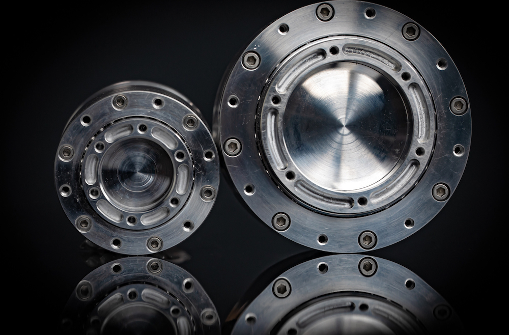

# 概述

INNFOS提供模块化机器人构建块，使您可以快速构建和编程自定义机器人系统。我们提供智能柔性执行器Smart Compliant Actuator（简称SCA），数字和模拟接口板以及将这些组件连接在一起的机械和电气硬件（另请参阅<a href="#!pages#硬件配置.md" class="active">硬件配置</a >）。与硬件同样重要的是，INNFOS还提供软件工具和API来编程和控制从这些物理组件创建的机器人系统（有关详细信息，请参阅<a href="#!index.md#软件开发" class="active">软件开发</a >），建议使用由INNFOS 开发的 INNFOS Actuator Studio（IAS）对 SCA进行快速安全的调试。

## INNFOS SCA

INNFOS SCA（Smart Compliant Actuator）是一种智能，高度集成和先进的伺服系统，可进行灵活和安全的控制。它高度集成了伺服电机，伺服驱动器，减速器和编码器的核心部件。在相同性能下，其体积仅为传统伺服系统的十分之一。与传统的机器人驱动相比，SCA是一项革命性的突破。它有效地解决了各类机器人多关节连接的结构问题，保证了服务机器人的联合控制和安全使用。这使得服务机器人能够与人类一起工作和生活，这为第四次工业革命和即将到来的智能机器人时代提供了重要的核心技术。

## 应用领域

INNFOS SCA包括使用谐波减速器的QDD Pro，使用行星减速器的QDD和不带减速器的DD。SCA可应用于多个场景，最小型号的SCA可应用于云台、无人机等，最大型号的SCA可应用于机器人、机械臂等。市场上常见的比如电动工具、CNC、3D打印机、AGV等，SCA都可以应用于此。

# 版本变更记录
**下表简单描述了版本变更记录**

<table style="width:600px"><thead><tr style="background:PaleTurquoise"><th style="width:80px">版本号</th><th style="width:100px">更新时间</th><th style="width:100px">更改类型</th><th style="width:80px">位置</th><th>更新内容</th></tr></thead><tbody><tr><td>V1.0.0</td><td>2019.05.24</td><td>修改</td><td>基本简介</td><td>图片替换</td><tr><td>V1.0.0</td><td>2019.04.28</td><td>添加</td><td>基本简介</td><td>全文添加</td></tbody></table>
