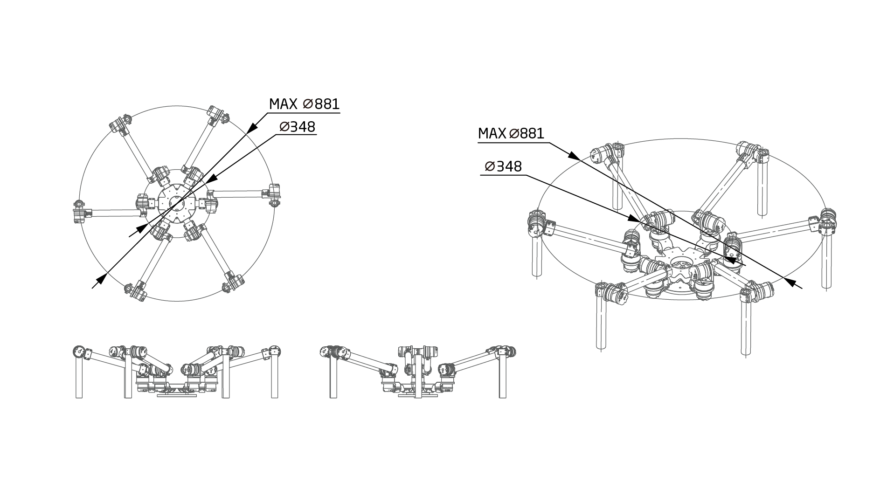

六足机器人安装使用说明书
=====

## 介绍

*   本说明书是针对六足机器人的使用说明。
*   在使用之前请仔细阅读本说明书内容。

 蜘蛛仿生机器人，共18个自由度，其单足长570mm，预估额定负载2kg。
其关节均采用QDD Lite系列执行器搭建，行走地形复杂，力量强大，单足或者双足可抬起作为简易手臂使用，主要应用于研发领域，实验室、研究所、极客爱好者等。
 SCA型号：[QDD Lite-NE30](QDDLite-NE30-36_v1_8.md)

在自然界和人类社会中存在一些人类无法到达的地方和可能危及人类生命的特殊场合。如行星表面、灾难发生矿井、防灾救援和反恐斗争等，对这些危险环境进行不断地探索和研究，寻求一条解决问题的可行途径成为科学技术发展和人类社会进步的需要。地形不规则和崎岖不平是这些环境的共同特点。

                                                                          

## 工程参数图
 [单位：毫米]

Note： 下图为单足工程参数图

### 3D模型
[模型文件]( ../img/六足机器人_v1_0.step.zip )

## 基本参数

<table style="width:500px"><thead><tr><th colspan="2" style="background: PaleTurquoise; color: black;">六足机器人参数</th></tr></thead><tbody></tr><tr><td>末端负载</td><td>      </td></tr>
<tr><td>自重</td><td>       </td></tr><tr><td>自由度</td><td>           </td></tr><tr><td>工作半径</td><td>        </td></tr><tr><td>关节范围</td><td>       </td></tr><tr><td>工具最大速度</td><td>      </td></tr><tr><td>重复定位精度</td><td>      </td></tr><tr><td>供电电压</td><td>        </td></tr><tr><td>功耗</td><td>        </td></tr><tr><td>结构件材料</td><td>     </td></tr><tr><td>工作环境温度</td><td>     </td></tr><tr><td>工作环境湿度</td><td>    </td></tr><tr><td>防护等级</td><td>     </td></tr><tr><td>通信端口</td><td>     </td></tr><tr><td>示教器</td><td>       </td></tr></td></tbody></table>

## 产品实拍效果图

## 硬件需求与连接

**硬件需求**

从前到后、从左到右依次为：六足机器人、插好终端电阻和回馈制动电容的ECB+HUB、急停开关+电源、电脑。

**连接ECB**

**连接电源**

*   连接电源与`ECB+HUB`

**连接执行器及其配件**

*   连接`执行器综合线缆`

**连接机械臂**

*   用执行器连接线连接`HUB`与执行器

**连接电脑**

*   用网线连接`ECB`与电脑

**连接后整体视图**

**开启电源**

*   开启电源. 执行器的供电电压范围为直流24V-45V.

*   上电以后，执行器LED状态灯会变成黄色闪烁，启动执行器后，LED会变成绿色闪烁，这时就可以与执行器进行通信了。如果执行器内部出现错误，LED灯会变为红色闪烁，请检查执行器错误代码。

## 软件安装与使用

**IAS软件的使用**

* `IAS`(INNFOS Actuator Studio)的为配置机械臂的上位机软件 , 请访问[INNFOS Actuator Studio(IAS)说明](#!pages/INNFOS_Actuator_Studio_IAS_instruction.md).

**运动功能使用**

* 示教-再现功能
  

### 下载安装

### 注意事项
在机械臂停止的状态下，在断电之前，请用手托住机械臂并执行mode0关闭电机使能。

## 版本变更记录
**下表简单描述了版本变更记录**

<table style="width:400px"><thead><tr style="background:PaleTurquoise"><th style="width:100px">版本号</th><th style="width:150px">更新时间</th><th style="width:150px">更新内容</th></tr></thead><tbody><tr><td>v1.0.0</td><td>2019.09.12</td><td>全文添加</td></tbody></table>

