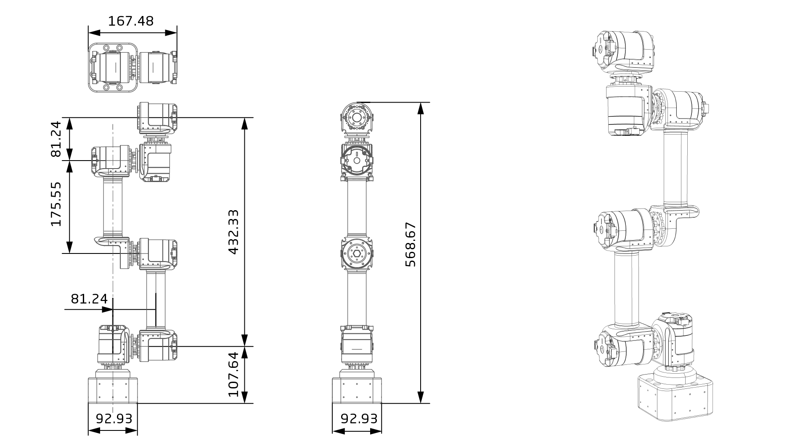

# 参数介绍 
## 桌面级6轴机械臂（QDD Lite-NE30-36版）工程参数图[单位：毫米]
 
### 3D 模型
[模型文件]( ../img/桌面级6轴机械臂（QDD Lite-NE30-36版）_v1_0.step.zip )

## 桌面级6轴机械臂（QDD Lite-NE30-36版）参数

<table style="width:700px"><thead><tr><th colspan="2" style="background: PaleTurquoise; color: black;">桌面级6轴机械臂（QDD Lite-NE30-36版）参数</th></tr></thead><tbody>
<tr><td>末端负载</td><td>500 g</td><td>自重</td><td>3.7kg（带底座）；2.5kg（不带底座）</td></tr><tr><td>自由度</td><td>6</td><td>工作半径</td><td>421mm</td></tr><tr><td>关节范围</td><td>‘+/-170°</td><td>工具最大速度</td><td>54 g</td></tr><tr><td>2m/s</td><td>重复定位精度</td><td>‘+/-0.1mm</td><td>供电电压</td></tr><tr><td>42v</td><td>功耗</td><td>普通功耗约120w</td><td>结构件材料/td></tr><tr><td>铝合金/碳纤维管</td><td>0.069 Nm</td><td>工作环境温度</td><td> 10-50°</td></tr><tr><td>工作环境湿度</td><td>5%~95%</td><td><b>防护等级</b></td></tr><tr><td>IP54</td><td>2A</td><td>通信端口</td></tr><tr><td>CAN/以太网</td><td>0.86 A</td></tr><tr><td>示教器</td><td>0.08 A</td></tr><tr><td><b>电脑或者移动终端</b></td></tr></tbody></table>

## 版本变更记录
**下表简单描述了版本变更记录**

<table style="width:400px"><thead><tr style="background:PaleTurquoise"><th style="width:100px">版本号</th><th style="width:150px">更新时间</th><th style="width:150px">更新内容</th></tr></thead><tbody><tr><td>v2.2.0</td><td>2019.05.09</td><td>全文添加</th></tr></thead><tbody><tr><td>v1.0.0</td><td>2019.04.11</td><td>全文添加</td></tbody></table>

