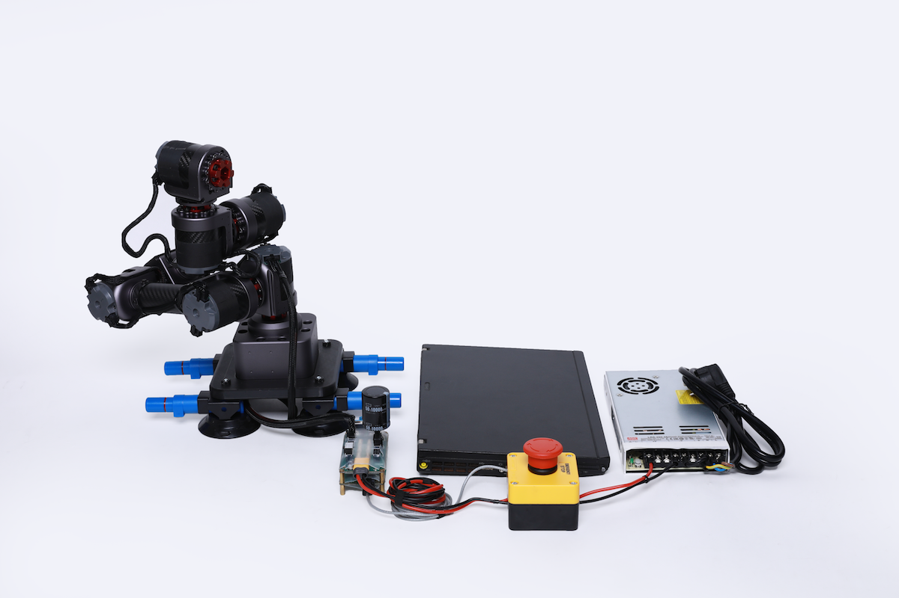

桌面级6轴机械臂安装使用说明书
=====

## 介绍

*   本说明书是针对桌面级6轴机械臂的使用说明。
*   在使用之前请仔细阅读本说明书内容。

 所有关节采用QDD Lite系列执行器搭建。其臂长活动范围最大430mm，末端负载500g。因QDD Lite系列执行器采用了复合材料，大大降低了高端机器人本机研发成本，主要应用于教育领域，学校、实验室、研究所、竞赛等。
                                                                          
                                                                          

## 桌面级六轴Lite版机械臂（6*NE30）工程参数图
 [单位：毫米]

### 3D 模型
[模型文件]( ../img/桌面级6轴机械臂（QDD Lite-NE30-36版）_v1_0.step.zip )

## 桌面级六轴Lite版机械臂（6*NE30）参数

<table style="width:500px"><thead><tr><th colspan="2" style="background: PaleTurquoise; color: black;">桌面级六轴Lite版机械臂（6*NE30）参数</th></tr></thead><tbody></tr><tr><td>末端负载</td><td>500g</td></tr>
<tr><td>自重</td><td>3.7kg（带底座）；2.5kg（不带底座）</td></tr><tr><td>自由度</td><td>6</td></tr><tr><td>工作半径</td><td>421mm</td></tr><tr><td>关节范围</td><td>+/-170°</td></tr><tr><td>工具最大速度</td><td>2m/s</td></tr><tr><td>重复定位精度</td><td>+/-0.1mm</td></tr><tr><td>供电电压</td><td>42v</td></tr><tr><td>功耗</td><td>普通功耗约120w</td></tr><tr><td>结构件材料</td><td>铝合金/碳纤维管</td></tr><tr><td>工作环境温度</td><td>10-50°</td></tr><tr><td>工作环境湿度</td><td>5%~95%</td></tr><tr><td>防护等级</td><td>IP54</td></tr><tr><td>通信端口</td><td>通信端口</td></tr><tr><td>示教器</td><td>电脑或者移动终端</td></tr></td></tbody></table>

## 桌面级六轴Lite版机械臂（6*NE30）产品实拍效果图

## 硬件需求与连接

**硬件需求**

从前到后、从左到右依次为：HUB、ECB、ECB连接线、终端电阻1个、网线、 机械臂、回馈制动电容、急停开关+电源。

**连接ECB**

**连接电源**

*   连接电源与`ECB+HUB`

**连接执行器及其配件**

*   连接`综合线缆`

**连接机械臂**

*   用执行器连接线连接`HUB`与执行器

**连接电脑**

*   用网线连接`ECB`与电脑

**连接后整体视图**

**开启电源**

*   开启电源. 执行器的供电电压范围为直流24V-45V.

*   上电以后，执行器LED状态灯会变成黄色闪烁，启动执行器后，LED会变成绿色闪烁，这时就可以与执行器进行通信了。如果执行器内部出现错误，LED灯会变为红色闪烁，请检查执行器错误代码。

## 软件安装与使用

**IAS软件的使用**

* `IAS`(INNFOS Actuator Studio)的为配置机械臂的上位机软件 , 请访问[INNFOS Actuator Studio(IAS)说明](#!pages/INNFOS_Actuator_Studio_IAS_instruction.md).

**运动功能使用**

* 示教-再现功能
  

## 机械臂提供以下功能
Mode0: 关闭机械臂使能状态

Mode1: 连续记录轨迹

Mode2: 再现记录的轨迹

Mode3：单点拖动示教模式

Mode4：再现单点拖动示教的路径

Mode41：以平滑的方式再现单点拖动示教的路径

### 下载安装
通过此链接下载机械臂软件  https://github.com/innfos/robot_controller
 下载 SDK   https://github.com/innfos/INNFOS-Actuator-Studio-linux
Note: 此两文件夹需放在同一目录下

### 运行模式
cd robot_controller 进入到主目录
 可执行文件为robotserver 
 根据运行模式 ./robotserver xx
 其中file文件夹用于存储路径文件

#### 运行模式
* mode0
执行命令 ./robotserver mode0
此模式的作用是关掉机械臂使能状态

* mode1
执行命令 ./robotserver mode1
此模式的作用是连续记录轨迹
CTRL + C可停止记录

* mode2
执行命令 ./robotserver mode2
再现模式2生成的轨迹
该模式会循环运行
CTRL + C可停止运行
此时会提示Input 'end' to end ...
输入end会使机械臂进入电流模式，请用手扶着机械臂。

* mode3
此模式下会逐步记录路径点位
执行命令 ./robotserver mode3
此时终端会提示：
please insert MOVJ、MOVL or MOVC:
输入MOVJ 并按enter键，则表示记录下当前点，再现时会以关节插补的形式运动到此点
输入MOVL 并按enter键，则表示记录下当前点，再现时会以直线插补的形式运动到此	点
输入MOVC 并按enter键
此时终端会提示：
The auxiliary point has been inserted.
Input 'YES' to insert the target point : 
表示记录下当前点，此点为圆弧辅助点
输入YES后则表示记录下当前点，此点为圆弧终点
再现时会以圆弧插补的形式运动到圆弧终点
输入其他值则退出示教。

* mode4
执行命令 ./robotserver mode4
按模式mode3生成的路径方式运行。
CTRL + C可停止运行

* mode41
执行命令 ./robotserver mode41
按模式mode3生成的路径方式运行，并加入平滑过渡
注意，此模式下路径会变形。
CTRL + C可停止运行

### 注意事项
在机械臂停止的状态下，在断电之前，请用手托住机械臂并执行mode0关闭电机使能。

## 版本变更记录
**下表简单描述了版本变更记录**

<table style="width:400px"><thead><tr style="background:PaleTurquoise"><th style="width:100px">版本号</th><th style="width:150px">更新时间</th><th style="width:150px">更新内容</th></tr></thead><tbody><tr><td>v1.0.0</td><td>2019.09.05</td><td>全文添加</td></tbody></table>

