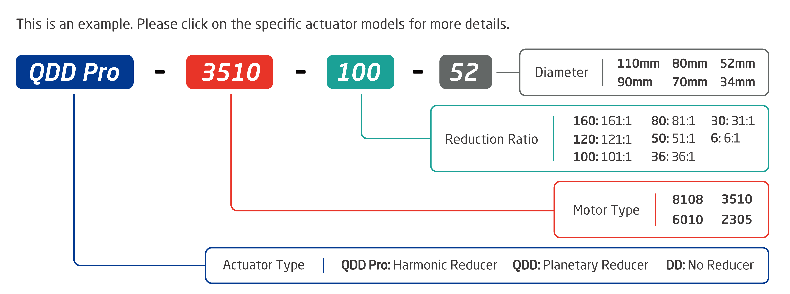

Main Page
=====

Getting Started
--------
The following instructions are meant to get you up and running quickly if you are new to INNFOS actuators. 
If there's any questions,please contact us at support@innfos.com.

  * [Introduction](pages/introduction.md)
  * [ECB-Based Communication](https://www.mdeditor.com/)

Software & Development
------------

  * [CAN Communication Protocol][ipChanged]
  * [Ethernet Configuration](ipChange.md)
  * [Ethernet Communication Protocol](pages/Ethernet_Communication_Protocol.md)
  * [Ethernet Communication SDK](https://www.mdeditor.com/)
  * [INNFOS Actuator Studio(IAS) instruction](pages/INNFOS_Actuator_StudioIAS_instruction.md)
  * [Appendix](https://www.mdeditor.com/)
  
 
  [ipChanged]: <https://github.com/innfos/ipChangeTool/blob/master/README.md>

Products
-----------------

## QDD Pro
  * [QDD Pro-3510-50-70](pages/QDDPro-3510-50_v2_2.md)
  * [QDD Pro-3510-80-70](pages/QDDPro-3510-80_v2_2.md)
  * [QDD Pro-6010-50-90](pages/QDDPro-6010-50-90_v2_2.md)
  * [QDD Pro-6010-80-90](pages/QDDPro-6010-80-90_v2_2.md)
  * [QDD Pro-6010-100-90](pages/QDDPro-6010-100-90_v2_2.md)

## QDD
  * [QDD-3510-36](pages/QDD-3510-36_v2_2.md)
  * [QDD-6010-36](pages/QDD-6010-36_v2_2.md)

## DD
  * [DD-3510](pages/DD-3510_v2_2.md)
  * [DD-6010](pages/DD-6010_v2_2.md)
  

  
## Accessories
  * [ECB & HUB](pages/ECB&HUB.md)
  
----  
  

Note: The following SCA data is being updated. Please contact our sales team (sales@innfos.com) for more information.

### QDD Pro
  * [QDD Pro-3510-30-70](pages/QDDPro-3510-30_v2_2.md)
  * [QDD Pro-3510-100](pages/QDDPro-3510-100_v2_2.md)
  * [QDD Pro-6010-30-80](pages/QDDPro-6010-30-80.md)
  * [QDD Pro-6010-30-90](pages/QDDPro-6010-30-90.md)
  * [QDD Pro-6010-50-80](pages/QDDPro-6010-50-80.md)
  * [QDD Pro-6010-80-80](pages/QDDPro-6010-80-80.md)
  * [QDD Pro-6010-100-80](pages/QDDPro-6010-100-80.md)
  * [QDD Pro-6010-120-90](pages/QDDPro-6010-120-90.md)
  * [QDD Pro-8108-30-110](pages/QDDPro-8108-30.md)
  * [QDD Pro-8108-50-110](pages/QDDPro-8108-50.md)
  * [QDD Pro-8108-80-110](pages/QDDPro-8108-80.md)
  * [QDD Pro-8108-100](pages/QDDPro-8108-100.md)
  * [QDD Pro-8108-120-110](pages/QDDPro-8108-120.md)
  * [QDD Pro-8108-160-110](pages/QDDPro-8108-160.md)

### QDD
  * [QDD-2305-36](pages/QDD-2305-36_v2_2.md)
  * [QDD-3510-6](pages/QDD-3510-6_v2_2.md)
  * [QDD-6010-6](pages/QDD-6010-6_v2_2.md)
  * [QDD-8108-6](pages/QDD-8108-6.md)
  * [QDD-8108-36](pages/QDD-8108-36.md)

### DD
  * [DD-2305](pages/DD-2305_v2_2.md)
  * [DD-8108](pages/DD-8108.md)

## XR-Robot
 [XR-1 ](https://www.mdeditor.com/)
Website is under maintenance. Stay tuned for future updates!

- - - -

Version Information
----------------------

  * If there is any problem with the products that we stopped to provide,please contact us.

<table class="tableizer-table">
<thead><tr class="tableizer-firstrow" style="background: PaleTurquoise; color: black;width:500px"><th >version</th><th>date</th><th>	Modify content</th></tr></thead><tbody><tr><td>V1.0.3</td><td>2019-4-15</td><td>Modify the schematic picture</td></tr><tr><td>V1.0.2</td><td>2019-4-9</td><td>Add model： DD-2305</td></tr><tr><td>V1.0.1</td><td>2019-4-4</td><td>Delete model： QDD-6010-8 QDD-6010-64  QDD-8108-8  QDD-8108-64 Add model： QDD-6010-6  QDD-6010-36  QDD-8108-6  QDD-8108-36</td></tr><tr><td>V1.0.0</td><td>2018-11-12</td><td>The first version</td></tr></tbody></table>

