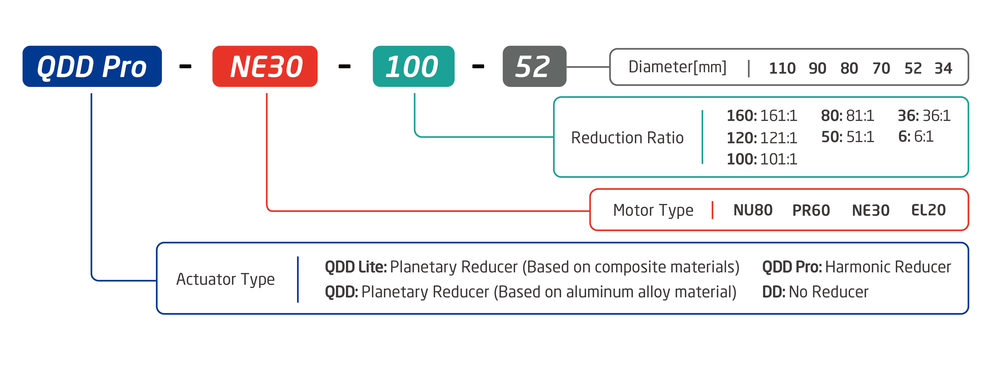

Main Page
=====

##  Getting Started
--------
The following instructions are meant to get you up and running quickly if you are new to INNFOS actuators. 
If there's any questions,please contact us at support@innfos.com.

  * [Introduction](pages/introduction.md)
  * [CAN-Based Communication](pages/CAN_Based_Connection.md)
  * [ECB-Based Communication](pages/ECB_Based_Communication.md)

##  Software & Development
------------

  * [CAN Communication Protocol](pages/CAN_Communication_Protocol.md)
  * [Ethernet Configuration](pages/Ethernet_Configuration.md)
  * [Ethernet Communication Protocol](pages/Ethernet_Communication_Protocol.md)
  * [Ethernet Communication SDK](pages/Ethernet_Communication_SDK.md)
  * [INNFOS Actuator Studio(IAS) instruction](pages/INNFOS_Actuator_Studio_IAS_instruction.md)
  * [Appendix](pages/appendix.md)
  
 
  [ipChanged]: <https://github.com/innfos/ipChangeTool/blob/master/README.md>

##  Products
-----------------

### QDD Pro
  * [QDD Pro-NE30-50-70](pages/QDDPro-NE30-50_v2_2.md)
  * [QDD Pro-NE30-80-70](pages/QDDPro-NE30-80_v2_2.md)
  * [QDD Pro-PR60-50-90](pages/QDDPro-PR60-50-90_v2_2.md)
  * [QDD Pro-PR60-80-90](pages/QDDPro-PR60-80-90_v2_2.md)
  * [QDD Pro-PR60-100-90](pages/QDDPro-PR60-100-90_v2_2.md)

### QDD
  * [QDD-NE30-36](pages/QDD-NE30-36_v2_12.md)
  * [QDD-PR60-36](pages/QDD-PR60-36_v2_2.md)
  * [QDD-NU80-6](pages/QDD-NU80-6_v3_2.md)    NEW！
  * [QDD-C-NE30-36](pages/QDD-C-NE30-36_v1_8.md)  NEW！
  * [QDD-C-PR60-36](pages/QDD-C-PR60-36_v1_8.md)  NEW！

### DD
  * [DD-NE30](pages/DD-NE30_v2_2.md)
  * [DD-PR60](pages/DD-PR60_v2_2.md)
  

  
### Accessories
  * [ECB & HUB](pages/ECB&HUB_v2_2.md)
  
----  

## the upcoming products

Note: The following SCA data is being updated. Please contact our sales team (sales@innfos.com) for more information.

### QDD Pro
  * [QDD Pro-NE30-100-70](pages/QDDPro-NE30-100_v2_2.md)
  * [QDD Pro-PR60-50-80](pages/QDDPro-PR60-50-80_v2_2.md)
  * [QDD Pro-PR60-80-80](pages/QDDPro-PR60-80-80_v2_2.md)
  * [QDD Pro-PR60-100-80](pages/QDDPro-PR60-100-80_v2_2.md)
  * [QDD Pro-PR60-120-90](pages/QDDPro-PR60-120-90_v2_2.md)
  * [QDD Pro-NU80-50-110](pages/QDDPro-NU80-50-110_v2_2.md)
  * [QDD Pro-NU80-80-110](pages/QDDPro-NU80-80-110_v2_2.md)
  * [QDD Pro-NU80-100-110](pages/QDDPro-NU80-100-110_v2_2.md)
  * [QDD Pro-NU80-120-110](pages/QDDPro-NU80-120-110_v2_2.md)
  * [QDD Pro-NU80-160-110](pages/QDDPro-NU80-160-110_v2_2.md)

### QDD
  * [QDD-EL20-36](pages/QDD-EL20-36_v2_3.md)
  * [QDD-NU80-36](pages/QDD-NU80-36_v2_2.md)
  * [QDD-C-EL20-36](pages/QDD-C-EL20-36_v1_8.md) 

### DD
  * [DD-EL20](pages/DD-EL20_v2_3.md)
  * [DD-NU80](pages/DD-NU80.md)

## XR-Robot
 [XR-1 ](https://www.mdeditor.com/)
Website is under maintenance. Stay tuned for future updates!

- - - -

##  Version Information
----------------------

  * If there is any problem with the products that we stopped to provide,please contact us.

<table class="tableizer-table"><thead><tr class="tableizer-firstrow" style="background: PaleTurquoise; color: black;width:500px"><th>Version</th><th>Date</th><th>Modify content</th></tr></thead><tbody><tr><td>V1.0.7</td><td>2019-7-23</td><td>Add model： QDD-C-EL20-36 QDD-C-NE30-36 QDD-C-PR60-36</td></tr><tr><td>V1.0.6</td><td>2019-6-28</td><td>Delete model： QDD Pro-NE30-30-70 QDD Pro-PR60-30-90 QDD Pro-NU80-30-110</td></tr><tr><td>V1.0.5</td><td>2019-6-19</td><td>Delete model: QDD Pro-PR60-30-80 QDD-NE30-6 QDD-PR60-6</td></tr><tr><td>V1.0.4</td><td>2019-5-15</td><td>update model</td></tr><tr><td>V1.0.3</td><td>2019-4-15</td><td>Modify the schematic picture</td></tr><tr><td>V1.0.2</td><td>2019-4-9</td><td>Add model： DD-EL20</td></tr><tr><td>V1.0.1</td><td>2019-4-4</td><td>Delete model： QDD-PR60-8 QDD-PR60-64  QDD-NU80-8  QDD-NU80-64 Add model： QDD-PR60-6  QDD-PR60-36  QDD-8108-6  QDD-NU80-36</td></tr><tr><td>V1.0.0</td><td>2018-11-12</td><td>The first version</td></tr></tbody></table>
