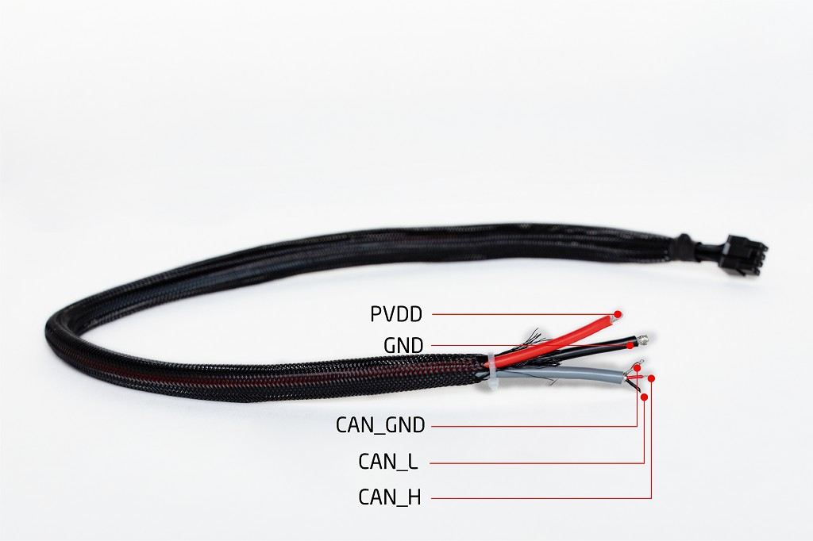
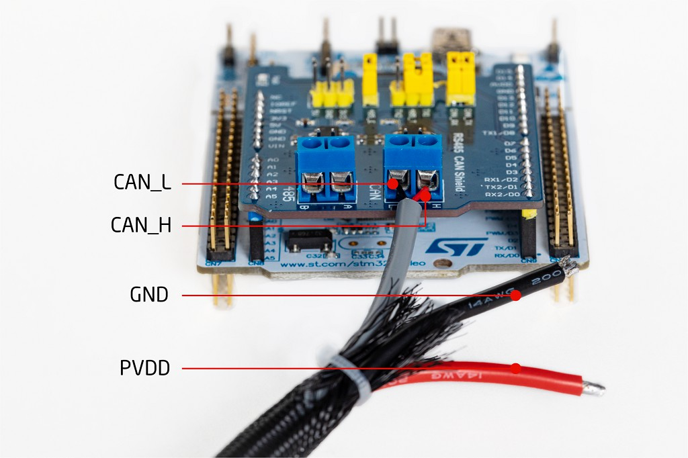
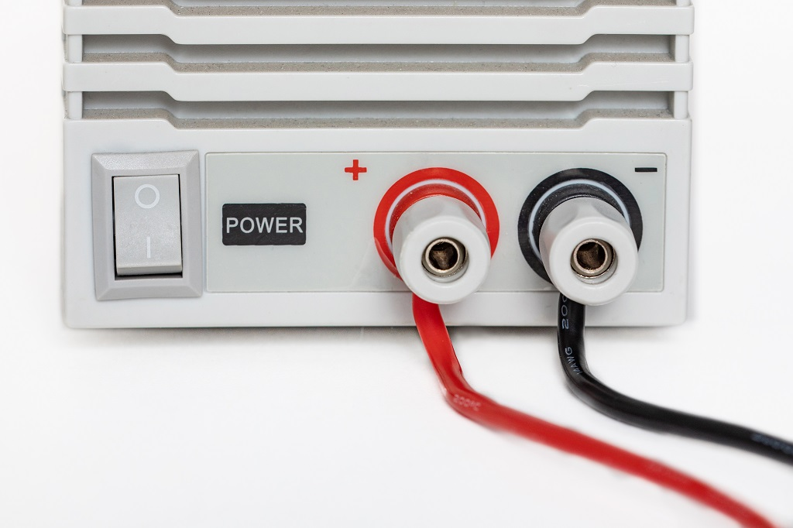
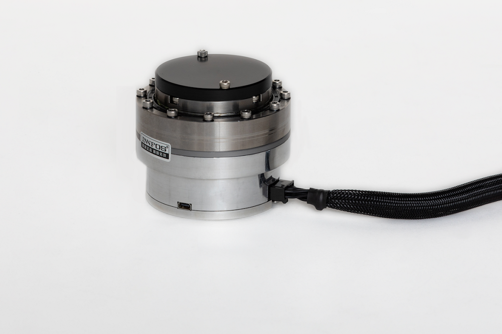
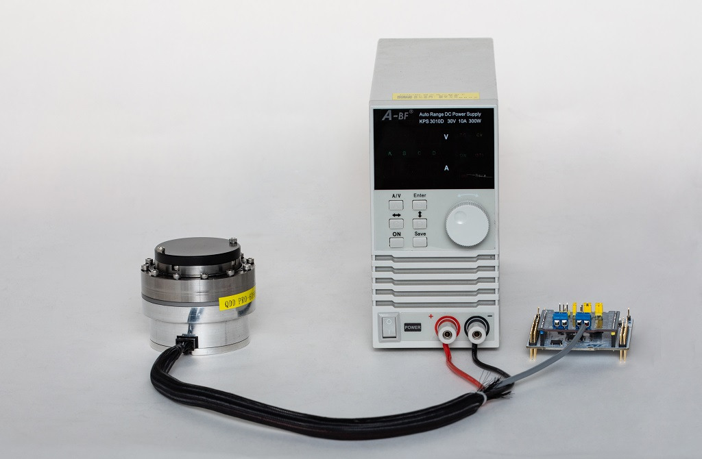
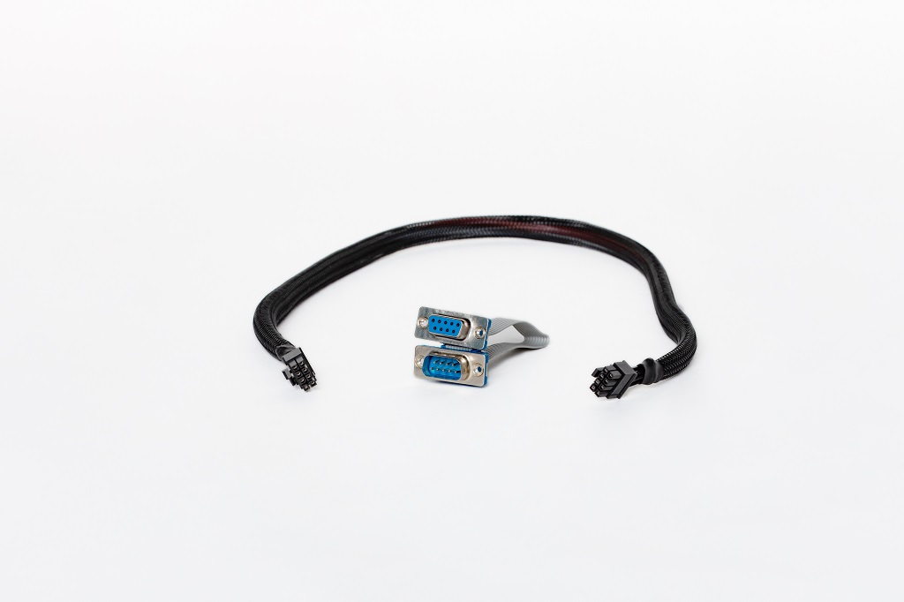
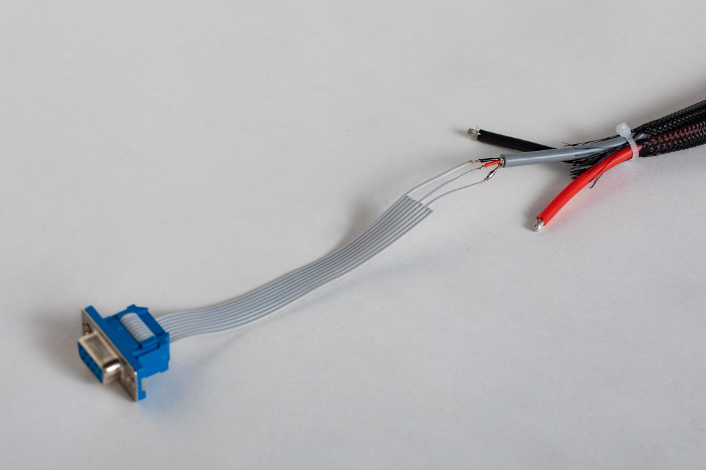
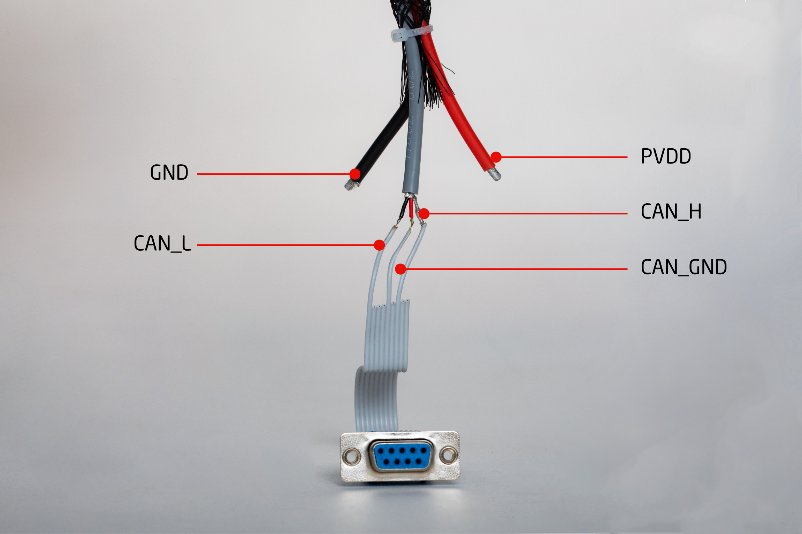
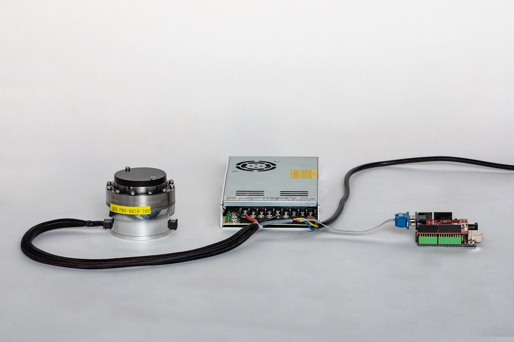

Communication method based on CAN bus
=====

## Physical layer description of CAN

### CAN Protocol Overview

*     CAN is an abbreviation of Controller Area Network (hereafter referred to as CAN) and is an ISO international standardized serial communication protocol.

*     INNFOS product design is subject to the CAN2.0A protocol standard. This article details the CAN communication protocol format of the company's products and the CAN communication structure of the product.

### Comprehensive performance parameters

<table style="width:400px"><thead><COL WIDTH=50%><COL WIDTH=50%><tr><th colspan="2"style=background:PaleTurquoise>Table 1 Description of the comprehensive performance parameters</th></tr></thead><tbody><tr><td>project</td><td>Description</td></tr><tr><td>Link layer protocol</td><td>CAN bus</td></tr><tr><td>CAN-ID type</td><td>11bit-CAN2.0A</td></tr><tr><td>Baud rate</td><td>1Mbit/s</td></tr><tr><td>Maximum number of sites</td><td>63</td></tr><tr><td>CAN frame length</td><td>0~8 bytes</td></tr><tr><td>Application layer CAN frame type</td><td>Data frame, remote frame</td></tr><tr><td>Terminal matching resistor</td><td>120Ω</td></tr></tbody></table>

The baud rate of this communication protocol is 1Mbit/s. For CAN communication, the cable types have little effect on the transmission distance, but the wire diameter is as thick as possible. The maximum number of nodes is 64. The company's products use 0.205mm2 wire diameter. The largest transmission distance is 25m.

----

## Hardware connection introduction of CAN

<table><thead><tr><th colspan="4" style=background:PaleTurquoise>Table 2 Communication Signal Connector Pin Definitions</th></tr></thead><tbody><tr><td style="width:80px">Pin number</td><td>definition</td><td>description</td><td>	Terminal pin distribution</td></tr><tr><td>1</td><td>PVDD</td><td>Power supply</td><td rowspan="9"></td></tr><tr><td>3</td><td>PVDD</td><td>Power supply</td></tr><tr><td>5</td><td>PVDD</td><td>Power supply</td></tr><tr><td>2</td><td>GND</td><td>Power Ground</td></tr><tr><td>4</td><td>GND</td><td>Power Ground</td></tr><tr><td>6</td><td>CGND</td><td>CAN Ground</td></tr><tr><td>7</td><td>CANL</td><td>CAN communication interface</td></tr><tr><td>8</td><td>CANH</td><td>CAN communication interface</td></tr></tbody></table>

----

### Connection based on ST development board

*    The INNFOS SCA can communicate directly with the CAN interface of the embedded control board.
*   INNFOS SCA can be controlled by connecting your own embedded control board
*    Two common connection examples for embedded development boards are provided as follows.

**Hardware requirements**

*   From left to right: `INNFOS SCA`, `ST development board (self-provided)`, `terminating resistor`, `actuator cable`, `DC stabilized voltage supply`
*   You can use your own ST development board to implement CAN communication and control with the actuator
*   Optional emergency stop switch depending on usage

Note: The components can be plugged in only after power-down, otherwise they may be damaged.  Please make sure that your DC power supply voltage is within the SCA voltage range, or may cause SCA damage.

**Connect ST development board to SCA integrated cabls**

*   Take the actuator cable

 

*   Cut one end of the actuator cable.
 
The red thick line is the positive; the black thick one is the negative line. Cut the twisted pair shielded wire, where the red thin line is CAN_H; the black thin one is CAN_L; The silver line is CAN_GND.

 

*    Connect the red thin line CAN_H and the black thin line CAN_L to the corresponding positions on the ST development board.

 

*    Connect the red power positive line and the black power negative line to the positive and negative terminals as shown.

 

**Connecting SCA**

*    Connect the other end of the actuator cable to the SCA.

 

*    Plug the terminal resistor to the SCA in tail-end

*    After the connection is completed, the power can be turned on for subsequent debugging

 

### Connection based on Arduino development board

**Hardware requirements**

*   From left to right: `INNFOS SCA`, `Arduino development board (self-provided)`, `terminating resistor`, `ECB cable`, `actuator  cable`, `DC stabilized power supply`
*   You can use your own Arduino development board to communicate and control CAN with the actuator
*  Optional emergency stop switch depending on usage

Note: The components can only be plugged in after power-down, otherwise they may be damaged.  Please make sure that your DC power supply voltage is within the SCA voltage range, or may cause SCA damage.

**Connect the Arduino development board to the actuator integrated cable**

*   Take the actuator cable。

 

*   Cut one end of the actuator cable. 
The red thick line is the positive; the black thick one is the negative line. Cut the twisted pair shielded wire, where the red thin line is CAN_H; the black thin one is CAN_L; The silver line is CAN_GND.

 

*    Carefully cut the ECB cable and cut the red thin wire CAN_H of the cable, black thin wire CAN_L, the silver thin wire CAN_GND,and then connect the corresponding pins as shown in the figure. Welding firmly and prevent short circuit by heat shrink tube or insulating tape.

 

*    Connect the red power positive line and the black power negative line to the positive and negative terminals as shown.

 

*     Plug the other end of the ECB cable into the Arduino board to complete the connection.

**Connecting actuator**

*    Connect the other end of the actuator cable to the SCA.

 

*    End effector plug-in termination resistor

*    After the connection is completed, the power can be turned on for subsequent debugging

 

## Software installating and using instruction

**Download IAS**

*   If the computer system is linux, please visit [IAS(linux)](https://github.com/innfos/INNFOS-Actuator-Studio-linux.git) to get the latest version of IAS(INNFOS Actuator Studio)(Linux),If the system is window, please visit [IAS(windows)](https://github.com/innfos/INNFOS-Actuator-Studio-windows.git).

**Configure IP address**

*   For configuration steps, please refer to [Ethernet communication configuration](Ethernet_Configuration.md)

**Install IAS**

*   Install IAS, please refer to [IAS installation](INNFOS_Actuator_Studio_IAS_instruction.md)

**Usage** 

 

After successful installation, start IAS, click the "OK" button to enable the "Next" button, and then click "Next" until the following interface appears:

 

Click the "1" or "2" button to start the actuator, and the button "1" is green meaning successful starting up. Click on the message box or click on the "Details" button (located under button "1") to enter the actuator debug interface.

 

 **Position control**

*   Click the `Profile Position Mode`button on the left sidebar and then click`Activate Profile Position Mode`.Then enter the position value in "Settings" in units of R (range -127R~127R).

 

 

For more information on IAS, please visit the[INNFOS Actuator Studio(IAS)instructions](#!pages/INNFOS_Actuator_Studio_IAS_instruction.md).

# Version Information

<table style="width:800px"><thead><tr style="background:PaleTurquoise"><th style="width:80px">Version number</th><th style="width:100px">Update time</th><th style="width:100px">Change type</th><th style="width:80px">Position</th><th>Update content</th></tr></thead><tr><td>V1.0.0</td><td>2019-05</td><td>Add</td><td>All content</td><td>The first version</td></tr></tbody></table>
