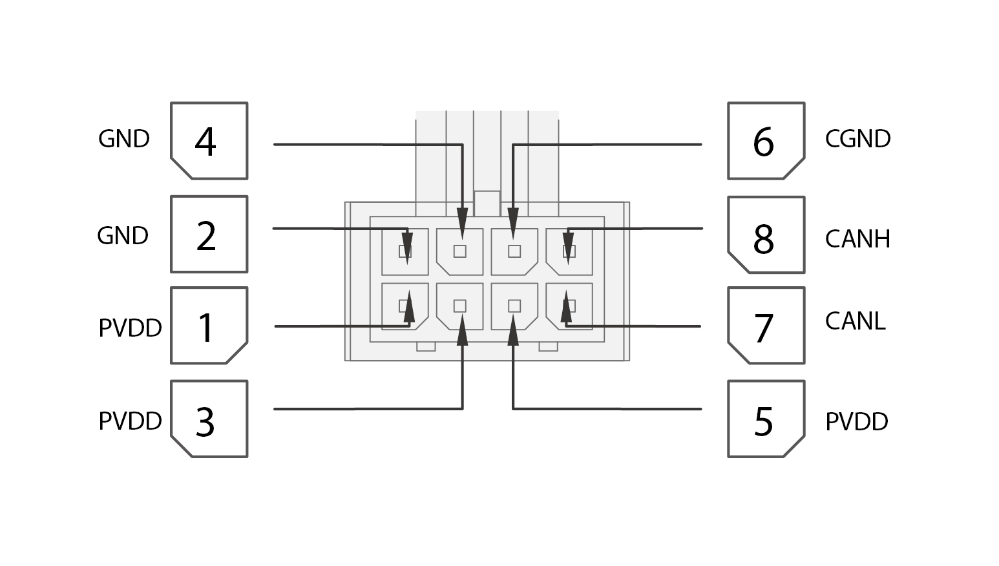
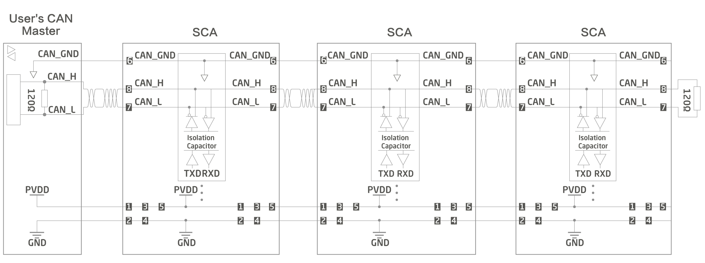
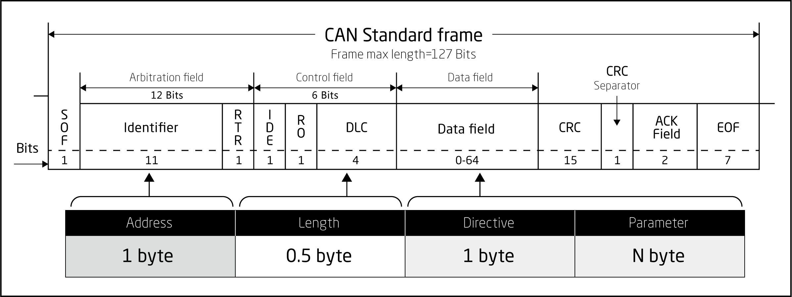

## Physical layer description of CAN

### CAN Protocol Overview

*     CAN is an abbreviation of Controller Area Network (hereafter referred to as CAN) and is an ISO international standardized serial communication protocol.

*     INNFOS product design is subject to the CAN2.0A protocol standard. This article details the CAN communication protocol format of the company's products and the CAN communication structure of the product.

### Comprehensive performance parameters

<table style="width:400px"><thead><COL WIDTH=50%><COL WIDTH=50%><tr><th colspan="2"style=background:PaleTurquoise>Table 1 Description of the comprehensive performance parameters</th></tr></thead><tbody><tr><td>project</td><td>Description</td></tr><tr><td>Link layer protocol</td><td>CAN bus</td></tr><tr><td>CAN-ID type</td><td>11bit-CAN2.0A</td></tr><tr><td>Baud rate</td><td>1Mbit/s</td></tr><tr><td>Maximum number of sites</td><td>63</td></tr><tr><td>CAN frame length</td><td>0~8 bytes</td></tr><tr><td>Application layer CAN frame type</td><td>Data frame, remote frame</td></tr><tr><td>Terminal matching resistor</td><td>120Ω</td></tr></tbody></table>

The baud rate of this communication protocol is 1Mbit/s. For CAN communication, the cable types have little effect on the transmission distance, but the wire diameter is as thick as possible. The maximum number of nodes is 64. The company's products use 0.205mm2 wire diameter, the largest. The transmission distance is 25m.

----

## Hardware connection introduction of CAN

### Interface specification model

communication interface：Molex 430450827

* The INNFOS actuator's patch cord interface is a CAN communication interface, as shown in the figure below. The internal pins of the same name are connected together, and their interface definitions are shown in Figure 2-1. The CAN interface connector is equipped with at least CANH, CANL, and CGND pins.

<table><thead><tr><th colspan="4" style=background:PaleTurquoise>Table 2 Communication Signal Connector Pin Definitions</th></tr></thead><tbody><tr><td style="width:80px">Pin number</td><td>definition</td><td>description</td><td>	Terminal pin distribution</td></tr><tr><td>1</td><td>PVDD</td><td>Power supply</td><td rowspan="9"></td></tr><tr><td>3</td><td>PVDD</td><td>Power supply</td></tr><tr><td>5</td><td>PVDD</td><td>Power supply</td></tr><tr><td>2</td><td>GND</td><td>Power Ground</td></tr><tr><td>4</td><td>GND</td><td>Power Ground</td></tr><tr><td>6</td><td>CGND</td><td>CAN Ground</td></tr><tr><td>7</td><td>CANL</td><td>CAN communication interface</td></tr><tr><td>8</td><td>CANH</td><td>CAN communication interface</td></tr></tbody></table>

----

### CAN communication bus and multi-node connection

<strong>图1 CAN通信网络的连接框图</strong>

<strong>图2 CAN通信网络的连接示意图</strong>

Note: CAN communication is an electrical level signal transmitted by the voltage difference between CAN_H and CAN_L.
If there is no isolation, in some cases, the voltage on the CAN bus can be well above the specification and is likely to damage most of the devices on the entire bus.
The SCA (except for special models) is internally designed with CAN isolation circuit to ensure the safety during communication.

*  It is recommended to use shielded twisted pair connection,two 120Ω termination matching resistors should be connected at both ends of the bus in order to prevent signal reflection.

*   Use a multimeter to measure the resistance between CANH and CANL to confirm that the resistance at both ends of the field is correctly connected. The normal resistance value should be at about 60Ω (the parallel value of the two resistors).

*   The maximum number of attached devices is 64.

----

## communication protocol

### communication protocol format

<strong>图3</strong>

Figure 3: Device address corresponding identifier bit, CAN bus standard data frame identifier bit is 11 bits, this protocol uses only 8 of them, just occupies one byte, data length corresponds to DLC, occupies a half byte. The contents of the instruction parameter are also located in data field. The content of the instruction located at front followed by the parameter, the high byte located at front followed by the low byte.The data length is equal to the instruction character plus the parameter content

**Device Address** 
A byte of data，identifies the address of the device to communicate with, 0x01 to 0xff are available. 0x00 is the broadcast address. 

**The length of data** 
Half a byte of data, identifies the number of specific data to be communicated. The range is 0x00 to 0x0F. The data out of range will not be processed. 

**Instruction byte** 
A byte of data，identifies the specific operation performed by the master and the slave. The value ranges from 0x00 to 0xff. 

**Parameter content** 
The specific parameter content of an instruction whose length is equal to the data length minus one. Some instructions do not contain specific data and should have a data digit of 1.

----

#### IQmath Instruction

**Fig 4**

<table style="width:650px"><thead><tr><th rowspan="2" style=background:PaleTurquoise>Data Type</th><th colspan="2" style=background:PaleTurquoise>Range</th><th rowspan="2"style=background:PaleTurquoise>Resolution/Precision</th></tr><tr> <td>Min</td> <td>Max</td> </tr></thead><tbody><tr><td>_iq30</td><td>-2</td><td>1.999 999 999</td><td>0.000 000 001</td></tr><tr><td>_iq29</td><td>-4</td><td>3.999 999 998</td><td>0.000 000 002</td></tr><tr><td>_iq28</td><td>-8</td><td>7.999 999 996</td><td>0.000 000 004</td></tr><tr><td>_iq27</td><td>-16</td><td>15.999 999 993</td><td>0.000 000 007</td></tr><tr><td>_iq26</td><td>-32</td><td>31.999 999 985</td><td>0.000 000 015</td></tr><tr><td>_iq25</td><td>-64</td><td>63.999 999 970</td><td>0.000 000 030</td></tr><tr><td>`_iq24`</td><td>`-128`</td><td>`127.999 999 940`</td><td>`0.000 000 060`</td></tr><tr><td>_iq23</td><td>-256</td><td>255.999 999 981</td><td>0.000 000 119</td></tr><tr><td>_iq22</td><td>-512</td><td>511.999 999 762</td><td>0.000 000 238</td></tr><tr><td>_iq21</td><td>-1024</td><td>1023.999 999 523</td><td>0.000 000 477</td></tr><tr><td>_iq20</td><td>-2048</td><td>2047.999 999 046</td><td>0.000 000 954</td></tr><tr><td>_iq19</td><td>-4096</td><td>4095.999 998 093</td><td>0.000 001 907</td></tr><tr><td>_iq18</td><td>-8192</td><td>8191.999 996 185</td><td>0.000 003 815</td></tr><tr><td>_iq17</td><td>-16384</td><td>16383.999 992 371</td><td>0.000 007 629</td></tr><tr><td>_iq16</td><td>-32768</td><td>32767.999 984 741</td><td>0.000 015 259</td></tr><tr><td>_iq15</td><td>-65536</td><td>65535.999 969 482</td><td>0.000 030 518</td></tr><tr><td>_iq14</td><td>-131072</td><td>131071.999 938 965</td><td>0.000 061 035</td></tr><tr><td>_iq13</td><td>-262144</td><td>262143.999 877 930</td><td>0.000 122 070</td></tr><tr><td>_iq12</td><td>-524288</td><td>524287.999 755 859</td><td>0.000 244 141</td></tr><tr><td>_iq11</td><td>-1048576</td><td>1048575.999 511 719</td><td>0.000 488 281</td></tr><tr><td>_iq10</td><td>-2097152</td><td>2097151.999 023 437</td><td>0.000 976 563</td></tr><tr><td>_iq9</td><td>-4194304</td><td>4194303.998 046 875</td><td>0.001 953 125</td></tr><tr><td>_iq8</td><td>-8388608</td><td>8388607.996 093 750</td><td>0.003 906 250</td></tr><tr><td>_iq7</td><td>-16777216</td><td>16777215.992 187 500</td><td>0.007 812 500</td></tr><tr><td>_iq6</td><td>-33554432</td><td>33554431.984 375 000</td><td>0.015 625 000</td></tr><tr><td>_iq5</td><td>-67108864</td><td>67108863.968 750 000</td><td>0.031 250 000</td></tr><tr><td>_iq4</td><td>-134217728</td><td>134217727.937 500 000</td><td>0.062 500 000</td></tr><tr><td>_iq3</td><td>-268435456</td><td>268435455.875 000 000</td><td>0.125 000 000</td></tr><tr><td>_iq2</td><td>-536870912</td><td>536870911.750 000 000</td><td>0.250 000 000</td></tr><tr><td>_iq1</td><td>-1073741824</td><td>1 073741823.500 000 000</td><td>0.500 000 000</td></tr></tbody></table>

Note: _iq24 is INNFOS main application.

*  In general ，The processor we used only supports hardware floating-point arithmetic directly, such as some devices with FPU, or just supports fixed-point arithmetic. In this case, the processing of floating-point numbers needs to be done by the compiler. On devices that support hardware floating-point processing, the quickest way to program floating-point operations is to use floating-point types directly, such as single-precision floats. However, in many cases, limited to cost, material and other factors, when we use only one fixed-point processor, if directly using the float type for floating-point type operations,even a simple floating-point arithmetic will make the compiler to generate a lot of code. It will cause a significantly increase of the program excution time, and the resources occupied will mutiply. This involves the problem of how to efficiently handle floating-point operations on fixed-point processors.

*  Since it is a fixed-point processor, it is much more efficient at processing fixed-point numbers, or literal “integers” than it is dealing with floating-point types. So on fixed-point processors, we use fixed-point integers to represent a floating-point number, and specify integer digits and scales to easily convert fixed-point and floating-point numbers. Taking a 32-bit fixed-point number as an example, suppose the conversion factor is Q, that is, the number of decimal places in 32 bits is Q, and the number of integer digits is 31-Q (in the case of signed numbers). The conversion relationship of fixed-point numbers and floating-point numbers is:

references:

[C28x_IQmath_Library.pdf](../img/C28x_IQmath_Library.pdf)

[IQ-MATH_Library.pdf](../img/IQ-MATH_Library.pdf)

Fixed point number = floating point number × 2^Q 

For example, when the floating point number -2.0 is converted to a fixed point number with Q of 24, the result is: fixed point number = -2 × 2^24 = -33554432. 

The range of representation of the 32-bit signed number is: -2147483648 to 2147483647. If we convert the maximum value of 2147483647 of the signed fixed point number to a floating point number corresponding to Q, the result is: floating point number 2147483647/2^24=127.999999940.

* See Appendix D for specific methods of IQ value conversion.

----

### CAN communication protocol command application example

**Example 1. Write command**

<table style="width:400px"><thead><tr><th colspan="4"style=background:PaleTurquoise>Read the current speed value of the actuator motor ID 0x01</th></tr></thead><tbody><tr><td>Device address</td><td>Data length</td><td>CMD</td><td>parameter</td></tr><tr><td>0x01</td><td>0x01</td><td>0x05</td><td>NO</td></tr></tbody></table>

Device address: 0x01 = Object ID 

Data length: 0x01 = Data length 

Instruction character: 0x05 = Current speed command read 

Parameter content: None = Parameter content sent 

Content: 0x05

<table style="width:400px"><thead><tr><th colspan="4"style=background:PaleTurquoise>Answer command</th></tr></thead><tbody><tr><td>Device address</td><td>Data length</td><td>Command Key</td><td>CMD</td></tr><tr><td>0x01</td><td>0x05</td><td>0x05</td><td>data[3~0]</td></tr></tbody></table>

Return device address: 0x01 = Response object ID 

Data length: 0x05 = Data length of the response 5 bits 

Instruction character: 0x05 = Acknowledge the current speed command (same as the send command) 

Parameter content: 0xXX 0xXX 0xXX 0xXX = Parameter content of the response

Response content :0x05 0xXX 0xXX 0xXX 0xXX 

Description: The parameter content data[3~0] is in the high position and the low bit is in the back. For the _IQ24 format. _IQ(-1.0)~_IQ(1.0) represents the reverse speed full scale and forward speed full scale. The full scale is 6000 RPM. If data = _IQ (0.5). 
Then it is 0.5*6000=3000RPM.

----

**Example 2. Write command**

<table style="width:400px"><thead><tr><th colspan="4"style=background:PaleTurquoise>Set the current position value of the actuator motor ID to 0x01 </th></tr></thead><tbody><tr><td>Device address</td><td>Data length</td><td>CMD</td><td>parameter</td></tr><tr><td>0x01</td><td>0x5</td><td>0x0A</td><td>0x05 0x00 0x00 0x00</td></tr></tbody></table>

Device address: 0x01 = Set object ID 
Data length: 0x5 = Data length 
Instruction character: 0x0A = Set position 
Parameter: 0x05 0x00 0x00 0x00 = Parameter content sent 
Send content: 0x0A 0x05 0x00 0x00 0x00 

Description: Parameter content data[3 ~0] The high position is in the front and the low position is in the back. For the _IQ24 format. _IQ(-128.0)~_IQ(127.999999940) represents the reverse position value full scale and forward position value full scale. If data=_IQ(5.0), set the current position to 5.

*    应答内容：无应答（特殊协议）

----

### General steps for using the command mode:

(1) SCA enable, command: 0x2A 01;

(2) Select the usage mode, command: current loop 0x07 01, speed loop 0x07 02, position loop 0X07 03, S-position mode 0X07 06, S-speed mode 0X07 07, HOMING mode 0X07 08;

(3) Set the relevant parameters, the instruction refers to the appendix of the manual. For the current value, speed value, position parameter, it is not 0, then it starts, and if it is 0, it stops;

(4) End of use, SCA disable, command: 0X2A 00. The disable command must be sent before the power is turned off, otherwise the zero position may be lost.

* * *

<strong>图5</strong>

Note:

*  The maximum amplitude (Maximum) set by the host computer is _IQ (1.0), and the minimum amplitude (Minimal) is _IQ (-1.0), which acts as a limiting function (the schematic diagram is shown in Figure 3-2). Example: (Figure: 3-2 uses the output of the position loop through the limiter module as the input of the speed loop. Assuming _IQ(0.5), _IQ(-0.5), the maximum speed of the position loop output should be ±0.5x6000=±3000RPM )

*  The upper limit of the proportional integral setting is _IQ (127.999999940), and the lower limit of the set value is _IQ (-128.0), but the set value is adjusted according to the actual operation (schematic diagram: 5)

*  The current loop sets the current value range from _IQ(-1.0)~_IQ(1.0). The actual current value is the IQ value multiplied by the full scale. Example: (QDD-PR60 model actuator full-scale current value is 33A, _IQ (0.5) The actual current value is 0.5x33A=16.5A, See the SCAs parameter list)

*  The speed loop sets the speed value range from _IQ(-1.0)~_IQ(1.0), and the actual speed value is the IQ value multiplied by the full scale (see ). Example: (_IQ (0.5) the actual speed is 0.5 * 6000 = 3000RPM)

*  Since the position loop is in _IQ24 format, the forward full scale is _IQ (127.999999940), the reverse full scale is _IQ (-128.0), and the IQ value is the actual value. For example: （_IQ(60.0) is the actual position. 60R, that is, the position where the zero position is rotated forward by 60 turns.)

*  Speed loop curve mode and position loop curve mode, you can set the acceleration, deceleration, and relatively smooth to reach your preset speed value and position, which can avoid excessive current during operation, trigger actuator over-current protection or Power supply overcurrent protection.

----

### CAN communication protocol command reference

### Read Command
<table class="tableizer-table"><thead><tr class="tableizer-firstrow"></tr></thead><tbody><tr><td  colspan="3" style=background:PaleTurquoise>3.3.1.1 Send data 1 byte, return data 2 byte</td></tr><tr><td style="width:250px">Command Name</td><td colspan="2">Read Command</td></tr><tr><td>description</td><td colspan="2">This command sends a data length of 1, and its return data with the length of 2</td></tr><tr><td>Command byte</td><td colspan="2">See <a href="#!pages/Can_Communication_Protocol.md#Read_command_1">Read Command 1</a></td></tr><tr><td>Data length</td><td colspan="2">1</td></tr><tr><td>Data content</td><td colspan="2">No</td></tr><tr><td>Command byte（return value）</td><td colspan="2">See <a href="#!pages/Can_Communication_Protocol.md#Read_command_1">Read Command 1</a></td></tr><tr><td>Data length （return value）</td><td colspan="2">2</td></tr><tr><td rowspan="2">Lower machine returns data</td><td>0x01：Success / enable  / normal</td><td rowspan="2">Pattern query return data see <a href="#!pages/Can_Communication_Protocol.md#Appendix_B:mode_table">mode table</a></td></tr><tr><td>0x00：Failed / disabled / abnormal</td></tr></tbody></table>

<table class="tableizer-table"><thead><tr class="tableizer-firstrow"></tr></thead><tbody><tr><td colspan="3" style=background:PaleTurquoise>3.3.1.2 Send data 1 byte, return data 3 bytes</td></tr><tr><td style="width:250px">Command name</td><td colspan="2">Read command</td></tr><tr><td>Description</td><td  colspan="2">This command sends a data length of 1, and its return data with the length of 3.  The parameter in high position shows first. The value is 2^8 times the true value. (special instructions are specified in the instruction list)</td></tr><tr><td>Command character</td><td  colspan="2">See <a href="#!pages/Can_Communication_Protocol.md#Read_command_2">Read Command 2</a></td></tr><tr><td>Data length</td><td colspan="2">1</td></tr> <tr><td>Data content</td><td colspan="2">None</td></tr><tr><td>Command character (return value)</td><td colspan="2">See <a href="#!pages/Can_Communication_Protocol.md#Read_commamd_2">Read Command 2</a></td></tr><tr><td>Data length (return value)</td><td  colspan="2">3</td></tr><tr><td>Lower machine returns data</td><td>The data is in iq8 format</td><td>Or see <a href="#!pages/Can_Communication_Protocol.md#Appendix_C:the_error_warning_instruction_list"> the error warning instruction list</a></td></tr></tbody></table>

<table class="tableizer-table"><thead><tr class="tableizer-firstrow"></tr></thead><tbody><tr><td  colspan="2" style=background:PaleTurquoise>3.3.1.3 Send data 1 byte, return data 5 bytes</td></tr><tr><td style="width:250px">Command name</td><td>Read command</td></tr><tr><td>Description</td><td>This command sends a data length of 1, and its return data with the length of 5.  the parameter in high position shows first. The value is 2^24 times the true value (special instructions are specified in the instruction list)</td></tr><tr><td>Command character</td><td>See <a href="#!pages/Can_Communication_Protocol.md#Read_command_3">Read Command 3</a></td></tr><tr><td>Data length</td><td>1</td></tr><tr><td>Data content</td><td>none</td></tr><tr><td>Command character (return value)</td><td>See <a href="#!pages/Can_Communication_Protocol.md#Read_command_3">Read Command 3</a></td></tr><tr><td>Data length (return value)</td><td>5</td></tr> <tr><td>Lower machine returns data</td><td>Data is formed as iq24(special instructions are specified in the instruction list）</td></tr></tbody></table>

### Write command

<table class="tableizer-table"><thead><tr class="tableizer-firstrow"></tr></thead><tbody><tr><td colspan="3"style=background:PaleTurquoise>3.3.2.1 Send data 2 byte, return data 2 byte</td></tr><tr><td style="width:250px">Command name</td><td colspan="2">Write command</td></tr><tr><td>Description</td><td colspan="2">This command class sends a data length of 2, a return data length is 2, and a byte after the data is sent indicates that the parameter content is to be written.  (note: a power-on command should be sent to use and a power-off command should be sent before powering off, otherwise the zero position may be lost.)</td></tr><tr><td>Command character</td><td colspan="2">See <a href="#!pages/Can_Communication_Protocol.md#Write_command_1">Write Command 1</a></td></tr><tr><td>Data length</td><td colspan="2">2</td></tr><tr><td rowspan="2">Data content</td><td>0x01：enable/ power on</td><td rowspan="2">The mode setting is <a href="#!pages/Can_Communication_Protocol.md#Appendix_B:mode_table">mode table</a></td></tr><tr><td>0x00：disable/power off</td></tr><tr><td>Data length (return value)</td><td colspan="2">See <a href="#!pages/Can_Communication_Protocol.md#Write_command_1">Write Command 1</a></td></tr><tr><td>Data length (return value)</td><td colspan="2">2</td></tr><tr><td rowspan="2">Lower machine returns data</td><td colspan="2">0x01：Success</td></tr><tr><td colspan="2">0x00：Failed</td></tr></tbody></table>

<table class="tableizer-table"><thead><tr class="tableizer-firstrow"></tr></thead><tbody><tr><td colspan="2"style=background:PaleTurquoise>3.3.2.2 Send data 3 byte, return data 2 byte</td></tr><tr><td style="width:250px">Command name</td><td>Write command</td></tr><tr><td>Description</td><td>The data length of this command is 3 bytes, the return data length is 2 bytes, and the sent data 1 byte at last indicate that the parameter content is to be written, and the high parameter shows in front. The value is 2^8 times the true value.</td></tr><tr><td>Command character</td><td>See <a href="#!pages/Can_Communication_Protocol.md#Write_command_2">Write Command 2</a></td></tr><tr><td>Data length</td><td>3</td></tr><tr><td rowspan="2">Data content</td><td>The value is formed IQ8</td></tr><tr><td>0x00：Disable/power off</td></tr><tr><td>Instruction (return value)</td><td>See <a href="#!pages/Can_Communication_Protocol.md#Write_command_2">Write Command 2</a></td></tr><tr><td>Data length (return value)</td><td>2</td></tr><tr><td rowspan="2">IAS return data</td><td>0x01：Success</td></tr><tr><td>0x00：Fail</td></tr></tbody></table>

<table class="tableizer-table"><thead><tr class="tableizer-firstrow"><th  colspan="3"style=background:PaleTurquoise>3.3.2.3 Send data 5 byte, return data is 2 byte or less</th></tr></thead><tbody> <tr><td style="width:250px">Command name</td><td colspan="2">Write Command</td></tr><tr><td>Description</td><td  colspan="2">The data length of this command is 5 bytes, the return data length is 1 byte, and the sent data 4 bytes at last indicate that the parameter content is to be written. The value is 2^24 times the true value. (Special instructions are specified in the instruction list)</td></tr><tr><td>Command byte</td><td  colspan="2">See <a href="#!pages/Can_Communication_Protocol.md#Write_command_3">Write Command 3</a></td></tr><tr><td>Data content</td><td  colspan="2">5</td></tr><tr><td>Data content</td><td  colspan="2">The value is formed IQ24 (Special instructions are specified in the instruction list)</td></tr><tr><td>Instruction (return value)</td><td  colspan="2">See <a href="#!pages/Can_Communication_Protocol.md#Write_command_3">Write Command 3</a></td></tr><tr><td>Data length (return value)</td><td  colspan="2">2or0</td></tr><tr><td  rowspan="2">Lower machine returns data</td><td>0x01：Success</td><td  rowspan="2">(There are no return data for the three special instructions, which are marked in the instruction list)</td></tr><tr><td  colspan="1">0x00：Fail</td></tr></tbody></table>

<table class="tableizer-table"><thead><tr class="tableizer-firstrow"><th colspan="2"style=background:PaleTurquoise>3.3.2.4 Send data 1 byte, return data is 2 byte</th></tr></thead><tbody><tr><td style="width:250px">Command name</td><td>Write Command</td></tr><tr><td>Description</td><td>This command class sends a data length of 0, and returns a data length of 1</td></tr><tr><td>Command byte</td><td>See <a href="#!pages/Can_Communication_Protocol.md#Write_command_4">Write Command 4</a></td></tr><tr><td>Data length</td><td>1</tr><tr><td>Data content</td><td>None</td></tr><tr><td>Command (return value)</td><td>See <a href="#!pages/Can_Communication_Protocol.md#Write_command_4">Write Command 4</a></td></tr><tr><td>Data length(return value)</td><td>2</td></tr><tr><td rowspan="2">Lower machine returns data</td><td>0x01：success</td></tr><tr><td>0x00：fail</td></tr></tbody></table>

----

## Appendix A

### A.1 Write command code value definition table

#### Read Command 1:

<table style="width:700px"><thead><tr><th colspan="3" style=background:PaleTurquoise>A.1.1 Read Command 1</th></tr></thead><tbody><tr><td style="width:100px">Command key</td><td style="width:200px">Definition</td><td>Description</td></tr><tr><td>0x00</td><td>shake hands</td><td>The PC sends command, and the slave computer responds to it, indicating that the slave computer is ready to communicate with the host computer. It can also be used as a heartbeat protocol to query the status of the slave in real time.</td></tr> <tr><td>0x55</td><td>inquiry actuator current mode</td><td>Read the current mode of the actuator managed by the lower computer.</td></tr><tr><td>0xB0</td><td>Query the last shutdown state of the actuator</td><td>Read the last shutdown state of the actuator, normal / abnormal</td></tr><tr><td>0x71</td><td>Current loop filter status</td><td>Read current loop filter enable/disable for the specified ID actuator.</td></tr><tr><td>0x75</td><td>Speed loop filter status</td><td>Read speed loop filter enable/disable for the specified ID actuator</td></tr><tr><td>0x79</td><td>Position loop filter status</td><td>Read Position loop filter enable/disable for the specified ID actuator</td></tr><tr><td>0x2B</td><td>Actuator enable/disable</td><td>Read enable/disable status for the specified ID actuator</td></tr></tbody></table>

#### Read Command 2:

<table style="width:700px"><thead><tr><th colspan="3" style=background:PaleTurquoise>A.1.2 Read Command 2</th></tr></thead><tbody><tr><td style="width:100px">Command key</td><td style="width:200px">Definition</td><td>Description</td></tr><tr><td>0x73</td><td>Current loop filter bandwidth</td><td>Read the bandwidth (Hz) of the specified ID actuator current loop filter</td></tr><tr><td>0x77</td><td>Speed loop filter bandwidth</td><td>Read the bandwidth (Hz) of the specified ID actuator speed loop filter</td></tr><tr><td>0x7B</td><td>Position loop filter bandwidth</td><td>Read the bandwidth (Hz) of the specified ID actuator Position loop filter</td></tr><tr><td>0x6C</td><td>Actuator motor protection temperature</td><td>Read motor protection temperature of actuator with the specified ID</td></tr><tr><td>0x6E</td><td>Actuator motor recovery temperature</td><td>Read motor recovery temperature of actuator with the specified ID</td></tr><tr><td>0x62</td><td>Actuator inverter protection temperature</td><td>Read inverter protection temperature of actuator with the specified ID</td></tr><tr><td>0x64</td><td>Actuator inverter recovery temperature</td><td>Read inverter recovery temperature of actuator with the specified ID</td>></tr><tr><td>0xFF</td><td>Alarm command (special command)</td><td>Lower machine alarm information</td></tr></tbody></table>

#### Read Command 3:

<table style="width:700px"><thead><tr><th colspan="3" style=background:PaleTurquoise>A.1.3 Read Command 3</th></tr></thead><tbody><tr><td style="width:100px">Command key</td><td style="width:200px">Definition</td><td style="width:400px">Description</td></tr><tr><td>0x04</td><td>current value</td><td>Read the current current value of the specified ID actuator. The current value needs to be multiplied by the current full scale (See the SCAs parameter list). The unit is A.</td></tr><tr><td>0x05</td><td>Current speed value</td><td>Read the current speed value of the specified ID actuator. The true speed value needs to be multiplied by the speed full scale (see Appendix D) in RPM.</td></tr><tr><td>0x06</td><td>	Current position value</td><td>Reads the current position value of the specified ID executor in R</td></tr><tr><td>0x15</td><td>Current loop P</td><td>Read P of the current loop of the specified ID actuator</td></tr><tr><td>0x16</td><td>Current loop I</td><td>Read I of the current loop of the specified ID actuator</td></tr><tr><td>0x17</td><td>Speed loop P</td><td>Read the current speed loop P of the specified ID actuator</td></tr><tr><td>0x18</td><td>Speed loop I</td><td>Read the current speed loop I of the specified ID actuator</td></tr><tr><td>0x19</td><td>position loop P</td><td>Read the current position loop P of the specified ID executor</td></tr><tr><td>0x1A</td><td>position loop I</td><td>Read the current position loop I of the specified ID executor</td></tr><tr><td>0x1C</td><td>Max speed of position trapezoidal curve</td><td>Reads the maximum speed of the trapezoidal curve of the current position of the specified ID actuator</td></tr><tr><td>0x1D</td><td>Acceleration of position trapezoidal curve</td><td>Reads the maximum acceleration of the trapezoidal curve at the current position of the specified ID actuator</td></tr><tr><td>0x1E</td><td>Deceleration of position trapezoidal curve</td><td>Read the maximum deceleration of the trapezoidal curve of the current position of the specified ID actuator</td></tr><tr><td>0x22</td><td>Max speed of the speed trapezoidal curve</td><td>Reads the maximum speed of the current speed trapezoidal curve of the specified ID actuator</td></tr><tr><td>0x23</td><td>Acceleration of velocity trapezoidal curve</td><td>Reads the maximum acceleration of the current speed trapezoidal curve of the specified ID actuator</td></tr><tr><td>0x24</td><td>Deceleration of the speed trapezoidal curve</td><td>Reads the maximum deceleration of the current speed trapezoidal curve of the specified ID actuator</td></tr><tr><td>0x34</td><td>Lower limit of current loop output</td><td>Read the lower limit of the current current loop output of the specified ID actuator</td></tr><tr><td>0x35</td><td>Upper limit of current loop output</td><td>Read the upper limit of the current current loop output of the specified ID actuator</td></tr><tr><td>0x36</td><td>Lower limit of the speed loop output</td><td>Read the lower limit of the current speed loop output of the specified ID actuator</td></tr><tr><td>0x37</td><td>Upper limit of speed loop output</td><td>Read the upper limit of the current speed loop output of the specified ID actuator</td></tr><tr><td>0x38</td><td>Lower limit of position loop output</td><td>Read the lower limit of the current position loop output of the specified ID actuator</td></tr><tr><td>0x39</td><td>Upper limit of position loop output</td><td>Read the upper limit of the current position loop output of the specified ID actuator</td></tr><tr><td>0x85</td><td>Upper limit of actuator position</td><td>read upper limit of actuator position</td></tr><tr><td>0x86</td><td>Lower limit of actuator position</td><td>Read the lower limit of the position of the execution ID actuator</td></tr><tr><td>0x8A</td><td>	Actuator position offset</td><td>Read the position offset value of the specified ID actuator</td></tr><tr><td>0x92</td><td>The lower limit of the current when the actuator is automatically reset to zero</td><td>Read the lower limit of the current when the specified ID actuator is automatically reset to zero</td></tr><tr><td>0x93</td><td>	The upper limit of the current when the actuator is automatically reset to zero</td><td>Read the upper limit of the current when the specified ID actuator is automatically reset to zero</td></tr><tr><td>0x7F</td><td>Stall energy</td><td>Reads the stall energy of the specified ID actuator. （The value is 75.225 times the true value）The heating energy after blocking, the unit is J.</td></tr></tbody></table>

### A.2 Write command code value definition table

#### Write Command 1:

<table style="width:700px"><thead><tr><th colspan="3" style=background:PaleTurquoise>A.2.1 Write Command 1</th></tr></thead><tbody><tr><td style="width:100px">Command key</td><td style="width:200px">Definition</td><td>Description</td></tr><tr><td>0x07：</td><td>Set the mode of the specified ID executor</td><td>Set the current mode of the specified ID executor</td></tr><tr><td>0x70：</td><td>Current loop filter status</td><td>Set the current loop filter enable/disable for the specified ID actuator</td></tr><tr><td>0x74：</td><td>Speed loop filter status</td><td>Set the speed loop filter enable/disable for the specified ID actuator</td></tr><tr><td>0x78：</td><td>Position loop filter status</td><td>Set position loop filter enable/disable for the specified ID actuator</td></tr><tr><td>0x2A：</td><td>Actuator on/off status</td><td>Set the specified ID actuator to power on/off</td></tr>
</tbody></table>

#### Write Command 2:

<table style="width:700px"><thead><tr><th colspan="3" style=background:PaleTurquoise>A.2.2 Write Command 2</th></tr></thead><tbody><tr><td>Command key</td><td>Definition</td><td>Description</td></tr><tr><td>0x72：</td><td>Current loop filter bandwidth</td><td>Set the bandwidth (Hz) of the specified ID actuator current loop filter</td></tr><tr><td>0x76：</td><td>Speed loop filter bandwidth</td><td>Set the bandwidth (Hz) of the specified ID actuator speed loop filter</td></tr><tr><td>0x7A：</td><td>Position loop filter bandwidth</td><td>Set the bandwidth (Hz) of the specified ID actuator position loop filter</td></tr><tr><td>0x61：</td><td>Actuator protection temperature</td><td>Set the protection temperature of the specified ID actuator °C</td></tr><tr><td>0x63：</td><td>Actuator recovery temperature</td><td>Set the recovery temperature of the specified ID actuator °C</td></tr>
</tbody></table>

#### Write Command 3:

<table style="width:700px"><thead><tr><th colspan="3" style=background:PaleTurquoise>A.2.3 Write Command 3</th></tr></thead><tbody><tr><td>Command key</td><td>Definition</td><td>Description</td></tr><tr><td>0x08：</td><td>Current value</td><td>Set the current current value of the specified ID actuator (Note: no return data)</td></tr><tr><td>0x09：</td><td>Current speed</td><td>Sets the current speed value for the specified ID executor. (Note: no return data)</td></tr><tr><td>0x0A：</td><td>Current value</td><td>Sets the current speed value for the specified ID executor. (Note: no return data)</td></tr><tr><td>0x0E：</td><td>Current loop P</td><td>Change the P value of the specified ID actuator current loop</td></tr><tr><td>0x0F：</td><td>Current loop I</td><td>Set the I value of the specified ID actuator current loop</td></tr><tr><td>0x10：</td><td>Speed loop P</td><td>Set the P value of the specified ID actuator speed loop</td></tr><tr><td>0x11：</td><td>Speed loop I</td><td>Set the I value of the specified ID actuator speed loop</td></tr><tr><td>0x12：</td><td>Position loop P</td><td>Set the P value of the specified ID actuator position loop</td></tr><tr><td>0x13：</td><td>Position loop I</td><td>Set the I value of the specified ID actuator position loop</td></tr><tr><td>0x1F：</td><td>Maximum speed of position trapezoidal curve</td><td>Change the maximum speed of the trapezoidal curve of the specified ID actuator position</td></tr><tr><td>0x20：</td><td>Acceleration of position trapezoidal curve</td><td>Change the maximum acceleration of the trapezoidal curve of the specified ID actuator position</td></tr><tr><td>0x21：</td><td>Deceleration speed of position trapezoidal curve</td><td>Change the maximum deceleration of the trapezoidal curve of the specified ID actuator position</td></tr><tr><td>0x25：</td><td>Maximum speed of the speed trapezoidal curve</td><td>Change the maximum speed of the specified ID actuator speed trapezoid</td></tr><tr><td>0x26：</td><td>Acceleration of velocity trapezoidal curve</td><td>Change the acceleration of the specified ID actuator speed trapezoidal curve</td></tr><tr><td>0x27：</td><td>Deceleration of the speed trapezoidal curve</td><td>Change the deceleration of the specified ID actuator speed trapezoid</td></tr><tr><td>0x2E：</td><td>Lower limit of current loop output</td><td>Change the lower limit of the specified ID actuator current loop output</td></tr><tr><td>0x2F：</td><td>Upper limit of current loop output</td><td>Change the upper limit of the specified ID actuator current loop output</td></tr><tr><td>0x30：</td><td>Lower limit of the speed loop output</td><td>Change the lower limit of the specified ID actuator speed loop output</td></tr><tr><td>0x31：</td><td>Upper limit of speed loop output</td><td>Change the upper limit of the specified ID actuator speed loop output</td></tr><tr><td>0x32：</td><td>Lower limit of position loop output</td><td>Change the lower limit of the specified ID actuator position loop output</td></tr><tr><td>0x33：</td><td>Upper limit of position loop output</td><td>Change the upper limit of the specified ID actuator position loop output</td></tr><tr><td>0x83：</td><td>Upper limit of actuator position</td><td>Change the upper limit of the position of the specified ID actuator</td></tr><tr><td>0x84：</td><td>Lower limit of actuator position</td><td>Lower limit of actuator position</td></tr><tr><td>0x87：</td><td>Lower limit of actuator position</td><td>Set the Home value of the specified ID executor</td></tr><tr><td>0x89：</td><td>Actuator position offset</td><td>Set the position offset value of the specified ID actuator</td></tr><tr><td>0x90：</td><td>Current lower limit of SCA while automatically zeroed</td><td>Set the lower limit of the current when the specified ID actuator is automatically reset to zero.</td></tr><tr><td>0x91：</td><td>Current upper limit of SCA while automatically zeroed</td><td>Set the upper limit of the current when the specified ID actuator is automatically reset to zero.</td></tr><tr><td>0x7E：</td><td>Stall energy</td><td>Set the stall energy of the specified ID actuator. (The value is 75.225 times the true value)The heating energy after blocking, the unit is J</td></tr></tbody></table>

#### Write Command 4:

<table style="width:700px"><thead><tr><th colspan="3" style=background:PaleTurquoise>A.2.4 Write Command 4</th></tr></thead><tbody><tr><td>Command key</td><td>Definition</td><td>Description</td></tr><tr><td>0xFE：</td><td>Eliminate the alarm of the lower computer</td><td>Eliminate the alarm action of the lower position machine. After receiving the command, the lower position machine stops the alarm, otherwise the lower position machine is inoperable.</td></tr><tr><td>0x88</td><td>Clear Homing data</td><td>Clear Homing data</td></tr><tr><td>0x0D</td><td>Storage parameter</td><td>Storage parameter</td></tr></tbody></table>

## Appendix B :Mode table

<table style="width:400px"><thead><tr style=background:PaleTurquoise><th>Command key</th><th>Command key</th></tr></thead><tbody><tr><td>0x01</td><td>Current mode</td></tr><tr><td>0x02</td><td>Speed mode</td></tr><tr><td>0x03</td><td>Position mode</td></tr><tr><td>0x06</td><td>Position trapezoidal mode (S curve)</td></tr><tr><td>0x07</td><td>Speed trapezoidal mode (S curve)</td></tr><tr><td>0x08</td><td>Homing mode</td></tr></tbody></table>

## Appendix C：Alarm instruction list

<table style="width:600px"><thead><tr style=background:PaleTurquoise><th>Command character</th><th>Command character</th></tr></thead><tbody><tr><td>0x0001</td><td>Overvoltage abnormality</td></tr><tr><td>0x0002</td><td>Undervoltage abnormality</td></tr><tr><td>0x0004</td><td>Abnormal blocking</td></tr><tr><td>0x0008</td><td>Overheating abnormality</td></tr><tr><td>0x0010</td><td>Abnormal read and write parameters</td></tr><tr><td>0x0020</td><td>Multi-turn count abnormality</td></tr><tr><td>0x0040</td><td>Inverter temperature sensor is abnormal</td></tr><tr><td>0x0080</td><td>communication is abnormal</td></tr><tr><td>0x0100</td><td>communication is abnormal</td></tr><tr><td>0x0200</td><td>Position mode step greater than 1</td></tr><tr><td>0x0400</td><td>DRV protection</td></tr><tr><td>other</td><td>Device exception</td></tr><tr><td>explaination</td><td>Multiple errors can be alarmed at the same time. If the return data is 0X05, the error is 0X01 overvoltage abnormality and 0004 blocked abnormality.</td></tr></tbody></table>

## Appendix D: Command Sending and IQ Value Conversion Method

* The comment section of the manual indicates that the IQ value in the position mode is the actual value, ranging from -128 to 127. 999999940. At this time, only the corresponding position value needs to be converted into an IQ value to be input into the parameter content. In the speed and current mode, the corresponding parameter value needs to be converted before converting the IQ value. If the current speed value is set to 100 RPM, the current value of the setting needs to be divided by the maximum value, ie 100/6000=0.01666666, and then Then, the IQ conversion is performed by 0.016666666, and the obtained value is the parameter value.

* For example, we need to set the current position to 60R (note the limit of the step response in the position mode. If the difference between the set position and the current position exceeds 1R, it will not respond), first find the corresponding command. The third type of write command (write command 3) in Appendix A indicates that the instruction to set the current position value is 0x0A. After finding the instruction, look for the corresponding transmission format of the instruction. In the "CAN Communication Protocol Command Reference", the 3.3.2.3 subsection corresponds to the third type of write instruction, and the transmission data length is 5, that is, one byte instruction + 4 bytes parameter. content. When the data content is applied to the IQ24 format, the IQ conversion is performed directly on 60, that is, 60*2^24=1006632960, and then unified into hexadecimal (according to the test software), 3C 00 00 00. According to the data frame format description of CAN bus, the instruction parameter should be at the highest position, and the content of the parameter is after, the content of the instruction we send is 0x 0A 3C 00 00 00, which also corresponds to the length of the data in the description is 5 (bytes). The instruction is sent to this point.

* Correspondingly, if the current or speed mode settings commands need to be sent,the parameter values need to be convert firstly (divided by the corresponding maximum value), to get a number in the range of -1 to 1, and then perform IQ conversion. The steps and methods for sending commands are the same as the position mode. Note that the data format used by each command, if it's in IQ8 format, convert the 2^24 in the formula to 2^8 and then convert it.

## Appendix D: Version Change Record

**The following table briefly describes the version change record.**

<table style="width:800px"><thead><tr style="background:PaleTurquoise"><th style="width:80px">Version number</th><th style="width:100px">Update time</th><th style="width:100px">Change type</th><th style="width:80px">Position</th><th>Update content</th></tr></thead><tbody><tr><td rowspan="4">V1.0.5</td><td rowspan="4">19.05.14</td><td>add</td><td>Appendix A</td><td>Temperature sensor and inverter temperature sensor read and write commands</td></tr><tr><td>modify</td><td>Chapter II Wiring</td><td>Modify Chapter 2 Wiring Modify Figure 2-3</td></tr><tr><td>modify</td><td>Chapter II Wiring</td><td>Modify Chapter 2 Wiring Modify Figure 2-3</td></tr><tr><td>Delete</td><td>Appendix D</td><td>Delete Appendix D"Model Table"</td></tr><tr><td>V1.0.4</td><td>18.12.14</td><td>add</td><td>Appendix E</td><td>Command transmission and IQ value conversion method</td></tr><tr><td rowspan=4>V1.0.3</td><td rowspan=4>18.03.19</td><td>add</td><td>Chapter III Communication Protocol</td><td>More actuator parameter information instructions, actuator temperature information commands, query last shutdown status command, Homing command than the previous version.</td></tr><tr><td>add</td><td>Chapter III Communication Protocol</td><td>Added storage parameter instruction</td></tr><tr><td>modify</td><td>Chapter III Communication Protocol</td><td>Revised the layout of the third chapter</td></tr><tr><td>add</td><td>Chapter III Communication Protocol</td><td>Added storage parameter instruction</td></tr><tr><td rowspan=2>V1.0.2</td><td  rowspan=2>18.01.30</td><td>modify</td><td>all content</td><td>Micro servo changed its name to INNFOS actuator</td></tr><tr><td>add</td><td>Chapter III Communication Protocol</td><td>More alarm commands than the previous version</td></tr><tr><td>V1.0.1</td><td>17.12.29</td><td>modify</td><td>Chapter III Communication Protocol</td><td>More alarm commands than the previous version</td></tr><tr><td  rowspan=2>V1.0.0</td><td  rowspan=2>17.12.15</td><td>modify</td><td>Chapter II wiring</td><td>Updated CAN interface definition</td></tr><tr><td>add</td><td>Chapter III Communication Protocol</td><td>Added switch command</td></tr></tbody></table>

