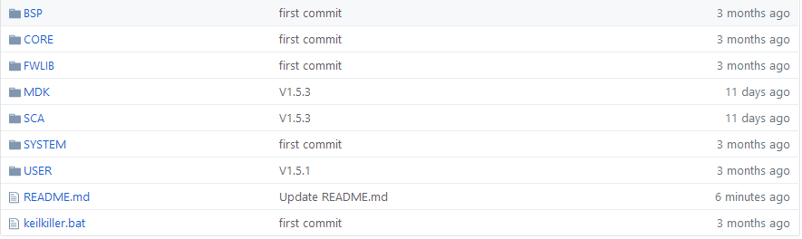
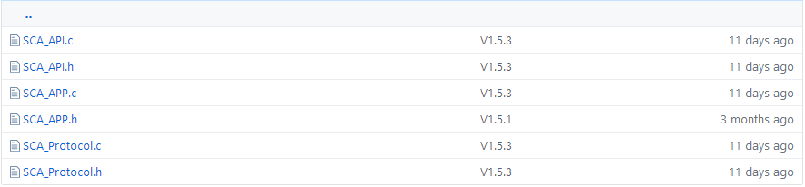
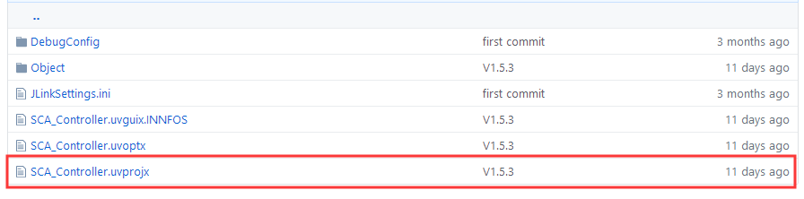
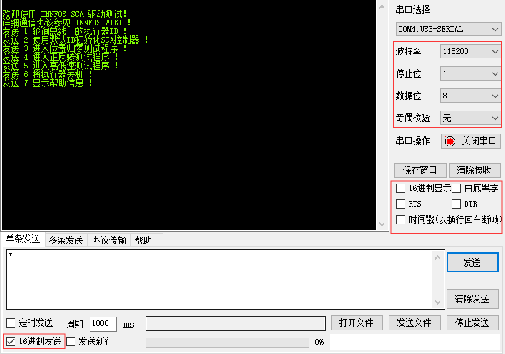
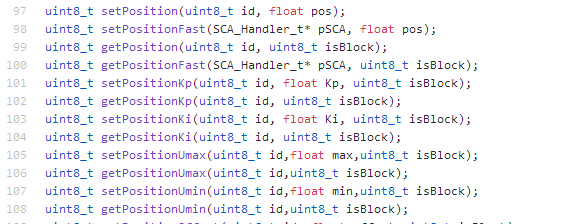

## Introduction

*   INNFOS CAN SDK STM32 version provides user-friendly interfaces, including the function of communication between the STM32F429 single-chip microcomputer and INNFOS SCA, that can send commands to multiple actuators or retrieve actuator status and parameters. The project files are open source and could be customed and modified.

*    First runner of this API is highly recommended to read the readme.txt description file in the project folder.

----

## Download SDK

Visit [Download Link](https://github.com/innfos/INNFOS_CAN_SDK_STM32.git)to acquire the MDK project files.

----

## File structure


<br>

<div class="md-text" style="text-align: center;"></div>

*  `BSP`：STM 32 Peripheral Underlying driver files.
*  `CORE`：Cortex-M4 Kernel control file and STM32 startup file.
*  `FWLIB`：STM32 standard Peripheral driver library 
*  `MDK`：MDK project files
*  `SCA`：INNFOS CAN protocol driver files and codes for application examples.
*  `SYSTEM`：Common interfaces for the STM32 programming environment. 
*  `USER`：Storage for main.c. etc.
*  `Keilkiller.bat`：erase intermediate files during compiling
*  `readme.txt`：relevant descriptions
<br>

### SCA文件目录说明



<div class="md-text" style="text-align: center;"></div>

*  `SCA_Protocol.c/h`： INNFOS CAN communication protocol layer. This layer completes procedures like data frame packing and unpacking, using CAN interface to send and receive data.
*  `SCA_API.c/h`：Communication protocol layer package, including API reading and writing for all parameters.
*  `SCA_APP.c/h`：Demo program.
<br>

----

## Example of compiling and running codes

*  Keil MDK on your PC, project version V5.21.1.0. Single-chip microcomputer model `STM32F429IGT6`。


<br>

<div class="md-text" style="text-align: center;"></div>

*  Open file `SCA_Controller.uvprojx`under MDK folder, it will show user interface and `main.c` code of MDK.  

<br>

<div class="md-text" style="text-align: center;"></div>

*  2 actuators are adopted in this demo, actuator 1 (ID `0x01`) connects to `CAN1`, actuator 2 (ID `0x02`) connects `CAN2`. There are multiple sentences in `SCA_APP.c` that adopted these IDs. Please adjust the ID number according to the actuator(s) you are using. If only 1 actuator is connected, please put the surplus codes into comments and adjust macro definition of `SCA_NUM_USE` under `SCA_API.c` to 1.


```sh
void SCA_Init()
{
	/* Initialize CAN port */
	CAN_Port1.CanPort = 1;			//Mark the port number
	CAN_Port1.Retry = 2;			//Number of retries
	CAN_Port1.Send = CAN1_Send_Msg;		//CAN1 send function
	
	CAN_Port2.CanPort = 2;			
	CAN_Port2.Retry = 2;			
	CAN_Port2.Send = CAN2_Send_Msg;		//CAN2 send function
	
	/* Set up SCA with ID and CAN port */
	setupActuators( 1, &CAN_Port1);		//ID1 bind CAN1 port
	setupActuators( 2, &CAN_Port2);		//ID2 bind CAN2 port
	
	/* Get the parameter pointer */
	pSCA_ID1 = getInstance(1);
	pSCA_ID2 = getInstance(2);
	
	/* Enable all SCA */
	enableAllActuators();
}
```

*  Make sure to connect the single-chip microcomputer to the PC via debugging tools like ST-LINK or J- LINK and confirm the microcomputer is in working order. Click compile all, if no error occurs, then click download to load to your single-chip microcomputer.

<br>

<div class="md-text" style="text-align: center;"></div>

*  After downloading is completed, connect serial port 1 (PA9 PA10) of the microcomputer to the PC via a USB to serial adapter. Open the virtual serial port terminal software, set the Baud rate to 115200. Data received will show as ASC codes. Data sent will show as Hex. Send number 7 to print out help information.


<br>
<div class="md-text" style="text-align: center;"></div>


*  Initialize the actuator(s) based on the prompt message, send commands in sequence. Observe the actuator’s movement and changes combine with codes under SCA_APP.c. When running the actuators for the first time, you can select function 1 to poll IDs, and adjust the ID number in the routine accordingly. 
<br>


## Advanced application

### Driver structure

* INNFOS CAN SDK STM32 splits the driver program into different layers.。

*  `SCA_Protocol.c/h` is the protocol layer that calls the interface of the STM32 CAN controller for sending and receiving data. It provides 5 types of software interfaces for reading and writing commands. Those interfaces will be called by functions in the API layer and packing/unpacking data according to the command. The head file includes macro definition for all commands, communication error type, and storage every actuator’s struct typedef handle of its parameter information. To support multiple CAN interfaces, we added a descriptive handle for CAN interface in this protocol layer. You can use this handle to define multiple interfaces for sending and receiving. Also you will need to define the sending function and retry times for each interface in the initialization program then bind to each SCA’s information handle. Moreover, this protocol layer provides unified data sending/receiving interface `canDispatch(CanRxMsg* RxMsg)` to make porting easier. This interface will be called and send date in when there is new CAN data pack received.  

*  `SCA_API.c/h` is the interface layer and provides reading and writing functions for all parameters. Users can directly call the API in this layer. Codes in this layer combine command & data, also call the corresponding API for data sending and receiving. Most of the APIs include return value that returns to the result of current communication if returned to `SCA_NoError` then the operation is successful. Detailed definition is under `SCA_Protocol.h`. The head file includes macro definition for six operating modes and 2 statuses of the actuator, as well as parameter configuration.

*  `SCA_APP.c/h` is the application layer, provides basic sample program and driver initialization. Users should focus on initialization program `SCA_Init()`, which includes configuration of CAN interface, binding SCA message handle and acquiring using of parameter pointers. 

*  To perform higher level control of the actuator, this routine enables switching of execution methods between `Block` and `Unblock`. API with parameter `isBlock` could modify this parameter to Block or Unblock to control the execution methods. When Block is executed, the command will wait for return of the actuator after it was sent. If overtime occurs, it will return an error code, which applies to lethal parameters(like switching operation mode). When unBlock is executed, the command will auto delay for 200us after it was sent, to avoid error in case of CAN bus line overload, this applies operations like parameter refreshing.

### 参数配置

*  During your project development, you will need to configure system parameters, relevant macro definition is under `SCA_API.h`. Due to this routine supports communication methods like Block, it will require adjusting Block overtime based on CPU speed. The time of switching on and off is a bit long, while other parameters have a very short return time. When executing programs under Unblock, a protective delay will be added in order to prevent busline overload. `SCA_Delay` is the interface of the delay function. `SendInterval` is the value of the delay time, default setting is `200us` after every Unblock sent.
```sh
/* Configuration */
#define SCA_NUM_USE		2		//The number of SCA used in this project
#define SCA_DEBUGER		1		//Enable the debug function
#define CanOvertime		0xFFFF		//Timeout of data (180Mhz)
#define CanPowertime		0xFFFFFF	//Timeout of power switch (180Mhz)
#define SendInterval		200		//Interval in unblock mode
#define SCA_Delay(x)		delay_us(x)	//Delay function

#ifndef SCA_NUM_USE
	#define SCA_NUM_USE	1		//Use 1 SCA in default
#endif

/* Debug port */
#if (SCA_DEBUGER == 1)
#define SCA_Debug(s,...)	printf("FILE: "__FILE__", LINE: %d: "s"", __LINE__, ##__VA_ARGS__)
#else
#define SCA_Debug(s,...)
#endif
```

*  ●When `SCA_DEBUGER` macro Define is 1, a debugging information interface will open. Default function is to call `printf` to output error code. It is suitable for debugging softwares.

### Calling API

*  Before calling `API` you will need to initialize the controller, you can refer to the `SCA_Init()` function under the application layer. First define the description handle of CAN interfaces based on their numbers, then assign values for those interfaces in the initialization function. Among them, `Retry`(times for resending if fails) and `Send`(sending function) must be defined, `Canport`(interface number) could be used for marking the interface number. After all CAN interface description handles are initialized, you will need to bind each ID and the CAN interface it calls with `setupActuators()` function. For each actuator, you only need to run this function once at every initialization, make sure that times of calling this function should not exceed the number defined in `SCA_NUM_USE`.

*  完成初始化并开机后，可正常使用接口的层所有函数。所有的`API`以`ID`来区分总线上的执行器，如读写位置的函数。写位置时，传入要操作的执行器ID，与实际位置值（±125.0R）；读位置时，只需传入要读取的执行器ID即可将当前位置值读入对应的信息句柄中。大部分API带有返回值，返回本次数据通信的结果，当返回`SCA_NoError（0）`时，该指令执行成功，返回其他参见`SCA_Protocol.h`下的错误类型定义。



<div class="md-text" style="text-align: center;"></div>

*  所有的信息句柄会以结构体数组的形式进行初始化定义，定义的长度为`SCA_NUM_USE`，与实际使用的SCA数量保持一致。所有以ID区分执行器的API中，会有以ID查找信息句柄的过程，调用 `getInstance()`函数。该函数会返回指定ID的信息句柄地址，若ID不存在则返回NULL。用户想要获取每个执行器的参数信息，则定义个一个 `SCA_Handler_t`类型的指针，然后用 `getInstance()` 函数获取对应ID的地址，用指针查看对应的参数即可。同时，该类型的指针也可以传入`Fast`型函数中，快速的执行指令，进而省略查找信息句柄的过程，当使用的SCA数量较多时，推荐使用此种类型的函数。

*  当修改完执行器的参数时，需要使用`saveAllParams()`函数将参数永久保存，否则下次开机后执行器内依然为未修改的参数。


### 移植相关
*  当需要将驱动程序移植到其他平台时，需要将工程文件夹下的SCA文件夹拷贝至目标工程内，并实现相应的软件接口。

*  `1.`平台实现CAN底层驱动，提供发送函数，并将函数封装为Send_t定义的格式（在协议层头文件中描述）。

*  `2.`在数据接收的接口中调用协议层内`canDispatch(CanRxMsg* RxMsg)`函数来解析数据，其中`CanRxMsg` 为CAN数据包的接收类型结构体。移植时，请自行根据平台定义`CanRxMsg`结构类型，此处默认使用STM32标准库函数中的接收结构。

*  `3.`在接口层中，替换延时函数的宏定义，此处需要实现微秒级延时，若以毫秒为单位延时可能会造成指令执行效率低下的现象。若开启了调试接口功能，还需要实现相应的信息打印函数，默认使用`printf`。根据CPU速率修改阻塞超时时间，若该值太小可能会造成数据正常接收但函数返回错误的现象。

*  `4.`替换相关的头文件，参考例程使用。

----

## 版本变更记录

<table class="tableizer-table"><thead><tr class="tableizer-firstrow" style=background:PaleTurquoise><th>版本</th><th>更新时间</th><th>更新内容</th></tr></thead><tbody><tr><td>V1.2.1</td><td>2019.11.26</td><td>修改图片，插入代码段</td></tr><tr><td>V1.2.0</td><td>2019.11.15</td><td>SDK更新至1.5.3版本，增加描述内容</td></tr><tr><td>V1.1.0</td><td>2019.08.21</td><td>SDK更新至1.5.0版本，增加描述内容</td></tr><tr><td>V1.0.0</td><td>2019.08.12</td><td>第一个版本</td></tr></tbody></table>

