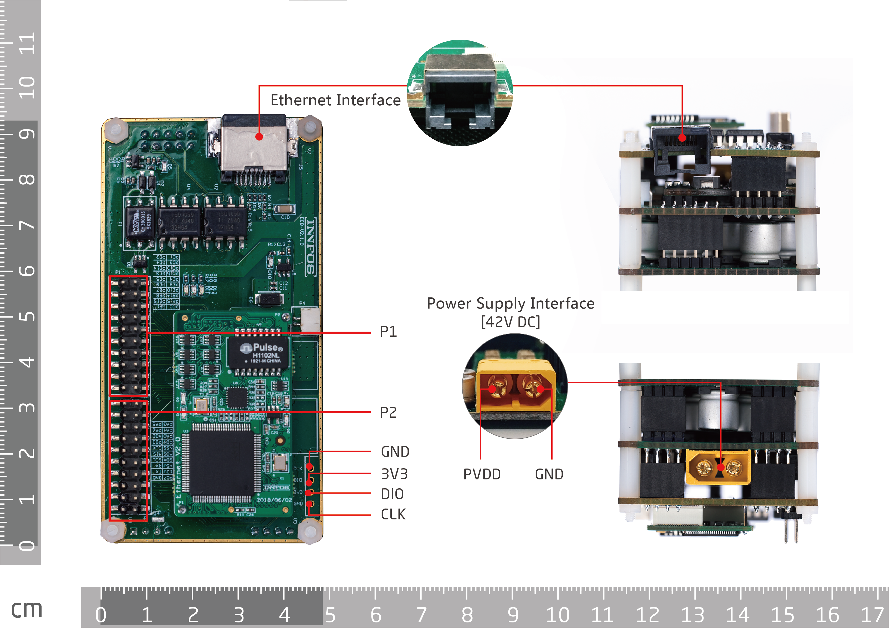
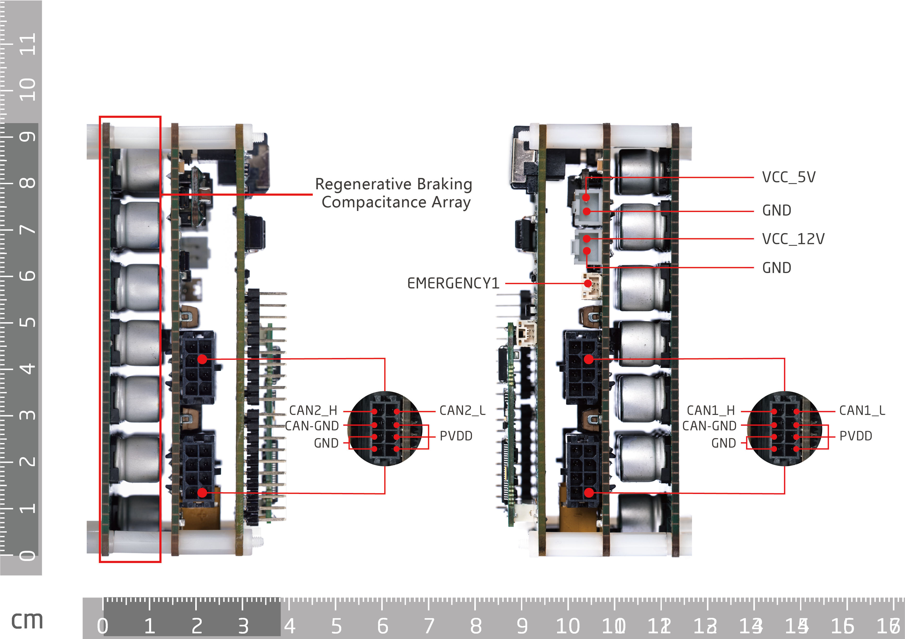

# ECB & HUB
## Introduction

ECB（Ethernet to CAN Bridge）is an Ethernet to CAN adapter, the function of this adapter includes signal conversion between Ethernet and CAN. The adapter is equipped with STM32F429VET6 Master Chip and has 10/100Mbps brandwidth. The default IP address is 192.168.1.30, and the Ethernet protocol is UDP with default interface number 2000. The ECB adapter has 2 independent 1 Mbps CAN bus lines that are insulated, which increases CAN communication brandwidth in the system, decreases communication delays, promotes system’s real-time performance and achieves control of multiple actuators series connection system with complex closed-loop design.

Our ECB’s principle graph and BOM, along with Ethernet communication protocol are all open sources. Users could develop on ECB by themselves based on their own requirements. In this way, it promotes the efficiency of users’ new product development in order to accelerate their listing timing.


 


## Resource overview

* CPU:STM32F429VET6
* RAM:256K
* Flash:512K
* Ethernet communication:  single line, 10/100M adaptive speed
* CAN communication: double line, 1Mbps speed
* LED 10 units: 3 power indicator LEDs, 5 user LEDs, 1 Ethernet connection status indicator LED, 1 Ethernet connection speed indicator LED.
* Inertial navigation module: 1 unit
* emergency stop switch: 1 unit
* 12V 3A power output: 1 unit
* 5V 3A power output: 1 unit
* Power & CAN signal compound interface: 4 units, each unit includes CAN and power signal simultaneously.
* Extension interface: 2 sets of 2.54mm double pin headers, which include I2C, SPI, and USART
* Reserved master chip pin: 28 pins that have complex functions, please refer to the materials attached.


Note: 
Using a power voltage higher than the maximum input voltage is strictly forbidden.
The product should be stored dry. Direct sunlight and rain contact, dropping, throwing and falling are strictly forbidden.
The product is sensitive to static electricity and could cause permanent damage to the chip. Before touching the product, it is recommended to release all static electricity on one’s body through the human body static electricity eliminator or just put one’s hands on the wall for a while.

## Description of interfaces

### Core board Pins
P1 pins
<table style="width:450px"><thead><tr class="tableizer-firstrow" style="background: PaleTurquoise; color: black"><th style="width:100px">P1 PIN#</th><th>Name</th><th style="width:100px">P1 PIN#</th><th>Name</th></tr></thead><tbody><tr><td>1</td><td>PC0</td><td>2</td><td>PB1</td></tr><tr><td>3</td><td>PA15</td><td>4</td><td>PB15</td></tr><tr><td>5</td><td>PB14</td><td>6</td><td>PB8</td></tr> <tr><td>7</td><td>PE10</td><td>8</td><td>PB7</td></tr><tr><td>9</td><td>PE8</td><td>10</td><td>PE9</td></tr><tr><td>11</td><td>PE4</td><td>12</td><td>PE5</td></tr><tr><td>13</td><td>PD15</td><td>14</td><td>PE3</td></tr><tr><td>15</td><td>PD13</td><td>16</td><td>PD14</td></tr><tr><td>17</td><td>PD3</td><td>18</td><td>PD4</td></tr><tr><td>19</td><td>PD1</td><td>20</td><td>PD2</td></tr></tbody></table>


P2 pins
<table style="width:450px"><thead><tr class="tableizer-firstrow" style="background: PaleTurquoise; color: black"><th style="width:100px">P1 PIN#</th><th>Name</th><th style="width:100px">P1 PIN#</th><th>Name</th></tr></thead><tbody><tr><td>1</td><td>PA5</td><td>2</td><td>PA3</td></tr><tr><td>3</td><td>PA6</td><td>4</td><td>PA4</td></tr><tr><td>5</td><td>AGND</td><td>6</td><td>PA0</td></tr><tr><td>7</td><td>PB3</td><td>8</td><td>PB4</td></tr><tr><td>9</td><td>SPI2_SCK</td><td>10</td><td>SPI2_NSS</td></tr><tr><td>11</td><td>SPI2_MISO</td><td>12</td><td>SPI2_MOSI</td></tr><tr><td>13</td><td>I2C3_SCL</td><td>14</td><td>I2C3_SDA</td></tr><tr><td>15</td><td>PD6/USART2_RX</td><td>16</td><td>VCC_5V</td></tr><tr><td>17</td><td>PD5/USART2_TX</td><td>18</td><td>VCC_12V</td></tr><tr><td>19</td><td>GND</td><td>20</td><td>PC7</td></tr></tbody></table>


### Models and Specifications
Power input interface：Amass XT60PT-M

Power signal composite interface：Molex 430450800

Ethernet interface: standard RJ45 connector, Lianda Precision L60055-14

Emergency stop switch: ：JST SM02B_GHS_TB(LF)(SN)

Startup switch: ：JST SM02B_GHS_TB(LF)(SN)

12V output: Mosi electronic A2502_WR02

5V output: Mosi Electronic A2502_WR02


## Shape and size


  

 Note: Unit is millimeters
 
## Instructions for operating ECB


Note: Since there are multiple ECBs connecting with the same computer, IP and MAC addresses cannot be duplicated. Visit “changing IP and MAC address” to change the ECB’s IP and MAC

## Changing IP and MAC addresses
#### Download

* Visit this link [download link](https://github.com/innfos/ipChangeTool .git)to download SDK and relevant documents, or directly run the codes below.


```sh
$ git clone https://github.com/innfos/ipChangeTool.git
```
    
* Go to ipChangeTool menu, and modify the administration authority:

```sh
chmod 777 ipChange
```
* After confirming there is only one ECB or ECU has been powered and connected to the computer, run the codes below.

```sh
./ipChange -ip=<1~255> -mac=<1~255>
```
* Be advised that you can only change the last digit for modifying IP and MAC addresses. e.g. The IP address of an ECB is 192.168.1.30, you can only modify the “30”.
## Ethernet IAP firmware upgrade
* Startup: After powering up the ECB, the system will go to the bootloader program in the default setting, the system will jump to users program after 5 seconds. The system will keep staying in the bootloader if the ROM is empty.

* Ethernet IAP software: update ECB firmware through Ethernet IAP software. For downloads and instructions please refer to the link below:


* Erasing users program: under the bootloader program, using Ethernet IAP software to erase users program.


* Jumping back to the bootloader program from users program: In users program, you can jump back to the bootloader program through Ethernet IAP software. If succeeded,  the system will stay in the bootloader unless you reset the system or upgrade the firmware.

* ECB firmware upgrade: under the bootloader program, you can upgrade ECB firmware through Ethernet IAP software. See resources below
## Resources
* [ECB_SCH]( ../img/ECB_v2_3.pdf )   [ECB_HUB_SCH]( ../img/ECB_HUB_v2_3.pdf )   [ECB_Core]( ../img/ECB_Core_v2_0.pdf )
* [STM32F429 data]( ../img/STM32F429VIT6.PDF )


## Versions
**See older versions and modifications below**

<table style="width:600px"><thead><tr style="background:PaleTurquoise"><th style="width:80px">Version</th><th style="width:100px">update date</th><th style="width:100px">type</th><th style="width:80px">location</th><th>content</th></tr></thead><tbody><tr><td>V3.0.0</td><td>2019.11.01</td><td>modify</td><td>全文</td><td>full-text</td></tr><tr><td><a href="http://wiki.innfos.com/wiki/cn/index.html#!pages/ECB&HUB_v2_2.md"> V2.2.4 </a></td><td>2019.07.05</td><td>addon</td><td>resources</td><td>add ECB_core principle graph</td></tr><tr><td rowspan="2">V2.2.3</td><td rowspan="2">19.05.30</td><td>modify</td><td>ECB and ECB_HUB connection</td><td>modify graphs
</td></tr><tr><td>modify</td><td>Multiple ECB connection</td><td>modify graphs
</td></tr><tr><td rowspan="3">V2.2.2</td><td rowspan="3">19.05.29</td><td>modify</td><td>overview</td><td>modify the overview graphs
</td></tr><tr><td>modify</td><td>Shape and size</td><td>modify graphs
</td></tr><tr><td>addon</td><td>interface model and specification</td><td>add interface model number</td></tr><tr><td>V2.2.1</td><td>2019.05.28</td><td>delete</td><td>interface description</td><td>delete Alternate functions
</td></tr><tr><td>V2.2.0</td><td>2019.05.02</td><td>addon</td><td>ECB & HUB</td><td>add in full-text</td></tbody></table>

