Ethernet communication
=====

## Hardware requirements and connections

**Hardware requirements**

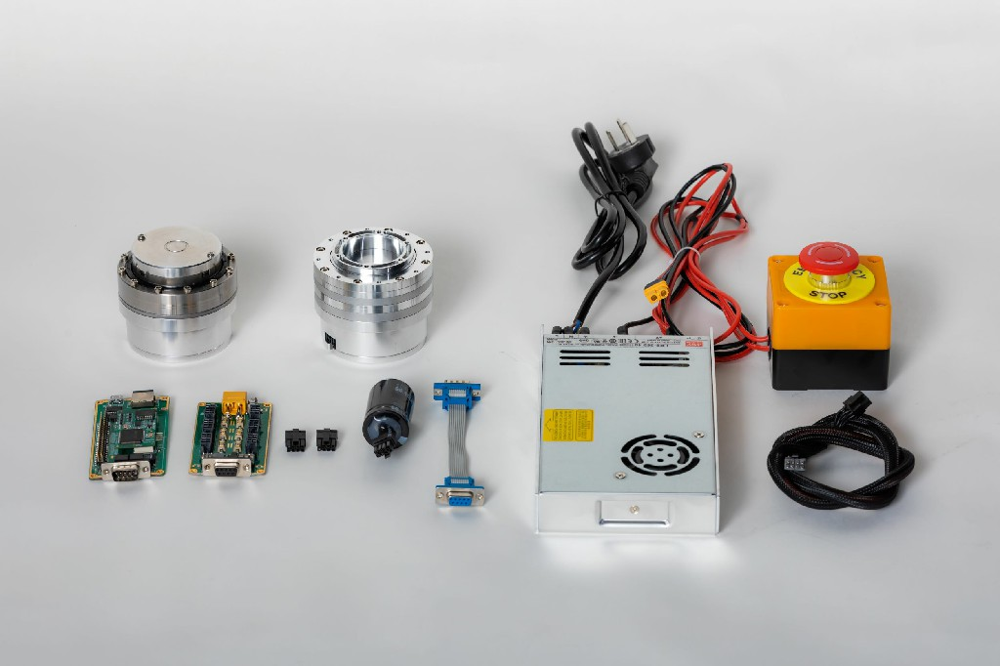

From front to back, from left to right: `ECB`, `HUB`, 2 `terminal resistors`, `regenerated brake capacitor`, `ECB cable`, `INNFOS SCA`, `SCA cable`, `emergency stop switch` + `power supply`.

**Connect the power supply**

*   Connect the power supply to the `HUB`.

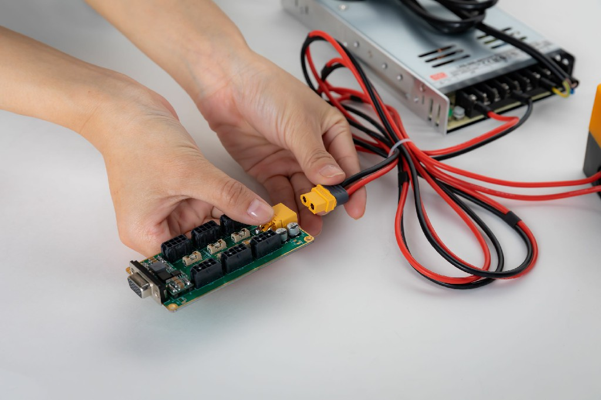

Note: The unit must be powered off and then plugged in. Otherwise the accessories may be damaged.

**Connect ECB**

*   Connect`HUB` and `ECB`

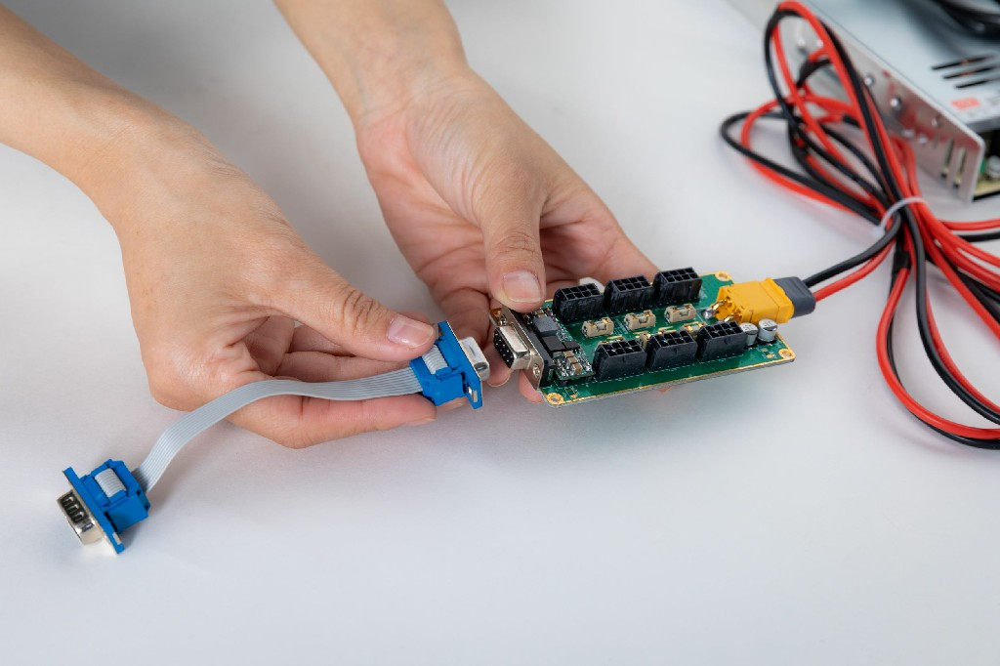 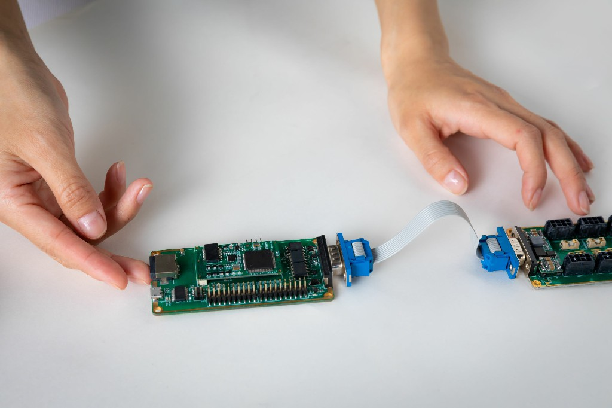

*   `HUB` inserts feedback brake capacitor and terminating resistor

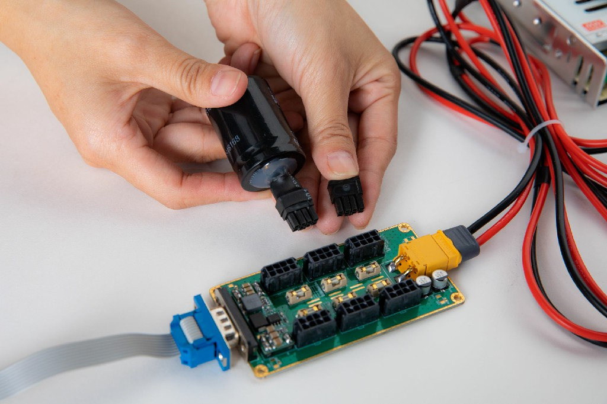 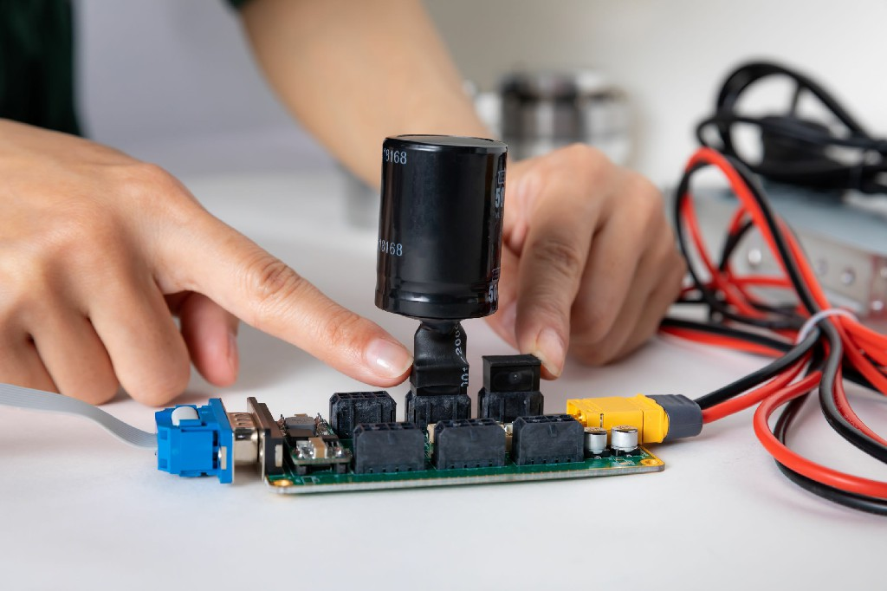

**Connect to SCA**

*   Connect the `HUB` and actuator with the actuator cable

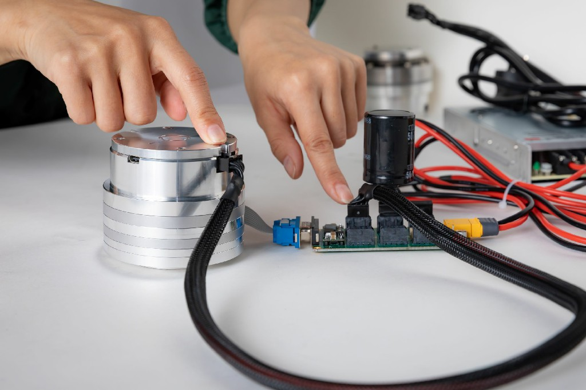

*   End effector plug-in termination resistor

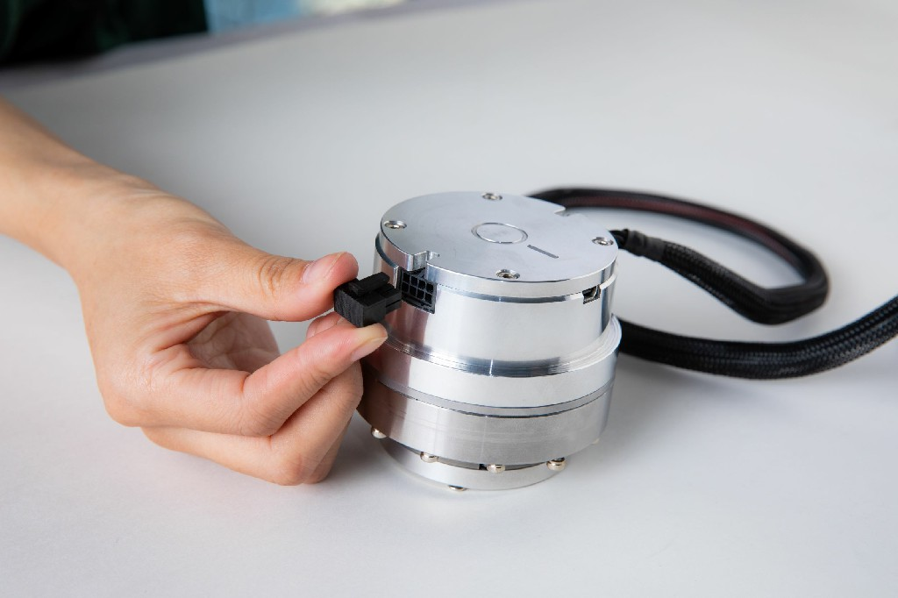

**Connect to a computer**

*   Connect`ECB` to computer with net cable

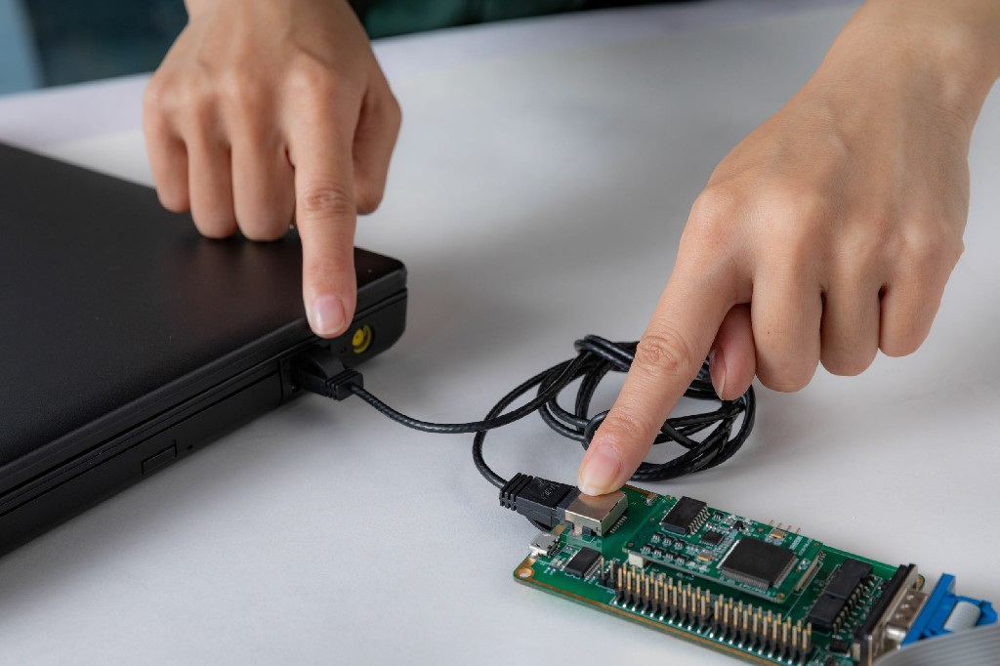

**Power on**

*   Power on and the actuator's supply voltage range is DC 24V-45V.

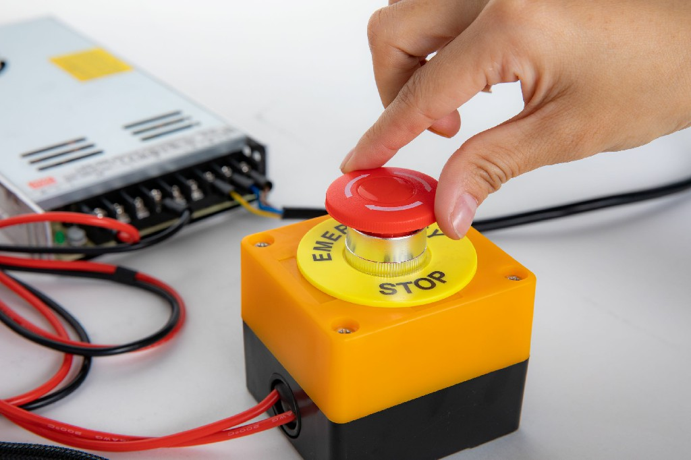

*   After power-on, the actuator LED status light will flash yellow. When the actuator is activated, the LED will flash green and the actuator can be communicated. If some error occurs, the LED will flash red, please check the actuator error code.
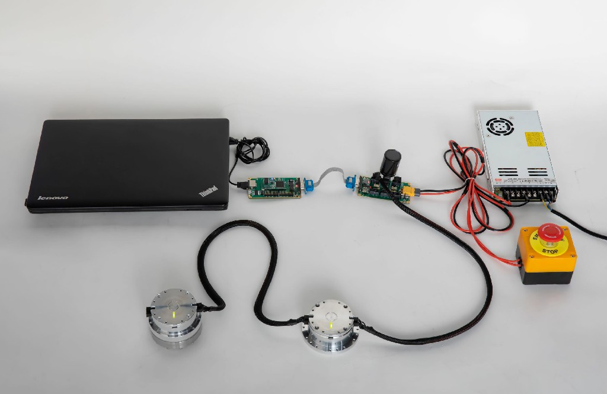

## Software installating and using instruction

**Download IAS**

*   If the computer system is linux, please visit [IAS(linux)](https://github.com/innfos/INNFOS-Actuator-Studio-linux.git) to get the latest version of IAS(INNFOS Actuator Studio)(Linux),If the system is window, please visit [IAS(windows)](https://github.com/innfos/INNFOS-Actuator-Studio-windows.git).

**Configure IP address**

*   For configuration steps, please refer to [Ethernet communication configuration](Ethernet_Configuration.md)

**Install IAS**

*   Install IAS, please refer to [IAS installation](INNFOS_Actuator_Studio_IAS_instruction.md)

**Usage** 

 

After successful installation, start IAS, click the "OK" button to enable the "Next" button, and then click "Next" until the following interface appears:

 

Click the "1" or "2" button to start the actuator, and the button "1" is green meaning successful starting up. Click on the message box or click on the "Details" button (located under button "1") to enter the actuator debug interface.

 

 **Position control**

*   Click the `Profile Position Mode`button on the left sidebar and then click`Activate Profile Position Mode`.Then enter the position value in "Settings" in units of R (range -127R~127R).

 

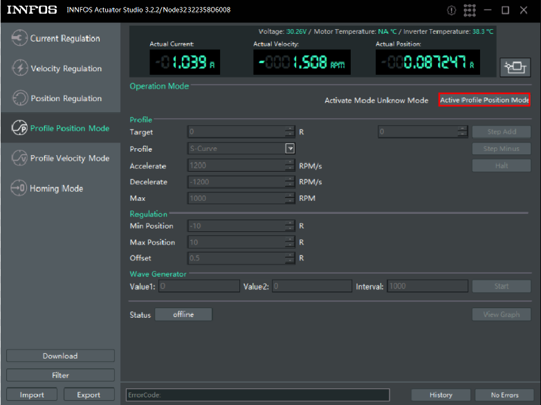 

For more information on IAS, please visit the[INNFOS Actuator Studio(IAS)instructions](#!pages/INNFOS_Actuator_Studio_IAS_instruction.md).

# Version change record
<table class="tableizer-table"><thead><tr class="tableizer-firstrow" style="background: PaleTurquoise; color: black;width:500px"><th >version</td><td>date</td><td>Modify content</td></tr>
 <tr><td>V1.0.0</td><td>2019-05</td><td>The first version</td></tr>
</tbody></table>
