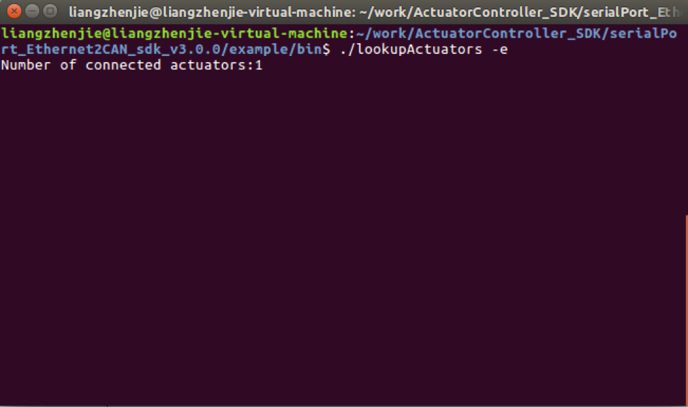
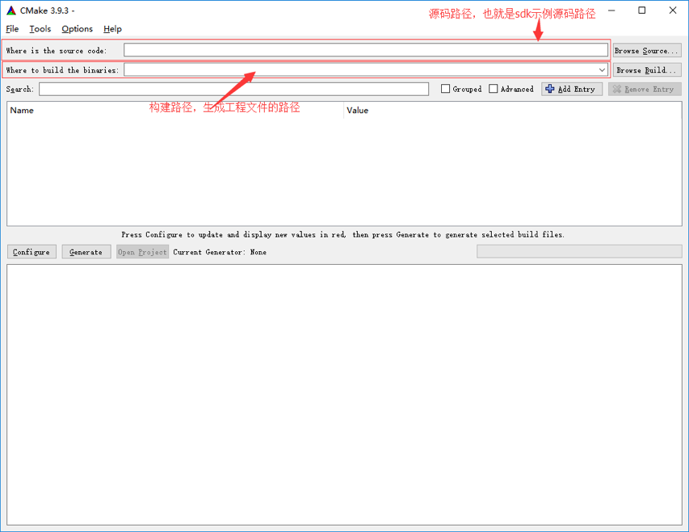
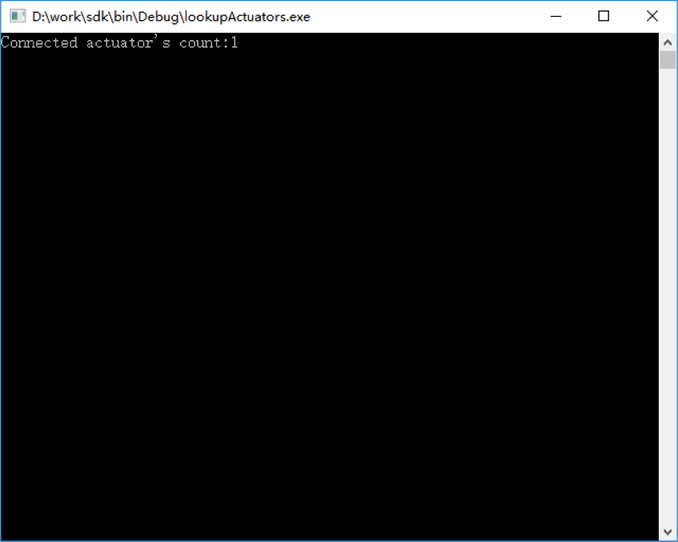
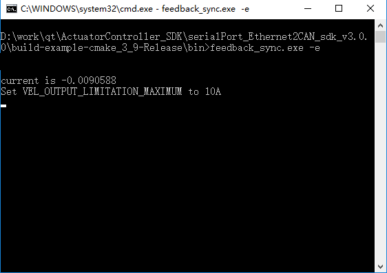

Ethernet Communication SDK
=========

## Instruction

*   the api provides a user-friendly interface that includes serial or ethernet communication (recommended) with multiple innfos actuators to send commands to multiple actuators simultaneously or to obtain actuator status and parameter information.
*   it is recommended that users who are new to the api should read the examples in the sdk first.

## Sdk download and directory description


#### download

*   visit the link download link to [download link](https://github.com/innfos/ActuatorController_SDK.git) download the sdk related files or execute the following command directly


```sh
$ git clone https://github.com/innfos/ActuatorController_SDK.git
```
    
## API related documentation

*   notes and related documentation please go to [document link](http://innfos.com/doc/index.html)

## SCA connection


Connect the device as shown above and turn it on again. 
Warning: do not plug or unplug all cables with electricity, otherwise the device may be damaged.

## Environment configuration and sample code compilation run

### linux

#### environment configuration

Please refer to <a href="#!pages/Ethernet_Configuration.md#linux_platform_environment_configuration">the Linux environment configuration</a>


#### Sample code compilation

* open the terminal and go to the`…\example`example directory, which has`CMakeLists.txt`

```bash
$ cmake CMakeLists.txt
$ make
```

*   after the input command is executed, a bin folder is generated in this directory, which stores the generated sample program.
*   after confirming that the actuator is properly connected and powered, the actuator will flash yellow and the sample code can be tested.

#### Sample program test

*   after proper connection and powered on, sca will flash yellow and can be tested the sample code

##### find connected actuators

*   open the terminal and enter the bin directory, enter the command

```bash
$./lookupActuators -e
```
*   this window will display the number of currently connected actuators. You can end the program with`ctrl+c`



**code description**

*   select different communication methods according to different parameters. The default is ethernet communication.

Note:the controller must be initialized before other operations can be performed.

``` cpp
//initialize controller
if(strcmp(argv[1],"-s")==0)
    ActuatorController::initController(Actuator::Via_Serialport);
elseif(strcmp(argv[1],"-e")==0)
    ActuatorController::initController();
```
*   associate the operation completion signal. After the user operates successfully, the signal will be triggered. According to different operationtype, the corresponding operation will be performed. In this example, the number of identified actuators will be printed after the automatic identification is completed.

``` cpp
//associated controller operation signal
int nOperationConnection = pController->m_sOperationFinished->s_Connect([=](uint8_t nDeviceId,uint8_t operationType){
   switch (operationType) {
   case Actuator::Recognize_Finished://automatic identification completed
       if(pController->hasAvailableActuator())
        {
            vector<uint8_t> idArray = pController->getActuatorIdArray();
            cout <<"Number of connected actuators:" << idArray.size() << endl;
        }
       break;
   default:
       break;
    }
});
```
*   the complete application must be associated with an error signal in order to receive feedback and respond accordingly when an error occurs inside the actuator. When`nDeviceId`is 0, the error is not specific to the actuator (eg unconnected error)

```cpp

//associated error signal
int nErrorConnection = pController->m_sError->s_Connect([=](uint8_t nDeviceId,uint16_t nErrorType,string errorInfo){
   if(nDeviceId==0)
    {
        cout <<"Error: " << (int)nErrorType <<" " << errorInfo << endl;
    }
   else
    {
        cout <<"Actuator " << (int)nDeviceId <<" " <<"error " << (int)nErrorType <<" " << errorInfo << endl;
    }
});

```

*   after the necessary signals are associated, the next corresponding operation is to identify the connected actuators.

```cpp
//automatically identify connected actuators
pController->autoRecoginze();
```

*   The event loop is a necessary step to ensure the internal communication of sdk. It is necessary to ensure that the event loop is not blocked so that sdk can trigger various signals.

```cpp
//execution controller event loop
while (!bExit)
{
    ActuatorController::processEvents();
}
```

*   finally disconnect the signal from all signals before the end of the program

```cpp
//disconnect the signal
pController->m_sOperationFinished->s_Disconnect(nOperationConnection);
pController->m_sError->s_Disconnect(nErrorConnection);

```

##### monitor actuator status

*   open the terminal, go to the `example/bin` directory, enter the command

```bash
$./monitorActuator -e
```

*   the actuator id is the `Actuator ID`, the attribute id is the monitored executor `attribute ID`, and the attribute value is the corresponding `attribute value`. You can end the program with `ctrl+c`


**code description**

*   all actuators are automatically turned on after automatic recognition. After each actuator is successfully turned on, the actuator::launch_finished signal is triggered. When all actuators are turned on, automatic refresh is started and the actuator data is read.

```cpp
int nLaunchedActuatorCnt =0;
//associated controller operation signal
int nOperationConnection = pController->m_sOperationFinished->s_Connect([&amp;](uint8_t nDeviceId,uint8_t operationType){
   switch (operationType) {
   case Actuator::Recognize_Finished://automatic identification completed
       if(pController->hasAvailableActuator())
        {
            vector<uint8_t> idArray = pController->getActuatorIdArray();
        cout <<"Number of connected actuators:" << idArray.size() << endl;
           for (uint8_t id: idArray) {
               if(pController->getActuatorAttribute(id,Actuator::ACTUATOR_SWITCH)==Actuator::ACTUATOR_SWITCH_OFF)
                {//Start the SCA if it is off
                    pController->launchActuator(id);
                }
               else
                {
                    ++ nLaunchedActuatorCnt;
                   if(nLaunchedActuatorCnt == pController->getActuatorIdArray().size())//all actuators have been started
                    {
                        autoRefresh();
                    }
                }
            }
        }
       break;
   case Actuator::Launch_Finished:
       if(++nLaunchedActuatorCnt == pController->getActuatorIdArray().size())//all actuators have been started
        {
            autoRefresh();
        }
       break;
   default:
       break;
    }
});
```

*   In order to monitor the change of the properties of the actuator, the signal`m_sActuatorAttrChanged`is required. When the user requests to read the properties of the actuator, a successful return will trigger the signal.

    
	
```cpp
//actuator attribute change signal controlled by the associated controller
int nAttrConnection =pController->m_sActuatorAttrChanged->s_Connect([=](uint8_t nDeviceId,uint8_t nAttrId,double value){
    cout <<"Actuator ID: " << (int)nDeviceId << endl;
    cout <<"atribute ID: " << (int)nAttrId << endl;
    cout <<"atribute value: " << value << endl;
    cout <<"----------------------------"<<endl;
});
```

#### control actuator

*   open the terminal, go to the `example/bin`directory, enter the command

```bash
$./operateActuator -e
```


*   indicate that the actuator has been found. Enter the command  `l 0 ` to start all connected actuators. If the startup is successful, the actuator will flash green, indicating successful startup. The terminal window is displayed as follows.


*  the corresponding mode of sca can be activated at this time. For example, input ` a 6`can activate the profile position mode, then input `p 5`, the actuator will rotate to 5 positions; input`a 7` can activate the `profile velocity` mode, then enter`v 500`, execute the device will rotate at 500rpm and stop rotating input`v 0`; input `a 1` can activate current mode, then input `c 0.6`, the actuator will rotate at a constant current of 0.6a (if the actuator does not move, you can gently turn it with your hand) actuator), you can `ctrl+c` and then`ctrl+d`to end the program (because there are multiple threads waiting for keyboard input) 

    

     

**code description**

*   the actuator can be operated after successfully started. `getActuatorIdArray` can get the short id of all actuators. The user can specify any id and operate. The actuator has multiple modes such as speed, current and position （`Actuator::ActuatorMode`）. The corresponding mode must be activated before the corresponding operation can be performed.


```cpp
 vector<uint8_t> idArray = controllerInst->getActuatorIdArray();
switch (directive)
{
case'a'://Activate actuator specified mode, command format: a mode id (actuator::actuatormode)
    controllerInst->activeActuatorMode(idArray, Actuator::ActuatorMode((int)value));
   break;
case'p'://specify the actuator position, command format: p laps (-127 to 127)
   for (int i =0; i < idArray.size(); ++i)
    {
        controllerInst->setPosition(idArray.at(i), value);
    }
   break;
case'c'://Specify actuator current, command format: c current value（A）
   for (int i =0; i < idArray.size(); ++i)
    {
        controllerInst->setCurrent(idArray.at(i), value);
    }
   break;
case'v'://Specify actuator speed, command format: v speed value（RPM）
   for (int i =0; i < idArray.size(); ++i)
    {
        controllerInst->setVelocity(idArray.at(i), value);
    }
   break;
case'l'://Start the specified executor, the format of the instruction: l executor id (id is 0 to start all actuators)
   if(uint8_t(value)==0)
    {
        controllerInst->launchAllActuators();
    }
   else
    {
        controllerInst->launchActuator(uint8_t(value));
    }
   //cout << "launch"<<endl;
   break;
case's'://Close the specified executor, the format of the instruction: l executor id (id is 0 to start all actuators)

   if(uint8_t(value)==0)
    {
        controllerInst->closeAllActuators();
    }
   else
    {
        controllerInst->closeActuator(uint8_t(value));
    }
   //cout << "close"<<endl;
   break;
default:
   break;
}
```

#### controller parameter adjustment

*   open the terminal, go to the`example/bin`directory, enter the command

```bash
$./tuneActuator -e
```

*  this sample program automatically starts the actuator and sets the position loop output to 3000 rpm, and the maximum current output of the speed loop is 16.5a.

If you use the `profile position` mode to rotate the actuator, the maximum speed of the actuator will not exceed 3000rpm; if you use the `profile velocity` mode to rotate the actuator, the maximum current of the actuator will not exceed 16.5a, you can end the program with `ctrl+c`

  
    
 
    
**code description**
    

*   •	This sample program automatically starts the actuator. After successful startup, the actuator properties can be adjusted. The speed loop current output adjusts the actuator torque under the speed loop. The position loop speed output adjusts the speed of the position loop. See the sca quick start instructions for details.

    
    
```cpp
//Actuator property adjustment, the adjustment is successful, will trigger the actuator property change signal

void tuneActuator()
{
    ActuatorController * pController = ActuatorController::getInstance();
    vector<uint8_t> idArray = pController->getActuatorIdArray();
   for (uint8_t id: idArray) {
       //adjust actuator speed loop minimum current output
        pController->setMinOutputCurrent(id,-10);
       //adjust actuator speed loop maximum current output
        pController->setMaxOutputCurrent(id,10);
       //adjust actuator position loop minimum speed output
        pController->setMinOutputVelocity(id,-2000);
       //adjust the maximum speed output of the actuator position loop, the maximum value is greater than the minimum value	
        pController->setMaxOutputVelocity(id,2000);
       //mode_profile_pos Mode_Profile_Posadjust the maximum speed（RPM）
        pController->setActuatorAttribute(id,Actuator::PROFILE_POS_MAX_SPEED,1000);
    }
}
```

#### actuator zero

*   open the terminal, go to the`example/bin`directory, enter the command

```bash
$./homingActuator -e
```


*   indicate that the current position of the actuator has been set to zero, the range is -9.5r to 9.5r, and the position limit is turned on. If the position is outside the range in the `profile position` mode, the actuator will not rotate, `ctrl+c` end program
 


**code description**

*   after the autostart is completed, `setHomingPosition` sets the current position `getActuatorAttribute(id,Actuator::ACTUAL_POSITION)` to 0, `setMaxPosLimit` and `setMinPosLimit` sets the maximum and minimum position limits, `setActuatorAttribute(id,Actuator::POS_OFFSET,0.5)` set the limit offset.
	
```cpp
    //actuator 0 bit and limit adjustment
void setActuatorLimitation()
{
    ActuatorController * pController = ActuatorController::getInstance();
    vector<uint8_t> idArray = pController->getActuatorIdArray();
   for (uint8_t id : idArray) {
       //the current position of the actuator is changed to 0, and the minimum and maximum positions are set to -10, 10, the offset is set to 0.5, and the actuator's range of motion becomes (-9.5, 9.5).
        pController->setHomingPosition(id,pController->getActuatorAttribute(id,Actuator::ACTUAL_POSITION));
        pController->setMinPosLimit(id,-10);
        pController->setMaxPosLimit(id,10);
        pController->setActuatorAttribute(id,Actuator::POS_OFFSET,0.5);
    }
    bSetLimitation =true;
}
```

*   the parameter setting is completed and the parameters are saved. Otherwise, the parameter settings will be discarded after shutdown.

```cpp
pController->saveAllParams(nDeviceId);
```

#### actuator length id

*   open the terminal and enter the`example/bin`directory, enter the command

```bash
$./longIdAndByteId -e
```

*   it is possible to acquire and convert long and short ids, and to obtain communication ip addresses by long id.

**code description**

*   the signal variable ends with an l. The signal is associated with the actuator length id and can be communicated with a long id. The difference between the long and short id is that the long id contains the communication address and the short id, and can be converted to each other (if different ip addresses have the same short id executor, the short id conversion long id will randomly convert one long under one ip address id).
    

```cpp
//associated controller's longid operation signal
int nOperationConnection = pController->m_sOperationFinishedL->s_Connect([&amp;](uint64_t nDeviceId,uint8_t operationType){
   switch (operationType) {
   case Actuator::Recognize_Finished://automatic identification completed
       if(pController->hasAvailableActuator())
        {
           //get the longid array get the longid array
            vector<uint64_t> longIdArray = pController->getActuatorLongIdArray();
           //get the byteid array
            vector<uint8_t> idArray = pController->getActuatorIdArray();
           for (uint64_t id: longIdArray) {
           //get the communication ip address in the long id
                cout <<"Communication IP is " << pController->toString(id) << endl;
               //convert longid to byteid
                cout <<"Long id " << id <<" convert to byte id " << (int)pController->toByteId(id) << endl;
            }
           for(uint8_t id : idArray)
            {
               //convert byteid to longid
                cout <<"Byte id " << (int)id <<" convert to long id " << pController->toLongId(id) << endl;
            }
        }
       break;
   default:
       break;
    }
});
```

#### synchronous response

* open the terminal and enter the `example/bin`directory, enter the command

```bash
$./feedback_sync -e
```

*   getactuatorattributewithack and setactuatorattributewithack are the interfaces of the two synchronous responses provided by sdk. Corresponding to getactuatorattribute and setactuatorattribute, the properties of the executor can be get synchronously. Calling getactuatorattributewithack and setactuatorattributewithack will block the current program until the result is returned (regardless of success or failure).

**code description**

*   `getActuatorAttributeWithACK` and `setActuatorAttributeWithACK`are the interfaces of the two synchronous responses provided by sdk. Corresponding to`getActuatorAttribute` and `setActuatorAttribute`，you can get or set the properties of the executor synchronously. Calling`getActuatorAttributeWithACK` and `setActuatorAttributeWithACK`will block the current program until the result is returned (regardless of success or failure).

```cpp

ActuatorController * pController = ActuatorController::getInstance();
    vector<uint8_t> idArray = pController->getActuatorIdArray();
   for (uint8_t id: idArray) {
       bool bSuccess =false;
       //read current and wait for return if read fails bsuccess is false
       double current = pController->getActuatorAttributeWithACK(id,Actuator::ACTUAL_CURRENT,&amp;bSuccess);
       if(bSuccess)
            cout <<"current is " << current << endl;
       //Set the maximum current output of the speed loop and wait for the return. If the setting fails, the value of bsuccess is false. (this interface cannot be used to set speed, position, current)
        bSuccess = pController->setActuatorAttributeWithACK(id,Actuator::VEL_OUTPUT_LIMITATION_MAXIMUM,10);
       if(bSuccess)
            cout <<"Set VEL_OUTPUT_LIMITATION_MAXIMUM to 10A" << endl;
    }
```

### windows

#### environment configuration


Please refer to the <a href="#!pages/Ethernet_Configuration.md#windows平台环境配置"> windowsenvironment configuration</a>


#### •	Sample code compilation

*   run cmake-gui to appear as the right interface:
*   the source path is `…\example` in the directory structure, containing the cmakelists.txt file. The build path can be customized, being used to generate the project file. After the path is configured, click the generate button to pop up the following interface.




*   if the red box is not a 64-bit generator, click on the drop-down triangle, select the 64-bit generator, and then click the finish button. Once successful, the visual studio project file will be formed and can be compiled with visual studio. Compiling the complete project to generate a bin directory, there is a debug or release folder (corresponding to the compiled version), the file in the directory structure `…\sdk\lib\windows_x64\debug`or`…\sdk\lib\windows_x64\release` is copied to the debug or release directory under the bin of the corresponding version. Double-clicking the exe in the directory will run the sample program normally.


#### Sample program test


##### Find connected actuators

*    after confirming that the actuator is properly connected and powered, the actuator will flash yellow and the sample code can be tested.

Open a command line window and go to the bin directory, enter the command ./lookupactuators.exe -e


```bash
./lookupActuators.exe -e 
```





##### •	Monitor actuator status


*   open a command line window and go to the bin directory and enter the command ./monitoractuator.exe -e

```bash
./monitorActuator.exe -e
```


##### Control sca


*   open a command line window, go to the bin directory and enter the command 


```bash
./operateActuator.exe -e
```


This indicates that the actuator has been found. Enter the command l 0 to start all connected scas. If startup is successful, the actuator will flash green, the cmd window is displayed as shown below.


*    the corresponding mode of sca can be activated at this time,for example, input a 6 can activate profile position mode, then inputting p 10 will lead to rotate to 10 turns; input a 7 can activate profile velocity mode, then input v 500, sca will rotate at 500rpm and stop rotating input v0; input a 1 can activate current mode, then input c 0.6, the actuator will rotate at a constant current of 0.6a (if the actuator does not move, you can gently turn it with your hand) actuator), the program will be ended with ctrl+c.


##### Actuator parameter adjustmen

*   open a command line window, go to the bin directory and enter the command 

```bash
./tuneActuator.exe -e
```

*   this sample program will automatically starts the actuator and sets the position loop output to 3000 rpm. The maximum current output of the speed loop is 16.5 a. If the actuator is rotated using the `profile position` mode, the maximum speed of the actuator will not exceed 3000 rpm; if `profile velocity` is used mode rotation actuator, the maximum current of the actuator will not exceed 16.5a, and the program can be terminated by `ctrl+c`.


##### Sca zero

*   open a command line window, go to the bin directory and enter the command

```bash
./homingActuator.exe -e
```

*   as shown in the figure, the current position of the actuator has been set to zero, the range is -9.5r to 9.5r, and the position limit is turned on if the `profile position` mode, enter a position outside this range, the actuator will not rotate, the program can be ended with`ctrl+c`


##### Sca length id


*   open a command line window, go to the bin directory, enter the command

```bash
./longIdAndByteId.exe -e
```

The acquisition of the length id and the mutual conversion can be performed, and the communication ip address can be obtained by the long id.



##### 	Synchronous response

*   open a command line window, go to the bin directory and enter the command

```bash
./feedback_sync.exe -e
```

*   run`feedback_sync.exe`，to associate the corresponding signal. The operation in the callback is an asynchronous response and does not block the current program. Synchronous response will block the current program until sdk returns the result. In comparison, the synchronous response is simple but inefficient because it needs to wait for the actuator response (and the actuator part does not have a synchronous response, such as setting position, speed, current etc.) If the efficiency requirements are high, an asynchronous response is recommended.

## SDK instructions

### overview

*   SDK provides an interface for communication with the actuator. It can search, status query, property adjustment and custom control of the connected actuator through serial port or ethernet. If you want to quickly understand the basic content and usage of sdk, please see the relevant code in example/src

### Use sdk in the project


*   this sdk follows the `c++11` standard, so make sure the compile option supports `c++11`（before building the project (eg -std=c++11 in gcc);
*   the basic steps to integrate sdk into your project (preferably refer to cmakelists.txt in example):
*   add sdk/include, sdk/include/asio to the project's include directory to associate methods in the shared library;
*   the library file directory sdk/lib/linux_x86_64 (the windows directories are sdk/lib/debug and sdk/lib/release) so that the executable can be linked to the shared library and the runtime can be associated with the shared library;
*   add the necessary elements to the build process (such as target_link_libraries in cmake)

### Namespaces


* the namespace actuator is defined in ../sdk/include/`Actuator` define.h and enumerates all the types and type values used in sdk:

<table style="width:600px"><thead><tr><th colspan="2" style=background:PaleTurquoise>Connection status for connection status determination of actuator and can[ConnectStatus]</th></tr></thead><tbody>
 <tr><td>command byte</td><td>description</td></tr> <tr><td>NO_CONNECT,</td><td>no connection</td></tr> <tr><td>CAN_CONNECTED=0x02,</td><td>CANcommunication connection succeeded</td></tr> <tr><td>ACTUATOR_CONNECTED=0x04,</td><td>actuator connection succeeded</td></tr></tbody></table>

<table style="width:600px">
<thead><tr class="tableizer-firstrow"><th  colspan="2" style=background:PaleTurquoise>Channel id, the channel index used to identify the actuator chart data[Channel_ID]</th></tr></thead><tbody>
 <tr><td>command byte</td><td>description</td> <tr><td>channel_1=0,</td><td>Chart data 1 channel, given ideal curve</td></tr> <tr><td>channel_2,</td><td>Chart data 2 channels, actual current curve</td></tr> <tr><td>channel_3,</td><td>Chart data 3 channels, actual speed curve</td></tr> <tr><td>channel_4,</td><td>Chart data 4 channels, actual location</td></tr> <tr><td>channel_cnt</td><td></td></tr></tbody></table>

<table style="width:600px">
<thead><tr class="tableizer-firstrow"><th  colspan="2" style=background:PaleTurquoise>Error type definition, defines error codes such as actuator internals and connections[ErrorsDefine] </th></tr></thead><tbody>
 <tr><td>command byte</td><td>description</td> <tr><td>ERR_NONE = 0,</td><td>no error</td></tr> <tr><td>ERR_ACTUATOR_OVERVOLTAGE=0x01,</td><td>Actuator overvoltage error</td></tr> <tr><td>ERR_ACTUATOR_UNDERVOLTAGE=0x02,</td><td>Actuator undervoltage error</td></tr> <tr><td>RR_ACTUATOR_LOCKED_ROTOR=0x04,</td><td>Actuator locked error</td></tr> <tr><td>ERR_ACTUATOR_OVERHEATING=0x08</td><td>Actuator overheating error</td></tr> <tr><td>enum OnlineStatus{</td><td>Actuator read or write error</td></tr> <tr><td>ERR_ACTUATOR_MULTI_TURN=0x20,</td><td>Actuator multi-turn count error</td></tr> <tr><td>ERR_INVERTOR_TEMPERATURE_SENSOR=0x40,</td><td>Actuator inverter temperature error</td></tr> <tr><td>ERR_CAN_COMMUNICATION=0x80,</td><td>Actuator temperature sensor error</td></tr> <tr><td>ERR_ACTUATOR_TEMPERATURE_SENSOR=0x100,</td><td>Actuator can communication error</td></tr> <tr><td>ERR_DRV_PROTECTION=0x400,</td><td>Actuator DRV protection</td></tr> <tr><td>ERR_ID_UNUNIQUE=0x800</td><td>Actuator ID is not unique error</td></tr> <tr><td>ERR_ACTUATOR_DISCONNECTION=0x801,</td><td>Actuator not connected error</td></tr> <tr><td>ERR_CAN_DISCONNECTION=0x802,</td><td>CAN Can communication converter board is not connected incorrectly</td></tr> <tr><td>ERR_IP_ADDRESS_NOT_FOUND=0x803,</td><td>No ip address error available</td></tr> <tr><td>ERR_ABNORMAL_SHUTDOWN=0x804,</td><td>Actuator abnormal shutdown error</td></tr> <tr><td>ERR_SHUTDOWN_SAVING=0x805,</td><td>Parameter save error when actuator is shut down</td></tr> <tr><td>ERR_UNKOWN=0xffff</td><td>unknown error</td></tr></tbody></table>

<table style="width:600px">
<thead><tr class="tableizer-firstrow"><th colspan="2"style=background:PaleTurquoise>Online status, used to identify if the actuator is connected[OnlineStatus]</th></tr></thead><tbody>
 <tr><td>command byte</td><td>description</td></tr> <tr><td>Status_Online=0x00,</td><td>actuator online</td></tr> <tr><td>Status_Offline=0x01,</td><td>actuator offline</td></tr></tbody></table>

<table style="width:600px">
<thead><tr class="tableizer-firstrow"><th colspan="2"style=background:PaleTurquoise>Switch status, identifies the actuator status of the switch[SwitchStatus]</th></tr></thead><tbody>
 <tr><td>command byte</td><td>description</td></tr> <tr><td>ACTUATOR_SWITCH_OFF=0,</td><td>actuator switch off</td></tr> <tr><td>ACTUATOR_SWITCH_ON=1,</td><td>actuator switch on</td></tr></tbody></table>

<table style="width:600px">
<thead><tr class="tableizer-firstrow"><th colspan="2"style=background:PaleTurquoise>Chart switch to identify the opening or closing of the actuator chart function[ChartSwitchStatus]</th></tr></thead><tbody>
<tr><td>command byte</td><td>description</td></tr> <tr><td>CHART_SWITCH_OFF=0,</td><td>Chart function is off and no chart data is generated</td></tr> <tr><td>CHART_SWITCH_ON=1,</td><td>Chart function is turned on, triggering chart thresholds will generate chart data</td></tr></tbody></table>

<table style="width:600px">
<thead><tr class="tableizer-firstrow"><th colspan="2"style=background:PaleTurquoise>Current loop chart index to identify whether the current chart is an iq value or an id value [CurrnetChart]</th></tr></thead><tbody>
<tr><td>command byte</td><td>description</td></tr> <tr><td>IQ_CHART=0,</td><td>Chart data 2 channels, actual current iq curve</td></tr> <tr><td>ID_CHART=1,</td><td>Chart data 2 channels, actual current id curve</td></tr></tbody></table>

<table style="width:600px">
<thead><tr class="tableizer-firstrow"><th colspan="2"style=background:PaleTurquoise>Sca communicates with the actuator through ethernet or serial port. When initializing the actuator controller, the default mode is ethernet communication[CommunicationType]</th></tr></thead><tbody>
<tr><td>command byte</td><td>description</td></tr> <tr><td>Via_Ethernet,</td><td>ethernet communication</td></tr> <tr><td>Via_Serialport,</td><td>serial communication</td></tr></tbody></table>

<table style="width:600px">
<thead><tr class="tableizer-firstrow"><th colspan="2"style=background:PaleTurquoise>Operation identification, identification operation completed, can be used to determine the execution status of the actuator controller[OperationFlags]</th></tr></thead><tbody>
<tr><td>command byte</td><td>description</td></tr> <tr><td>Recognize_Finished</td><td>Identification completed</td></tr> <tr><td>Launch_Finished</td><td>The actuator is started (if multiple actuators are connected, multiple startup completion signals will be triggered)</td></tr> <tr><td>Close_Finished</td><td>The actuator is closed (if multiple actuators are connected, multiple shutdown completion signals will be triggered)</td></tr> <tr><td>Save_Params_Finished</td><td>The actuator parameters are saved (if multiple actuators are connected, multiple parameter save completion signals will be triggered)</td></tr> <tr><td>Save_Params_Failed</td><td>Executor parameter save failed</td></tr> <tr><td>Attribute_Change_Finished</td><td>not implemented yet</td></tr></tbody></table>

<table style="width:600px">
<thead><tr class="tableizer-firstrow"><th colspan="2"style=background:PaleTurquoise>Actuator mode, identifying the mode of the current actuator[ActuatorMode]</th></tr></thead><tbody>
<tr><td>command byte</td><td>description</td></tr> <tr><td>Mode_None</td><td>&nbsp;</td></tr> <tr><td>Mode_Cur</td><td>current mode</td></tr> <tr><td>Mode_Vel</td><td>speed mode</td></tr> <tr><td>Mode_Pos</td><td>position mode</td></tr> <tr><td>Mode_Teaching</td><td>not implemented yet</td></tr> <tr><td>Mode_Profile_Pos=6</td><td>Profile position mode, compared to the position mode,  has an acceleration deceleration process</td></tr> <tr><td>Mode_Profile_Vel</td><td>Profile speed mode, compared to speed mode, has an acceleration deceleration process</td></tr> <tr><td>Mode_Homing</td><td>homing mode</td></tr></tbody></table>

<table style="width:600px">
<thead><tr class="tableizer-firstrow"><th colspan="2"style=background:PaleTurquoise>Actuator property identifies all relevant properties of the executor [ActuatorAttribute]</th></tr></thead><tbody>
 <tr><td>command byte</td><td>definition</td></tr> <tr><td>CUR_IQ_SETTING</td><td>current iq value</td></tr> <tr><td>CUR_PROPORTIONAL</td><td>current ratio</td></tr> <tr><td>CUR_INTEGRAL</td><td>current integration</td></tr> <tr><td>CUR_ID_SETTING</td><td>current id value</td></tr> <tr><td>CUR_MINIMUM</td><td>reserve</td></tr> <tr><td>CUR_MAXIMUM</td><td>reserve</td></tr> <tr><td>CUR_NOMINAL</td><td>reserve</td></tr> <tr><td>CUR_OUTPUT</td><td>reserve</td></tr> <tr><td>CUR_MAXSPEED</td><td>current loop maximum speed</td></tr> <tr><td>ACTUAL_CURRENT</td><td>actual current value</td></tr> <tr><td>VEL_SETTING</td><td>velocity setting</td></tr> <tr><td>VEL_PROPORTIONAL</td><td>velocity proportional</td></tr> <tr><td>VEL_INTEGRAL</td><td>velocity integral</td></tr> <tr><td>VEL_OUTPUT_LIMITATION_MINIMUM</td><td>velocity output minimum limitation</td></tr> <tr><td>VEL_OUTPUT_LIMITATION_MAXIMUM</td><td>velocity output maximum limitation</td></tr> <tr><td>ACTUAL_VELOCITY</td><td>actual velocity</td></tr> <tr><td>POS_SETTING</td><td>position setting</td></tr> <tr><td>POS_PROPORTIONAL</td><td>position proportional</td></tr> <tr><td>POS_INTEGRAL</td><td>position integral</td></tr> <tr><td>POS_DIFFERENTIAL</td><td>position differential</td></tr> <tr><td>POS_OUTPUT_LIMITATION_MINIMUM</td><td>position output minimum limitation</td></tr> <tr><td>POS_OUTPUT_LIMITATION_MAXIMUM</td><td>position output maximum limitation</td></tr> <tr><td>POS_LIMITATION_MINIMUM</td><td>minimum limitation of position</td></tr> <tr><td>POS_LIMITATION_MAXIMUM</td><td>maximum limitation of position</td></tr> <tr><td>HOMING_POSITION</td><td>homing position</td></tr> <tr><td>ACTUAL_POSITION</td><td>actual position</td></tr> <tr><td>PROFILE_POS_MAX_SPEED</td><td>profile position Profile position max speed</td></tr> <tr><td>PROFILE_POS_ACC</td><td>profile position Profile position accelerated speed</td></tr> <tr><td>PROFILE_POS_DEC</td><td>profile position Profile position declined speed</td></tr> <tr><td>PROFILE_VEL_MAX_SPEED</td><td>profile velocity Profile position max speed</td></tr> <tr><td>PROFILE_VEL_ACC</td><td>profile velocity Profile velocity accelerated speed</td></tr> <tr><td>PROFILE_VEL_DEC</td><td>profile velocity Profile velocity declined speed</td></tr> <tr><td>CHART_FREQUENCY</td><td>Chart frequency</td></tr> <tr><td>CHART_THRESHOLD</td><td>Chart threshold</td></tr> <tr><td>CHART_SWITCH</td><td>Chart switch</td></tr> <tr><td>POS_OFFSET</td><td>Position offset</td></tr> <tr><td>VOLTAGE</td><td>voltage</td></tr> <tr><td>POS_LIMITATION_SWITCH</td><td>Position limitation switch</td></tr> <tr><td>HOMING_CUR_MAXIMUM</td><td>Homing current maximum</td></tr> <tr><td>HOMING_CUR_MINIMUM</td><td>Homing current minimum</td></tr> <tr><td>CURRENT_SCALE</td><td>Current scale</td></tr> <tr><td>VELOCITY_SCALE</td><td>Velocity scale</td></tr> <tr><td>FILTER_C_STATUS</td><td>Whether current loop filtering is on</td></tr> <tr><td>FILTER_C_VALUE</td><td>Current filter value</td></tr> <tr><td>FILTER_V_STATUS</td><td>Whether speed loop filtering is on</td></tr> <tr><td>FILTER_V_VALUE</td><td>Speed filter value</td></tr> <tr><td>FILTER_P_STATUS</td><td>Whether position loop filtering is on</td></tr> <tr><td>FILTER_P_VALUE</td><td>Position filter value</td></tr> <tr><td>INERTIA</td><td>inertia</td></tr> <tr><td>LOCK_ENERGY</td><td>Lock protection energy</td></tr> <tr><td>ACTUATOR_TEMPERATURE</td><td>actuator temperature</td></tr> <tr><td>INVERTER_TEMPERATURE</td><td>inverter temperature</td></tr> <tr><td>ACTUATOR_PROTECT_TEMPERATURE</td><td>actuator protection temperature</td></tr> <tr><td>ACTUATOR_RECOVERY_TEMPERATURE</td><td>actuator recovery temperature</td></tr> <tr><td>INVERTER_PROTECT_TEMPERATURE</td><td>inverter protection temperature</td></tr> <tr><td>INVERTER_RECOVERY_TEMPERATURE</td><td>inverter recovery temperature</td></tr> <tr><td>CALIBRATION_SWITCH</td><td>reserve</td></tr> <tr><td>CALIBRATION_ANGLE</td><td>reserve</td></tr> <tr><td>ACTUATOR_SWITCH</td><td>actuator switch</td></tr> <tr><td>FIRMWARE_VERSION</td><td>firmware version</td></tr> <tr><td>ONLINE_STATUS</td><td>online status</td></tr> <tr><td>DEVICE_ID</td><td>device id</td></tr> <tr><td>SN_ID</td><td>actuator sn_id</td></tr> <tr><td>MODE_ID</td><td>actuator current mode</td></tr> <tr><td>ERROR_ID</td><td>error id</td></tr> <tr><td>RESERVE_0</td><td>reserve</td></tr> <tr><td>RESERVE_1</td><td>reserve</td></tr> <tr><td>RESERVE_2</td><td>reserve</td></tr> <tr><td>RESERVE_3</td><td>reserve</td></tr> <tr><td>DATA_CNT</td><td>number of attributes</td></tr> <tr><td>DATA_CHART</td><td>reserve</td></tr> <tr><td>DATA_INVALID</td><td>invalid data</td></tr></tbody></table>
 

# Version change records
<table><thead><tr style="background:PaleTurquoise"><th>Version</th><th>	Update time</th><th>	update contents</th></tr></thead><tbody> <tr><td>V2.0.0</td><td>2019-03-09</td><td>version 2.0</td></tr> <tr><td>V1.0.0</td><td>2018-04-17</td><td>version 1.0</td></tr></tbody></table>
