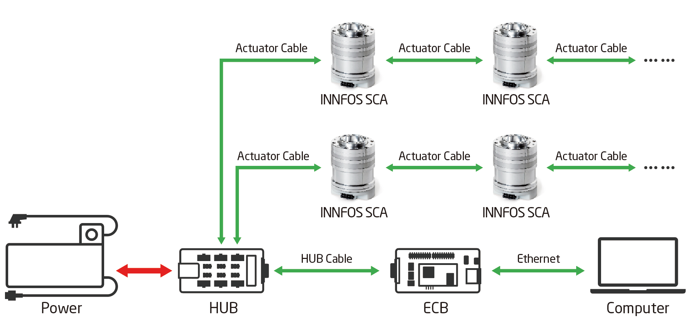
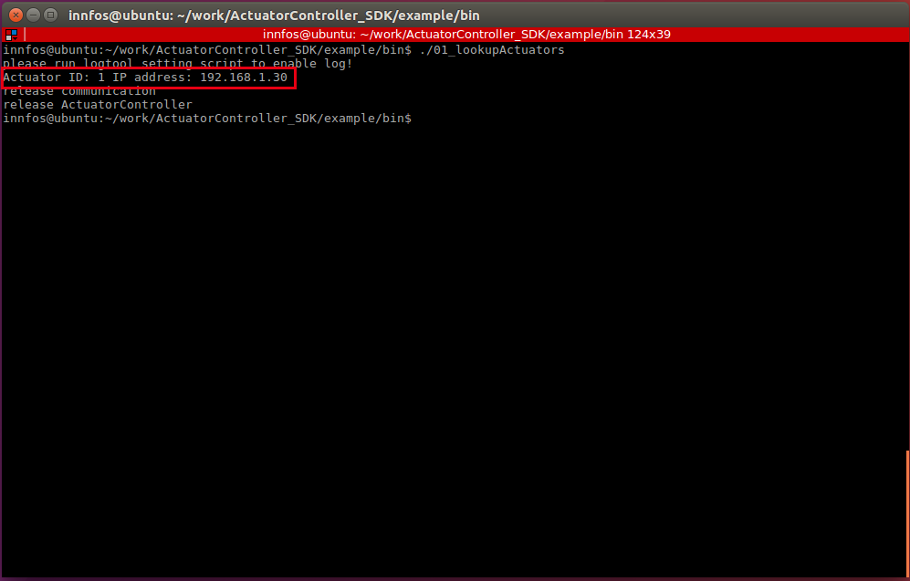
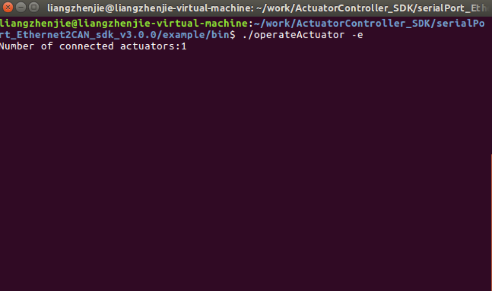
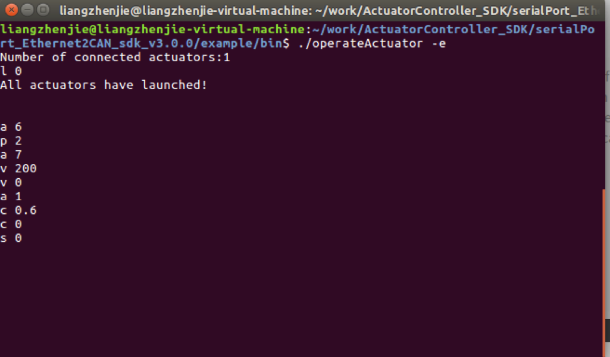

Ethernet Communication SDK(C++)
=========

## Instruction

*   the SDK provides a user-friendly interface that includes serial or ethernet communication (recommended) with multiple innfos actuators to send commands to multiple actuators simultaneously or to obtain actuator status and parameter information.
*   it is recommended that users who are new to the API should read the examples in the SDK first.

## SDK download and directory description


#### download

*   visit the link download link to [download link](https://github.com/mintasca/innfos-cpp-sdk.git) download the SDK related files or execute the following command directly


```sh
$ git clone https://github.com/mintasca/innfos-cpp-sdk.git
```
    
## API related documentation

*   notes and related documentation please go to [document link](https://mintasca.com/doc/index.html)

## SCA connection



Connect the device as shown above and turn it on again. 
Warning: do not plug or unplug all cables with electricity, otherwise the device may be damaged.

## Environment configuration and sample code compilation run

### linux

#### environment configuration

Please refer to <a href="#!pages/Ethernet_Configuration.md#linux_platform_environment_configuration">the Linux environment configuration</a>


#### Sample code compilation

* Open the terminal and go to the`…\example`example directory, which has`CMakeLists.txt`

```bash
$ cmake CMakeLists.txt
$ make
```

*   after the input command is executed, a bin folder is generated in this directory, which stores the generated sample program.
*   after confirming that the actuator is properly connected and powered, the actuator will flash yellow and the sample code can be tested.

#### Sample program test

*   after proper connection and powered on, sca will flash yellow and can be tested the sample code

##### find connected actuators

*   Open the terminal and enter the bin directory, enter the command

```bash
$./01_lookupActuators
```
*   This window will display the number of currently connected actuators. A connected actuator with ID 1 is shown in the example whose communication IP address is 192.168.1.30.



**code description**

*   Initialize actuator controller.

Note:the controller must be initialized before other operations can be performed.

``` cpp
ActuatorController * pController = ActuatorController::initController();
```
*   An error- in-variable needs to be defined to find connected actuators, which can return the corresponding error code when the actuators are not found. The lookupActuators function can return all UnifiedID arrays of connected actuators.

``` cpp
//ec Define an error type, ec==0x00 means no error, ec will be passed to pcontroller-> lookupActuators(ec) by reference,
//when the error occurs, ec value will be modified by SDK to the corresponding error code
Actuator::ErrorsDefine ec;
//Find the connected actuators and return the UnifiedID of all actuators found.
//UnifiedID is a structure composed of the actuator ID (actuatorID) and IP(ipAddress) of ECB(ECU)
std::vector<ActuatorController::UnifiedID> uIDArray = pController->lookupActuators(ec);
```
*  Output UnifiedID information of all connected actuators; output error code if no actuator is found

``` cpp

//If the size of the uIDArray is greater than zero, the connected actuators have been found
if(uIDArray.size() > 0)
{
    for(auto uID : uIDArray)
    {
        cout << "Actuator ID: "<<(int)uID.actuatorID << " IP address: " << uID.ipAddress.c_str() << endl;
    }
}
else
{
    //ec=0x803 Communication with ECB(ECU) failed
    //ec=0x802 Communication with actuator failed
    cout << "Connected error code:" << hex << ec << endl;
}

```

##### Enable a single actuator

*   Open the terminal, go to the `example/bin` directory, enter the command

```bash
$./02a_enableSingleActuator
```

*   Enable a single actuator，and the actuator indicator will turn green after enabled.


**code description**

*   After finding all the connected actuators, actuator ID arrays can be got by using getActuatorIdArray . Unlike UnifiedID, the actuator ID does not contain actuator communication IP address information. If there are no actuators with the same ID under different IP addresses, it is recommended to operate directly with the actuator ID.

```cpp
//Gets an array of all actuator IDs
vector<uint8_t> idArray = pController->getActuatorIdArray();
```

*  Enable an actuator, return true if successfully enabled,false otherwise 

```cpp
//Enable an actuator
if(pController->enableActuator(idArray.at(0)))
{
    cout << "Enable actuator " << (int)idArray.at(0) << " successfully!" << endl;
}
```

#### Enable several actuators

*   Open the terminal, go to the `example/bin`directory, enter the command

```bash
$./02b_enableActuatorsInBatch 
```


     

**code description**

*  Enable all connected actuators，return true if successfully enabled,false otherwise.

```cpp
//Enable all connected actuators
if(pController->enableActuatorInBatch(uIDArray))
{
    cout << "All actuators have been enabled successfully! " << endl;
}

```

#### Current control

*   Open the terminal, go to the`example/bin`directory, enter the command

```bash
$./03a_currentControl
```

*  The sample program will control the actuator in current mode

    
 
    
**code description**
    

*  This example program automatically enables the actuator. The actuator current mode will be activated after successful enablement, assigning a current of 0.6A to the actuator first. And it will change to a current of -0.6A after 1s, and finally disable the actuator. `Actuator:Mode_Cur` is refer to `ActuatorMode` in `actuatorDefine.h`.

    
```cpp
//Enable an actuator,If there are no actuators with the same ID under multiple IP addresses, you can omit the ipAddress parameter
pController->enableActuator(actuator.actuatorID,actuator.ipAddress);
//Activate current mode
pController->activateActuatorMode(actuator.actuatorID,Actuator::Mode_Cur);
cout << "set current to 0.6A" << endl;
pController->setCurrent(actuator.actuatorID,0.6);
std::this_thread::sleep_for(std::chrono::seconds(1));
cout << "set current to -0.6A" << endl;
pController->setCurrent(actuator.actuatorID,-0.6);
std::this_thread::sleep_for(std::chrono::seconds(1));
```


#### Velocity control

*   Open the terminal, go to the`example/bin`directory, enter the command

```bash
$./03b_velocityControl 
```


*   The sample program automatically enables the actuator. The actuator's profile velocity mode will be activated after successful enablement, and then send speed command. The actuator will rotate at 500RPM for 3s, then rotate at -500RPM for 3s, finally becoming disabled.
 



**code description**

*  For `Actuator::Mode_Profile_Vel` please refer to `ActuatorMode` in `actuatorDefine.h`.

	
```cpp
//Enable an actuator,If there are no actuators with the same ID under multiple IP addresses, you can omit the ipAddress parameter
pController->enableActuator(actuator.actuatorID,actuator.ipAddress);
//activate profile velocity mode
pController->activateActuatorMode(actuator.actuatorID,Actuator::Mode_Profile_Vel);

cout << "set velocity to 500RPM" << endl;
pController->setVelocity(actuator.actuatorID,500);
std::this_thread::sleep_for(std::chrono::seconds(3));
cout << "set velocity to -500RPM" << endl;
pController->setVelocity(actuator.actuatorID,-500);
std::this_thread::sleep_for(std::chrono::seconds(3));
```

#### Profile position control

*   Open the terminal and enter the`example/bin`directory, enter the command

```bash
$./03c_positionControl
```

*   The sample program automatically enables the actuator. The profile position mode of the actuator will be activated after successful enablement, and then send position command. The actuator will first rotate to the 10R position, then rotate to the -10R position after 4s, and finally become disabled after 3s.


**code description**

*   For `Actuator::Mode_Profile_Pos` please refer to `ActuatorMode` in `actuatorDefine.h`.
    

```cpp
//Enable actuator
pController->enableActuator(actuator.actuatorID,actuator.ipAddress);
//activate profile position mode
pController->activateActuatorMode(actuator.actuatorID,Actuator::Mode_Profile_Pos);

cout << "set position to 10 revolutions " << endl;
pController->setPosition(actuator.actuatorID,10);
std::this_thread::sleep_for(std::chrono::seconds(4));
cout << "set position to -10 revolutions " << endl;
pController->setPosition(actuator.actuatorID,-10);
std::this_thread::sleep_for(std::chrono::seconds(3));
```

#### Actuator parameter setting

* Open the terminal and enter the `example/bin`directory, enter the command

```bash
$./04_actuatorSetting 
```

* This sample program automatically enables the actuator. The actuator's profile position mode will be activated after successful enablement. Then by modifying the actuator parameters, the actuator will rotate to the specified position at different speeds.


**code description**

*  Enable the actuator, the actuator's profile position mode will be activated after successfully enabled. 

```cpp
if(pController->enableActuator(actuatorID))
{
    cout << "Enable actuator " << (int)actuatorID << " successfully!" << endl;
}
//activate profile position mode
pController->activateActuatorMode(actuatorID,Actuator::Mode_Profile_Pos);
```

*  Set the acceleration, deceleration, and maximum speed in the actuator profile position mode to 300 RPM/s, -300 RPM/s, 500 RPM, and then rotate the actuator to the -15R position. At this time, the actuator speed is comparatively slower.

```cpp
//change acceleration to 300 RPM/s
pController->setProfilePositionAcceleration(actuatorID,300);
//change deceleration to -300 RPM/s
pController->setProfilePositionDeceleration(actuatorID,-300);
//change max velocity to 500 RPM
pController->setProfilePositionMaxVelocity(actuatorID,500);
cout << "change position in low speed " << endl;
pController->setPosition(actuatorID,-15);
this_thread::sleep_for(std::chrono::seconds(5));
```

*  Set the acceleration, deceleration, and maximum speed in the actuator profile position mode to 1200 RPM/s, -1200 RPM/s, 3000 RPM, and then rotate the actuator to the 15R position. At this time, the actuator speed is comparatively faster.

```cpp
//change acceleration to 1200 RPM/s
pController->setProfilePositionAcceleration(actuatorID,1200);
//change deceleration to -1200 RPM/s
pController->setProfilePositionDeceleration(actuatorID,-1200);
//change max velocity to 3000 RPM
pController->setProfilePositionMaxVelocity(actuatorID,3000);
cout << "change position in high speed " << endl;
pController->setPosition(actuatorID,15);
this_thread::sleep_for(std::chrono::seconds(4));

```

*  The modified actuator parameters need to be saved in case all parameters will be discarded after the actuator is disabled.

```cpp
//Save parameters,or you will lose all changes after disable the actuator
if(pController->saveAllParams(actuatorID))
{
    cout << "Save parameters sucessfully!" << endl;
}

```

#### Synchronous acquisition of actuator parameters

*  Open the terminal and go to the example/bin directory and enter the command

```bash
$./05a_feedback_sync
```

*  The sample program automatically enables the actuator. The current and position of the actuator can be synchronously acquired after successful enablement.


**Code description**

*  Simultaneously read the position and current of SCA. If the second parameter of getPosition, getCurrent, and getVelocity is true, sdk will read and send the corresponding actuator parameter and wait for the return. The function will block for 1-2ms. If the parameter is False, sdk will return the result of the most recent request (the result may not match the actual parameters of the actuator).

```cpp
/**
 * Read the position of the actuator, if the second parameter is true, sdk will send the read position request to the actuator and wait for the return,
 * otherwise, the result of the last request is returned immediately
 **/
double pos = pController->getPosition(actuatorID,true);
/**
 * Read the current of the actuator, if the second parameter is true, sdk will send the read current request to the actuator and wait for the return,
 * otherwise, the result of the last request is returned immediately
 **/
double cur = pController->getCurrent(actuatorID,true);
cout << "Actuator postion:" << pos << "R,current:" << cur << "A" <<endl;

```

#### Asynchronously acquisition of actuator parameters

* Open the terminal, go to the example/bin directory and enter the command

```bash
$./05a_feedback_asyc
```

*   This sample program automatically enables the actuator. The current and position of the actuator will be acquired asynchronously after successful enablement. The program can be ended with `ctrl-c`.


**Code description**

*   Asynchronous acquisition of actuator parameters requires three parts of work. The first part is registering callbacks. The callbacks will be called when requesting the return value of the parameter. addParaRequestCallback supports the function pointer and std::function to pass the callbacks.

```cpp
//Add an actuator request parameter callback which will be invoked when the parameter request returns
pController->addParaRequestCallback(paramFeedback);
```

*   Asynchronous acquisition of actuator parameters callback function needs three variables. The first variable being `ActuatorController::UnifiedID`, is the actuator uID, which represents the actuator of the ID requesting result to return.

```cpp
void paramFeedback(ActuatorController::UnifiedID uID,uint8_t paramType,double paramValue)
{
    switch (paramType) {
    case Actuator::ACTUAL_CURRENT:
        cout << "Actuator " << (int)uID.actuatorID << " current is " << paramValue << "A"<<endl;
        break;
    case Actuator::ACTUAL_POSITION:
        cout << "Actuator " << (int)uID.actuatorID << " position is " << paramValue << "R"<<endl;
        break;
    case Actuator::ACTUAL_VELOCITY:
        cout << "Actuator " << (int)uID.actuatorID << " velocity is " << paramValue << "RPM"<<endl;
        break;
    default:
        break;
    }
}

```


*  The second variable being paramType, is a parameter type, representing which the returned parameter is .For parameter type, please refer to the `ActuatorAttribute` in `actuatordefine.h`.

```cpp
//Asynchronous request executor current, velocity, poistion, and when the request returns,
//the callback function is triggered by a polling callback event. This function does not block.
pController->requestCVPValue(idArray.at(0));

```

*  The third variable is the parameter value for actuating the parameter.

```cpp
//Event polling, polling callback events, event triggering calls to the corresponding callback function
ActuatorController::processEvents();.
pController->requestCVPValue(idArray.at(0));
```

### windows

#### environment configuration


Please refer to the <a href="#!pages/Ethernet_Configuration.md#windows"> windows environment configuration</a>


#### Sample code compilation

*   run cmake-gui to appear as the right interface:
*   the source path is `…\example` in the directory structure, containing the cmakelists.txt file. The build path can be customized, being used to generate the project file. After the path is configured, click the generate button to pop up the following interface.


*   if the red box is not a 64-bit generator, click on the drop-down triangle, select the 64-bit generator, and then click the finish button. Once successful, the visual studio project file will be formed and can be compiled with visual studio. Compiling the complete project to generate a bin directory, there is a debug or release folder (corresponding to the compiled version), the file in the directory structure `…\SDK\lib\windows_x64\debug`or`…\SDK\lib\windows_x64\release` is copied to the debug or release directory under the bin of the corresponding version. Double-clicking the exe in the directory will run the sample program normally.


#### Sample program test


##### Find connected actuators

*    after confirming that the actuator is properly connected and powered, the actuator will flash yellow and the sample code can be tested.

Open a command line window and go to the bin directory, enter the command 


```bash
$ 01_lookupActuators.exe
```

*  This window will show the number of currently connected actuators. In the example, an actuator with ID 1 is connected and its communication IP address is `192.168.1.30`.


##### Enable several actuators

*   Open a command line window and go to the bin directory, enter the command

```bash
$ 02a_enableSingleActuator.exe
```

*   Enable a single actuator, and the actuator indicator will turn green when enabled.


#### Enable several actuators

*   Open a command line window and go to the bin directory, enter the command

```bash
$ 02b_enableActuatorsInBatch.exe 
```


#### Current control

*   Open a command line window and go to the bin directory, enter the command

```bash
$ 03a_currentControl.exe
```

*  This sample program will control the actuator in current mode
   


#### Velocity control

*  Open a command line window and go to the bin directory, enter the command

```bash
$ 03b_velocityControl.exe 
```

*   The example program automatically enables the actuator. After successful enablement, the actuator's profile velocity mode will be activated, then send the velocity command. The actuator will rotate at 500RPM for 3s, then rotate at -500RPM for 3s, and finally become disabled.


#### Profile position control

*   Open a command line window and go to the bin directory, enter the command

```bash
$ 03c_positionControl.exe
```

*  The sample program automatically enables the actuator. After successful enablement, the profile position mode of the actuator will be activated, then send the position command. The actuator will first rotate to the 10R position, then rotate to the -10R position after 4s, and finally become disable after 3s.


#### Actuator parameter setting

*   Open a command line window and enter the bin directory, enter the command

```bash
$ 04_actuatorSetting.exe 
```

*   The sample program automatically enables the actuator. After successful enablement, the actuator's profile position mode will be activated, then modify the actuator parameters. The actuator will rotate to the specified position at different speeds.


#### Synchronous acquisition of actuator parameter

* Open a command line window and go to the bin directory, enter the command

```bash
$ 05a_feedback_sync.exe
```

* The sample program automatically enables the actuator. The current and position of the actuator can be synchronous acquired after successful enablement.


#### Asynchronous acquisition of actuator parameter

* Open a command line window and go to the bin directory, enter the command

```bash
$ 05b_feedback_asyc.exe
```

*  The sample program automatically enables the actuator. The current and position of the actuator can be synchronous acquired after successful enablement. The program can be ended with ctrl-c.


## SDK instructions

### overview

*   SDK provides an interface for communication with the actuator. It can search, status query, property adjustment and custom control of the connected actuator through serial port or ethernet. If you want to quickly understand the basic content and usage of SDK, please see the relevant code in example/src

### Use SDK in the project


*   this SDK follows the `c++11` standard, so make sure the compile option supports `c++11`（before building the project (eg -std=c++11 in gcc);
*   the basic steps to integrate SDK into your project (preferably refer to cmakelists.txt in example):
*   add SDK/include, SDK/include/asio to the project's include directory to associate methods in the shared library;
*   the library file directory SDK/lib/linux_x86_64 (the windows directories are SDK/lib/debug and SDK/lib/release) so that the executable can be linked to the shared library and the runtime can be associated with the shared library;
*   add the necessary elements to the build process (such as target_link_libraries in cmake)

### Namespaces


* the namespace actuator is defined in ../SDK/include/`Actuator` define.h and enumerates all the types and type values used in SDK:

<table style="width:600px"><thead><tr><th colspan="2" style=background:PaleTurquoise>Connection status for connection status determination of actuator and can[ConnectStatus]</th></tr></thead><tbody>
 <tr><td>command byte</td><td>description</td></tr> <tr><td>NO_CONNECT,</td><td>no connection</td></tr> <tr><td>CAN_CONNECTED=0x02,</td><td>CANcommunication connection succeeded</td></tr> <tr><td>ACTUATOR_CONNECTED=0x04,</td><td>actuator connection succeeded</td></tr></tbody></table>

<table style="width:600px">
<thead><tr class="tableizer-firstrow"><th  colspan="2" style=background:PaleTurquoise>Channel id, the channel index used to identify the actuator chart data[Channel_ID]</th></tr></thead><tbody>
 <tr><td>command byte</td><td>description</td> <tr><td>channel_1=0,</td><td>Chart data 1 channel, given ideal curve</td></tr> <tr><td>channel_2,</td><td>Chart data 2 channels, actual current curve</td></tr> <tr><td>channel_3,</td><td>Chart data 3 channels, actual speed curve</td></tr> <tr><td>channel_4,</td><td>Chart data 4 channels, actual location</td></tr> <tr><td>channel_cnt</td><td></td></tr></tbody></table>

<table style="width:600px">
<thead><tr class="tableizer-firstrow"><th  colspan="2" style=background:PaleTurquoise>Error type definition, defines error codes such as actuator internals and connections[ErrorsDefine] </th></tr></thead><tbody>
 <tr><td>command byte</td><td>description</td> <tr><td>ERR_NONE = 0,</td><td>no error</td></tr> <tr><td>ERR_ACTUATOR_OVERVOLTAGE=0x01,</td><td>Actuator overvoltage error</td></tr> <tr><td>ERR_ACTUATOR_UNDERVOLTAGE=0x02,</td><td>Actuator undervoltage error</td></tr> <tr><td>RR_ACTUATOR_LOCKED_ROTOR=0x04,</td><td>Actuator locked error</td></tr> <tr><td>ERR_ACTUATOR_OVERHEATING=0x08</td><td>Actuator overheating error</td></tr> <tr><td>enum OnlineStatus{</td><td>Actuator read or write error</td></tr> <tr><td>ERR_ACTUATOR_MULTI_TURN=0x20,</td><td>Actuator multi-turn count error</td></tr> <tr><td>ERR_INVERTOR_TEMPERATURE_SENSOR=0x40,</td><td>Actuator inverter temperature error</td></tr> <tr><td>ERR_CAN_COMMUNICATION=0x80,</td><td>Actuator temperature sensor error</td></tr> <tr><td>ERR_ACTUATOR_TEMPERATURE_SENSOR=0x100,</td><td>Actuator can communication error</td></tr> <tr><td>ERR_DRV_PROTECTION=0x400,</td><td>Actuator DRV protection</td></tr> <tr><td>ERR_ID_UNUNIQUE=0x800</td><td>Actuator ID is not unique error</td></tr> <tr><td>ERR_ACTUATOR_DISCONNECTION=0x801,</td><td>Actuator not connected error</td></tr> <tr><td>ERR_CAN_DISCONNECTION=0x802,</td><td>CAN Can communication converter board is not connected incorrectly</td></tr> <tr><td>ERR_IP_ADDRESS_NOT_FOUND=0x803,</td><td>No ip address error available</td></tr> <tr><td>ERR_ABNORMAL_SHUTDOWN=0x804,</td><td>Actuator abnormal shutdown error</td></tr> <tr><td>ERR_SHUTDOWN_SAVING=0x805,</td><td>Parameter save error when actuator is shut down</td></tr> <tr><td>ERR_UNKOWN=0xffff</td><td>unknown error</td></tr></tbody></table>

<table style="width:600px">
<thead><tr class="tableizer-firstrow"><th colspan="2"style=background:PaleTurquoise>Online status, used to identify if the actuator is connected[OnlineStatus]</th></tr></thead><tbody>
 <tr><td>command byte</td><td>description</td></tr> <tr><td>Status_Online=0x00,</td><td>actuator online</td></tr> <tr><td>Status_Offline=0x01,</td><td>actuator offline</td></tr></tbody></table>

<table style="width:600px">
<thead><tr class="tableizer-firstrow"><th colspan="2"style=background:PaleTurquoise>Switch status, identifies the actuator status of the switch[SwitchStatus]</th></tr></thead><tbody>
 <tr><td>command byte</td><td>description</td></tr> <tr><td>ACTUATOR_SWITCH_OFF=0,</td><td>actuator switch off</td></tr> <tr><td>ACTUATOR_SWITCH_ON=1,</td><td>actuator switch on</td></tr></tbody></table>

<table style="width:600px">
<thead><tr class="tableizer-firstrow"><th colspan="2"style=background:PaleTurquoise>Chart switch to identify the opening or closing of the actuator chart function[ChartSwitchStatus]</th></tr></thead><tbody>
<tr><td>command byte</td><td>description</td></tr> <tr><td>CHART_SWITCH_OFF=0,</td><td>Chart function is off and no chart data is generated</td></tr> <tr><td>CHART_SWITCH_ON=1,</td><td>Chart function is turned on, triggering chart thresholds will generate chart data</td></tr></tbody></table>

<table style="width:600px">
<thead><tr class="tableizer-firstrow"><th colspan="2"style=background:PaleTurquoise>Current loop chart index to identify whether the current chart is an iq value or an id value [CurrnetChart]</th></tr></thead><tbody>
<tr><td>command byte</td><td>description</td></tr> <tr><td>IQ_CHART=0,</td><td>Chart data 2 channels, actual current iq curve</td></tr> <tr><td>ID_CHART=1,</td><td>Chart data 2 channels, actual current id curve</td></tr></tbody></table>

<table style="width:600px">
<thead><tr class="tableizer-firstrow"><th colspan="2"style=background:PaleTurquoise>Sca communicates with the actuator through ethernet or serial port. When initializing the actuator controller, the default mode is ethernet communication[CommunicationType]</th></tr></thead><tbody>
<tr><td>command byte</td><td>description</td></tr> <tr><td>Via_Ethernet,</td><td>ethernet communication</td></tr> <tr><td>Via_Serialport,</td><td>serial communication</td></tr></tbody></table>

<table style="width:600px">
<thead><tr class="tableizer-firstrow"><th colspan="2"style=background:PaleTurquoise>Operation identification, identification operation completed, can be used to determine the execution status of the actuator controller[OperationFlags]</th></tr></thead><tbody>
<tr><td>command byte</td><td>description</td></tr> <tr><td>Recognize_Finished</td><td>Identification completed</td></tr> <tr><td>Launch_Finished</td><td>The actuator is started (if multiple actuators are connected, multiple startup completion signals will be triggered)</td></tr> <tr><td>Close_Finished</td><td>The actuator is closed (if multiple actuators are connected, multiple shutdown completion signals will be triggered)</td></tr> <tr><td>Save_Params_Finished</td><td>The actuator parameters are saved (if multiple actuators are connected, multiple parameter save completion signals will be triggered)</td></tr> <tr><td>Save_Params_Failed</td><td>Executor parameter save failed</td></tr> <tr><td>Attribute_Change_Finished</td><td>not implemented yet</td></tr></tbody></table>

<table style="width:600px">
<thead><tr class="tableizer-firstrow"><th colspan="2"style=background:PaleTurquoise>Actuator mode, identifying the mode of the current actuator[ActuatorMode]</th></tr></thead><tbody>
<tr><td>command byte</td><td>description</td></tr> <tr><td>Mode_None</td><td>&nbsp;</td></tr> <tr><td>Mode_Cur</td><td>current mode</td></tr> <tr><td>Mode_Vel</td><td>speed mode</td></tr> <tr><td>Mode_Pos</td><td>position mode</td></tr> <tr><td>Mode_Teaching</td><td>not implemented yet</td></tr> <tr><td>Mode_Profile_Pos=6</td><td>Profile position mode, compared to the position mode,  has an acceleration deceleration process</td></tr> <tr><td>Mode_Profile_Vel</td><td>Profile speed mode, compared to speed mode, has an acceleration deceleration process</td></tr> <tr><td>Mode_Homing</td><td>homing mode</td></tr></tbody></table>

<table style="width:600px">
<thead><tr class="tableizer-firstrow"><th colspan="2"style=background:PaleTurquoise>Actuator property identifies all relevant properties of the executor [ActuatorAttribute]</th></tr></thead><tbody>
 <tr><td>command byte</td><td>definition</td></tr> <tr><td>CUR_IQ_SETTING</td><td>current iq value</td></tr> <tr><td>CUR_PROPORTIONAL</td><td>current ratio</td></tr> <tr><td>CUR_INTEGRAL</td><td>current integration</td></tr> <tr><td>CUR_ID_SETTING</td><td>current id value</td></tr> <tr><td>CUR_MINIMUM</td><td>reserve</td></tr> <tr><td>CUR_MAXIMUM</td><td>reserve</td></tr> <tr><td>CUR_NOMINAL</td><td>reserve</td></tr> <tr><td>CUR_OUTPUT</td><td>reserve</td></tr> <tr><td>CUR_MAXSPEED</td><td>current loop maximum speed</td></tr> <tr><td>ACTUAL_CURRENT</td><td>actual current value</td></tr> <tr><td>VEL_SETTING</td><td>velocity setting</td></tr> <tr><td>VEL_PROPORTIONAL</td><td>velocity proportional</td></tr> <tr><td>VEL_INTEGRAL</td><td>velocity integral</td></tr> <tr><td>VEL_OUTPUT_LIMITATION_MINIMUM</td><td>velocity output minimum limitation</td></tr> <tr><td>VEL_OUTPUT_LIMITATION_MAXIMUM</td><td>velocity output maximum limitation</td></tr> <tr><td>ACTUAL_VELOCITY</td><td>actual velocity</td></tr> <tr><td>POS_SETTING</td><td>position setting</td></tr> <tr><td>POS_PROPORTIONAL</td><td>position proportional</td></tr> <tr><td>POS_INTEGRAL</td><td>position integral</td></tr> <tr><td>POS_DIFFERENTIAL</td><td>position differential</td></tr> <tr><td>POS_OUTPUT_LIMITATION_MINIMUM</td><td>position output minimum limitation</td></tr> <tr><td>POS_OUTPUT_LIMITATION_MAXIMUM</td><td>position output maximum limitation</td></tr> <tr><td>POS_LIMITATION_MINIMUM</td><td>minimum limitation of position</td></tr> <tr><td>POS_LIMITATION_MAXIMUM</td><td>maximum limitation of position</td></tr> <tr><td>HOMING_POSITION</td><td>homing position</td></tr> <tr><td>ACTUAL_POSITION</td><td>actual position</td></tr> <tr><td>PROFILE_POS_MAX_SPEED</td><td>profile position Profile position max speed</td></tr> <tr><td>PROFILE_POS_ACC</td><td>profile position Profile position accelerated speed</td></tr> <tr><td>PROFILE_POS_DEC</td><td>profile position Profile position declined speed</td></tr> <tr><td>PROFILE_VEL_MAX_SPEED</td><td>profile velocity Profile position max speed</td></tr> <tr><td>PROFILE_VEL_ACC</td><td>profile velocity Profile velocity accelerated speed</td></tr> <tr><td>PROFILE_VEL_DEC</td><td>profile velocity Profile velocity declined speed</td></tr> <tr><td>CHART_FREQUENCY</td><td>Chart frequency</td></tr> <tr><td>CHART_THRESHOLD</td><td>Chart threshold</td></tr> <tr><td>CHART_SWITCH</td><td>Chart switch</td></tr> <tr><td>POS_OFFSET</td><td>Position offset</td></tr> <tr><td>VOLTAGE</td><td>voltage</td></tr> <tr><td>POS_LIMITATION_SWITCH</td><td>Position limitation switch</td></tr> <tr><td>HOMING_CUR_MAXIMUM</td><td>Homing current maximum</td></tr> <tr><td>HOMING_CUR_MINIMUM</td><td>Homing current minimum</td></tr> <tr><td>CURRENT_SCALE</td><td>Current scale</td></tr> <tr><td>VELOCITY_SCALE</td><td>Velocity scale</td></tr> <tr><td>FILTER_C_STATUS</td><td>Whether current loop filtering is on</td></tr> <tr><td>FILTER_C_VALUE</td><td>Current filter value</td></tr> <tr><td>FILTER_V_STATUS</td><td>Whether speed loop filtering is on</td></tr> <tr><td>FILTER_V_VALUE</td><td>Speed filter value</td></tr> <tr><td>FILTER_P_STATUS</td><td>Whether position loop filtering is on</td></tr> <tr><td>FILTER_P_VALUE</td><td>Position filter value</td></tr> <tr><td>INERTIA</td><td>inertia</td></tr> <tr><td>LOCK_ENERGY</td><td>Lock protection energy</td></tr> <tr><td>ACTUATOR_TEMPERATURE</td><td>actuator temperature</td></tr> <tr><td>INVERTER_TEMPERATURE</td><td>inverter temperature</td></tr> <tr><td>ACTUATOR_PROTECT_TEMPERATURE</td><td>actuator protection temperature</td></tr> <tr><td>ACTUATOR_RECOVERY_TEMPERATURE</td><td>actuator recovery temperature</td></tr> <tr><td>INVERTER_PROTECT_TEMPERATURE</td><td>inverter protection temperature</td></tr> <tr><td>INVERTER_RECOVERY_TEMPERATURE</td><td>inverter recovery temperature</td></tr> <tr><td>CALIBRATION_SWITCH</td><td>reserve</td></tr> <tr><td>CALIBRATION_ANGLE</td><td>reserve</td></tr> <tr><td>ACTUATOR_SWITCH</td><td>actuator switch</td></tr> <tr><td>FIRMWARE_VERSION</td><td>firmware version</td></tr> <tr><td>ONLINE_STATUS</td><td>online status</td></tr> <tr><td>DEVICE_ID</td><td>device id</td></tr> <tr><td>SN_ID</td><td>actuator sn_id</td></tr> <tr><td>MODE_ID</td><td>actuator current mode</td></tr> <tr><td>ERROR_ID</td><td>error id</td></tr> <tr><td>RESERVE_0</td><td>reserve</td></tr> <tr><td>RESERVE_1</td><td>reserve</td></tr> <tr><td>RESERVE_2</td><td>reserve</td></tr> <tr><td>RESERVE_3</td><td>reserve</td></tr> <tr><td>DATA_CNT</td><td>number of attributes</td></tr> <tr><td>DATA_CHART</td><td>reserve</td></tr> <tr><td>DATA_INVALID</td><td>invalid data</td></tr></tbody></table>
 

# Version change records

<table style="width:400px"><thead><tr style="background:PaleTurquoise"><th style="width:100px">Version</th><th style="width:150px">Update time</th><th style="width:150px">Update contents</th></tr></thead><tbody><tr><td>v4.0.0</td><td>2019.08.05</td><td>first commit</th></tr></thead><tbody><tr><td><a href="https://mintasca.com/wiki/en/index.html#!pages/Ethernet_Communication_SDK_v3_4_0.md">v3.4.0 </a></td><td>2019.06.06</td><td>first commit</th></tr></thead></tbody></table>

