## Overview

IAS is a visual debug control software for INNFOS actuator, the main functions of which include control, ID modification, visual graphic data regulation, motion editing, etc. It can intuitively modify and control INNFOS actuators in a convenient way.It does not require the programming skills of users when using IAS, but is unsuitable for complex function combinations.

----

## Download

如果电脑系统为Linux,访问[IAS(Linux)](https://github.com/innfos/INNFOS-Actuator-Studio-linux.git)获取最新版本的IAS(INNFOS Actuator Studio)(Linux),如果电脑系统是Windows请访问 [IAS(Windows)](https://github.com/innfos/INNFOS-Actuator-Studio-windows.git).

----

## IAS installation

### Linux plantform

1. Unzip the IAS to your desired location
2. Enter the IAS folder
3. Launch the program by either double clicking the INNFOS Actuator Studio icon or using the command

```sh
$ ./INNFOS\ Actuator\ Studio
```

### Windows plantform

1.Double-click the installation software`Setup.exe`


<div class="md-text" style="text-align: center;"><strong>图1-1</strong></div>

2.After entering the installation interface, click`Next`


<div class="md-text" style="text-align: center;"><strong>图1-2</strong></div>

3.Click `I Agree`

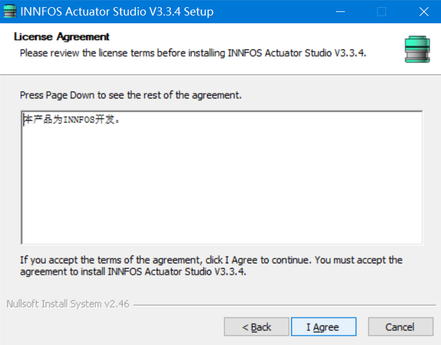

<div class="md-text" style="text-align: center;"><strong>图1-3</strong></div>

4.Select the installation location and click`Install`

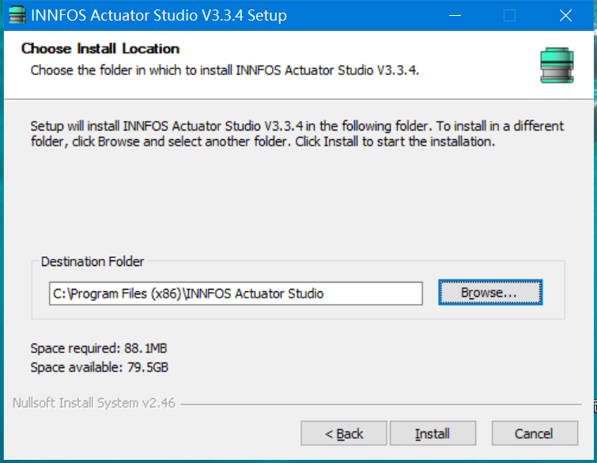

<div class="md-text" style="text-align: center;"><strong>图1-4</strong></div>

5.Wait for the completion of the installation;


<div class="md-text" style="text-align: center;"><strong>图1-5</strong></div>

6.Click`Finish`to complete the software installation.

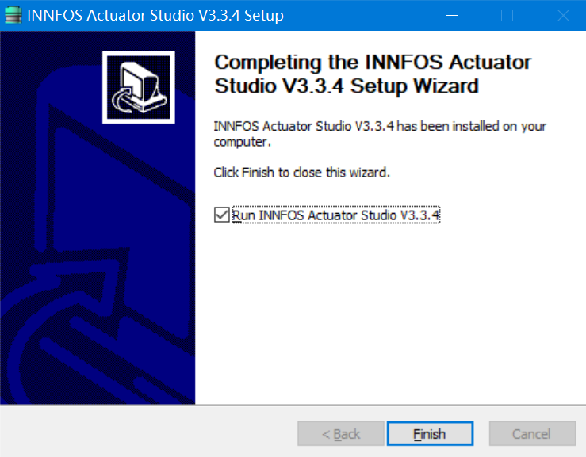

<div class="md-text" style="text-align: center;"><strong>图1-6</strong></div>

----

## IAS boot

1、Double-click to run the software and enter the user interface.

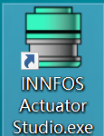

<div class="md-text" style="text-align: center;"><strong>图2-1</strong></div>

2.Click`confirm that you've read the document`, then click `next` to enter the next interface. 

Note:Please click“show the document!” to read the software instructions when use the product for the first time.


<div class="md-text" style="text-align: center;"><strong>图2-2</strong></div>

3.Select the actuator communication mode (The default setting is Ethernet communication), then click `next`


<div class="md-text" style="text-align: center;"><strong>图2-3</strong></div>

Note: Please confirm that the static IP is correctly configured before start using Ethernet communication.


*    When the USB to CAN is not connected or connected abnormally, an error message will appear.


<div class="md-text" style="text-align: center;"><strong>图2-4</strong></div>

*    When the external actuator is not connected or connected abnormally, an error message will appear.


<div class="md-text" style="text-align: center;"><strong>图2-5</strong></div>

*    When the external system is connected correctly, it enters running interface of the actuator. The red area is OFF. As shown in figure 2-6, OFF at mark 1 is a single actuator switch, ON at mark 2 is a main switch, when the actuators are connected at the same time, click on mark 2 to control all actuators.

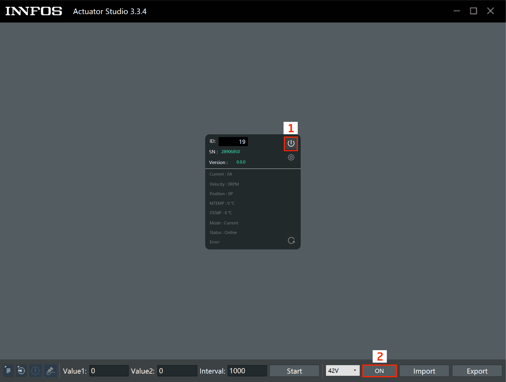

<div class="md-text" style="text-align: center;"><strong>图2-6</strong></div>

*   After clicking `OFF`, the messages in the red area showed in figure 2-7 will pop up.

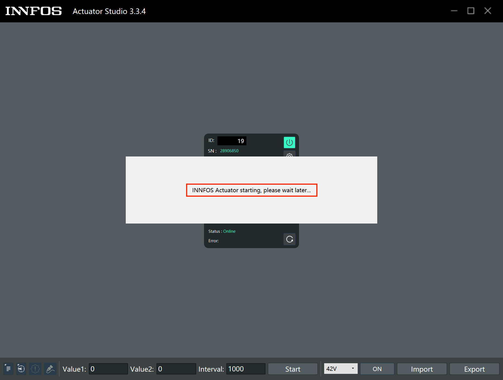

<div class="md-text" style="text-align: center;"><strong>图2-7</strong></div>

*   In about three seconds, as shown in figure 2-8, mark 1 for the actuator ID number, mark 2 is the error clear key, mark 3 for the enter operation interface key, and mark 4 for the actuator's information display area.

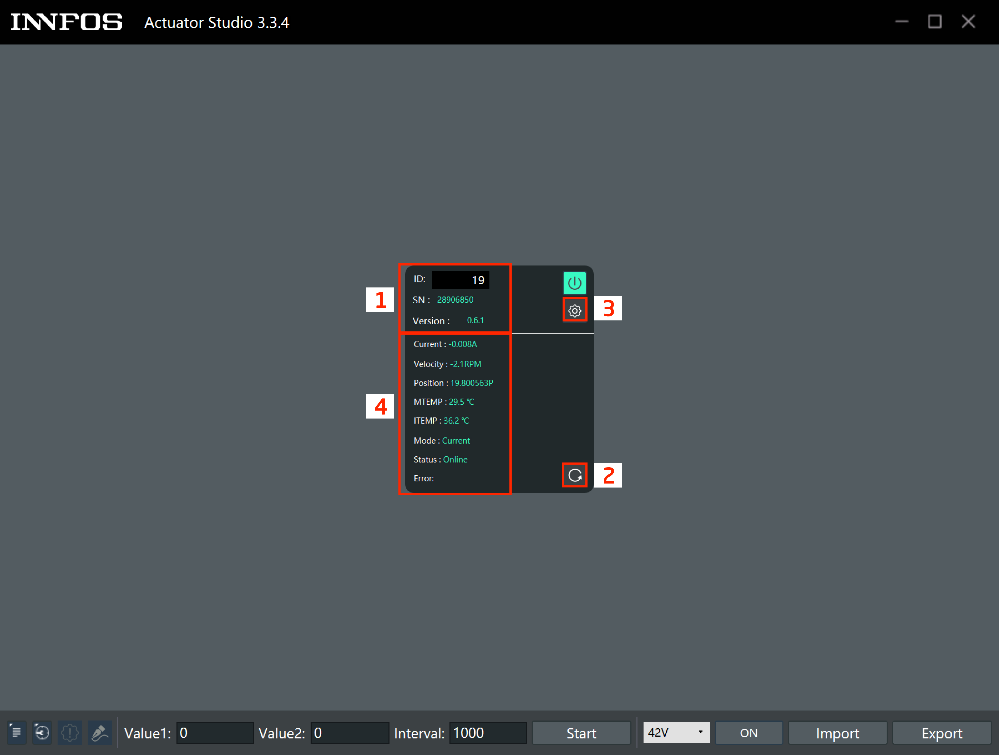

<div class="md-text" style="text-align: center;"><strong>图2-8</strong></div>

4.Click on message box or click `Detail` to enter the current loop mode.


<div class="md-text" style="text-align: center;"><strong>图2-9</strong></div>

----

## Current mode

Logic block diagram of the INNFOS actuator system:


<div class="md-text" style="text-align: center;"><strong>图3-1 INNFOS执行器系统的逻辑框图</strong></div>

Description: after the mixed practice of the current setting value and current feedback value, passing through the PI module, the optional filter and the limiting module to drive the motor, the motor feeds back the current parameter to the system to form a closed loop.


### Function Descriptions of Current Loop Mode

*   文字序号与图中序号对应

（1）Current loop mode

（2）Simple diagram of current loop mode

（3）Status activation in current mode

（4）parameter settings

（5）INNFOS SCA status parameter values

（6）Error warning

（7）Square wave generator parameter value setting

（8）INNFOS actuator current connection status

（9）Oscilloscope switch


<div class="md-text" style="text-align: center;"><strong>图3-2</strong></div>


### Description of basic parameters

*   文字序号与图中序号对应

（1）相电流

（2）比例设置（预设）

（3）积分设置（预设）

（4）最大电流（预设）

（5）最小电流（预设）

<span style="color: red">[注:电流环模式中，比例设置、积分设置根据执行器型号已进行预设，无需更改；最小电流设置固定值-0.82，最大电流设置固定值0.82，并已进行预设，无需更改。]</span> 

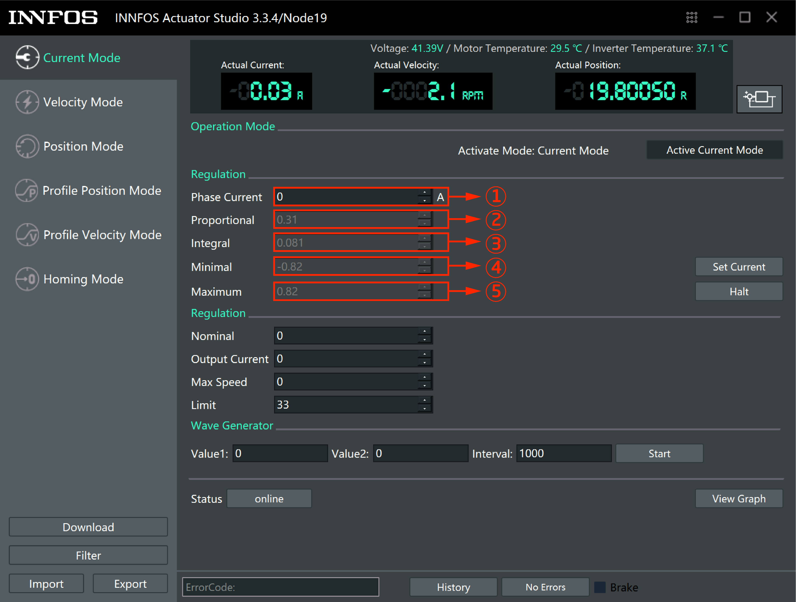

<div class="md-text" style="text-align: center;"><strong>图3-3</strong></div>

### Current loop usage

1.Click on“Active Current Mode”to activate the current current loop mode.

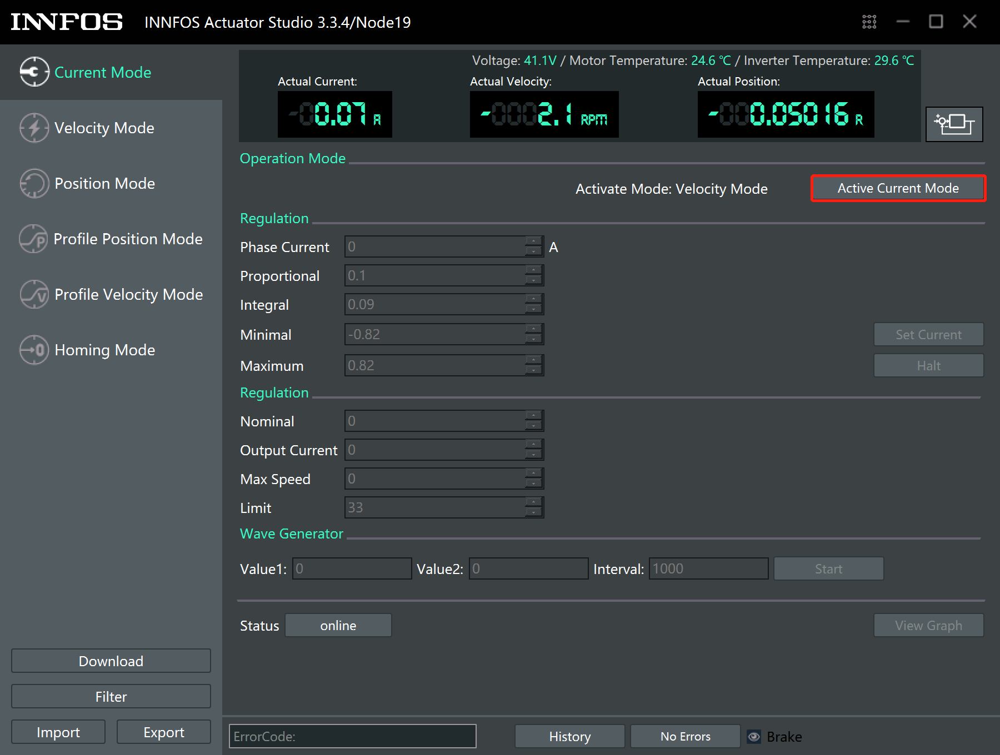

<div class="md-text" style="text-align: center;"><strong>图3-4</strong></div>

2.Parameter setting: application mode

*   在`Phase Current`中输入电流值大小（图中1处），按回车键或`Set Current`键，INNFOS执行器开始输出相应扭矩。若负载不够大，INNFOS执行器会高速运转。

then the actuator will output the corresponding torque.If the load is not heavy enough, the INNFOS actuator will running in high speed.


*   After rotating, you can see the current status in the INNFOS actuator parameter values.(Mark 3)
*   Press the `Halt` to stop the rotation of the INNFOS actuator.(Mark 2)
*   The maximum current value can be set in the `Limit` parameter.


<div class="md-text" style="text-align: center;"><strong>图3-5</strong></div>

3.Click on "View Graph" to open the oscilloscope


<div class="md-text" style="text-align: center;"><strong>图3-6</strong></div>

4.Oscilloscope Function Description

*   `prescalar` in the right picture can set the time of the entire waveform (Mark 1),`trig_value` can be set(Mark 2).The setting parameters can be saved, paused and automatically scaled in(Mark 3);
*    `channel1` is the offset and magnification of the given waveform of the INNFOS actuators (Mark 4);
*    `channel2` is the offset and amplification of the INNFOS actuator current (Mark 5);
*    `channel3` is the offset and magnification of the INNFOS actuator speed (Mark 6);
*    `channel4` is the offset and magnification of the INNFOS actuator position (Mark 7).


<div class="md-text" style="text-align: center;"><strong>图3-7</strong></div>

Note:不用的通道偏置设置为0，放大设置为1，或者直接点击OFF关闭其显示!

5.Square wave generator parameter setting

*   Enter the current value 1 in `Value 1`(Mark 1)
*   Enter the current value 2 in `Value 2` (Mark 2)
*   在`Interval`内输入时间（单位：ms）（图3处）（例：`Value 1`为0.1，`Value 1`为0，`Value 1`为1000，启动后，先给定INNFOS执行器相电流为-0.001A，1000mS后给定相电流为0.5A,再过1000ms再次给定相电流-0.001A，如此反复运行直至用户点击“停止”)。
*   Select `Start`(Mark 4), and the square wave generator will press the set time ( `Interval` value), continuously validate Value1 and Value2 to the specified position until the button is closed.


<div class="md-text" style="text-align: center;"><strong>图3-8</strong></div>

6.点击`View Graph`按钮打开示波器窗口，可以查看给定（ `Channel 1` 此时为方波发生器）、电流（ `Channel 2` ）、速度（ `Channel 3` ）、位置（ `Channel 4` ）四通道参数波形，如图 


<div class="md-text" style="text-align: center;"><strong>图3-9</strong></div>

7.Click the `Stop` button to stop the square wave generator.

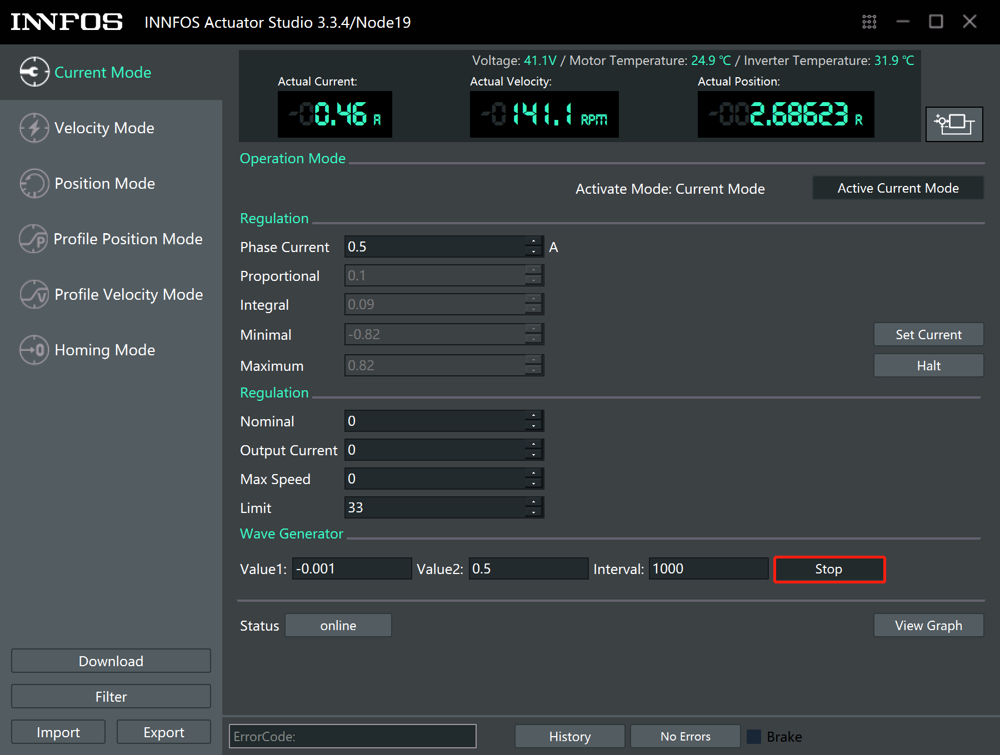

<div class="md-text" style="text-align: center;"><strong>图3-10</strong></div>

----

## Speed mode usage

Logic block diagram of the INNFOS actuator system:


<div class="md-text" style="text-align: center;"><strong>图4-1 INNFOS执行器系统的逻辑框图</strong></div>

Description: After the speed value setting and the speed feedback value are added and subtracted, the PI module is passed through the optional filter and then the module outputs the current to the current loop. When the current loop mode is ensured to operate correctly, the motor is driven by the current loop. The encoder feeds the speed parameter back to the system to form a closed loop.

### Click on "Velocity Mode" to enter speed mode


<div class="md-text" style="text-align: center;"><strong>图4-2</strong></div>

### Description of Speed Loop Mode Functions

*   文字序号与图中序号对应

(1)Simple diagram of speed loop mode

(2)Activation in current mode

(3)Basic parameter settings

(4)INNFOS SCA parameter values

(5)Error warning

(6)Square-wave generator parameter value setting

(7)INNFOS actuator connection status

(8)Oscilloscope switch 


<div class="md-text" style="text-align: center;"><strong>图4-3</strong></div>

### Speed mode usage

1.Click on "Active Velocity Mode" to activate the current Speed Mode.

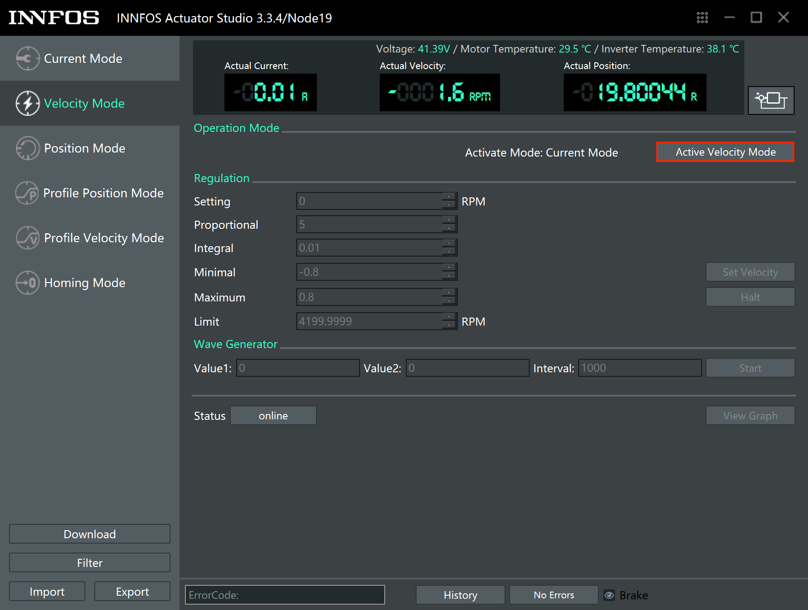

<div class="md-text" style="text-align: center;"><strong>图4-4</strong></div>

2.Speed loop basic parameter settings:

*   Enter the speed value (unit: RPM) in the `Setting` box. Press Enter or click on `Set Velocity` on the right, then INNFOS SCA starts to rotate.
*   After rotating, the status value column, as shown in the figure, can be seen as the parameter values of different INNFOS SCA.
*   After rotating, the status value column, as shown in the figure, can be seen as the parameter values of different INNFOS SCA.
*   Adjust the `Proportional` box and the `Integral` box to adjust the PI value(Mark 2).
*   The Mininal box and Maximum box shows the output limit for speed loop (followed by Current loop input),
for example, current up to 33A（Model 6010 is 33A and Model 3510 is 16.5A. See Appendix D of the CAN Bus Communication Protocol for details.）, input value is 0.5；When the INNFOS actuator current is increased to 33*0.5, the current value will be limited without increasing.
*   Press the `Halt` button to stop the rotation of the INNFOS actuator.


<div class="md-text" style="text-align: center;"><strong>图4-5</strong></div>

3.Click on `View Graph` to open the oscilloscope


<div class="md-text" style="text-align: center;"><strong>图4-6</strong></div>

4.Introduction to Speed Loop Oscilloscope

*   在`Interval`内输入单位时间（单位：ms），可设置INNFOS执行器方波发生器的参数。（例：`Value 1`为-0.001，`Value 1`为300，`Value 1`为1000，启动后，INNFOS执行器先到速度-0.001 RPM，1000mS后速度为 300 RPM，在过1000ms再次到速度-0.001 RMP，如此反复运行直至用户点击“停止”)。

*   Enter the number of revolutions in `Value1`. (Unit: RPM)
*   Enter the reverse number in `Value2`. (Unit: RPM)
*   Enter the unit time (in ms) in `Interval` to set the parameters of the INNFOS actuator square wave generator.
*   Select `Start` to turn the INNFOS actuator on.


<div class="md-text" style="text-align: center;"><strong>图4-7</strong></div>

5.设置`View Graph`视图里的参数，可以更好的查看当前INNFOS执行器各项参数波形。

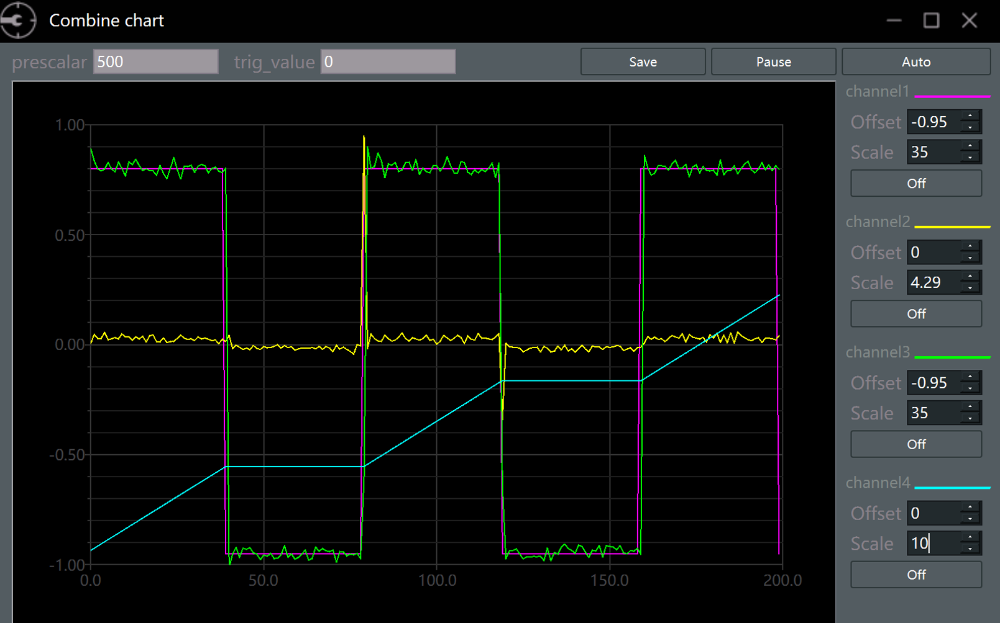

<div class="md-text" style="text-align: center;"><strong>图4-8</strong></div>

Note:不用的通道偏置设置为0，放大设置为1（右图中channel2和channel4），或者直接点击OFF关闭其显示

6.Click `Stop` to stop the square-wave generator.


<div class="md-text" style="text-align: center;"><strong>图4-9</strong></div>

----

## Position Mode

Logic block diagram of the INNFOS actuator system：


<div class="md-text" style="text-align: center;"><strong>图5-1 INNFOS执行器系统的逻辑框图</strong></div>

Introduction of the block diagram:

In the case of ensuring the accuracy of the current loop and the speed loop, the set position value and the feedback value, through addition and subtraction, passed through the PI module and then output the speed value through the optional filter. After that, the speed loop drives the motor through the current loop, and the motor feeds back the position parameters to the system via the encoder. All this form a closed loop.

### Click “Position Mode” to enter the position mode

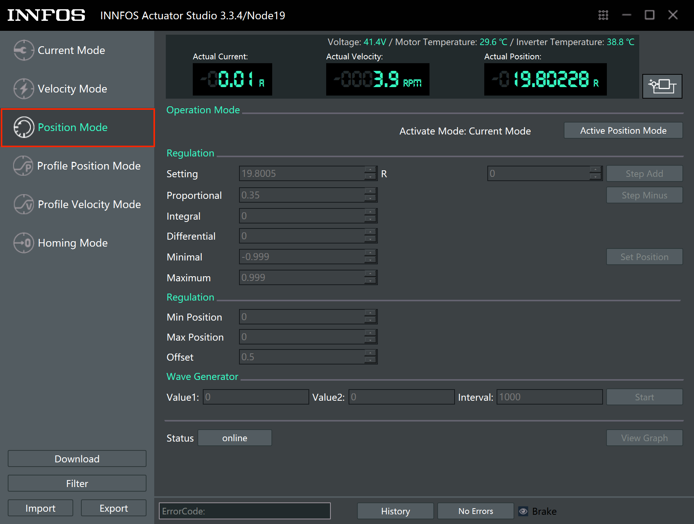

<div class="md-text" style="text-align: center;"><strong>图5-2</strong></div>

### Description of Position Mode Function

*   文字序号与图中序号对应

(1) Position loop mode diagram

(2) Status activation in current mode

(3) Basic parameter settings

(4) INNFOS actuator status parameter values

(5) Error warning

(6) Square wave generator parameter value setting

(7) INNFOS actuator connection status

(8) Oscilloscope switch
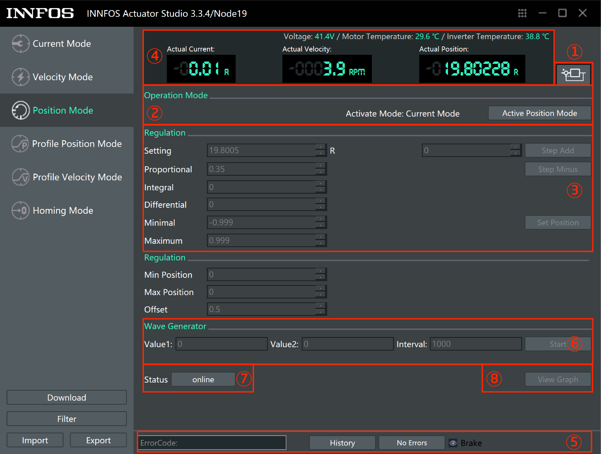

<div class="md-text" style="text-align: center;"><strong>图5-3</strong></div>

### Position Mode Usage

1.Click on “Active Position Mode” to activate the current position mode. 

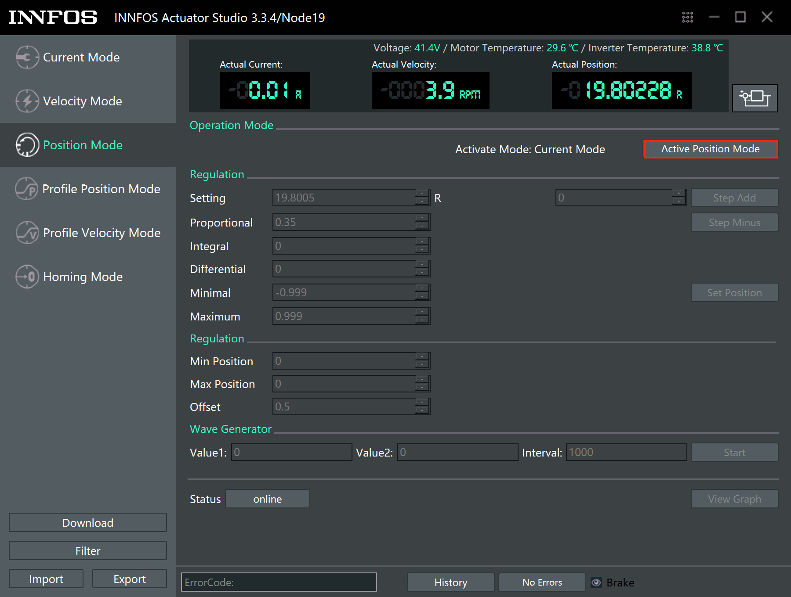

<div class="md-text" style="text-align: center;"><strong>图5-4</strong></div>

2.Position Mode basic parameter settings:

*    Enter the position value (unit: R) in the `Setting` box（Mark.1）, Press `Set Position` (Mark.4)and then the INNFOS actuator starts to rotate.INNFOS actuator will stop rotate after arrives the assigned input position
*    After rotating, the status value column (Mark. 5) can see the current parameter values.
*    Adjust the Proportional box to change the scale value (Mark. 2).
*    The Mininal box and Maximum box (Mark. 3)are the speed limit of the speed loop for the position loop, for example, speed is up to 6000RPM, input value is 0.5, then the maximum speed of the INNFOS actuator rise to 6000*0.5=3000R/min, the speed value will be limited and will not increase.


<div class="md-text" style="text-align: center;"><strong>图5-5</strong></div>

3.点击“波形图”可打开示波器，参数界面介绍同上 


<div class="md-text" style="text-align: center;"><strong>图5-6</strong></div>

4.Setting of Square-wave Gnerator Prameter Value

*   在`Interval`内输入时间（单位：ms），输入参数为转动一次的时间。（例：`Value 1`为0.1，`Value 2`为0，`Interval`为1000，启动后，INNFOS执行器先转到位置0.1，1000mS后转到位置0，在过1000ms再次转到位置2，如此反复运行直至用户点击“停止”)。

*    Enter the number of revolutions in `Value1`. (Unit: RPM)
*    Enter the reverse number in `Value2`. (Unit: RPM)
*    Enter the unit time (in ms) in `Interval` to set the parameters of the INNFOS actuator square wave generator.
*    Select `Start` to turn the INNFOS actuator on.


<div class="md-text" style="text-align: center;"><strong>图5-7</strong></div>

5.Click `Stop` to stop the square-wave generator.


<div class="md-text" style="text-align: center;"><strong>图5-8</strong></div>

6.位置模式步加步减设置：

*   在框X中输入转动的位置（单位：R），也可点击键盘方向键进行设置。点击键盘默认为增加0.1。
*   在框X中输入数值，按`step add`和`step minus`按钮，执行器可转动相应位置，点击一次可使执行器正向或反向转动一次。
*   INNFOS执行器开始转动后，在状态值栏可以看到当前INNFOS执行器的各项参数值。


<div class="md-text" style="text-align: center;"><strong>图5-9</strong></div>


----

## 位置环S曲线模式Position loop S-curve mode

### 点击“梯形位置模式”进入位置环S曲线模式


<div class="md-text" style="text-align: center;"><strong>图6-1</strong></div>

### 位置环S曲线模式各项功能描述

*   文字序号与图中序号对应

（1）位置环S曲线模式简易示意图

（2）当前模式下状态激活

（3）基本参数设置

（4）INNFOS执行器状态参数值

（5）错误警告

（6）INNFOS执行器当前连接状态 


<div class="md-text" style="text-align: center;"><strong>图6-2</strong></div>

### 位置环S曲线模式使用方式

1.点击“Active Profile Position Mode” 激活当前位置环S曲线模式 


<div class="md-text" style="text-align: center;"><strong>图6-3</strong></div>

2.位置环S曲线模式基本参数设置：

*   右图2处的`Accelerate`框和`Decelerate`框为S曲线模式下的速度上升和下降的平缓度，例如：加速度值越大，INNFOS执行器达到最大速度的时间越短，加速度值越小，INNFOS执行器达到最大转速的时间越长。减速度值越大，INNFOS执行器从最大速度降低到零的时间越短，减速度值越小，INNFOS执行器从最大速度降低到零的时间越长。
*   `Max`限制了INNFOS执行器的最大转速，随数值增加而增加，如右图的3处，当前最大转速为1000RPM。

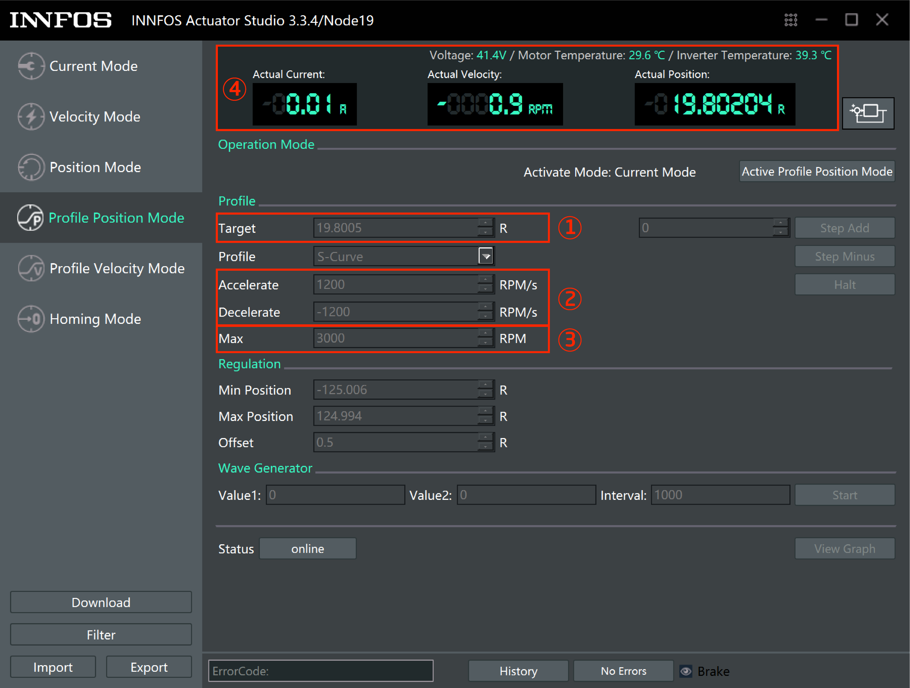

<div class="md-text" style="text-align: center;"><strong>图6-4</strong></div>


2.位置环S曲线模式基本参数设置：

*   在`Target`框中输入转动的位置（单位：R），INNFOS执行器开始转动到指定位置。
*   INNFOS执行器开始转动后，在状态值栏可以看到当前INNFOS执行器的各项参数值，右图4处。


<div class="md-text" style="text-align: center;"><strong>图6-5</strong></div>


3.点击“波形图”可打开示波器，参数界面介绍同上:


<div class="md-text" style="text-align: center;"><strong>图6-6</strong></div>


4.方波发生器参数值设定：

*   在`Value 1`中输入位置值1(单位:R)
*   在`Value 2`”中输入位置值2(单位:R)
*   在`Interval`内输入时间（单位：ms），输入参数为转动一次的时间。（例：`Value 1`为2，`Value 1`为-2，`Value 1`为1000，启动后，INNFOS执行器先转到位置2，1000mS后转到位置-2，在过1000ms再次转到位置2，如此反复运行直至用户点击“停止”)。
*   点击`Start`键，开启INNFOS执行器转动。


<div class="md-text" style="text-align: center;"><strong>图6-7</strong></div>

*   波形图如下：

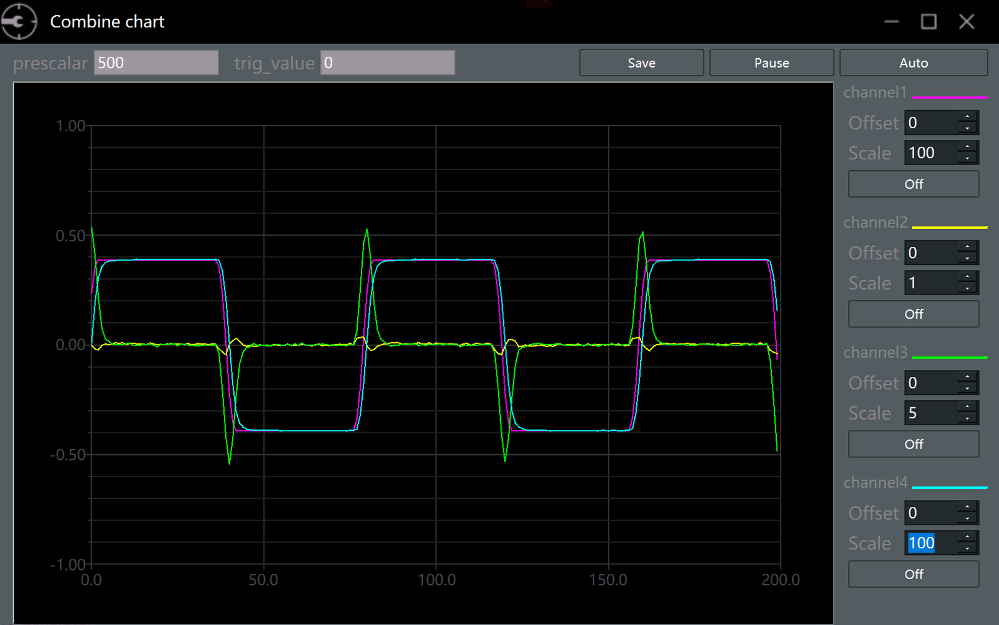

<div class="md-text" style="text-align: center;"><strong>图6-8</strong></div>


5.点击`Stop`键，可停止方波发生器的运行。


<div class="md-text" style="text-align: center;"><strong>图6-9</strong></div>

3.位置环S曲线模式步加步减设置：

*   在`Target`框中输入转动的位置（单位：R），也可点击键盘方向键进行设置。点击键盘默认为增加1。


<div class="md-text" style="text-align: center;"><strong>图6-10</strong></div>

*   在框X中输入数值，按`step add`和`step minus`按钮，执行器可转动相应位置，点击一次可使执行器转动一次。
*   INNFOS执行器开始转动后，在状态值栏可以看到当前INNFOS执行器的各项参数值，右图4处。


<div class="md-text" style="text-align: center;"><strong>图6-11</strong></div>


----

## 速度环S曲线模式

### 点击“Profile Velocity Mode”进入速度环S曲线模式


<div class="md-text" style="text-align: center;"><strong>图7-1</strong></div>

*   文字序号与图中序号对应

（1）速度环S曲线模式简易示意图

（2）当前模式下状态激活

（3）基本参数设置

（4）INNFOS执行器状态参数值

（5）错误警告

（6）INNFOS执行器当前连接状态 

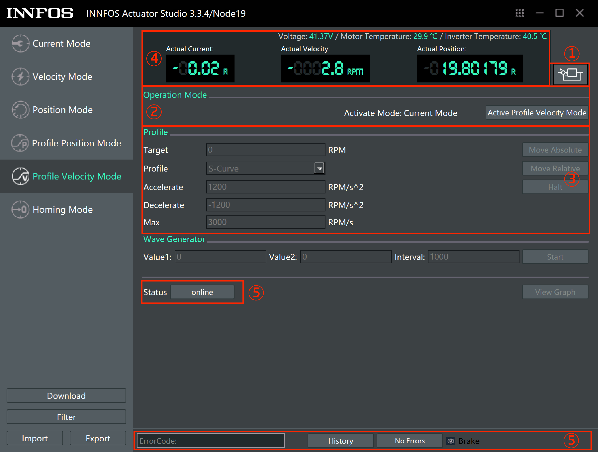

<div class="md-text" style="text-align: center;"><strong>图7-2</strong></div>

### 速度环S曲线模式使用方式

1.点击“Active Profile Velocity Mode”，激活当前速度环S曲线模式。 


<div class="md-text" style="text-align: center;"><strong>图7-3</strong></div>

2.速度环S曲线模式基本参数设置：

*   在`Target`框中输入INNFOS执行器的速度值（单位：RPM），INNFOS执行器开始转动，直至达到输入值。
*   INNFOS执行器开始转动后，在状态值栏可以看到当前INNFOS执行器的各项参数值，右图3处。
*   右图中2处的加速度、减速度和最大速度项为S曲线的调整参数。


<div class="md-text" style="text-align: center;"><strong>图7-4</strong></div>

----

## 归零模式

### 点击“归零模式”进入归位模式

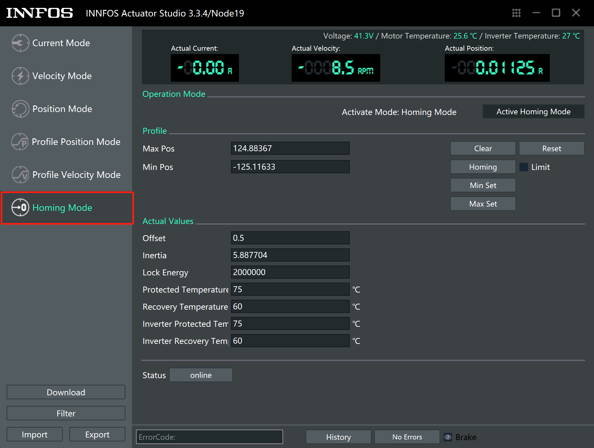

<div class="md-text" style="text-align: center;"><strong>图8-1</strong></div>

### 归位模式使用方式

#### 手动校准左右极限

1.点击右图红框位置“激活归零模式”;进入归位模式。


<div class="md-text" style="text-align: center;"><strong>图8-2</strong></div>

2.先后点击“清除”;和“归零”按键，重复两次可清除当前左右极限，并使当前位置变为零位。直到右图红框1处数据变为如图大数值（这是软件限位的上下限）。然后将右图2处调为如下大数值（这是限流，比如加大负载时需要较大电流，需要放开电流限制）。


<div class="md-text" style="text-align: center;"><strong>图8-3</strong></div>

3.手动将关节或执行器调节到左机械极限，点击“最大位置”，此时“最小位置”;栏处的数值会改变，左机械极限设定完毕。（此处也可以手动输入极限数值，单位：R）


<div class="md-text" style="text-align: center;"><strong>图8-4</strong></div>

4.手动将关节或执行器调节到右机械极限，点击“最小位置”;，此时“最小位置”栏处的数值会改变，右机械极限设定完毕。（此处也可以手动输入极限数值，单位：R）


<div class="md-text" style="text-align: center;"><strong>图8-5</strong></div>

注意：位置模式使用时，应注意当前限位范围，如果当前位置在限位范围外，发位置指令时，位置则会回到限位范围内。

5.若只设定零点，则手动将关节或执行器调节至想要的零点，点击2处的“归零”按键，1处的当前位置值会变为0。


<div class="md-text" style="text-align: center;"><strong>图8-6</strong></div>

6.设置左右极限偏置


<div class="md-text" style="text-align: center;"><strong>图8-7</strong></div>

7.点击“保存”按钮即可保存当前参数 


<div class="md-text" style="text-align: center;"><strong>图8-8</strong></div>

### 温度保护设置

1.设置电机保护温度

输入电机保护温度并回车，点击“download”保存，执行器将在达到保护温度后停止转动，并将自动切入电流环模式。
电机保护温度默认为75℃。


2.设置电机恢复温度

输入电机保护温度并回车，点击“download”保存，执行器将在降温至恢复温度后恢复可控，用户可继续。
电机保护温度默认为60℃。


3.设置逆变器保护温度


4设置逆变器恢复温度

注：设置的保护温度需比恢复温度高5℃

### 堵转能量设置

----


## 新版本在线升级功能

1.如有新版本更新，会有提示


<div class="md-text" style="text-align: center;"><strong>图9-1</strong></div>

2.显示本次升级内容及升级按钮


<div class="md-text" style="text-align: center;"><strong>图9-2</strong></div>

3.点击update等待升级完成


<div class="md-text" style="text-align: center;"><strong>图9-3</strong></div>


----
## 错误提示

### 当有错误出现时，错误框内会提示错误内容

如图，弹出错误提示信息。


<div class="md-text" style="text-align: center;"><strong>图9-3</strong></div>

### 错误处理方式

点击“OK”，再点击“Clear Errors”可清除错误，清除错误后，INNFOS执行器进入电流环模式。


<div class="md-text" style="text-align: center;"><strong>图9-3</strong></div>

----

## 版本信息
<table class="tableizer-table"><thead><tr class="tableizer-firstrow" style=background:PaleTurquoise><th>版本</th><th>更新时间</th><th>更新内容</th></tr></thead><tbody><tr><td><a href="http://innfos.com/wiki/cn/index.html#!pages/INNFOS_Actuator_Studio_IAS_instruction_V_1_0_0.md">V1.1.0</td><td>2019-07</td><td>第二版</td></tr><tr><td>V1.0.0</td><td>2019-04</td><td>第一个版本</td></tr></tbody></table>
