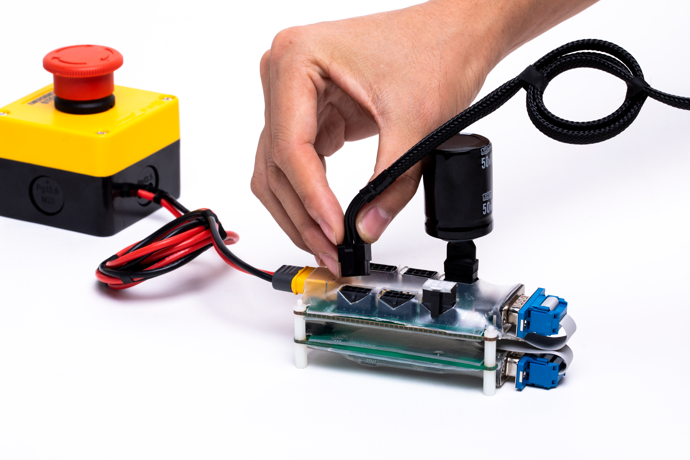

Desktop 6-axis robotic arm installation instructions
=====

## Introduction

*  This manual is for the use of the desktop 6-axis robot.
*  Please read this manual carefully before use.


<br>All joints are built by QDD Lite series actuators. Its arm length is up to 430mm and the end load is 500g. The cost of high-end robots R&D is greatly reduced, because composite materials are used in QDD Lite series SCAs. This desktop 6-axis robot mainly used in education, schools, laboratories, research institutes, competitions, etc.
                                                                
                                                                       

## Engineering parameter map
<br>[Unit: mm]


### 3D model
[model file]( ../img/桌面级6轴机械臂（QDD Lite-NE30-36版）_v1_0.step.zip )


## Basic parameters

<table style="width:500px"><thead><tr><th colspan="2" style="background: PaleTurquoise; color: black;">Desktop 6-axis Lite version of the robot arm (6*NE30) parameters</th></tr></thead><tbody></tr><tr><td>End load</td><td>500g</td></tr>
<tr><td>weight</td><td>3.7kg(with base）；2.5kg（without base）</td></tr><tr><td>Degree of freedom</td><td>6</td></tr><tr><td>Working radius</td><td>421mm</td></tr><tr><td>Joint range</td><td>+/-170°</td></tr><tr><td>Maximum tool speed</td><td>2m/s</td></tr><tr><td>Repeatability accuracy</td><td>+/-0.1mm</td></tr><tr><td>Supply voltage</td><td>42v</td></tr><tr><td>Power consumption</td><td>Ordinary power consumption is about 120w</td></tr><tr><td>Structural material</td><td>Aluminum alloy/carbon fiber tube</td></tr><tr><td>Working temperature</td><td>10-50°</td></tr><tr><td>Working environment humidity</td><td>5%~95%</td></tr><tr><td>Protection level</td><td>IP54</td></tr><tr><td>Communication port</td><td>CAN/Ethernet</td></tr><tr><td>Teach pendant</td><td>Computer or mobile terminal</td></tr></td></tbody></table>


## Product real shot renderings


## Hardware requirements and connections

**Hardware requirements**


From front to back, from left to right: one set of six-axis robot, ECB+HUB with terminal resistance and feedback brake capacitor, emergency stop switch + power supply, computer.


**Connect ECB**

**Connect power supply**

*  Connect the power supply with `ECB+HUB`


** Connect SCAs and their accessories**

*  Connect `INNFOA SCA cable`




**Connect the robotic arm**

*  Connect INNFOS SCA Cable with`HUB` 


**Connect to a computer**

*   Connect`ECB`to the computer with RJ45


**Overall view after connection**


**Turn the power on**

*  Turn the power on. The actuator's supply voltage range is DC 24V-45V.


*  After power-on, the SCA LED status light will flash yellow. When SCA is activated, the LED will flash green and communication with the actuator will be ready. If an error occurs inside SCA, the LED will flash red, please check the actuator error code.


## Software installation and use


**Use of IAS**

* `IAS`(INNFOS Actuator Studio)is the PC software to configure the robotic arm, please visit the[INNFOS Actuator Studio(IAS)instructions](#!pages/INNFOS_Actuator_Studio_IAS_instruction.md).

**Sports function use**

* Teaching-reproduction function


### Download and install

Operating environment: linux-x86-64

Visit the link [download link](https://github.com/innfos/robot_controller-6-NE30-.git)tdownload the software or directly execute the following command
```sh
$ git clone https://github.com/innfos/robot_controller-6-NE30-.git
```
Visit the link [download link](https://github.com/innfos/ActuatorController_SDK.git)download the SDK files or execute the following command directly.
```sh
$ git clone https://github.com/innfos/ActuatorController_SDK.git
```

Note: These two folders need to be placed in the same directory.

### Operating mode
The robot arm provides the following modes: mode0, mode1, mode2, mode3, mode4

Go to the home directory
```sh
$ cd robot_controller-6-NE30-/
```
Configure environment variables:
```sh
$ . environment
```
Note: execute this command every time when open the terminal. If not, the terminal will prompt to find the dynamic library "libActuatorController.so".

<br>The executable file is robotserver 
<br>
Enter in the terminal according to the running mode:
```sh
$ ./robotserver xx
```
"xx" is mode0, mode1, mode2, mode3, mode4

The condition that there is no "robotserver" file when executing indicates that the file does not have permission. Execute the following command to change the permissions:

```sh
$ chmod +x robotserver
```

<br>The file folder is used to store the path file

* mode0

•	The function of this mode is to turn off the arm enable state to execute the command.

```sh
$ ./robotserver mode0
```
Note: Before the arm is powered off, you need to execute this command before turn the power off.

* mode1

The function of this mode is to continuously record the track
<br>Execution command 
```sh
$ ./robotserver mode1
```
At this point the terminal will display：


<br> Enter "start" to start recording.
<br>CTRL + C stops recording, at which point the trace file is stored in file/trajectory.txt.


* mode2

Reproduces the track file file/trajectory.txt generated by "mode1".

This mode will run the execution command in a loop
```sh
$ ./robotserver mode2
```
At this point the terminal will display:


<br>The value is the reproduction speed ratio, which ranges from 0.1 to 1, equaling to 10% to 100%. After entering the correct value, press Enter to next step. It is recommended that the first run should use a low reproduction speed ratio, and after confirming that the path is correct, a higher reproduction speed ratio can be used.

CTRL + C can stop running the loop, and the terminal will prompt:


<br>Entering "end" will lead the robotic arm to enter the current mode. Hold the robotic arm with your hand.

* mode3

This mode will gradually record the path point and store it in the file file/data.txt.
<br>Executing an order
```sh
$ ./robotserver mode3
```
At this point, the terminal will prompt:


<br>This option is to select the interpolation type. Input “MOVJ”, “MOVL”, “MOVC”, and enter other values to exit the program.

MOVJ:

Joint interpolation, the end motion trajectory is uncertain, only planning in the joint space, terminal input "MOVJ"


MOVL:

Linear interpolation, the end motion track is a straight line, and the terminal input

MOVC:

Circular interpolation. the end motion track is arc, circular interpolation needs to record two points, one is auxiliary point, input “MOVC”

Record the auxiliary point, the terminal prompts as follows, enter “YES” record a the end of the arc, enter other to exit the program.


* mode4

Perform the reproduction operation by the path file file/data.txt generated by the mode "mode3".
<br>Executing an order
```sh
$ ./robotserver mode4
```
At this point the terminal will display:


<br>The value is the reproduction speed ratio, which ranges from 0.1 to 1 equaling to 10% to 100%. After entering the correct value, press Enter to proceed to the next step. It is recommended that the first run use a low reproduction speed ratio, and after confirming that the path is correct, a higher reproduction speed ratio can be used.

After determining the reproduction speed ratio, the terminal will display:


<br> This option is to select the replay mode. Choose to input “STEP”, “CYCLE”, “CONTINUOUS”, and enter other values to exit the program.

STEP:

Single step mode, in which enter "FORWARD" to run to the next point, or enter "BACKWARD" to run to the previous point. Enter other values to exit the program.


CYCLE:

Single-cycle operation mode means only run the program once. In this mode, the following interface will appear on the terminal. Enter “YES” to reproduce the path in a smooth manner (note that the path will be deformed), and input the other to run in the normal motion mode (ie, the speed of point to point movement is reduced to zero).


CONTINUOUS:

Continuous cycle operation mode will continuously reproduce the path of “mode3” teaching. In this mode, the following interface will appear on the terminal. Enter “YES” to reproduce the path in a smooth manner (note that the path will be deformed), and input the other according to the normal movement mode. Run (ie point-to-point motion speed reduced to zero).


<br>The above modes can be terminated by pressing CTRL + C to terminate the program.

### Precautions
On condition that the arm stopped, hold the arm by hand and execute mode0 to turn off the motor before the power is turned off.


## Version change record
**The following table briefly describes the version change record.**

<table style="width:400px"><thead><tr style="background:PaleTurquoise"><th style="width:100px">Version number</th><th style="width:150px">updated time</th><th style="width:150px">Updated content</th></tr></thead><tbody><tr><td>v1.0.0</td><td>2019.10.10</td><td>Add the full text</td></tbody></table>


