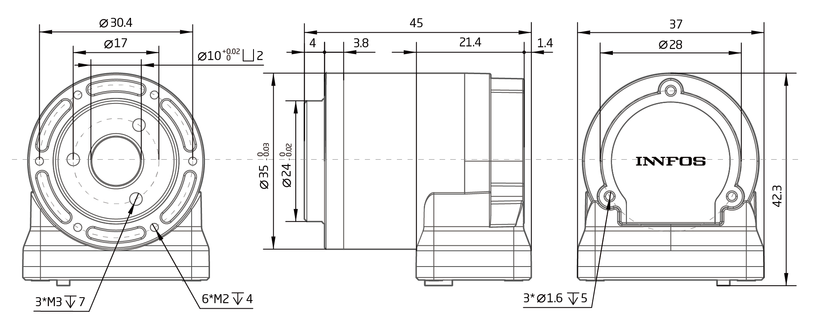
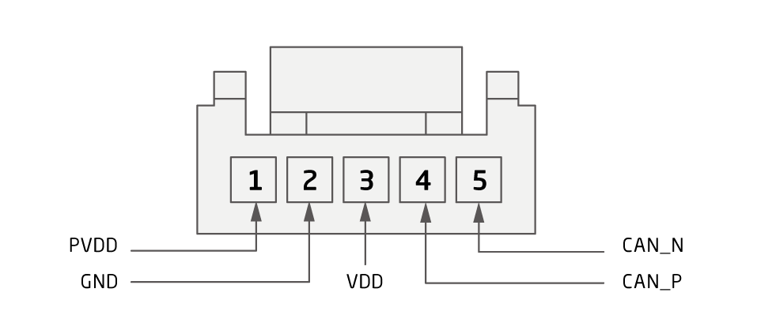

# Parameter introduction 
## QDD Lite-EL20-36 Parameter Diagram[mm]
 
### 3D model 
[Model file]( ../img/QDD Lite-EL20-36_v1_8.step.zip )

## QDD Lite-EL20-36 Parameter
<table style="width:850px"><thead><tr><th colspan="4" style="background: PaleTurquoise; color: black;">QDD Lite-EL20-36 parameter</th></tr></thead><tbody><tr><td colspan="2" width=60%><b>Working parameters at norminal voltage</b></td><td colspan="2" width=40%><b>Mechanical parameters</b></td></tr><tr><td>Motor power</td><td>36 W</td><td>Diameter</td><td>35mm</td></tr><tr><td>Norminal voltage</td><td>42 VDC</td><td>Length</td><td>45mm</td></tr><tr><td>No load speed</td><td>167 RPM</td><td>Weight</td><td>79.7 g</td></tr><tr><td>Norminal speed</td><td>111 RPM</td><td>Backlash</td><td> Updating later</td></tr><tr><td>Nominal torque</td><td>0.4 Nm</td><td>Maximum axial load</td><td>200 N</td></tr><tr><td>Peak torque</td><td>3.2 Nm</td><td>Maximum radial load</td><td>  800 N</td></tr><tr><td>Torque coefficient</td><td>1.242 Nm/A</td><td>Version number</td><td>v1.8</td></tr><tr><td>Full range of phase current</td><td>2A</td><td colspan="2"><b>Work area</b></td></tr><tr><td>Nominal power current</td><td>0.86 A</td><td colspan="2" rowspan="15"></td></tr><tr><td>Quiescent Current</td><td>0.08 A</td></tr><tr><td colspan="2"><b>Basic parameters</b></td></tr><tr><td>Motor type</td><td>
Brushless servo motor</td></tr><tr><td>Voltage range</td><td>24~45 VDC</td></tr><tr><td>Gear ratio</td><td>36:1</td></tr><tr><td>Resolution</td><td>589824(19bit) Step/turn</td></tr><tr><td>Encoder system</td><td>Multiturn absoulute encoder （±127turns）</td></tr><tr><td>Interface</td><td>CAN</td></tr><tr><td>Angle of rotation</td><td>> 360.0 °</td></tr><tr><td>Temperature range</td><td>0~+50 °C</td></tr><tr><td>Noise level</td><td><= 70 dB(A)</td></tr></tbody></table>

### Connector Pin Layout
<table class="tableizer-table">
<thead><tr class="tableizer-firstrow"><th colspan="4" style="background: PaleTurquoise; color: black;width:800px">Connector Pin Layout</th></tr></thead><tbody><tr><td>Pin NO.</td><td>Color</td><td>Signal</td><td>Terminal pin distribution</td></tr><tr><td>1</td><td>PVDD</td><td>Black</td><td rowspan="9"></td></tr><tr><td>2</td><td>GND</td><td>Black</td></tr><tr><td>3</td><td>VDD</td><td>Black</td></tr><tr><td>4</td><td>CAD-P</td><td>Black</td></tr><tr><td>5</td><td>CAD-N</td><td>Black</td></tr></tbody></table>

## Version Updating Records

<table style="width:500px"><thead><tr style="background:PaleTurquoise"><th style="width:100px">Version number</th><th style="width:150px">Update time</th><th style="width:3800px">Update content</th></tr></thead><tbody><tr><td>v1.8.1</td><td>2019.07.30</td><td>Updated the values of no load speed  Updated the values of norminal speed  Updated the values of nominal torque  Updated the values of peak torque  Updated the values of torque coefficient</th></tr></thead><tbody><tr><td>v1.8.0</td><td>2019.06.20</td><td>Full text added</th></tr></thead><tbody><tr><td>v1.0.0</td><td>2019.04.11</td><td>Full text added</td></tbody></table>
