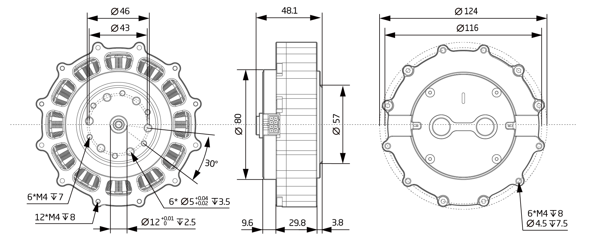
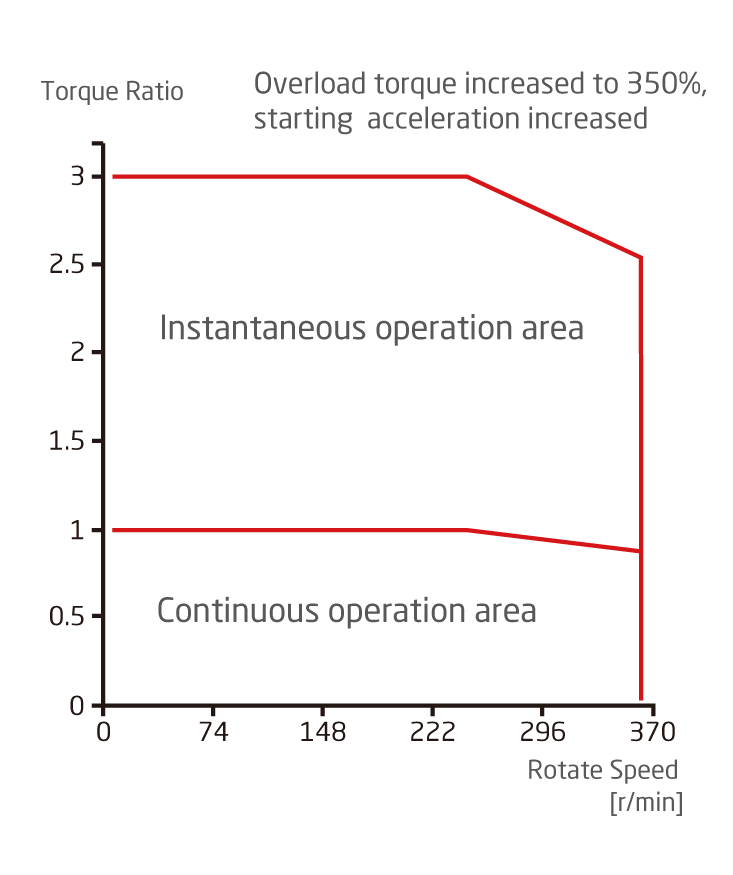

# Parameter introduction 
## QDD-AT100-6 Parameter Diagram[mm]
 
### 3D model 
[Model file ]( ../img/QDD-AT100-6_v1_0.step.zip )

## QDD-AT100-6 Parameter
<table style="width:850px"><thead><tr><th colspan="4" style="background: PaleTurquoise; color: black;">QDD-AT100-6 parameter</th></tr></thead><tbody><tr><td colspan="2" width=60%><b>Working parameters at norminal voltage</b></td><td colspan="2" width=40%><b>Mechanical parameters</b></td></tr><tr><td>Motor power</td><td>1250 W</td><td>Diameter</td><td>100mm</td></tr><tr><td>Norminal voltage</td><td>42 VDC</td><td>Length</td><td>37mm</td></tr><tr><td>No load speed</td><td>333 RPM</td><td>Weight</td><td>Updating later</td></tr><tr><td>Norminal speed</td><td>250 RPM</td><td>Backlash</td><td>9 Arc min</td></tr><tr><td>Nominal torque</td><td>36 Nm</td><td>Static load capacity</td><td>Updating later</td></tr><tr><td>Peak torque</td><td>90 Nm</td><td>Version number</td><td>v1.0</td></tr><tr><td>Torque coefficient</td><td>1 Nm/A</td><td colspan="2"><b>Work area</b></td></tr><tr><td>Full range of phase current</td><td>45A</td><td colspan="2" rowspan="15"></td></tr><tr><td>Nominal power current</td><td>30 A</td></tr><tr><td>Quiescent Current</td><td>0.08 A</td></tr><tr><td colspan="2"><b>Basic parameters</b></td></tr><tr><td>Motor type</td><td>Brushless servo motor</td></tr><tr><td>Voltage range</td><td>24~45 VDC</td></tr><tr><td>Gear ratio</td><td>6:1</td></tr><tr><td>Resolution</td><td>98304 (16 bit)Step/turn </td></tr><tr><td>Encoder system</td><td>Multiturn absoulute encoder</td></tr><tr><td>Interface</td><td>Isolated CAN</td></tr><tr><td>Angle of rotation</td><td>> 360.0 °</td></tr><tr><td>Ambient temperature range</td><td>5~55 °C</td></tr><tr><td>Noise level</td><td><= 70 dB(A)</td></tr></tbody></table>

 Note: Encoder counter range: ±127turns; Motor protection temperature settable range: 25-120 °C; Inventer protection temperature settable range: 25-120 °C

### Connector Pin Layout
<table class="tableizer-table">
<thead><tr class="tableizer-firstrow"><th colspan="4" style="background: PaleTurquoise; color: black;width:800px">Connector Pin Layout</th></tr></thead><tbody><tr><td>Pin NO.</td><td>Color</td><td>Signal</td><td>Terminal pin distribution</td></tr><tr><td>1</td><td>PVDD</td><td>Black</td><td rowspan="9"></td></tr><tr><td>3</td><td>PVDD</td><td>Black</td></tr><tr><td>5</td><td>PVDD</td><td>Black</td></tr><tr><td>2</td><td>GND</td><td>Black</td></tr><tr><td>4</td><td>GND</td><td>Black</td></tr><tr><td>6</td><td>CAN-GND</td><td>Gray</td></tr><tr><td>7</td><td>CAN-L</td><td>Gray</td></tr><tr><td>8</td><td>CAN-H</td><td>Gray</td></tr></tbody></table>

## Version Updating Records

<table style="width:500px"><thead><tr style="background:PaleTurquoise"><th style="width:100px">Version number</th><th style="width:150px">Update time</th><th style="width:3800px">Update content</th></tr></thead><tbody><tr><td>v1.0.0</td><td>2019.04.11</td><td>Full text added</td></tbody></table>

