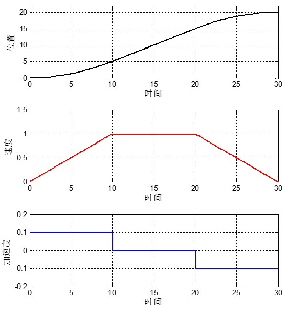

## Appendix A:
### INNNFOS Actuator ID Modification
 
After start-up, the red area is selected by the mouse and the current actuator ID number can be changed. Then enter A-1 interface below and click Download to save the changed parameters.

* FigA-1

* * *

## Appendix B

### INNFOS Actuator Precautions

*   INNFOS actuator has a low-power circuit design inside, and there is a button battery inside to supply it. This low-power circuit can achieve multi-turn counting function,which means the position change of the actuator after turned off will be recorded. The next time when the actuator is turned on,the current position of the actuator will change accordingly. The battery life is estimated to be 8 months. If the battery is dead, the replacement service is for free.

Note: This function is a test version. By using, function errors may be occur. Therefore, after each power-on, please confirm the current position of the actuator. If the current position is strikingly different from the previous setting, activate Homing mode to reset the zero position (see Homeing Mode description)to avoid misuse and damage to the mechanical structure

*   When the new actuator is in used, the Limit in Homing mode, whether turned on or off, affects the position mode for the left and right limits. As for the speed mode and current mode, it is only enabled when turned on. For example, the current Max Pos setting value is 10, and the Min Pos is -10, it can only move within this interval in the position mode. When the command sent exceeds this limit interval, the actuator will go to the limit boundary and will not rotate. For the speed and current mode, it can only be used when turned on.

*   For the new actuator, there are limits for Position mode. When the command step changes by more than 1, the actuator does not respond and prompts a 0x0200 error to avoid mechanical structure damage caused by the large step input.

*   The difference between software and mechanical limit: mechanical limit, a physical limit, is the upper and lower limit of the actual movement of the mechanical structure. The software limit, the virtual limit, is the upper and lower limits of the motion set in PC. The range of software limits should be less than or equal to the mechanical limit.

*   The adjustment of PI value needs to start from the PI parameters of the current mode.When debugging the speed loop mode, confirm the PI value of the current loop is correctly debugged, and the position loop mode can be continued after the speed loop parameter is correct.

####   unit description：

R: Revolutions, number of revolutions, 1R = 1 revolution = 360 °, indicating the position of the actuator.

RPM: Revolutions Per Minute, revolutions per minute, indicating actuator speed.

RPM/s: The first-order time derivative of the speed, ie the acceleration, indicates the actuator’s speed changes.

RPM/s^2: The first-order time derivative of acceleration, ie jerk (jerk), indicates the actuator acceleration changes.

*   ip address configuration is made through opening the control panel, selecting Network and Internet, to Network and Sharing Center, and then Change Adapter Settings. The next step is right clicking on Ethernet to select Properties, TCP/IPv4, then Properties, where ip address 119 in 192.168.1.119 can be replaced with any integer between 100 and 200. The gateway can be set to 192.168.1.1. The DNS does not need to be filled out, just click OK to complete the configuration. The configuration is as follows:

*   Fig B-1

## Appendix C
### Oscilloscope Detailed Instructions

*    **Prescalar**: The internal sampling frequency of the actuator is 20K, and the sampling period is 0.05ms (a value is collected every 0.05ms). Prescalar is the prescaler value, which divides the internal sampling frequency. The oscilloscope displays a sampling frequency of 20K/Prescalar. For example, if Prescalar is 1, the sampling frequency and the period stay unchanged. If the Prescalar is 10 and the sampling period becomes 2K, a point is acquired every 0.5ms (0.05ms*Prescalar), the range of waveforms shown in the oscilloscope will be wider, and the frequency of waveform refresh slower. Conversely, if Prescalar is reduced, the narrower the range of waveforms that can be seen on the oscilloscope, the larger area the waveform will be, and the waveform refresh rate will be faster.
*   **Trig_value**: ways to use oscilloscope's trigger value: The waveform will only be displayed when the value of the waveform crosses the trigger value from bottom to top. If the trigger value is 100, it will only be displayed when the value of the waveform crosses 100. If you pass 100 from 80 to 120, the display can be triggered. If it is from 100 to 120, it will not be triggered. (Set to 99.9999 if necessary)
*   **Offset**: Move the waveform up and down. You can only pan the waveform up and down in the direction of the Y-axis for comparison.
*   **Scalar**: Magnification, used when zooming in or out on the amplitude of the graph. The oscilloscope's Y-axis range is -1~1. When the mouse stays at a certain point of the waveform, the coordinate position of the current point is displayed. The coordinate of the Y-axis multiplied by the magnification is the amplitude of the current point. That is, the amplitude A = Y * Scalar.
*   **Tips**： First set tirg_value and prescalar while using the oscilloscope, and when the waveform appearing, you can click auto to let the software automatically find an offset and scalar value, and then manually adjust. After each parameter change, you need to press Enter or switch the input box to take effect.

*   FIg C-1

## Appendix D
### Detailed explanation of the position loop S curve mode principle

*   In applications, the movement that the actuator driving the mechanical structure needs to be smooth, slow and orderly. If the actuator reaches the specified position in an instant, the strong moment of inertia will have a certain impact on the mechanical structure, so the function of the S-curve-position mode is to make the rotation smooth, which requires a gradual change from low to high or high to low during acceleration and deceleration to ensure smooth movement of the entire mechanical movement.
*   The following two parameters are for adjusting the S-curve-position mode, Accelerate and Decelerate. Accelerate is the speed of change when the speed increases from low to high. The higher the value of Accelerate, the faster the speed increases. Decelerate is the speed of change when the speed is reduced from high to low. The larger the value of Decelerate, the faster the speed will decrease. Instead, the opposite is true. The parameter corresponding to Max is the maximum speed. When the speed has not reached the specified position after increasing to the maximum value, the speed will no longer increased and the acceleration is zero.
*   Take the graph as an example to explain the role of these two parameters: assuming the current position of the actuator is 0 R, send the command to rotate it to 20 R, the maximum speed is set to 1 RPM, and the acceleration and deceleration are set into 0.1 RPM/S. The parameter values here are set only for theoretical analysis, and the parameter values ​​should be set according to the actual situation.

* Fig D-1

*    The three waveforms shown in the above figure are the position, velocity, acceleration and time of the S-curve mode. The first derivative of the position is the velocity, indicating the speed of the velocity change; the first derivative of the velocity is acceleration, indicating the speed and direction of velocity change. It is not difficult to see that the above images are divided into three regions in units of time, 0-10 is the acceleration zone, 10-20 is the constant velocity zone and 20-30 is the deceleration zone.
*    When the actuator is running in S-curve mode as shown in the figure “Position-Time” above, you can see that the position change has a gentle process. The shape of the curve will change according to the parameter setting . In the acceleration region, the position amount increases rapidly, the speed increases linearly, and the acceleration is constant; in the uniform velocity region, the position amount increases linearly, the velocity value is constant, the acceleration is 0; in the deceleration region, the position amount increases slowly，the speed decreases linearly and the acceleration is constant.
*   If you increase the value of Accelerate here, the slope of the left part of the speed curve will become larger, the speed will increase faster, the corresponding acceleration path will become smaller, and the acceleration area of the position curve will become steeper; if the value of Decelerate is increased, the slope of the deceleration zone in the curve will become larger, the speed will decrease faster, the corresponding deceleration path will become smaller, and the deceleration area of the position curve will become steeper. Here you can adjust it according to actual needs.
*   It should be noted that the MAX parameter in the S-position mode is the maximum value of the rotational speed. If the value of MAX is set to a large value, the uniform motion region may not appear in the velocity mode, the acceleration will not be 0, and the position curve There will be no straight line in the middle. This is because the upper limit of the speed is higher, the speed of the actuator has not reached the maximum value when it reaches the specified position, and then the deceleration is performed, so there is no uniform speed.

## Version Change Record

The following table briefly describes the version change records

<table><thead><tr style="background:PaleTurquoise"><th>Version No.</th><th>Update time</th><th>update contents</th></tr></thead><tbody><tr><td>V1.0.2</td><td>18.12.07</td><td>Added instructions for the usage of the oscilloscope and S-curve mode</td></tr><tr><td>V1.0.1</td><td>18.04.28</td><td>updated figures for full text</td></tr><tr><td rowspan=4>V1.0.0</td><td>18.03.14</td><td>Updated the figures for the entire chapter</td></tr><tr><td>18.03.12</td><td>Modified the boot error warning and updated some of the figures in section 3.1 of section 3.1.</td></tr><tr><td>18.01.15</td><td>Added the modification methods of the actuator number</td></tr><tr><td>18.01.04</td><td>Added power button</td></tr></tbody></table>
