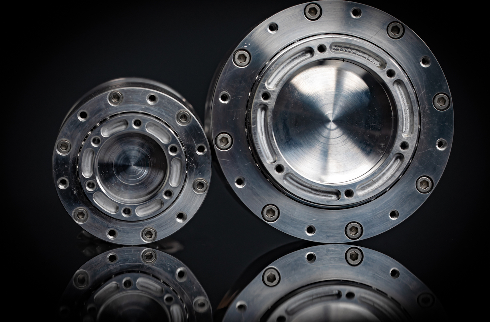
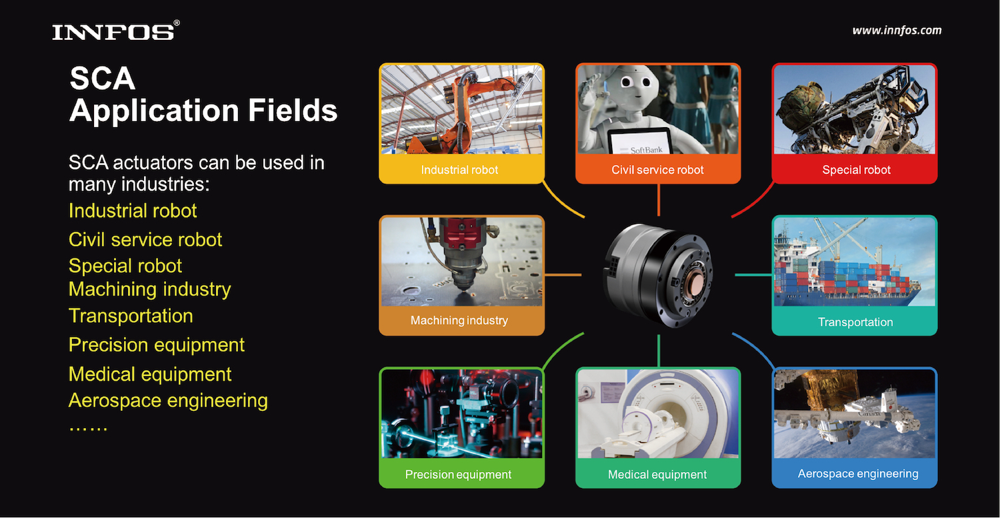

# Overview

INNFOS provides modular robotic building blocks that let you build and program custom robotic systems quickly. We provide Smart Compliant Actuator(SCA), digital and analog interface boards, and the mechanical and electrical hardware to connect these components together (see also Hardware Configuration). Just as important as the hardware, INNFOS also provides software tools and APIs to program and control the robotic system created from these physical components(see Software & Development for more details),It is recommended to use the INNFOS Actuator Studio (IAS) developed by INNFOS for SCA fast and safe debugging.

## INNFOS SCA

INNFOS SCA （Smart Compliant Actuator）is an intelligent, highly integrated and advanced servo system with flexible and safe control. It highly integrates the core components of servo motor, servo drive, reducer and encoder. Its volume is only one tenth of traditional servo system under the same performance. SCA is a revolutionary breakthrough compared to traditional robotic actuation. It effectively solves the structural problems of multiple joint connections for various types of robot and ensures the joint control and safe usage of service robots. This has enabled service robots to work and live with humans, which providing an important core technology for the Fourth Industrial Revolution and the coming era of the intelligent robot.

## Application fields

INNFOS SCA includes QDD Pro with harmonic reducer, QDD using planetary reducer and DD without reducer. SCA can be applied to multiple scenarios. The smallest SCA can be applied to tripod head, drone, etc. while largest one can be applied to robots, robotic arms and so forth. Of course, SCAs are commonly used in electric tools, CNC, 3D printers, AGV, etc.

# Version Change Record

The following table briefly describes the version change records
<table><thead><tr style="background:PaleTurquoise"><th>Version</th><th>	Update time</th><th>	update contents</th></tr></thead><tbody><tr><td>V1.0.1</td><td>2019.05</td><td>优化SCA应用范围描述</td></tr><tr><td>V1.0.0</td><td>2019.04</td><td>	The first version</td></tr></tbody></table>
